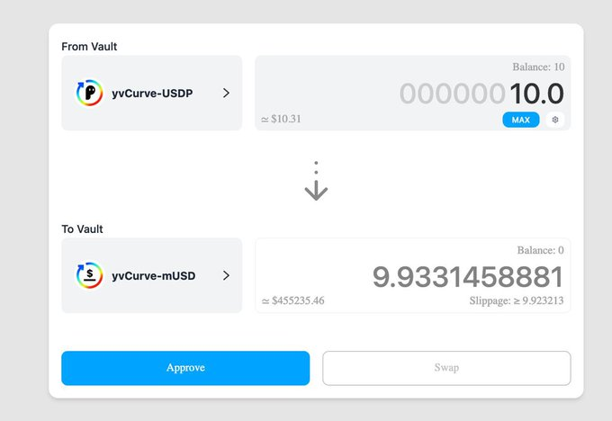
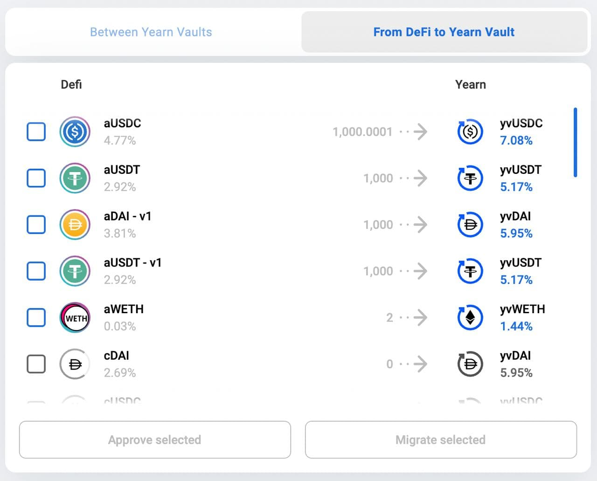

# Bowswap.Finance [Güncel](https://t.me/yearnupdates/483)

Artık iki bölümden öluşuyor:

## 1. Yearn Vault'leri arasında

Fonları bir vault'dan diğerine takas eder. Likidite havuzu yok. İstenen vault'dan çekilir ve yeniden yatırılır. Yaptığı tek takas Curve'yi kullanmaktır. Vault'lerin ortak bir belirteci varsa (örneğin aynı metapool veya 3CRV) bunları kullanacaktır. Gaz açısından ucuz olmasa da, gaz açısından verimlidir - kesinlikle manuel yapmaktan daha ucuzdur, 

## 2. DeFi'den Yearn Vault'lere

[Bowswap.finance](https://bowswap.finance/), şimdi mevcut en iyi getiriye basit geçişle. AAVE ve Compound'dan Yearn Finance'e birkaç tıklamayla hiçbir ücret ödemeden geçiş yapın.

Üzgünüm Stani

Bu sonraki özellik, kullanıcıların Compound ve AAVE'den Yearn'e para taşımasına yardımcı olur. Bu, yukarıdakiyle aynı konsepttir, protokolden çekilip Yearn Vault'a yatırılır. Ayrıca listede her iki protokolün APY'sini gösterir ve aynı anda birden fazla token seçmenize izin verir.

Bu takaslarda Yearn tarafından herhangi bir ücret alınmaz.
