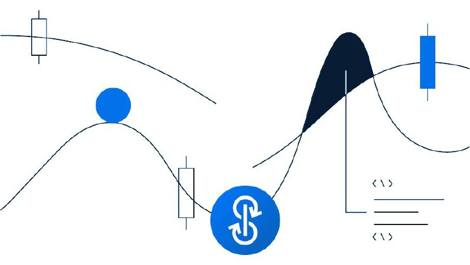

# What if Yearn = the web's "yield function"?

In programming a "function" is a little bundle of reusable code that accomplishes a specific task… You can summon that function anytime, and it will do the same thing over and over again without fail.

With Yearn, devs anywhere on earth can take our yields and insert them into any financial flow.

People talk about money legos. Yearn isn't so much a lego as the plastic other DeFi projects can use to build their own legos.

Just as the Internet of Information uses APIs for data, the Internet of Value will use Yearn for yield. Anywhere value lies dormant (for days, hours... even minutes), Yearn will go.

And that means Yearn could become as big as the Internet of Value itself. Like blockchains, it could come to underlie all financial flows -- all value flows.
