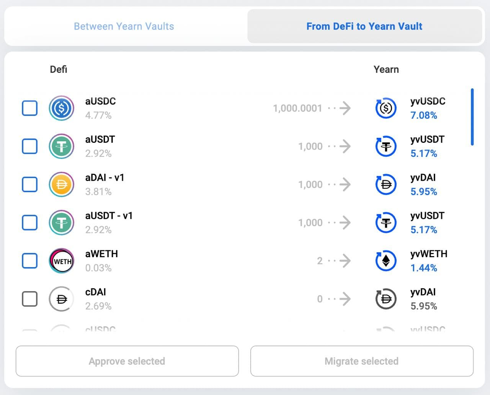

# Bowswap.Finance [Update](https://t.me/yearnupdates/483)

Sekarang memiliki 2 bagian:

## 1. Diantara Berangkas Yearn

Bagian ini menSwap dana dari satu brankas ke brankas lainnya. Tidak ada kolam likuiditas. Menarik dan menyetor ulang ke brankas yang diinginkan. Satu-satunya swap yang dilakukannya adalah menggunakan Curve. Jika brankas memiliki token yang sama (metapool yang sama atau 3CRV misalnya) ia akan menggunakannya. Meskipun tidak murah dari segi gas, ini hemat gas - Lebih murah daripada melakukannya secara manual, pasti

## 2. Dari DeFi ke Berangkas Yearn 

[Bowswap.finance](https://bowswap.finance/), sekarang dengan migrasi sederhana ke hasil terbaik yang tersedia. Bermigrasi dari AAVE dan Compound ke Yearn Finance dalam beberapa klik, tanpa biaya.

Maaf Stani

Fitur berikutnya ini membantu pengguna memigrasikan dana dari Compound dan AAVE ke Yearn. Ini adalah konsep yang sama seperti di atas, withdraw dari protokol dan menyetor ke dalam Berangkas Yearn. Juga menunjukkan APY kedua protokol dalam daftar dan membiarkan Anda memilih beberapa token secara bersamaan.

Tidak ada biaya yang dibebankan oleh Yearn pada swap ini.
