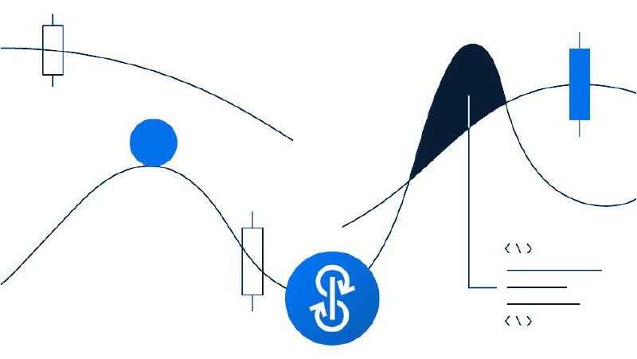

#Bagaimana jika Yearn = "yield function" web?

Dalam pemrograman, "function" adalah kumpulan kecil kode yang dapat digunakan kembali yang menyelesaikan tugas tertentu… Anda dapat memanggil function itu kapan saja, dan itu akan melakukan hal yang sama berulang-ulang tanpa gagal.

Dengan Yearn, para pengembang di mana pun di dunia dapat mengambil hasil kami dan memasukkannya ke dalam aliran keuangan apa pun.

Orang-orang berbicara tentang uang lego. Yearn bukanlah sebuah lego seperti plastik yang dapat digunakan proyek DeFi lainnya untuk membuat lego mereka sendiri.

Sama seperti Internet of Information yang menggunakan API untuk data, Internet of Value akan menggunakan Yearn untuk hasil. Di mana saja nilai terbengkalai (selama berhari-hari, berjam-jam... bahkan menit), Yearn akan pergi.

Dan itu berarti Yearn bisa menjadi sebesar Internet of Value itu sendiri. Seperti blockchain, itu bisa mendasari semua aliran keuangan -- semua aliran nilai.
