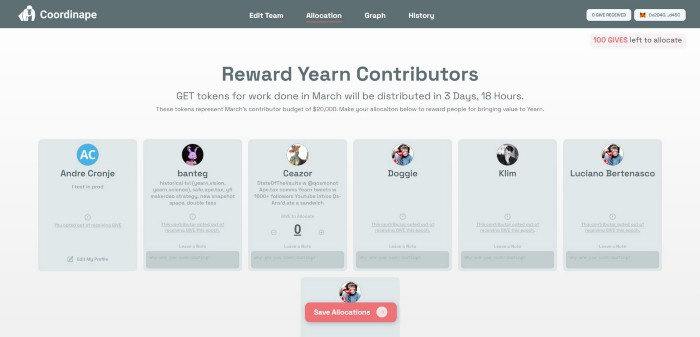
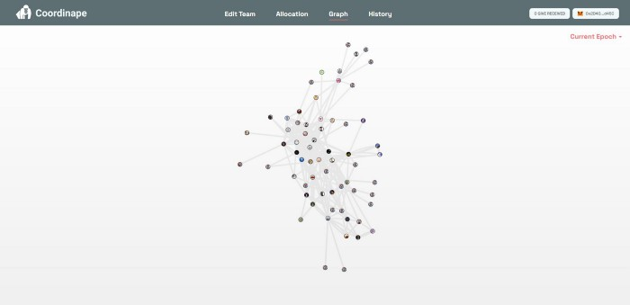

# डाओ के लिए विकेंद्रीकृत पेरोल प्रबंधन

लेखक: [आंद्रे क्रोन्ये](https://twitter.com/AndreCronjeTech) 

३१ मार्च २०२१ 

डाओ के पास टॉप डाउन मैनेजमेंट नहीं है। कोई मानव संसाधन विभाग नहीं है। कोई अनुबंध नहीं है और कोई वेतन वार्ता नहीं है।  योगदानकर्ताओं को उचित रूप से कैसे प्रोत्साहित और पुरस्कृत करे?

जब डाओ पहली बार शुरू हुआ, तो उसने शासन भारित वेतन को अपनाया (मैं इस शब्द का उपयोग शिथिल रूप से करता हूं, क्योंकि तकनीकी रूप से वे एक बार काम आते है, प्रति माह एक बार अनुदान, यदि आप अगले महीने योगदान नहीं करते हैं, तो कोई अनुदान नहीं)। शासन भारित वेतन केवल समुदाय के सदस्यों द्वारा स्थापित प्रस्ताव थे, जहां उन्होंने प्रस्तावित किया कि योगदानकर्ता एक्स को वाई भुगतान प्राप्त करना चाहिए। इन्हें सक्रिय प्रबंधन की आवश्यकता होती है और मासिक डाओ वोट/अनुमोदन की आवश्यकता होती है। यह अच्छी तरह से स्केल नहीं करता है।

स्केलिंग और ओवरहेड समस्याओं को दूर करने के लिए, [कोऑर्डिनपे](https://coordinape.com/) का निर्माण किया गया, ये मेरे पसंदीदा प्रकार के उत्पाद हैं क्योंकि वे व्यक्तिगत आवश्यकता से उत्पन्न होते हैं, लेकिन किसी अन्य की मदद के लिए सामान्यीकृत किया जा सकता है संगठन/डाओ इसी तरह की समस्या से जूझ रहे हैं।

[कोऑर्डिनेप](https://coordinape.com/) क्या है? बस कोई भी व्यक्ति जो यर्न में योगदान करना चाहता है (या उनका अपना डाओ) वो पंजीकरण कर सकता है (वर्तमान में गिटहब विवरण का उपयोग करके), और हर युग (यर्न के लिए १ महीना) मे आप उन टीम के सदस्यों का चयन करें जिनके साथ आप काम कर रहे हैं। नीचे, तरसने वाले योगदानकर्ता;

उदाहरण के लिए, नीचे मेरी बातचीत (जिन सदस्यों को मैंने इस पिछले युग के साथ बातचीत करने वाले के रूप में चिह्नित किया है);

अब प्रत्येक सदस्य के पास एलोकेशन पॉइंट की एक निर्धारित राशि होती है, और वे उन योगदानकर्ताओं को पॉइंट अलॉट कर सकते हैं जिनके साथ उन्होंने काम किया है, जो उनके योगदान के बारे में सोचते हैं।

इसलिए यदि हम वर्तमान युग के योगदानों को देखें तो हम निम्नलिखित देखते हैं;

प्रत्येक पंक्ति एक सदस्य से दूसरे सदस्य को आवंटन है। यह एक योगदानकर्ता ग्राफ बनाता है जो उन सदस्यों की ओर भारित होता है जिनके पास सबसे अधिक इंटरैक्शन और आवंटन होते हैं।

अब बस, युग के दौरान, यर्न Y राशि अर्जित करता है  आपने फीस/योगदान/पुरस्कार/आदि के दव्यरा , यह समन्वय योगदानकर्ता अनुबंध के लिए अर्जित होता है, युग के अंत में योगदानकर्ता युग में अपने योगदान के आधार पर अपने अनुदान का दावा कर सकते हैं।

**निष्कर्ष**

[कोऑर्डीनेप](https://coordinape.com/) बिना टॉप डाउन मैनेजमेंट या एचआर के विकेंद्रीकृत टीमों और डाओ को फंड के साथ योगदानकर्ताओं को स्वायत्त रूप से आवंटित और पुरस्कृत करने की अनुमति देता है, यह सब सिबिल प्रतिरोधी सामाजिक ग्राफ के माध्यम से किया जाता है।

फ्लैट संगठनों के लिए विकेंद्रीकृत पेरोल।

परियोजना अभी भी बंद स्रोत है, हालांकि टीम सक्रिय रूप से अन्य डीएओ और संगठनों के साथ जुड़ना चाह रही है, यदि आपकी कोई रुचि या प्रश्न है, तो कृपया [@tracheopteryx](https://twitter.com/tracheopteryx) तक पहुंचें।
