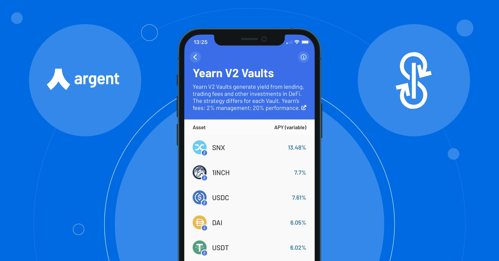
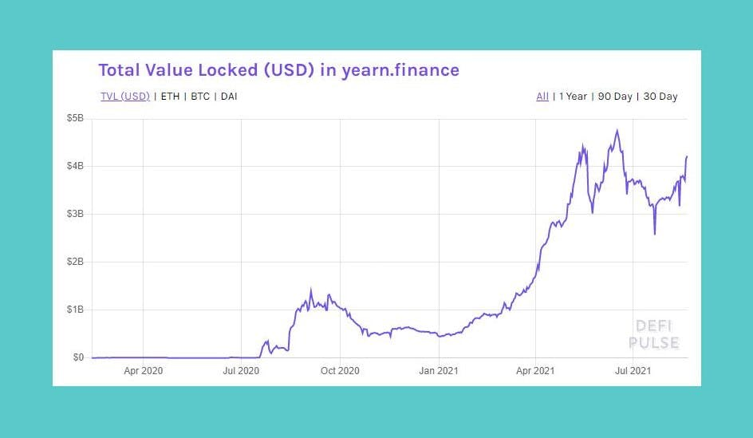
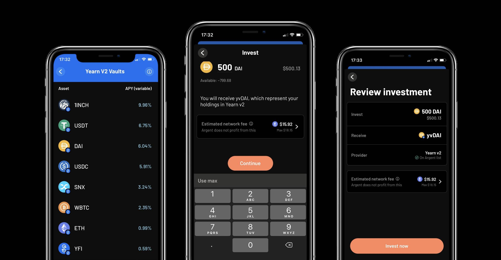

# Dapatkan penghasilan dengan mudah dengan Yearn v2 di Argent

Berangkas Yearn V2 sekarang hanya dengan satu ketukan! Argent! hasilkan sampai 16.47% Net APY\* dengan generasi yield otomatis. Ini didasarkan pada dukungan kami yang ada untuk  [V1 Vaults](https://www.argent.xyz/blog/yearn-vaults-in-argent/) Yearn.

## **Keuntungan memakai Yearn dengan Argent**

penghasilan dengan [Yearn](https://yearn.finance/vaults) melalui Argent itu unik dikarenakan:

- **Kesederhanaan**: Hanya satu transaksi yang diperlukan. (Tidak perlu persetujuan terpisah).
- **Keamanan**: Tidak ada persetujuan token yang tak terbatas; Anda secara otomatis hanya menyetujui apa yang perlu Anda belanjakan. Anda juga merasa tenang bahwa Anda berinteraksi dengan kontrak yang tepat.

Kami telah meluncurkan dengan 7 Vault (USDC, DAI, SNX, 1INCH, YFI, WBTC, USDT, UNI, ETH).

## **Mengapa Yearn itu penting?**

Yearn telah tumbuh dalam sebuah [monumental pace](https://defipulse.com/yearn.finance) sejak diluncurkan pada awal 2020. Yearn memudahkan siapa saja untuk "yield farming" (mencoba memaksimalkan pengembalian aset Anda dengan memanfaatkan beberapa protokol DeFi). Yearn membandingkan pendekatan mereka dengan investasi pasif.

DeFi Pulse Graph menunjukkan total nilai terkunci (TVL) di Yearn.Finance

Ada juga keuntungan besar dalam hal biaya jaringan Ethereum ('gas'). Gas "disosialisasikan" ke semua orang menggunakan Vault itu sehingga jauh lebih ekonomis untuk rata-rata pengguna.

[Strategies](https://medium.com/yearn-state-of-the-vaults/the-vaults-at-yearn-9237905ffed3) diusulkan oleh komunitas dan dipilih oleh governance Yearn.

Dengan V2, setiap Vault dapat menggunakan beberapa strategi, sedangkan V1 Vault masing-masing hanya menggunakan satu.

## **Bagaimana cara menggunakan Yearn V2 Vaults di Argent**

### **Beli**

- Ketuk **'Invest'** tab di Argent
- Ketuk **'Yearn V2 Vaults'**
- Pilih satu Vault
- Ketuk **'Buy Investment'**
- Pilih jumlahnya (& konfirmasikan bahwa Anda puas dengan biaya jaringan)
- Beli

### **Biaya**

Argent tidak mengambil biaya.

Yearn mengambil:

- 20% biaya kinerja (dikurangi dari yield)
- 2% biaya manajemen (dikurangi dari total saldo per tahun).

Anda juga perlu membayar untuk gas.

Menggunakan yearn di app Argent

## **Melacak Performa Vault Anda**

Saldo tidak diperbarui terus menerus; mereka diperbarui secara "dasar fluktuasi", sesuai dengan Yearn.

Untuk melacak pengembalian, Anda dapat menggunakan

- [Zapper](https://zapper.fi/)
- [Zerion](https://app.zerion.io/)
- [Yearn Vault ROI Calculator](https://yearn-roi.xyz/#/)
- [yVault ROI](https://yvault-roi.netlify.app/)

## **Bacaan & sumber lebih lanjut**

- [Yearn's docs](https://docs.yearn.finance/)
- [Yearn's State of the Vaults (weekly update)](https://medium.com/yearn-state-of-the-vaults/the-vaults-at-yearn-9237905ffed3)
- [Yearn's Twitter](https://twitter.com/iearnfinance)

## **Resiko Resiko**

Seperti biasa di crypto dan DeFi, Anda harus melakukan riset sendiri tentang risikonya. Ini termasuk kontrak pintar dan ekonomi protokol. Audit Yearn dapat ditemukan [di sini](https://docs.yearn.finance/resources/audits).

\*APY bersifat variabel dan konsepnya tidak secara teknis langsung berlaku seperti halnya di keuangan terpusat. Silakan lihat [Penjelasan Yearn](https://docs.yearn.finance/resources/guides/how-to-understand-yvault-roi#roi-calculation) for more.

## **Download Argent**

Memulai dengan Argent [di sini](https://argent.link/yearn-v2-post). Jika Anda memiliki pertanyaan, Anda dapat menemukan kami di:

- [Discord](https://discord.com/invite/GWSyrHg)
- [Twitter](https://twitter.com/argentHQ)
- [Support](https://support.argent.xyz/hc/en-us)

_Ini harus pergi tanpa mengatakan tetapi jika tidak: kami BUKAN sebuah bank _**🙄**_. Kami bukan entitas keuangan yang terregulasi._
