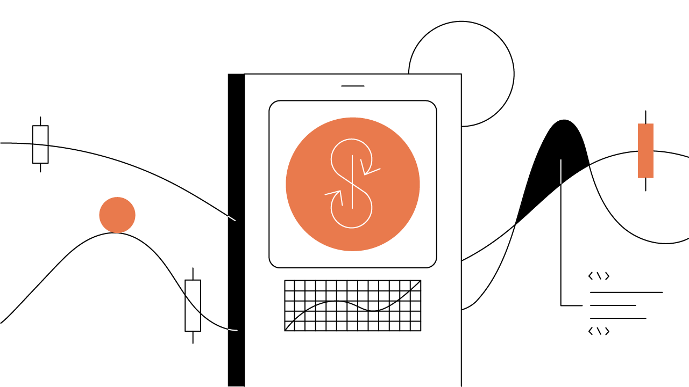

original publication: [https://www.gemini.com/cryptopedia/yearn-finance-defi-lending-protocol](https://www.gemini.com/cryptopedia/yearn-finance-defi-lending-protocol)

# Yearn Finance and Money Robots: Automated DeFi Strategy

Yearn Finance offers a suite of investment strategies powered by robots that contain “wisdom sourced from the crowd” — Yearn’s own community.

## Summary

Yearn Finance money robots execute investment strategies across decentralized finance (DeFi) platforms with the aim of generating the highest returns with the lowest risk. The strategies deployed include providing assets for lending, earning project tokens with yield farming, providing liquidity, or a combination of these and other investment strategies across a wide range of DeFi lending protocols. The Yearn protocol allows you to easily take part in complex investing strategies by providing tokens to the platform. Its expanding suite of products is intended to simplify investing in DeFi and is gaining traction with investors.

## Contents

- Yearn.Finance: yVaults
- yVault Strategy Case Studies: GUSD
- A Suite of DeFi Products
- Wisdom of the Crowd

Yearn Finance develops products that automate and aim to simplify the complexity of decentralized finance (DeFi) with “money robots” that work to maximize returns for a fee. Yearn started with just one [Ethereum](https://www.gemini.com/cryptopedia/ethereum-smart-contracts-tokens-use-cases) developer — [Andre Cronje](https://www.gemini.com/cryptopedia/glossary#andre-cronje) — who sought to automate and optimize his own DeFi returns. It has now evolved into one of the most active and engaged decentralized communities on Ethereum with a focus on developing increasingly innovative ways to generate returns.

Money robots refer to automated trading strategies executed by Yearn across Ethereum-based DeFi platforms. There are countless investment strategies that can be deployed across a growing number of DeFi protocols. For example, a Yearn money robot can earn trading fees on the [Curve protocol](https://www.gemini.com/cryptopedia/curve-crypto-automated-market-maker), borrow money using [Aave’s flash loans](https://www.gemini.com/cryptopedia/aave-flashloans), and lend assets to [Compound](https://www.gemini.com/cryptopedia/compound-finance-defi-crypto).

## Yearn.Finance: yVaults

The most popular products in the Yearn ecosystem are [yVaults](https://www.gemini.com/cryptopedia/glossary#y-vaults), a series of token pools that follow an investment strategy that is allocated across DeFi platforms. Depositing tokens into a yVault automatically mints a new [yToken](https://www.gemini.com/cryptopedia/glossary#y-tokens), which is a type of [liquidity provider (LP) token](https://www.gemini.com/cryptopedia/liquidity-provider-amm-tokens). LP tokens are automatically created when tokens are deposited into a [liquidity pool](https://www.gemini.com/cryptopedia/glossary#liquidity-pool) — and serve as a claim to a pool’s underlying assets. Each yToken can be redeemed at any time for the originally deposited tokens plus any rewards accumulated while the tokens were working in the yVault.

For example, you can deposit [GUSD](https://www.gemini.com/cryptopedia/gusd-gemini-dollar-stablecoin-features) to the GUSD yVault and receive the LP token called yGUSD. When you exchange the yGUSD for the underlying GUSD, you receive that GUSD plus any earnings or rewards the GUSD accumulated from using the yVault’s strategy. Yearn’s yVaults compress complex layers of DeFi applications and components into a simplified trading strategy where investors provide assets and hold a token to participate in a sophisticated, algorithmic strategy.

## yVault Strategy Case Studies: GUSD

yVault strategies are fluid, and the Yearn community can decide to change or adjust a strategy as it becomes less profitable. In the yGUSD strategy for October 2020 — which has already been altered for optimization — the strategy earns yield for the yGUSD holder through the following steps:

1. GUSD is deposited into a Curve pool made up of [stablecoins](https://www.gemini.com/cryptopedia/what-are-stablecoins-how-do-they-work) GUSD, [DAI](https://www.gemini.com/cryptopedia/dai-stablecoin-what-is-dai-token), USDC, and USDT to earn fees.
2. The LP token generated from the stablecoin pool is staked in Curve to earn the [CRV token](https://www.gemini.com/cryptopedia/glossary#crv-token).
3. 90% of the CRV tokens earned are sold for DAI.
4. DAI is deposited back to the original GUSD, DAI, USDC, USDT stablecoin pool to earn more fees.

From the point of view of a user, the steps above take place under the algorithmic hood. This GUSD strategy itself is fairly simple as compared to more involved and sequentially complicated yVault strategies, which may involve borrowing money, using [leverage](https://www.gemini.com/cryptopedia/glossary#leverage), and maintaining exposure to market forces.

For example, the yETH vault, which is still in an experimental stage as of December 2020 and not yet fully released, uses both the [MakerDAO](https://www.gemini.com/cryptopedia/makerdao-defi-mkr-dai-coins) and Curve protocols in its strategy. With the yETH strategy, ETH holders remain exposed to the price appreciation (or depreciation) of ETH while earning yield through the following steps:

1. ETH is deposited to MakerDAO as collateral.
2. DAI is borrowed from MakerDAO using the deposited ETH as collateral.
3. The borrowed DAI is deposited to the yDAI vault.
4. The yDAI vault deposits DAI to Curve in order to earn fees.
5. The LP token generated from the DAI pool is staked in Curve to earn the CRV token.
6. The CRV tokens are sold for ETH.
7. ETH is deposited back to MakerDAO as collateral.

Because the yETH vault borrows DAI from MakerDAO, there is the risk of getting liquidated — or having the money robot sell your ETH in order to repay your DAI loan. Liquidation occurs when the value of ETH collateral falls below the minimum 150% threshold of the value of borrowed DAI. In order to avoid liquidation, the yETH money robot aims to keep the value of ETH collateral at a safe 200% compared to the value of DAI debt. If the value of ETH collateral starts to fall below the 200% target, the money robot will automatically pay off some of the DAI debt to remain over-collateralized. Managing debt, collateral, and liquidation adds an additional layer of complexity to Yearn’s vaults.

It’s important to recognize the yVault strategy’s risk compounds as it becomes more complex by virtue of reliance on more protocols and platforms. Strategies like the yETH example also have the risks inherent in using leverage as well as the risks of liquidation and smart contract failure.

## A Suite of DeFi Products

The Yearn suite of products is an ever-expanding and evolving set of DeFi products. Besides the various yVault strategies, Yearn offers multiple active products that together form its ecosystem.

Other Yearn products include the yEarn application which focuses on using stablecoins like DAI and putting them to work in high-interest lending pools on Compound or Aave. Another product, Zap, is designed to reduce transaction costs in Ethereum by combining what would have been various manual transactions into one more complex, single-click transaction. The yInsure feature provides insurance for smart contracts as a safeguard in the event of a vulnerability or flaw in the code.

There are also a multitude of products currently in the research and development stage, including yTrade for leveraging trades, yLiquidate to automate liquidations, and yBorrow for loans. Yearn has thus far proven fertile ground for research and development, and its product offerings will likely continue to expand as the DeFi space matures.

## Wisdom of the Crowd

A Yearn money robot executes a strategy plan for investment of digital assets: how to allocate them, where to put them, when to move them, and when to sell them. In fact, anyone can come up with a new strategy by posting it on the Yearn governance forum and explaining the logic and potential returns to the community. If approved by the community, the strategy will be implemented and the strategy creator earns fees — profiting from their successful strategizing.

Even though the DeFi space features many automated and algorithmic mechanisms throughout its various platforms, Yearn money robot strategies are created and influenced by community members. Yearn’s community management, distributed “[fair launch](https://www.gemini.com/cryptopedia/what-is-yearn-finance-yfi-coin-yearnfinance)” of its highly-scarce [YFI platform governance tokens](https://www.gemini.com/cryptopedia/glossary#yfi-token), and collaborative nature present a timely reminder of human ingenuity and efficacy, even in the age of automated algorithms. With Yearn, ideas can come from anywhere and wisdom is sourced from the crowd. The effectiveness of that wisdom is constantly tested, iterated, and improved in real-time with real money.

Yearn Finance presents a unique proposition of layering, interoperability, and crowdsourcing in DeFi. It is an experiment in automated investing and product development, in incentives and coordination. And, it’s an experiment to see if a decentralized community with a broad mandate to optimize returns can effectively do so without organizational conflict. While many DeFi platforms focus on disintermediating legacy players and systems, Yearn’s innovation is to act as an intermediary bringing together the decentralized community and disparate platforms for the benefit of their users.
