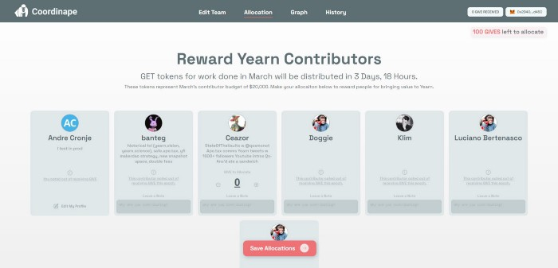

# Gestión de nómina descentralizada para DAO

Los DAO no tienen una gestión de arriba hacia abajo. No hay departamento de recursos humanos. No hay contratos ni negociaciones salariales. ¿Cómo incentiva y recompensa adecuadamente a los contribuyentes?

Cuando comenzó el DAO de Yearn, adoptó salarios ponderados de gobernanza (utilizo el término de manera vaga, ya que técnicamente son subvenciones únicas, una vez al mes, si no contribuye el mes siguiente, no hay subvención). Los salarios ponderados de gobernanza eran simplemente propuestas establecidas por miembros de la comunidad, donde proponían que el contribuyente X debería recibir el pago Y. Estos requieren una gestión activa y necesitan votos / aprobaciones mensuales de DAO. Esto no escala bien.

Para abordar los problemas de escalamiento y gastos generales, el equipo de yearn creó [Coordinape](https://coordinape.com/). Estos son mis tipos de productos favoritos, ya que se originan a partir de una necesidad personal, pero se pueden generalizar para ayudar a cualquier otro. organizaciones / DAO están luchando con un problema similar.

¿Qué es [Coordinape](https://coordinape.com/), simplemente ponga que cualquier persona que desee contribuir a Yearn (o su propio DAO) puede registrarse (actualmente usando los detalles de github), cada epoch (para Yearn 1 mes), puede seleccione los miembros del equipo con los que ha estado trabajando e interactuando, a continuación, colaboradores de Yearn;

Por ejemplo, mis interacciones a continuación (miembros que marqué por haber interactuado con esta época pasada);

Ahora cada miembro tiene una cantidad fija de puntos de asignación y puede asignar puntos a los colaboradores con los que ha trabajado en función de lo que piensa de sus contribuciones.

Entonces, si observamos las contribuciones de la epoch actual, vemos lo siguiente;

Cada línea es una asignación de un miembro al siguiente. Esto crea un gráfico de contribuyentes que se pondera hacia los miembros que tienen la mayor cantidad de interacciones y asignaciones.

Ahora, simplemente, durante la epoch, Yearn gana "Y" cantidad en tarifas/contribuciones/recompensas/etc. Esto se acumula en el contrato de colaborador de Coordinate, al final de la epoch, los contribuyentes pueden reclamar su subvención en función de sus contribuciones en la epoch.

**Conclusión**

[Coordinape](https://coordinape.com/) permite a los equipos descentralizados y DAO sin administración de arriba hacia abajo o recursos humanos para asignar y recompensar de forma autónoma a los contribuyentes con fondos, todo a través de gráficos sociales resistentes a profetas.

Nómina descentralizada para organizaciones planas.

Actualmente, el proyecto aún es de código cerrado, sin embargo, el equipo está buscando activamente participar con otras DAO y organizaciones, si tiene algún interés o consulta, comuníquese con [@tracheopteryx](https://twitter.com/tracheopteryx)

