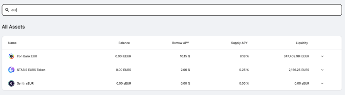

# Fair launches, decentralized collaboration, and Fixed Forex

**\-Fair launches-**

It took awhile for me to finally realize the essence behind a fair launch. It isn’t giving the tokens away, it isn’t because there was no presale, simply put, it was because everyone had the same advantage, everyone had the same ruleset, there was no secret “friends and family” round, seed rounds, influencer allocation, there were no whitelists, no capped participation, the rules were provided, and anyone could participate. I finally feel comfortable in saying a fair launch, is a launch in which all participants have the same ruleset.

**\-Decentralized collaboration-**

I still see a lot of tribalism, I guess that’s understandable, I never understood how people became so tribal over sport teams, I’ve started to wonder how much of that tribalism is because of betting on the teams, afterall, that’s what crypto is, betting on your favorite team. Just like I never understood the tribalism in sports, I also don’t understand it in crypto. By my standards, I simply see “right” and “wrong”, doesn’t matter if its a team I’m associated with or not, if I see the “right”, I praise it, if I see the “wrong”, I scold it.

But I think some teams, often discount the value in collaboration, its something I always enjoyed about yveCRV, and by extention, its clones, stCRV and cvxCRV, its the product of collaboration between curve, yearn, sushi, and pickle. It can’t exist without all those entities. Same reason before yveCRV, the y pool was my pride and joy, it was the collaboration between curve, yearn, aave, compound, and dydx.

With this in mind, I realized, to continue to succeed, products can’t be isolated, they need to be an amalgamation of products and teams. My original iteration of Fixed Forex was standalone, unupgradable, ungovernable, without any value extraction, and tokenless.

**\-Fixed Forex-**

We keep talking about disrupting exchange control, we keep talking about disrupting fiat, in their own way, Tether and Circle did more for disrupting exchange control, than crypto did, exchange control tends to have a simple rule, money can’t leave its territory without special permission. Both Tether and Circle take deposits locally, the fiat never leaves the bank account, thus no exchange control (in theory, in practice and regulation its a very different story). So let’s consider you want to make a payment from the US to Korea, from USD to KRW, a “simple” path, would be deposit USD for USDT, transfer USDT to Upbit, swap USDT for KRW, withdraw KRW.

Fixed Forex is designed to accomplish the above without end users being aware or knowledgeable of the steps, Fixed Forex has two core components, forex on-chain liquidity, and decentralized fiat on and off ramps.

While I am most excited about the latter, its go-live date is only possible after we achieve on-chain liquidity. So for purposes of this article, we will explain how Fixed Forex works, and how users can participate.

**\-Iron Bank Fixed Forex (ibff)-**

Fixed Forex leveraged Iron Bank, Yearn, Sushi, and Curve

**Disclaimers;**

- Unaudited.
- 0 benefit for early participation, only risk.
- The initial token distribution will be a fraction of the emission, this serves only for testing purposes.
- Given the incredibly low initial distribution, do not buy these tokens, do not provide liquidity for these tokens, you will lose money.

Fixed Forex is the collective name for USD, EUR, ZAR, JPY, CNY, AUD, AED, CAD, INR, and any other forex pairs launched under the Fixed Forex moniker.

The first available option is [ibEUR](https://www.coingecko.com/en/coins/iron-bank-euro) which can be minted via [yearn.fi/lend](https://yearn.fi/lend)

All forex options can be minted via any of the accepted collateral on [yearn.fi](https://yearn.fi/lend)

For up to date collateral factors, you can visit the Iron Bank documentation, [here](https://docs.cream.finance/iron-bank/collateral-and-reserve-factor)

Each forex pair will target 2 liquidity pools;

ib\*/\* ([curve.fi](https://curve.fi/))  
ib\*/ETH ([sushi.com](https://sushi.com/))

For each asset, liquidity providers will have four available yield options;

1.  Provide ib\* to [yearn.fi/lend](https://yearn.fi/lend) and earn interest (currently 6.38%)
2.  Provide ib\*/ETH to [sushi.com](https://sushi.com/) (currently 390%)
3.  Provide ib\*/\* to [curve.fi](https://curve.fi/) (pool pending)
4.  Stake in Iron Bank Fixed Forex and earn the native token IBFF (vested, veIBFF)

\-veIBFF-

The IBFF mechanism is complex, and should be carefully understood before participating.

The initial launch will target only a single pool, [ibEUR/ETH](https://analytics.sushi.com/tokens/0x96e61422b6a9ba0e068b6c5add4ffabc6a4aae27)

As an LP you can stake the LP token in the IBFF [faucet](https://etherscan.io/address/0x7d254d9adc588126edaee52a1029278180a802e8), this provides a fractional token drip, this is required to create a token lock in the vesting contract, [veIBFF](https://etherscan.io/address/0x4d0518c9136025903751209ddddf6c67067357b1).

The system’s true native token is veIBFF, or vested IBFF, veIBFF earns protocol fees, these fees are dynamic based on supply and demand. Currently, these fees are 10.15% of TVL.

IBFF owners can choose to create a vesting lock, up to 4 years, with linear decay on the veIBFF [contract](https://etherscan.io/address/0x4d0518c9136025903751209ddddf6c67067357b1)

Once a lock has been created, LPs can stake ibEUR/ETH in the distribution [contract](https://etherscan.io/address/0x1da8a6fe33bd35b99505d67843eec9fa124f2d4b), the distribution contract will distribute tokens every 7 days linearly.

Distribution tokens are rewarded based on your vesting lock. If the vesting lock is 1 years, you receive 1/4 tokens as veIBFF, which will become unlocked in 1 year. The remainder 3/4 tokens is distributed to the fee distribution [contract](https://etherscan.io/address/0x83893c4a42f8654c2dd4ff7b4a7cd0e33ae8c859).

veIBFF holders have two weekly claims, claim 1 is protocol accumulated fees (10.15% of TVL currently), and distributed IBFF from the [distribution contract](https://etherscan.io/address/0x83893c4a42f8654c2dd4ff7b4a7cd0e33ae8c859).

Simply put, the greater your time investment, the more disproportionate your reward.

**Disclaimers;**

- Unaudited.
- 0 benefit for early participation, only risk.
- The initial token distribution will be a fraction of the emission, this serves only for testing purposes.
- Given the incredibly low initial distribution, do not buy these tokens, do not provide liquidity for these tokens, you will lose money.

**Links;**

[Forum](https://gov.yearn.finance/c/projects/fixed-forex/26)  
[Website](https://yearn.fi/lend)  
No social media
