# Can Yearn disrupt the $110 trillion asset management industry?

**Summary**

1.  The asset management industry has [$110 trillion](https://www.pwc.com/gx/en/industries/financial-services/assets/wealth-management-2-0-data-tool/pwc_awm_revolution_2020.pdf) assets under management (AUM).
2.  Yearn is not directly comparable to an asset manager in traditional finance but a comparison with Blackrock is helpful for understanding where its revenues come from and its early setbacks.
3.  There are over $300 billion of tokenized assets on Ethereum which are growing rapidly.
4.  Yearn is leading the innovation in risk-adjusted yields putting it in pole position to benefit from the rise of assets on Ethereum. This will likely lead to Yearn’s AUM increasing significantly over time.
5.  Being a DeFi protocol gives Yearn advantages unavailable to other crypto asset managers, such as Grayscale and Celsius. In particular, its permissionless nature allows integration with other protocols, such as the recent one with Alchemix.

**Introduction**

DeFi has been growing explosively for 3.5 years, according to [DeFiPulse](https://defipulse.com/) from less than $2m Total Value Locked (TVL) in Q3 2017 to $44.6bn in Q1 2021. [Defillama](https://defillama.com/home) has Ethereum’s Q1 2021 TVL at $68.5bn. Uniswap’s trading volume exceeded Coinbase’s for the month of [September 2020](https://www.theblockcrypto.com/linked/79775/uniswap-coinbase-monthly-volume-september). The question is no longer whether DeFi will disrupt traditional finance, but which DeFi protocols will be the disrupters?

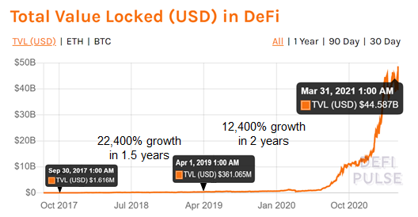Growth in DeFi TVL has been explosive for 3.5 years¹

Yearn is an asset management protocol on Ethereum. At Q1 2021 it managed $1.8bn of Ether, stablecoins and DeFi tokens. But that was last week, it’s now [$2.5bn](https://yearn.science/).

Yearn allows you to deposit your crypto into a “vault” which automatically uses DeFi protocols to earn a yield. The strategies deployed range in complexity from simply depositing your crypto onto a lending protocol, to taking a loan against your crypto and investing the loan in another strategy or taking an uncollateralized loan from another protocol to leverage returns. The recent launch of v2 vaults goes one step further and means your crypto can earn a yield from multiple strategies in the same vault.

1.  **The asset management industry**

In traditional finance assets gravitate towards a few well known asset managers. Whilst the industry is by no means winner-takes-all, it is highly concentrated.

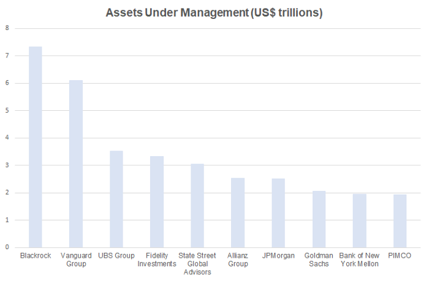The asset management industry is measured in $trillions AUM and highly concentrated ([June 30th 2020 data](https://www.advratings.com/top-asset-management-firms))

Yearn does not have a direct comparable in traditional asset management. It’s not a bank, but it earns yields from lending. It’s not a hedge fund, but it carries out active strategies.

**2\. Similarities to Blackrock**

**Revenue sources**

74% of Blackrock’s Q3 2020 revenue came from investment advisory, fees and securities lending. Yearn’s revenues can be categorized in a similar way.

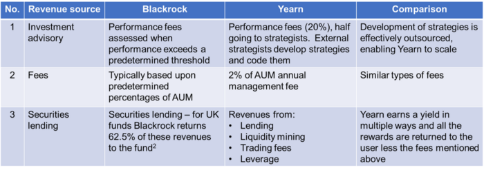

Similar sources of revenue. Different technologies.

One standout feature of how Yearn is structured is the outsourcing of strategies. Incentivizing strategists is what differentiates Yearn, a scalable asset management platform, from one team, or initially one person, trying to keep up with all the innovations in DeFi.

**Early setbacks**

It would be remiss of me to compare Yearn to the largest global asset manager without acknowledging two recent setbacks:

- Issues around how to incentivize contributors led to [debate within the community](https://gov.yearn.finance/t/yip-57-funding-yearns-future/9319) and resulted in the minting of 6,666 YFI (over $200m)
- Yearn suffered an [$11m exploit](https://www.coindesk.com/yearn-finance-dai-vault-exploit)— [depositors have since been made whole](https://cointelegraph.com/news/after-yearn-exploit-attacker-funds-frozen-and-reimbursement-plans-developing)

Coincidentally, Larry Fink (CEO of Blackrock) experienced similar early setbacks:

- In 1994, Fink and his co-founder had an internal dispute over methods of compensation and equity
- Before Blackrock he lost $100m at Boston First due to poor risk management practices

Two takeaways:

- Incentivizing people is difficult and usually requires compensation. This is true for most organizations, be they companies or protocols.
- Risk management is hard. Losses due to poor risk management practices are not unique to DeFi on Ethereum, or because of the particular programming language used.

**The power of DeFi**

How Yearn was able to deal with these issues demonstrates the benefits of DeFi on Ethereum:

- how cheap it is — more than $200m capital raised for $33
- transparency — anyone can view the [transaction](https://etherscan.io/tx/0x21a3007a2547a9d6f1bceb44cb9292b36079fcccd8f36f7ec1ca066db261e153) shown below on Etherscan
- no middleman — no need for Goldman Sachs or Morgan Stanley

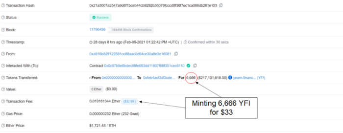

A $200m+ capital raise on Ethereum is extremely cheap

While fans of “Ethereum killers” talk up what is possible in the future, huge transactions are already happening on Ethereum to solve real-world problems — in this case incentivizing contributors to grow the protocol.

Following the Dai vault exploit, Yearn chose to reimburse those who lost funds — despite not being contractually obliged to do so. The funds for reimbursement could have come from selling the newly minted YFI for Dai or by taking out a collateralized loan. Yearn decided on the latter, and again the [transaction](https://etherscan.io/tx/0xdd102623987cfb7a401d4880d0524478a795fb269c380c876bb9990dd69c2f0d) demonstrates the advantages of Ethereum:

- $155 to take out a $9.7m collateralized loan
- No paperwork
- No humans required — just a purple rabbit

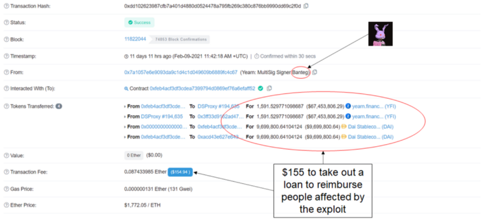

Taking a $9.7m collateralized loan on Ethereum is extremely cheap

Comparing an asset management protocol on Ethereum to the largest global asset manager could be considered premature. After all, Yearn is restricted to the assets on Ethereum whereas Blackrock is not. So let’s analyse the assets on Ethereum.

**3\. The rise of assets on Ethereum**

**Ether ($200bn+)**

Ether is by far the largest asset on Ethereum and recently became a [top 50 global asset](https://companiesmarketcap.com/) by market capitalization.

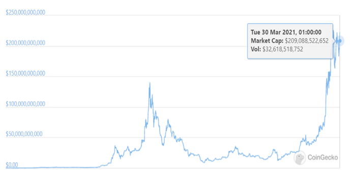A $200bn+ market cap makes Ether a top 50 global asset

**What can you do with ETH and how does Yearn fit in?**

In 2017/18 you could send ETH to a friendly team who had written an excellent whitepaper. If you were lucky, that team was led by Sergey Nazarov (Chainlink), Stani Kulechov (Aave) or Kain Warwick (Synthetix). Most investors weren’t so lucky as many teams did not deliver beyond the whitepaper.

Now it’s 2021, things have moved on. You have the following options for your ETH each with its own risk-reward profile:

- Hold it in cold storage or a hot wallet if you consider the price volatility of ETH risky enough without taking on additional risks to earn a yield
- Hold Grayscale’s Ethereum Trust which gives you ETH price exposure in a tax advantaged account, but charges a fee
- Hold it on a centralized exchange ready to trade it
- Deposit it in the ETH 2.0 [staking contract](https://etherscan.io/address/0x00000000219ab540356cbb839cbe05303d7705fa) and operate an ETH 2.0 validator to earn yield
- Deposit it on a lending protocol, such as Aave, Compound Finance or dydx to earn an interest from collateralized lending (and flashloan fees)
- Use it to open a Collateralized Debt Position on [MakerDao](https://oasis.app/borrow), and use the Dai to earn a yield or to trade
- Deposit it on Curve Finance to earn trading fees and rewards from the [ETH:sETH pool](https://curve.fi/pools)
- Deposit it in Curve Finance’s [steth pool](https://curve.fi/pools) and then deposit the liquidity provider (LP) token in Yearn’s [crvSTETH vault](https://yearn.finance/vaults/0xdCD90C7f6324cfa40d7169ef80b12031770B4325) to earn a yield (made up of LDO and CRV rewards)
- Combine it with your favourite ERC-20 to earn trading fees (and liquidity mining rewards) on Uniswap or Sushiswap

ETH has become a productive asset. But the future of France does not involve individuals assessing the risks and rewards of all the choices above on a regular basis and making expensive transactions on Ethereum. People have better things to do and (on average) each new person coming into DeFi is going to understand less than the previous one. They’re not going to put the hours in to chasing down every yield farm that pops up.

This is where Yearn comes in. Yearn finds the best risk-adjusted yield for your ETH (that works at scale).

**DeFi tokens ($93bn)**

DeFi tokens are the newest type of asset on Ethereum.

Valuable governless tokens

DeFi tokens consist predominantly of DeFi governance tokens whose protocols produce cashflows. The protocols are in various stages of working out how much of these cashflows should be returned to the token holders.

Each DeFi token has its quirks as their communities try to find ways of incentivizing people to grow the protocol in a way that will help the protocol (and ultimately the token’s price). For example:

- Maker (MKR) incentivizes you to vote on which collateral types can be onboarded and which parameters should be chosen
- Synthetix (SNX) incentivizes you to mint sUSD and use it to trade on their synthetics platform
- Aave (AAVE) has its safety module incentivizing you to vote against the onboarding of assets that are deemed too risky
- Compound Finance (COMP) wants you to vote on interest rate model updates
- Curve Finance rewards locking of CRV with half of the 0.04% trading fees, and uses the time value of the locked CRV to vote on the reward distribution between pools
- Hegic rewards you with fees from options trading, provided you can stake 888,000 tokens
- Sushi wants you to stake for xSushi to earn 0.05% of the volume traded
- UNI controls protocol fee switch and can force early transition to an open-source license

The value of these tokens has increased significantly over the last year as the market puts a greater value on tokens representing a transparent and fair (to the extent that each wallet is treated the same) financial system that is available to anyone with an internet connection. The cashflows help too.

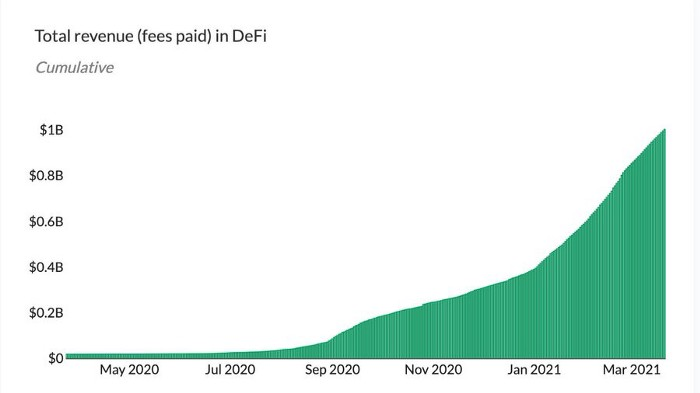

DeFi protocols recently surpassed $1bn in total revenue (Token Terminal)

**Stablecoins**

The most popular stablecoins represent 1 USD and come in different forms, such as collateralized by crypto (e.g. Maker’s Dai), custodial (e.g. USDC) or algorithmic (e.g. AMPL).

Stablecoins are moving to Ethereum where they can earn a yield from lending, trading or liquidity mining. It is difficult to see these stablecoins being converted back to fiat when traditional banks are paying [close to 0%](https://twitter.com/mattysino/status/1379368078979391488?s=20). This goes some way to explaining why the stablecoin supply on Ethereum grew 600% over the last 12 months.

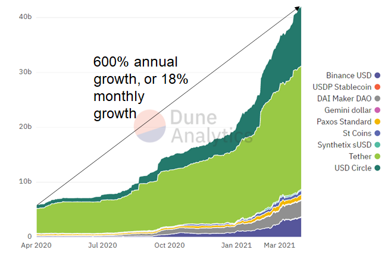

People are preferring stablecoins on Ethereum to dollars in the bank ([https://duneanalytics.com/hagaetc/stablecoins](https://duneanalytics.com/hagaetc/stablecoins))

You can now earn a yield on stablecoins by providing liquidity to protocols. Either deposit them on a lending protocol, for example, on Aave or Compound Finance or on an AMM such as Curve Finance.

One problem with depositing stablecoins on Aave or Compound Finance is that you will not always be earning the highest yield of the two. The original Yearn protocol solved this problem in early 2020 by automatically moving stablecoins to the highest yielding lending protocol.

Yearn’s stablecoin strategies have come a long way since early 2020 and now the protocol earns interest from lending, trading fees, [Curve’s “boosties”](https://docs.yearn.finance/how-to-guides/how-to-understand-crv-vote-locking), liquidity mining rewards and leverage and converts it in to a yield for the user. More on these strategies later.

**Tokenized bitcoin on Ethereum ($10bn)**

Even bitcoin is finding its way to Ethereum. By end March 2021 there was more [bitcoin on Ethereum](https://btconethereum.com/) ($10bn) than that held by MicroStrategy ($5.4bn³) and Tesla ([$1.5bn](https://www.cnbc.com/2021/02/08/tesla-buys-1point5-billion-in-bitcoin.html)) combined. Mainstream media isn’t going to make it.

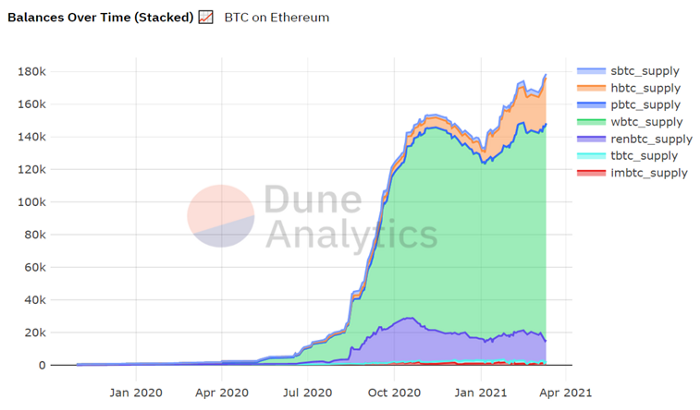

Tokenized bitcoin on Ethereum ([https://duneanalytics.com/queries/4962/9776](https://duneanalytics.com/queries/4962/9776))

Companies and protocols have developed ways for you to swap your bitcoin for a tokenized version of bitcoin.

Representations of the “real thing” are often more useful in traditional finance too. For example, I can’t earn a yield with a £1 coin, but I can earn 1% APY with a £1 balance in my Santander account. With wBTC, the largest tokenized version of bitcoin, you can earn a yield in Yearn’s wBTC vault. The ability to earn a yield by lending your tokenized bitcoin means people increasingly prefer to own tokenized bitcoin on Ethereum despite the extra risks involved.

If you want bitcoin exposure, what’s the alternative? HODL and tell everyone [hodling _is_ using bitcoin](https://twitter.com/danheld/status/1362794078518341637?s=20). Or earn a yield using a centralized service, such as BlockFi or Celsius. Your decision will depend on your risk-reward preferences.

**What’s next?**

Ether, DeFi tokens, stablecoins and tokenized bitcoin combine to form a $300bn+ addressable market for an asset management protocol on Ethereum. Are there signs of other asset classes making their way to Ethereum?

**Synthetic equities**

The chart below shows why equities matter. At [$95 trillion](https://www.cnbc.com/2020/11/12/global-stock-market-value-rises-to-a-record-95-trillion-this-week-on-vaccine-hope.html) the market cap is 50 times the size of the total crypto market cap.

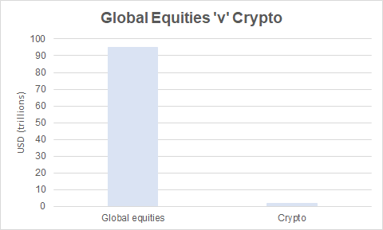

Global equities 50x crypto market cap

Synthetix was the first protocol to create synthetic crypto and traditional Finance indices. To many it was therefore a surprise that Mirror came and stole the show with their Mirrored Tesla (mTsla) synthetic equity on Terra (and also Ethereum). Their different approaches to creating liquid synths, reducing the cost of transactions and different protocol risks make this an interesting head-to-head.

DeFi on Ethereum has battle-tested AMMs and lending protocols. They have worked fairly reliably for stablecoins and other ERC-20 tokens over a few years. As far as these protocols are concerned, synthetic equities will be just another ERC-20 token and treated the same as the stablecoins, DeFi tokens or tokenized bitcoin. The foundations have already been laid for you to be able to:

- lend your synthetic equity in return for a yield
- earn trading fees
- use it as collateral to borrow against
- trade it for another token or
- leave it with Yearn to earn a yield for you

By end 2021 you might be able to zap any ERC-20 token into a yield-bearing synthetic Tesla where the yield comes from mTsla/sTesla trading fees on Curve, lending on Aave, additional rewards from Ironbank leverage and a boost from [Yearn’s stack of veCRV](https://crv.ape.tax/).

**Tokenized equities (non-synthetic)**

Tokenized equities are one step closer to the “real” thing, because you have ownership of the stock.

FTX offers [tokenized stocks](https://help.ftx.com/hc/en-us/articles/360051229472-Tokenized-Stocks) that are backed by shares of the stock, custodied by CM-Equity. Currently FTX does not allow these tokens outside of their platform, however, the comment “In the future, there may be other ways to withdraw the tokens from FTX” suggests this could change. Clearly SBF’s preference will be that they are withdrawn to Solana, but the DeFi protocols on Ethereum have the most traction so at least there will likely be a bridge there.

One example of a tokenized equity already on Ethereum is the [wCRES token](https://defi.crescofin.ch/): “The wCRES token is a simple ERC20 token that conveys equity rights in CrescoFin to the tokenholder. There is no restriction on transferability and no need to undergo a KYC check.” Coincidentally, they’re also in the yield business and with Stani Kulechov as an advisor Aave is likely to be their first choice for earning that yield.

These tokenized equities will bring another asset-type to Ethereum. Some protocols might accept custodied tokenized equities, other protocols might accept their synthetic counterparts. This, as well as arbitrage opportunities, will create demand for swapping from one to another, and that’s what Curve enables so well. It will then be up to an asset manager on Ethereum to find a way for you to earn trading fees and any additional rewards available in DeFi. That is what Yearn does best.

**IPOs on Ethereum (slightly speculative)**

Tokenizing equities that already exist is a huge step to increasing the addressable market of an asset manager on Ethereum. But what about new equities?

Initial Public Offerings (IPOs) are expensive. The underwriting fees from a PWC report are shown below. Note that there’s no quote for deals under $25m, welcome to traditional finance. The column on the right shows the number of middlemen that could one day be disintermediated by using Ethereum.

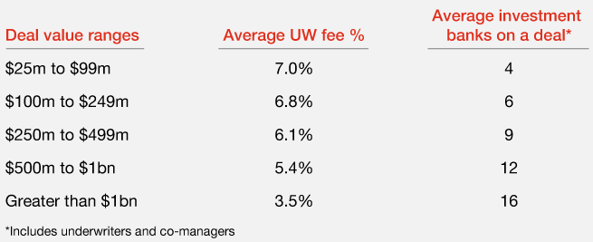

[Underwriting fees](https://www.pwc.com/us/en/services/deals/library/cost-of-an-ipo.html) for IPOs in traditional finance

During 2017/18 there were lots of scam Initial Coin Offerings (ICOs). There were so many because they were cheap to do, and there were lots of people with spare cash willing to take a gamble.

But the narrative of there being lots of scams doesn’t tell the full story. It is now possible to carry out an IPO on Ethereum for a much lower cost. Lots of ICOs in 2017/18 turned out to be illegal securities, but the technology is just as good for legal securities too. So what will be the first high profile IPO on Ethereum?

There have been only two so far (that I can find), both of which are related to Ethereum ([a fund](https://www.coindesk.com/ether-fund-ipo-3iq-tsx) and a [trading platform](https://token.inx.co/?_ga=2.105952771.1875400193.1615853639-1172741532.1615853639)). Ethereum is still considered risky, so don’t expect risk-averse companies to launch their IPOs on Ethereum any time soon. But for a smaller company that has a greater appetite for risk an IPO on Ethereum may be the best way to raise capital.

**Bonds as well? (Very speculative)**

Bonds are less risky than crypto and equities (measured by historic volatility). There’s more than [$100 trillion](https://www.icmagroup.org/Regulatory-Policy-and-Market-Practice/Secondary-Markets/bond-market-size/) of them. If ever, they will likely come last to Ethereum. No-one is pestering the Spartan Council for a synthetic 30-year US treasury, sTMUBMUSD30Y, to lock in 2.4% pa yield. However, there are signs of large traditional financial players testing the waters.

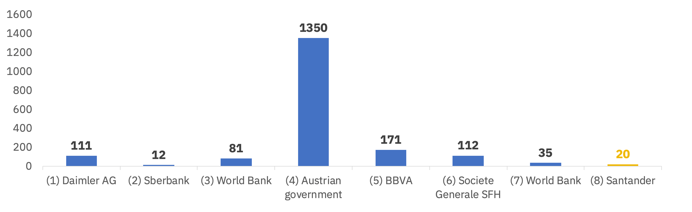
History of bond issuance on blockchains ([Binance Research](https://research.binance.com/en/analysis/santander-bond), Coindesk)

These institutions and companies are testing the technology because it is cheap. If it’s cheap it saves them money and gives them an edge against competitors.

Like most assets, bonds are lent, borrowed and traded giving rise to interest and trading fees respectively. In traditional finance most of the interest and trading fees would go to a middleman. But imagine depositing a tokenized version of a 30-year treasury in a Yearn vault to earn an additional yield from people shorting and trading the bond. This may sound fanciful but the technology already exists, as far as Ethereum is concerned a bond would be another ERC-20 token (ok, maybe there’s some technicalities to be ironed out). Lending protocols would first need to accept the bond as collateral, and then Curve Finance (or another AMM) would need to create a liquidity pool where it could be traded and finally Yearn would need to build strategies for the bond.

If issuing bonds turns out to be cheaper on Ethereum (along with all the other advantages) and over time the perception that using Ethereum is too risky changes, then it’s highly likely that more bonds will be issued on Ethereum.

These institutions will not be quibbling over a $1,000 gas fee.

**Assets in search of yield**

Today there are more than $300bn of assets on Ethereum with the potential for many more. Yearn is well-placed to become the go-to asset manager for those willing to take on the additional risks of interacting with more protocols in search of higher yields.

**4\. Yearn is leading the innovation in risk-adjusted yields**

**Crypto yields before 0 B.C**

Cronje wasn’t the first person to realise the importance of yield in crypto. BlockFi offered yields from institutional lending in 2017 and then Mashinsky “The Machine” introduced the CEL token as an incentivizing mechanism (and to distribute revenues more equitably amongst depositors).

However, these are companies. They are centralized.

The challenge that the DeFi entrepreneurs took up was to find a way of trading, borrowing and lending in a censorship-resistant way with code replacing the middleman. Even if the models replicated traditional finance they would have the advantages of transparency, no middlemen and available to anyone with an internet connection.

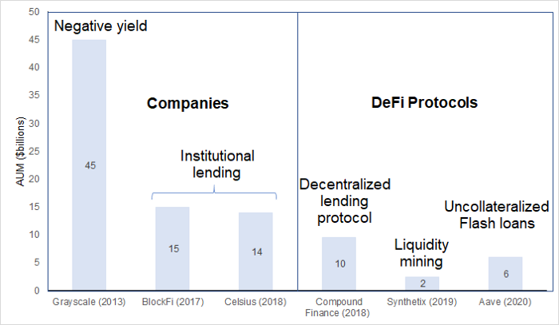History of crypto yields before 0 B.C⁴

Compound Finance’s lending protocol was the first DeFi protocol that allowed you to earn a yield. However, it wasn’t until the [launch of the COMP](https://www.coindesk.com/compounds-comp-token-price-doubles-amid-defi-mania) token in June 2020 that usage skyrocketed.

Synthetix deserves a special mention because they were the first DeFi protocol to use their token as an incentivizing mechanism to grow the protocol (unlike many protocols that even 2 years later, just give away tokens for staking that are then sold immediately). In other words, Synthetix is partly responsible for all the APYs quoted everywhere in DeFi — sometimes called yield farming, liquidity mining, or just earning rewards.

In early 2020 Aave popularized flashloans and uses the fees to increase the depositors’ yield. Flashloans let you borrow without providing collateral, as long as you pay the loan back within the same block (13 seconds). Lots of exploits use flashloans giving them a bad rap for a couple of weeks after each exploit, but they are a useful stress test and make DeFi more robust in the longer term.

Earning a yield in crypto saw 6 innovations in 7 years. And then came Cronje.

When Cronje started working on Yearn v1 there were several problems that people had to overcome in order to interact with DeFi protocols. Even something as simple as switching funds between the highest lending protocols required:

- enough ETH to pay for gas each time interest rates on the lending protocols varied materially
- an understanding of how the underlying lending protocols work
- an understanding of the risks involved
- a lot of time — both to check the yields and then to make the transactions

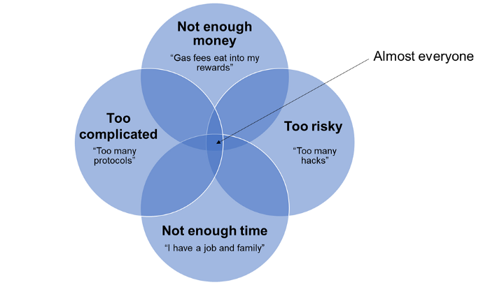The problems with DeFi that Yearn helps to solve

Initially Andre carried out these transactions manually. By aggregating capital the gas fees can be shared, not everyone needs to understand all the protocols at the same level of detail, and you can deposit your funds and let one person do the work. The challenge was to automate the process.

**Innovations in automated yields**

First of all Andre had to figure out how each lending protocol calculated the yield, which he explains [here](https://medium.com/iearn/how-we-built-on-chain-apr-for-ethereum-defi-a8d84b680758). Then he ran in to some problems which he explains [here](https://medium.com/iearn/yield-aggregator-problem-s-2-3-4-and-5-too-large-to-move-9a75432a50de). But it wasn’t long before Yearn was moving funds to whichever lending protocol had the highest yield.

He then found a way for the protocol to earn additional trading fees by providing liquidity to Curve Finance.

When the COMP token was launched, kicking off the yield farming summer of 2020, this meant that Yearn had to incorporate the price of COMP in to the yield calculations.

When Curve introduced the concept of “boosties” for locking CRV, Yearn found a way of incentivizing people to lock their CRV indefinitely to earn a regular yield in a stablecoin pool (3CRV), which would boost the yields of Yearn’s depositors (the “[backscratcher](https://twitter.com/iearnfinance/status/1376912409688956932?s=20)”).

But Andre was still not happy. There remained capital inefficiencies everywhere he looked, such as capital sitting idle in Cream Finance (a lending protocol in Yearn’s ecosystem). Say there’s 10m Dai sitting in Cream Finance and not being lent out (therefore earning no yield) and Yearn has a strategy that could earn 10% APY on Dai, even if only for a very short time. What if Yearn could borrow that Dai for a lower interest rate, earn the 10% APY, and pay the loan back either when the strategy no longer produced excess yield or when the depositor on Cream Finance wanted their Dai returned? That’s what Yearn does — not for its own benefit — but to increase the yields of depositors. It was a first in [protocol-to-protocol uncollateralized lending](https://creamdotfinance.medium.com/introducing-the-iron-bank-bab9417c9a).

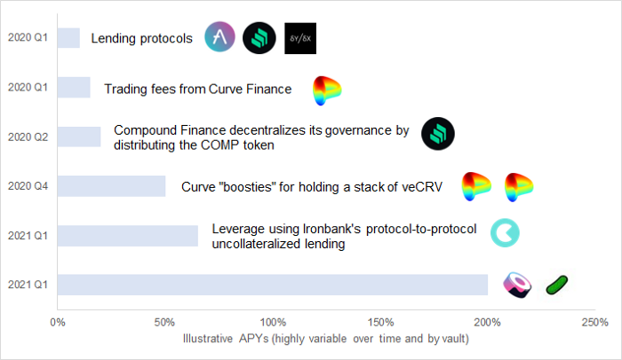Yearn’s innovations in yields

The bar at the bottom of the diagram above represents an innovation in yields that came with the help of another ecosystem partner, Sushi. As a way of incentivizing people to lock their CRV indefinitely Yearn created a complex asset called yveCRV. However, there was no market for yveCRV so Yearn incentivized people to provide liquidity to yveCRV-ETH by offering rewards in Sushi. This turned an illiquid asset into a liquid one using an ecosystem partner. This is not your average DeFi protocol.

**Yearn’s v2 vaults become multi-strategy**

Despite all these innovations Yearn’s vaults contained one significant limitation. They could only run one strategy at a time. The magnitude of the problem, and its impact on scalability, was realised soon after the first ETH vault in September 2020 but it was not long before fubuloubu posted the vaults v2 design in Yearn Improvement Proposal 48 ([YIP-48](https://gov.yearn.finance/t/yip-48-vaults-v2-design/6658)).

The vault re-design proposed in YIP-48 has now been implemented, audits have been carried out and new strategies are ready to go.

The image below shows the yvDai vault earning a yield for depositors with 6 strategies in action at the same time (the strategy labels are in green).

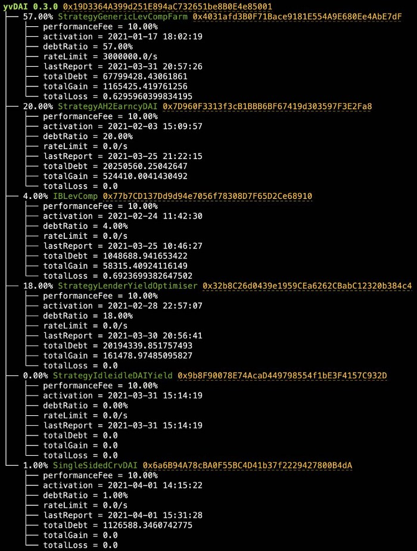

Six strategies in one vault ([https://twitter.com/bantg/status/1377681238249574404?s=20](https://twitter.com/bantg/status/1377681238249574404?s=20))

Ceazor explains the different strategies [here](https://www.youtube.com/watch?v=Ur9bWz8SfOs). They’re getting complicated.

The diagram below shows the inner workings of the GenericLevCompFarm strategy, where 57% of the yvDai vault is being deployed.

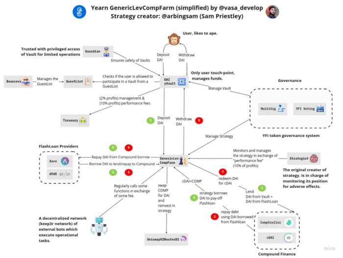

Diagram of the first strategy, GenericLevCompFarm, shown in banteg’s tweet above

This is not just another DeFi protocol or yield aggregator.

**Managing Risk**

Although one of the common criticisms of yield aggregators is that a significant chunk of the yields is dependent on temporary rewards issued by DeFi protocols, even without these rewards there is no competition from traditional finance. Towards the end of 2020 [negative yielding debt hit $18 trillion](https://www.bloomberg.com/news/articles/2020-12-11/world-s-negative-yield-debt-pile-at-18-trillion-for-first-time#:~:text=About%20%241%20trillion%20of%20bonds,30%25%20peak%20reached%20last%20year).

The greater challenge seems to be to reduce the real and perceived risks of interacting with the assets and protocols on Ethereum. People do not stick around with asset managers that lose their money.

A key part of Yearn’s brand is its focus on security which Cronje prioritized in the first version in early 2020. Developers have to determine which protocols and strategies are trustworthy, think through potential economic exploits, limit deposits in to certain strategies and find ways of covering losses in case exploits do occur. The seriousness with which Yearn takes security and the speed with which it resolves issues that arise is evidenced by the detail in its [vulnerability disclosure reports](https://github.com/yearn/yearn-security/tree/master/disclosures) and the [system specification](https://github.com/yearn/yearn-vaults/blob/master/SPECIFICATION.md). Higher level risk controls are shown in the table below.

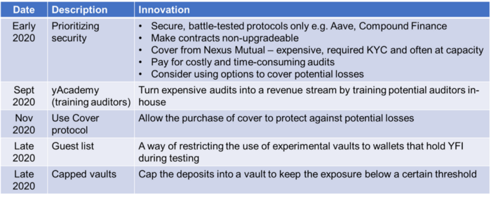Prioritizing security from day 1

The yAcademy is my favourite from the list above because it illustrates the emergent nature of Yearn — and DeFi in general. It started with just some dev (Andre) writing some code (Yearn v1). People he didn’t know thought it was interesting and started interacting with it so he started a telegram group where it was discussed. Auditing the code was necessary, but expensive and slow, due to there being few people with the required skills and because it is hard and time-consuming. It’s still a bottleneck for the whole of DeFi, not just for Yearn. 9 months later Ali Atiia **(**@aliatiia\_) submits a [governance proposal](https://gov.yearn.finance/t/lets-poach-samczsun-and-plant-the-seed-for-an-auditing-academy/5507) (viewed by 2.3k people) for Yearn to develop an academy to train auditors. 2 months after the proposal, and a partnership with Gitcoin and Status in-hand, [YIP-53](https://gov.yearn.finance/t/yip-53-yacademy-planting-the-seed-of-a-sustainably-secure-future-for-yearn-and-beyond/7929) is submitted. This officially creates yAcademy with a budget and a detailed specification.

This happened with no management. No HR department. No résumés.

**Evidence of adoption**

It’s one thing to describe how Yearn is leading the innovation in risk-adjusted yields, but ultimately the asset management industry uses one key metric, and that’s AUM (TVL in DeFi). This is up by 3x in the last quarter. At less than 1% of the assets on Ethereum, which are themselves growing at a rapid pace, there is still plenty of room for Yearn’s AUM to grow.

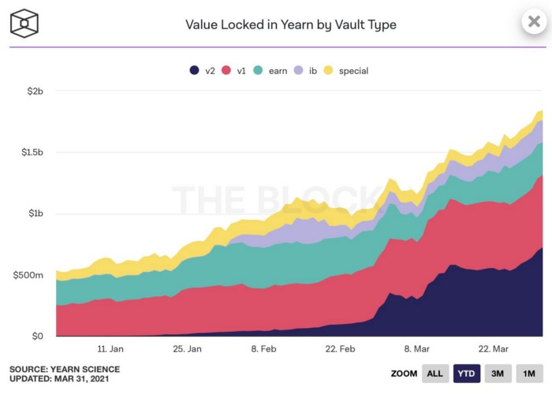Yearn’s TVL hits $1.84b on 31st March 2021 — The Block (and banteg)

**5\. Competition**

Two of the largest crypto asset managers are Grayscale ([$45bn AUM](https://twitter.com/Grayscale/status/1377000118298275846)) and Celsius Network ([$14bn AUM](https://twitter.com/Mashinsky/status/1378340230265200644?s=20)). It’s natural to consider these as Yearn’s competitors because they are also competing for your crypto. However, this ignores how early we are. Blackrock’s AUM is $8.7 trillion, and the total AUM of the global asset management industry is $110 trillion.

**Grayscale ($45bn)**

Grayscale caters to a different user base. Grayscale’s trusts allow you to hold crypto in tax-advantaged accounts with a focus on security. Investors can hold the trust in their brokerage account so they do not have to worry about a private key. In return for the perceived security and tax saving, potential investors are willing to pay an annual management charge.

Grayscale has [filed](https://www.coindesk.com/grayscale-files-to-register-trust-for-defi-platform-yearn-finance) to register a trust for YFI. If this goes ahead it would allow equity investors to get exposure to YFI. A more interesting synergy between the company and the protocol would be if Grayscale introduces trusts for Yearn’s vaults tokens— this could increase both Yearn’s and Grayscale’s AUM. For example, a yield-bearing yvETH trust could more than offset the fees charged by Grayscale. This may seem far-fetched but 9 months ago the YFI token didn’t exist — things move fast in crypto. yvETH may need to become liquid first, perhaps with help from Yearn’s ecosystem partner Sushi by incentivizing liquidity provision to the yvETH-ETH pair.

**Celsius ($14bn)**

Celsius Network has several licenses and appears to be doing its best to meet the latest regulations. It does not charge fees and is not restricted to assets on Ethereum which gives it a much greater addressable market than Yearn today. Celsius could be considered a competitor to Yearn because they are both asset managers competing for assets.

However, if Yearn’s vaults earn the highest risk-adjusted yields in DeFi, then there’s no reason why Celsius could not use Yearn’s vaults. Celsius pays [17.8% APY](https://celsius.network/rates/) on [SNX](https://www.stakingrewards.com/earn/synthetix-network-token) and [Matic](https://www.stakingrewards.com/earn/matic-network) which is much more likely paid from staking rewards than from institutional lending (where the majority of their revenue comes from). It is not such a big leap for Celsius to go from staking SNX to earning a yield with Yearn.

One key advantage that protocols have over companies is the composability of DeFi (“money legos”) and the permissionless nature of DeFi which means any protocol can use Yearn’s vaults. For example, the yvDai vault recently reached its limit (temporarily) because a new protocol, Alchemix, directed funds there. A new protocol Smoothy Finance has also integrated Yearn’s vaults into their AMM. These protocol-to-protocol integrations are not possible with Celsius and will likely be crucial to Yearn’s success. Yearn’s affiliate program incentivizes these integrations and it will be interesting to see the new protocols that utilize Yearn’s vaults in the future.

Another example of Yearn benefiting from other protocols is the recent [proposal](https://forum.cream.finance/t/list-yearn-finance-v2-yvault-tokens-as-collateral-assets/1478) to list some of Yearn’s vault tokens on the lending protocol Cream Finance, another ecosystem partner. If approved, this will allow users to earn a yield on their crypto in Yearn’s vaults and use it as collateral for borrowing at the same time — improving the capital efficiency of DeFi.

The information in this article does not constitute any form of advice or recommendation and is not intended to be relied upon by users in making (or refraining from making) any investment decisions or in interacting with DeFi protocols.

Disclosure: I hold YFI and other crypto mentioned in this article.

To learn more about Yearn join [discord](https://discord.gg/cxkXa6Px), the [telegram chat](https://t.me/yearnfinance) or follow Yearn on [Twitter](https://twitter.com/iearnfinance).

¹ Note that the Yearn TVL on DeFiPulse is currently out of date. DeFiPulse has the longest history of total TVL across DeFi

² Blackrock’s securities lending [description](https://www.blackrock.com/uk/individual/education/how-to-invest/securities-lending?switchLocale=y&siteEntryPassthrough=true)

³ 90,859 bitcoins ([Reuters article](https://www.reuters.com/article/us-crypto-currency-microstrategy-idUSKCN2AT2H5)) at end March price of $59k is $5.4bn

⁴ [BlockFi’s $15bn AUM](https://www.forbes.com/sites/ninabambysheva/2021/03/11/blockfi-gets-a-3-billion-valuation-with-new-350-million-series-d-funding/?sh=6105ca5b58a5) and protocol TVLs from [DeFillama](https://defillama.com/home)
