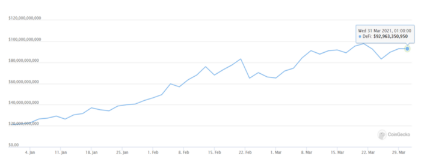

# Yearn peut-il perturber l'industrie de la gestion d'actifs évalué à 110 Trillion de dollars?

**Résumé**

1. L'industrie de la gestion d'actifs détient [$110 trillion](https://www.pwc.com/gx/en/industries/financial-services/assets/wealth-management-2-0-data-tool/pwc_awm_revolution_2020.pdf) d'actifs sous gestion (assets under management, AUM).

2. Yearn n'est pas directement comparable à un gestionnaire d'actifs de la finance traditionnelle, mais une comparaison avec Blackrock est utile pour comprendre d'où proviennent ses revenus et ses premiers revers.

3. Il y a plus de 300 milliards de dollars d'actifs tokenisés sur Ethereum qui se développent rapidement.

4. Yearn est à la tête de l'innovation en matière de rendements ajustés au risque, ce qui la place en pole position pour bénéficier de la montée en puissance des ces  actifs sur Ethereum. Cela entraînera probablement une augmentation significative de l'AUM de Yearn au fil du temps.

5. Être un protocole DeFi donne à Yearn des avantages impossible à avoir pour les autres gestionnaires d'actifs cryptos, tels que Grayscale et Celsius. En particulier, sa nature sans permission permet l'intégration avec d'autres protocoles, comme la récente intégration avec Alchemix par exemple.

**Introduction**

La DeFi connaît une croissance explosive depuis 3,5 ans, selon [DeFiPulse](https://defipulse.com/), passant de moins de 2 millions de dollars de valeur totale verrouillée (TVL) au troisième trimestre 2017 à 44,6 milliards de dollars au premier trimestre 2021. [Defillama](https://defillama.com/home) annonce un TVL au premier trimestre 2021 sur Ethereum de 68,5 milliards de dollars. Le volume des transactions d'Uniswap a dépassé celui de Coinbase pour le mois de [septembre 2020](https://www.theblockcrypto.com/linked/79775/uniswap-coinbase-monthly-volume-september). La question n'est plus de savoir si la DeFi va perturber la finance traditionnelle, mais quels protocoles DeFi joueront les trouble-fête ? 

Croissance de la TVL dans la DeFi a explosée depuis 3.5 ans¹

Yearn est un protocole de gestion d'actifs sur Ethereum. Au premier trimestre 2021, il gérait 1,8 milliard de dollars d'Ether, de stablecoin et de jetons DeFi. Mais ces chiffres datent de la semaine dernière, ce sont maintenant [2,5 milliards de dollars](https://yearn.science/) !

Yearn vous permet de déposer vos cryptos dans un «vault» (coffre fort) qui utilise automatiquement les protocoles DeFi pour gagner le rendement. Les stratégies déployées varient en complexité, du simple dépôt de votre crypto sur un protocole de prêt, à la prise d'un prêt contre vos cryptos tout en investissant ce prêt dans une autre stratégie ou à la prise d'un prêt non garanti sur un autre protocole pour générer des intérêts. Le récent lancement des vaults v2 va encore plus loin, car vos cryptos peuvent générer des intérêts à partir de plusieurs stratégies dans un même vault.

1.  **L'industrie de la gestion d'actifs**

Dans la finance traditionnelle, les actifs gravitent vers quelques gestionnaires d'actifs bien connus. Bien que l'industrie ne soit en aucun cas la seule, elle est très importante.

The asset management industry is measured in $trillions AUM and highly concentrated ([June 30th 2020 data](https://www.advratings.com/top-asset-management-firms))

Yearn n’est pas directement comparable à la gestion d'actifs traditionnelle. Ce n’est pas une banque, mais il génère des intérêts grâce à  des prêts. Ce n’est pas un hedge fund, mais il met en œuvre des stratégies actives.

**2\. Similitudes avec Blackrock**

**Sources de revenus**

74% des revenus de Blackrock au troisième trimestre 2020 provenaient de conseils en placement, d'honoraires et de prêts. Les revenus de Yearn peuvent être classés de la même manière.

Sources de revenus similaires. Différentes technologies.

L'externalisation des stratégies est une caractéristique remarquable de la façon dont Yearn est structuré. Inciter les stratèges est ce qui différencie Yearn, une plateforme de gestion d'actifs évolutive, d'une équipe, ou d'une seule personne, essayant de suivre toutes les innovations de la DeFi.

**Premiers revers**

Il serait négligent de ma part de comparer Yearn au plus grand gestionnaire d'actifs mondiaux sans reconnaître deux revers récents :

- Les problèmes liés à la manière d'encourager les contributeurs ont conduit à un [débat au sein de la communauté](https://gov.yearn.finance/t/yip-57-funding-yearns-future/9319) et ont abouti a la création  (mint) de 6666 YFI (plus de 200 millions de dollars)
- Yearn a subi [un exploit de 11 millions de dollars](https://www.coindesk.com/yearn-finance-dai-vault-exploit) - [les déposants ont depuis été remboursés](https://cointelegraph.com/news/after-yearn-exploit-attacker-funds-frozen-and-reimbursement-plans-developing).

De façon similaire , Larry Fink (PDG de Blackrock) a connu des revers à ses débuts :

- En 1994, Fink et son co-fondateur ont eu un différend interne sur les modes de rémunération et d'équité
- Avant Blackrock, il a perdu 100 millions de dollars chez Boston First en raison de mauvaises pratiques de gestion des risques

Deux Informations à retenir:

- Inciter les gens est difficile et nécessite généralement une compensation. Cela est vrai pour la plupart des organisations, qu'il s'agisse d'entreprises ou de protocoles.
- La gestion des risques est difficile. Les pertes dues à de mauvaises pratiques de gestion des risques ne sont pas uniques à la DeFi sur Ethereum, ou en raison d’un langage de programmation utilisé en particulier.

**La puissance de la DeFi**

La façon dont Yearn a pu résoudre ces problèmes démontre les avantages de la DeFi sur Ethereum:

- à quel point elle est bon marché - plus de 200 millions de dollars de capitaux levés pour 33 $
- transparence - tout le monde peut voir la [transaction](https://etherscan.io/tx/0x21a3007a2547a9d6f1bceb44cb9292b36079fcccd8f36f7ec1ca066db261e153) ci-dessous sur Etherscan
- pas d'intermédiaire - pas besoin de Goldman Sachs ou Morgan Stanley

Une augmentation de capital de plus de 200 millions de dollars sur Ethereum est extrêmement bon marché

Alors que les fans de «Ethereum killers» parlent de ce qui sera éventuellement possible à l'avenir, d'énormes transactions sont déjà en cours sur Ethereum pour résoudre des problèmes du monde réel -  incitant les contributeurs à développer le protocole.

À la suite de l'exploit du vault Dai, Yearn a choisi de rembourser ceux qui ont perdu des fonds - bien qu'ils ne soient pas obligés contractuellement de le faire. Les fonds pour le remboursement pourraient provenir de la vente de YFI nouvellement créé contre du Dai ou de la souscription d'un prêt garanti. Yearn a opté pour ce dernier, et à nouveau la [transaction](https://etherscan.io/tx/0xdd102623987cfb7a401d4880d0524478a795fb269c380c876bb9990dd69c2f0d) démontre les avantages d'Ethereum:

- 155 $ pour contracter un prêt garanti de 9,7 millions de dollars
- Pas de paperasse
- Aucun humain requis - juste un lapin violet

Prendre un prêt garanti de 9,7 millions de dollars sur Ethereum est extrêmement bon marché

Comparer un protocole de gestion d'actifs sur Ethereum au plus grand gestionnaire d'actifs mondiaux pourrait être considéré comme prématuré. Après tout, Yearn est limité aux actifs sur Ethereum, contrairement à Blackrock. Analysons donc les actifs sur Ethereum.

**3\. La montée en puissance des actifs sur Ethereum**

**Ether (200 milliards de dollars et plus)**

Ether est de loin l'actif le plus important sur Ethereum et est récemment devenu l'un des [50 principaux actifs](https://companiesmarketcap.com/)  mondiaux en termes de capitalisation boursière.

Une capitalisation boursière de plus de 200 milliards de dollars fait d'Ether parmi les 50 principaux actifs mondiaux

**Que pouvez-vous faire avec votre ETH et comment Yearn est impliqué ?**

En 2017/18, vous pouviez envoyer votre ETH à une équipe sympathique qui avait rédigé un excellent whitepaper.  Si vous aviez de la chance, cette équipe était dirigée par Sergey Nazarov (Chainlink), Stani Kulechov (Aave) ou Kain Warwick (Synthetix). La plupart des investisseurs n’ont pas été aussi chanceux, car de nombreuses équipes n’ont pas livré au-delà du whitepaper.

Nous sommes maintenant en 2021, les choses ont évoluées. Vous avez les options suivantes pour votre ETH, chacune avec son propre profil risque-récompense :

- Conservez-le dans un “cold storage” ou un “hot wallet”  si vous considérez la volatilité des prix de l'ETH suffisamment risqué et que vous ne voulez pas prendre de risques supplémentaires pour gagner des intérêts.
- Détenez des “Ethereum Trust” de Grayscale qui vous donne une exposition au prix de l’ETH dans un compte fiscalement avantageux, mais facture des frais.
- Gardez-le sur un échange centralisé pour le trader.
- Déposez-le dans le [contrat de staking](https://etherscan.io/address/0x00000000219ab540356cbb839cbe05303d7705fa) ETH 2.0 et utilisez un validateur ETH 2.0 pour gagner des intérêts.
- Déposez-le sur un protocole de prêt, tel que Aave, Compound Finance ou dydx pour gagner des intérêts sur les prêts garantis (et les frais de prêt flash)
- Utilisez-le pour ouvrir une position de dette garantie sur [MakerDao](https://oasis.app/borrow) et utilisez le Dai pour generer des intérêts ou pour l’echanger.
- Déposez-le sur Curve Finance pour gagner des frais de trading et des récompenses sur la [pool steth](https://curve.fi/pools)
- Déposez-le dans la pool steth de Curve Finance, puis déposez le jeton de fournisseur de liquidité (LP) dans le vault [crvSTETH](https://yearn.finance/vaults/0xdCD90C7f6324cfa40d7169ef80b12031770B4325) de Yearn pour générer des intérêts (composé de récompenses LDO et CRV)
- Combinez-le avec votre ERC-20 préféré pour gagner des frais de négociation (et des récompenses de “liquidity mining”) sur Uniswap ou Sushiswap

L'ETH est devenu un actif productif. Mais le ”future of France” n'implique pas que les individus évaluent régulièrement les risques et les avantages de tous les choix ci-dessus et effectuent des transactions coûteuses sur Ethereum. Les gens ont mieux à faire et (en moyenne) chaque nouvelle personne entrant dans le monde de la DeFi sera moins renseignée  que la précédente. Les utilisateurs ne vont pas passer des heures à traquer toutes les fermes de rendement qui surgissent.

C'est là qu'intervient Yearn. Yearn trouve le meilleur rendement ajusté au risque pour votre ETH .

**Jetons DeFi (93 milliards de dollars)**

Les jetons DeFi sont le dernier type d'actif sur Ethereum.

De précieux jetons sans gouvernement

Les jetons DeFi sont principalement constitués de jetons de gouvernance dont les protocoles produisent des flux de trésorerie. Les protocoles déterminent ensuite la part de ces flux de trésorerie qui doit être restituée aux détenteurs de jetons.

Chaque jeton DeFi a ses particularités, car leurs communautés essaient de trouver des moyens d'inciter les gens à développer le protocole d'une manière qui aidera le protocole (et finalement le prix du jeton). Par example:

- Maker (MKR) vous incite à voter sur les types de garantie pouvant être intégrés et les paramètres à choisir.
- Synthetix (SNX) vous incite à créer des sUSD et à les utiliser pour trader sur leur plate-forme de synthétiques.
- Aave (AAVE) a son module de sécurité vous incitant à voter contre l'intégration d'actifs jugés trop risqués.
- Compound Finance (COMP) veut que vous votiez sur les mises à jour du modèle de taux d'intérêt.
- Curve Finance récompense le verrouillage du CRV avec la moitié des frais de négociation de 0,04% et le CRV verrouillé pour voter sur la distribution des récompenses entre les pools.
- Hegic vous récompense avec des frais de négociation d'options, à condition que vous puissiez staker 888000 jetons.
- Sushi veut que vous stakiez vos SUSHI  pour obtenir des xSushi et gagner 0,05% du volume échangé.
- UNI contrôle le changement des frais de protocole et peut forcer la transition anticipée vers une licence open source.

La valeur de ces jetons a considérablement augmentée au cours de la dernière année, le marché accordant une plus grande valeur aux jetons représentant un système financier transparent et équitable (dans la mesure où chaque portefeuille est traité de la même manière), accessible à toute personne disposant d'une connexion Internet. Les flux de trésorerie aident aussi.

Les protocoles DeFi ont récemment dépassé 1 milliard de dollars de revenus totaux (Token Terminal)

**Stablecoins**

Les stablecoins les plus populaires représentent 1$ et se présentent sous différentes formes, telles que des garanties par des cryptos (par exemple le DAI de Maker), custodial (par exemple USDC) ou algorithmique (par exemple AMPL).

Les Stablecoins migrent vers Ethereum où ils peuvent générer des intérêts grâce aux prêts, aux échanges ou à l'extraction de liquidités. Il est difficile de voir ces stablecoins être reconvertis en fiat alors que les banques traditionnelles paient près de [0% d’intérêt](https://twitter.com/mattysino/status/1379368078979391488?s=20). Cela explique en partie pourquoi l'offre de stablecoins sur Ethereum a augmentée de 600% au cours des 12 derniers mois.

Les gens préfèrent les stablecoins sur Ethereum aux dollars en banque (([https://duneanalytics.com/hagaetc/stablecoins](https://duneanalytics.com/hagaetc/stablecoins))

Vous pouvez désormais générer des intérêts sur les stablecoins en fournissant de la liquidité sur les protocoles. Soit en les déposant sur un protocole de prêt, par exemple, sur Aave ou Compound Finance ou sur une AMM comme Curve Finance.

Un problème avec le dépôt de stablecoins sur Aave ou Compound Finance est que vous ne gagnerez pas toujours les intérêts les plus élevés. Le protocole original Yearn a résolu ce problème au début de 2020 en déplaçant automatiquement les stablecoins vers le protocole de prêt générant les intérêts les plus élevés.

Les stratégies utilisant des stablecoins de Yearn ont parcouru un long chemin depuis début 2020 et maintenant le protocole génère des intérêts sur les prêts, les frais de négociation, [les «boosters» de Curve](https://docs.yearn.finance/how-to-guides/how-to-understand-crv-vote-locking), les récompenses , l'effet de levier , l'extraction de liquidité et le convertit intérêts pour l'utilisateur. Plus d'informations sur ces stratégies plus tard.

**Bitcoin tokenisés sur Ethereum (10 milliards de dollars)**

Même le bitcoin trouve son chemin vers Ethereum. Fin mars 2021, il y avait plus de [bitcoin sur Ethereum](https://btconethereum.com/) (10 milliards de dollars) que ceux détenus par MicroStrategy (5,4 milliards de dollars³) et Tesla([1,5 milliard de dollars](https://www.cnbc.com/2021/02/08/tesla-buys-1point5-billion-in-bitcoin.html))  combinés. Les médias grand public ne réussiront pas !

Bitcoin tokenisé sur Ethereum  ([https://duneanalytics.com/queries/4962/9776](https://duneanalytics.com/queries/4962/9776))

Les entreprises et les protocoles ont développé des moyens pour vous  permettre d'échanger votre bitcoin contre une version tokenisée de ce bitcoin.

Les représentations de «choses réelles» sont souvent aussi plus utiles dans la finance traditionnelle. Par exemple, je ne peux pas gagner d’intérêts avec une pièce de 1 £, mais je peux gagner 1% APY avec un solde de 1 £ sur mon compte Santander. Avec wBTC, la version tokenisée de Bitcoin la plus abondante, vous pouvez gagner des intérêts en les deposant dans le vault wBTC de Yearn. La possibilité de gagner des intérêts en prêtant votre bitcoin tokenisé signifie que les gens préfèrent de plus en plus posséder du bitcoin tokenisé sur Ethereum malgré les risques supplémentaires que cela implique.

Si vous voulez une exposition au bitcoin, quelle est l'alternative ? HODL et dites à tout le monde que [“hold” s’est utiliser son Bitcoin](https://twitter.com/danheld/status/1362794078518341637?s=20). Ou gagnez des intérêts en utilisant un service centralisé, tel que BlockFi ou Celsius. Votre décision dépendra de vos préférences risque-récompense.

**Et après?**

Ether, les jetons DeFi, les stablecoins et le bitcoin tokenisé se combinent pour former un marché  potentiel de plus de 300 milliards de dollars pour un protocole de gestion d'actifs sur Ethereum. Y a-t-il des signes d'autres classes d'actifs se dirigeant vers Ethereum?

**Actions synthétiques**

Le graphique ci-dessous montre pourquoi les actions sont importantes. À [95 billions de dollars](https://www.cnbc.com/2020/11/12/global-stock-market-value-rises-to-a-record-95-trillion-this-week-on-vaccine-hope.html), la capitalisation boursière est 50 fois supérieure à la capitalisation boursière totale de la crypto.

Actions mondiales 50x capitalisation boursière crypto

Synthetix a été le premier protocole à créer des indices cryptographiques synthétiques et financiers traditionnels. Pour beaucoup, c'était donc une surprise que Mirror débarque  et vole le devant de la scène avec leur équité synthétique Mirrored Tesla (mTsla) sur Terra (et aussi Ethereum). Leurs différentes approches pour créer des synthés liquides, réduire le coût des transactions et les différents risques du protocole en font un compétiteur intéressant.

La DeFi sur Ethereum a des AMM et des protocoles de prêt maintenant éprouvés.  Ils ont fonctionné de manière assez fiable pour les stablecoins et d’autres jetons ERC-20 pendant quelques années. En ce qui concerne ces protocoles, les actions synthétiques ne seront qu'un autre token ERC-20 et seront traitées de la même manière que les stablecoins, les jetons DeFi ou le bitcoin tokenisé. Les bases sont déjà posées pour que vous puissiez :

- prêtez vos  synthétiques en échange d'intérêts
- gagner des frais de négociation
- utilisez-le comme garantie pour emprunter 
- échangez-le contre un autre jeton 
- laissez-le sur Yearn pour générer des d'intérêts

Fin  2021, vous pourrez peut-être zapper n'importe quel jeton ERC-20 dans une Tesla synthétique générant des d'intérêts où les d'intérêts proviennent des frais de négociation mTsla / sTesla sur Curve, des prêts sur Aave, des récompenses supplémentaires grâce à l'effet de levier de l’Ironbank et une augmentation du stake de [Yearn veCRV](https://crv.ape.tax/). 

**Actions tokenisées (non synthétiques)**

Les actions tokenisées sont un pas de plus vers la chose «réelle», car vous êtes propriétaire de l'action.

FTX propose des [actions tokenisées](https://help.ftx.com/hc/en-us/articles/360051229472-Tokenized-Stocks) qui sont adossées à des actions, conservées par CM-Equity. Actuellement, FTX n'autorise pas ces jetons en dehors de leur plate-forme, cependant, la petite phrase «À l'avenir, il pourrait y avoir d'autres moyens de retirer les jetons de FTX» suggère que cela pourrait changer. De toute évidence, la préférence de SBF sera qu'ils soient retirés sur Solana, mais les protocoles DeFi sur Ethereum ont le plus de traction, donc il y aura probablement au moins un pont là-bas.

Le jeton wCRES est un exemple d'équité symbolique déjà sur Ethereum: «[Le jeton wCRES](https://defi.crescofin.ch/) est un simple jeton ERC20 qui transmet les droits de participation sur CrescoFin au détenteur de jetons. Il n'y a aucune restriction sur la transférabilité et il n'est pas nécessaire de se soumettre à un contrôle KYC. » Par coïncidence, ils sont également dans le secteur du rendement et avec Stani Kulechov en tant que conseiller, Aave sera probablement leur premier choix pour gagner ce rendement.

Ces actions tokenisées apporteront un autre type d'actif à Ethereum. Certains protocoles peuvent accepter des actions tokenisées, d'autres protocoles peuvent accepter leurs équivalents synthétiques. Ceci, ainsi que les opportunités d’arbitrage, créeront une demande de permutation de l’un à l’autre, et c’est ce que Curve permet si bien. Il appartiendra ensuite à un gestionnaire d'actifs sur Ethereum de trouver un moyen  de gagner des frais de négociation et des récompenses supplémentaires disponibles dans DeFi à votre place.   C'est ce que Yearn fait de mieux.

**IPOs sur Ethereum (légèrement spéculative)**

Tokeniser les actions qui existent déjà est une étape importante pour augmenter le marché potentiel d'un gestionnaire d'actifs sur Ethereum. Mais qu'en est-il des nouvelles actions?

Les offres publiques initiales (IPO) sont coûteuses. Les frais de souscription d'un rapport PWC sont indiqués ci-dessous. Notez qu'il n'y a pas de chiffres pour les offres de moins de 25 millions de dollars… bienvenue dans la finance traditionnelle. La colonne de droite montre le nombre d'intermédiaires qui pourraient un jour disparaître en utilisant Ethereum.

[Frais de souscription](https://www.pwc.com/us/en/services/deals/library/cost-of-an-ipo.html) pour les introductions en bourse dans la finance traditionnelle

En 2017/18, de nombreuses  ICOs (Initial Coin Offerings) frauduleuses. Il y en avait énormémentcar cela ne coutait rien d’en créer, et il y avait beaucoup de gens avec de l'argent disponible, prêts à faire un pari.

Mais le récit de nombreuses escroqueries ne raconte pas toute l’histoire. Il est désormais possible de réaliser une introduction en bourse sur Ethereum pour un coût bien moindre. De nombreux ICO en 2017/18 se sont révélés être des titres illégaux, mais la technologie est la même et peut être intéressante et fonctionner pour les titres légaux. Alors, quelle sera la première introduction en bourse de haut niveau sur Ethereum?

Il n'y en a eu que deux jusqu'à présent (que je peux trouver), tous deux liés à Ethereum ([un fonds](https://www.coindesk.com/ether-fund-ipo-3iq-tsx) et une [plateforme de trading](https://token.inx.co/?_ga=2.105952771.1875400193.1615853639-1172741532.1615853639)). Ethereum est toujours considéré comme risqué, alors ne vous attendez pas à ce que les entreprises peureuses de prendre des risques lancent leurs introductions en bourse sur Ethereum de si tôt. Mais pour une petite entreprise qui a un plus grand appétit pour le risque, une introduction en bourse sur Ethereum peut être le meilleur moyen de lever des capitaux.

**Des obligations aussi? (Très spéculatif)**

Les obligations sont moins risquées que les crypto-monnaies et les actions (mesurées par la volatilité historique). Il y en a pour plus de [100 billions de dollars](https://www.icmagroup.org/Regulatory-Policy-and-Market-Practice/Secondary-Markets/bond-market-size/). Si jamais cela devait arriver , elles rejoindraient probablement  Ethereum en dernier. Personne ne harcèle le Spartan Council pour qu'un Trésor américain synthétique à 30 ans, sTMUBMUSD30Y, bloque un rendement de 2,4% par an. Cependant, il y a des signes montrant que de grands acteurs financiers traditionnels  tâtent le terrain.

Histoire de l'émission d'obligations sur les blockchains ([Binance Research](https://research.binance.com/en/analysis/santander-bond), Coindesk) 

Ces institutions et entreprises testent la technologie parce qu'elle est bon marché. Si c’est bon marché, cela leur permet d'économiser de l'argent et leur donne un avantage sur les concurrents.

Comme la plupart des actifs, les obligations sont prêtées, empruntées et négociées, donnant lieu respectivement à des intérêts et à des frais de négociation. Dans la finance traditionnelle, la plupart des intérêts et des frais de négociation iraient à un intermédiaire. Mais imaginez déposer une version symbolique d'un trésor de 30 ans dans un vault Yearn pour générer des intérêts supplémentaires grâce à des personnes qui vendent et négocient l'obligation. Cela peut sembler fantaisiste, mais la technologie existe déjà. En ce qui concerne Ethereum, une obligation serait un autre jeton ERC-20 (ok, il y a peut-être quelques détails techniques à aplanir). Les protocoles de prêt devraient d'abord accepter l'obligation comme garantie, puis Curve Finance (ou un autre AMM) devrait créer une pool de liquidités où elle pourrait être échangée et enfin Yearn devrait élaborer des stratégies pour l'obligation.

Si l'émission d'obligations s'avère moins chère sur Ethereum (avec tous les autres avantages) et que la perception que l'utilisation d'Ethereum est trop risquée change avec le temps, il est fort probable que davantage d'obligations seront émises sur Ethereum.

Ces établissements ne seront pas en train de chipoter pour des frais de transaction de 1 000 $.

**Des assets en quête de rendement**

Aujourd'hui, il y a plus de 300 milliards de dollars d'actifs sur Ethereum avec un potentiel énorme d’augmenter cette valeur. Yearn est bien placé pour devenir le gestionnaire d'actifs incontournable pour ceux qui souhaitent assumer les risques supplémentaires liés à l'interaction avec plus de protocoles à la recherche de rendements plus élevés.

**4\. Yearn est à la tête de l'innovation en matière de rendements ajustés en fonction du risque
**

**Les rendements avant JC**

Cronje n’a pas été la première personne à réaliser l’importance du rendement en crypto. BlockFi a offert des rendements sur des prêts institutionnels en 2017, puis Mashinsky «The Machine» a introduit le jeton CEL comme mécanisme d'incitation (et pour distribuer les revenus plus équitablement entre les déposants).

Cependant, ce sont des entreprises. elles sont centralisées.

Le défi que les entrepreneurs DeFi ont relevé était de trouver un moyen de négocier, d'emprunter et de prêter de manière résistante à la censure, le code remplaçant l'intermédiaire. Même si les modèles reproduisaient la finance traditionnelle, ils auraient les avantages de la transparence, sans intermédiaires et à la disposition de toute personne disposant d'une connexion Internet.

Histoire des rendements cryptographiques avant 0 avant JC⁴

Le protocole de prêt Compound Finance a été le premier protocole DeFi qui vous a permis de générer des interets. Cependant, ce n'est qu'au [lancement du jeton COMP](https://www.coindesk.com/compounds-comp-token-price-doubles-amid-defi-mania) en juin 2020 que l'utilisation a explosée.

Synthetix mérite aussi une mention spéciale car il a été le premier protocole DeFi à utiliser son jeton comme mécanisme d'incitation pour développer le protocole (contrairement à de nombreux protocoles qui, même 2 ans plus tard, donnent simplement des jetons via le staking et qui sont ensuite vendus immédiatement). En d'autres termes, Synthetix est en partie responsable de tous les APY  partout dans  la DeFi - parfois appelés agriculture de rendement, extraction de liquidités ou simplement gagner des récompenses.

Début 2020, Aave a popularisé les prêts flash (flash loan) et utilise les frais pour augmenter le rendement des déposants. Le Flashloan vous permet d'emprunter sans fournir de garantie, à condition que vous remboursiez le prêt dans le même bloc (13 secondes). De nombreux exploits utilisent des Flashloans, ce qui leur donne une mauvaise réputation pendant les quelques semaines suivant un exploit, mais ils constituent un test de résistance utile et rendent la DeFi plus robuste à long terme.

La génération de rendement en crypto a vu 6 innovations en 7 ans… Et puis  Cronje est apparu !

Lorsque Cronje a commencé à travailler sur Yearn v1, il y avait plusieurs problèmes que les gens ont dû surmonter pour interagir avec les protocoles DeFi. Même quelque chose d'aussi simple que bouger des fonds entre les protocoles de prêt les plus élevés nécessitait :

- assez d'ETH pour payer le gaz à chaque fois que les taux d'intérêt des protocoles de prêt variaient sensiblement
- une compréhension du fonctionnement des protocoles de prêt sous-jacents
- une compréhension des risques encourus
- beaucoup de temps - à la fois pour vérifier les rendements et ensuite pour effectuer les transactions

Les problèmes de la DeFi que Yearn tente de résoudre

Au départ, André effectuait ces transactions manuellement. En agrégeant le capital, les frais de gaz peuvent être partagés. Tout le monde n'a pas besoin de comprendre tous les protocoles avec le même niveau de détail, et vous pouvez déposer vos fonds et laisser une seule personne faire le travail. Le défi était d'automatiser le processus.

**Innovations dans les rendements automatisés**

Tout d'abord, André a dû comprendre comment chaque protocole de prêt calculait le rendement, ce qu'il explique [ici](https://medium.com/iearn/how-we-built-on-chain-apr-for-ethereum-defi-a8d84b680758). Puis il a rencontré des problèmes qu'il explique [ici](https://medium.com/iearn/yield-aggregator-problem-s-2-3-4-and-5-too-large-to-move-9a75432a50de). Mais il ne fallut pas longtemps avant que Yearn ne transfère des fonds vers le protocole de prêt le plus rentable.

Il a ensuite trouvé un moyen pour le protocole de gagner des frais de négociation supplémentaires en fournissant des liquidités sur Curve Finance.

Lorsque le jeton COMP a été lancé, marquant le coup d'envoi de l'agriculture de rendement (yield farming) à l'été 2020, cela signifiait que Yearn devait intégrer le prix du COMP dans les calculs de rendement.

Lorsque Curve a introduit le concept de «boosties» pour verrouiller le CRV, Yearn a trouvé un moyen d'inciter les gens à verrouiller indéfiniment leur CRV pour gagner un rendement régulier provenant d’une pool de stablecoins (3CRV), ce qui augmenterait les rendements des déposants de Yearn (le « “[backscratcher](https://twitter.com/iearnfinance/status/1376912409688956932?s=20)”).

Mais André n'était toujours pas content. Il restait des imperfections partout où il regardait, comme le capital inactif dans Cream Finance (un protocole de prêt dans l'écosystème de Yearn). Disons qu'il y a 10 millions de Dai, dans un coin,  chez Cream Finance et ils ne sont pas prêtés (donc sans rendement) et que Yearn a une stratégie qui pourrait générer 10% APY sur ce Dai, même si ce n'est que pour une très courte période. Et si Yearn pouvait emprunter ce Dai à un taux d'intérêt inférieur, gagner un APY de 10% et rembourser le prêt, soit lorsque la stratégie ne produisait plus de rendement excédentaire, soit lorsque le déposant sur Cream Finance voulait  récupérer son Dai ? C’est ce que fait Yearn - non pas pour son propre bénéfice - mais pour augmenter les rendements des déposants. C'était une première dans le [domaine des prêts non garantis protocole à protocole](https://creamdotfinance.medium.com/introducing-the-iron-bank-bab9417c9a).

Innovations de Yearn en matière de rendement

La barre en bas du diagramme ci-dessus représente une innovation concernant les rendements qui sont apparue avec l'aide d'un autre partenaire de l'écosystème, Sushi. Pour inciter les gens à verrouiller indéfiniment leur CRV, Yearn a créé un actif complexe appelé le yveCRV. Cependant, il n'y avait pas de marché pour le yveCRV, alors Yearn a incité les gens à fournir de la liquidité sous forme de yveCRV-ETH en offrant des récompenses en sushi. Cela a transformé un actif illiquide en un actif liquide en utilisant un partenaire de l'écosystème. Ce n'est pas votre protocole DeFi lamba, YEan est beaucoup plus que cela. 

**Les vaults v2 de Yearn deviennent multi-stratégies**

Malgré toutes ces innovations, les vaults de Yearn contenaient une limitation importante. Ils ne pouvaient exécuter qu'une seule stratégie à la fois. L'ampleur du problème et son impact sur l'évolutivité ont été pris en compte peu de temps après le premier vault ETH en septembre 2020, mais il n'a pas fallu longtemps avant que fubuloubu publie la conception des vault v2 dans une Yearn Improvement Proposition 48  ([YIP-48](https://gov.yearn.finance/t/yip-48-vaults-v2-design/6658)).

La refonte de la voûte proposée dans cet YIP-48 a maintenant été mise en œuvre, des audits ont été effectués et de nouvelles stratégies sont prêtes à l'emploi.

L'image ci-dessous montre le vault  yvDai générant un rendement pour les déposants avec 6 stratégies en action en même temps (les noms des stratégies sont en vert).

Six stratégies dans un seul vault([https://twitter.com/bantg/status/1377681238249574404?s=20](https://twitter.com/bantg/status/1377681238249574404?s=20))

Ceazor explique [ici](https://www.youtube.com/watch?v=Ur9bWz8SfOs) les différentes stratégies. Attention au moment ou vous lirez cet article les strategies auront peut-être changées. 

Le diagramme ci-dessous montre le fonctionnement interne de la stratégie GenericLevCompFarm, où 57% du vault  yvDai est déployé (au moment de l’ecriture de cet article).

Schéma de la première stratégie, GenericLevCompFarm, présenté dans le tweet de banteg ci-dessus

Yearn n’est pas simplement un  protocole DeFi classique ou un agrégateur de rendement.

**Gérer les risques**

Bien que l'une des critiques courantes des agrégateurs de rendement soit qu'une partie importante des rendements dépend des récompenses temporaires émises par les protocoles DeFi,  il n'y a pas de concurrence avec la finance traditionnelle (même sans ces récompenses). Vers la fin de 2020, [la dette à rendement négatif a atteint 18 billions de dollars](https://www.bloomberg.com/news/articles/2020-12-11/world-s-negative-yield-debt-pile-at-18-trillion-for-first-time#:~:text=About%20%241%20trillion%20of%20bonds,30%25%20peak%20reached%20last%20year).

Le plus grand défi semble être de réduire les risques réels et perçus d'interagir avec les actifs et les protocoles sur Ethereum. Les gens ne restent pas avec les gestionnaires d'actifs qui perdent leur argent.

Un élément clé de la “marque” Yearn est l'accent mis sur la sécurité que Cronje a priorisé dans la première version début 2020. Les développeurs doivent déterminer quels protocoles et stratégies sont dignes de confiance, réfléchir aux exploits potentiels, limiter les dépôts dans certaines stratégies et trouver des moyens de couvrir les pertes au cas où des exploits se produiraient quand même. Le sérieux avec lequel Yearn gère la sécurité et la rapidité avec laquelle il résout les problèmes qui surviennent est attesté par [ses rapports de divulgation de vulnérabilité](https://github.com/yearn/yearn-security/tree/master/disclosures) et la [spécification du système](https://github.com/yearn/yearn-vaults/blob/master/SPECIFICATION.md). Les contrôles de risque de niveau supérieur sont indiqués dans le tableau ci-dessous.

Priorité à la sécurité dès le premier jour

La yAcademy est ma préférée dans la liste ci-dessus car elle illustre la nature émergente de Yearn - et de la DeFi en général. Cela a commencé avec juste quelques développeurs (Andre) écrivant du code (Yearn v1). Des gens qu'il ne connaissait pas ont pensé que cela été intéressant et ont commencé à interagir avec lui, alors il a créé un groupe de telegram où ils ont discuté. L'audit du code était nécessaire, mais coûteux et lent, car il y avait peu de personnes possédant les compétences requises et parce que cela demandait beaucoup de temps. C'est toujours un des problèmes majeur pour l'ensemble de la DeFi, et pas seulement pour Yearn. 9 mois plus tard,  Ali Atiia **(**@aliatiia\_) soumet [une proposition de gouvernance](https://gov.yearn.finance/t/lets-poach-samczsun-and-plant-the-seed-for-an-auditing-academy/5507) (vue par 2,3k personnes) pour que Yearn développe une académie pour former les auditeurs. 2 mois après la proposition, et un partenariat avec Gitcoin et Status, [YIP-53](https://gov.yearn.finance/t/yip-53-yacademy-planting-the-seed-of-a-sustainably-secure-future-for-yearn-and-beyond/7929) est soumis. Cela permet de créer officiellement la yAcademy avec un budget et une spécification détaillée.

Cela s'est produit sans management. Pas de service de RH. Pas de curriculum vitae.

**Preuve d'adoption**

C'est une chose de décrire comment Yearn mène l'innovation en matière de rendements ajustés au risque, mais en fin de compte, le secteur de la gestion d'actifs utilise une mesure clé, à savoir l’AUM (La TVL dans la DeFi). Elle a été multipliée par 3 au dernier trimestre. Cela représente moins de 1% des actifs sur Ethereum, qui eux-mêmes croissent à un rythme rapide, il reste encore beaucoup de la place pour que la TVL de Yearn augmente.

La TVL de Yearn atteint 1,84 milliard de dollars le 31 mars 2021 - The Block (et banteg)

**5\. Concurrence**

Deux des plus grands gestionnaires d'actifs cryptographiques sont Grayscale ([45 milliards de dollars AUM](https://twitter.com/Grayscale/status/1377000118298275846)) et Celsius Network ([14 milliards de dollars AUM](https://twitter.com/Grayscale/status/1377000118298275846)). Il est naturel de les considérer comme des concurrents de Yearn. Cependant, cela ne tient pas compte deu fait que nous n’en soyons que aux premiers balbutiements. Le AUM de Blackrock est de 8,7 billions de dollars, et le total des actifs sous gestion de l’industrie mondiale de la gestion d’actifs est de 110 billions de dollars.

**Grayscale (45 milliards de dollars)**

Grayscale caters to a different user base. Grayscale’s trusts allow you to hold crypto in tax-advantaged accounts with a focus on security. Investors can hold the trust in their brokerage account so they do not have to worry about a private key. In return for the perceived security and tax saving, potential investors are willing to pay an annual management charge.

Grayscale has [filed](https://www.coindesk.com/grayscale-files-to-register-trust-for-defi-platform-yearn-finance) to register a trust for YFI. If this goes ahead it would allow equity investors to get exposure to YFI. A more interesting synergy between the company and the protocol would be if Grayscale introduces trusts for Yearn’s vaults tokens— this could increase both Yearn’s and Grayscale’s AUM. For example, a yield-bearing yvETH trust could more than offset the fees charged by Grayscale. This may seem far-fetched but 9 months ago the YFI token didn’t exist — things move fast in crypto. yvETH may need to become liquid first, perhaps with help from Yearn’s ecosystem partner Sushi by incentivizing liquidity provision to the yvETH-ETH pair.

**Celsius (14 milliards de dollars)**

Celsius Network dispose de plusieurs licences et semble faire de son mieux pour se conformer aux dernières réglementations. Il ne facture pas de frais et n'est pas limité aux actifs sur Ethereum, ce qui lui ouvre un marché  beaucoup plus important que Yearn aujourd'hui. Celsius pourrait être considéré comme un concurrent de Yearn car ils sont tous deux des gestionnaires d'actifs en concurrence pour ces actifs.

Cependant, si les vaults de Yearn obtiennent les rendements ajustés au risque les plus élevés de la DeFi, il n'y a aucune raison pour que Celsius ne puisse pas utiliser les vaults de Yearn. Celsius distribue  [17,8% d'APY](https://celsius.network/rates/) pour [SNX](https://www.stakingrewards.com/earn/synthetix-network-token) et [Matic](https://www.stakingrewards.com/earn/matic-network), ce qui est plus que probablement payé à partir de récompenses de staking que de prêts institutionnels (d'où provient la majorité de leurs revenus). Ce n'est donc pas un si grand saut pour Celsius de passer du staking de SNX à l'obtention d'un rendement grâce à  Yearn.

L'un des principaux avantages des protocoles par rapport aux entreprises, est la composabilité de la DeFi («money legos») et la nature sans permission de la DeFi, ce qui signifie que tout protocole peut utiliser les vaults de Yearn. Par exemple, le vault yvDai a récemment atteint sa limite (temporairement) car un nouveau protocole, Alchemix, y a dirigé des fonds. Un nouveau protocole Smoothy Finance a également intégré les vaults de Yearn dans leur AMM. Ces intégrations de protocole à protocole ne sont pas possibles avec Celsius et seront probablement la raison du succès de Yearn. Le programme d'affiliation de Yearn encourage ces intégrations et il sera intéressant de voir les nouveaux protocoles qui utiliseront les vaults de Yearn à l'avenir.

Un autre exemple est la récente [proposition](https://forum.cream.finance/t/list-yearn-finance-v2-yvault-tokens-as-collateral-assets/1478) de répertorier certains des jetons de vaults de Yearn sur le protocole de prêt Cream Finance, un autre partenaire de l’écosystème. Si elle est approuvée, cela permettra aux utilisateurs de gagner des intérêts sur leur crypto dans les vaults de Yearn et de l'utiliser comme garantie pour un emprunt  (même temps), améliorant ainsi l'efficacité du capital dans la DeFi.

Les informations contenues dans cet article ne constituent aucune forme de conseil ou de recommandation et ne sont pas destinées à être utilisées par les utilisateurs pour prendre (ou s'abstenir de prendre) des décisions d'investissement ou pour interagir avec les protocoles DeFi.

Informations: Je détiens des YFI et autres crypto-monnaies mentionnées dans cet article.

Pour en savoir plus sur Yearn, rejoignez le [discord](https://discord.gg/cxkXa6Px), le [telegram chat](https://t.me/yearnfinance) ou [Twitter](https://twitter.com/iearnfinance).

¹ Notez que Yearn TVL dans DeFi Pulse est actuellement obsolète. DeFi Pulse a la plus longue histoire de TVL totale à travers DeFi

² [description](https://www.blackrock.com/uk/individual/education/how-to-invest/securities-lending?switchLocale=y&siteEntryPassthrough=true) de la sécurité de Blackrock pour les prêts  

³ 90,859 bitcoins ([Reuters article](https://www.reuters.com/article/us-crypto-currency-microstrategy-idUSKCN2AT2H5))  a la fin Mars avec un prix de  $59k est $5.4bn

⁴ [BlockFi’s $15bn AUM](https://www.forbes.com/sites/ninabambysheva/2021/03/11/blockfi-gets-a-3-billion-valuation-with-new-350-million-series-d-funding/?sh=6105ca5b58a5) et les TVLs prevenant de [DeFillama](https://defillama.com/home)
