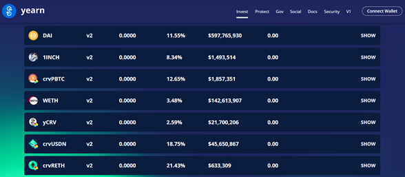
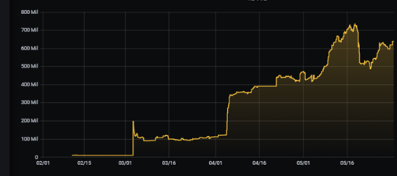
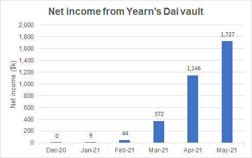
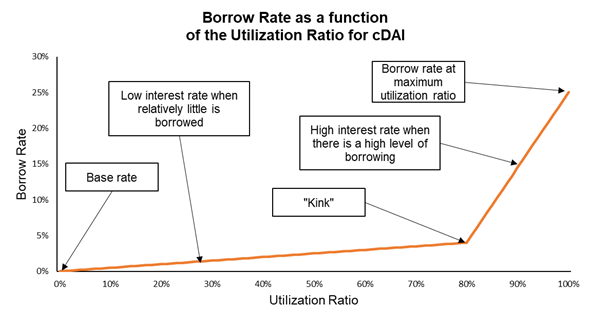
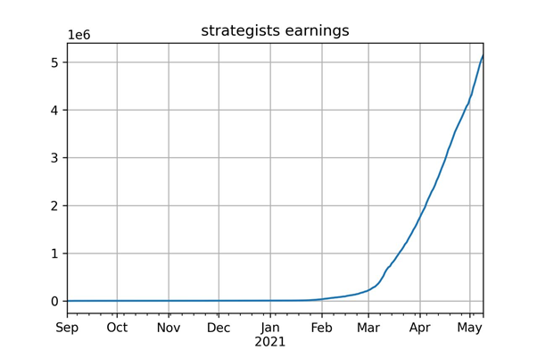
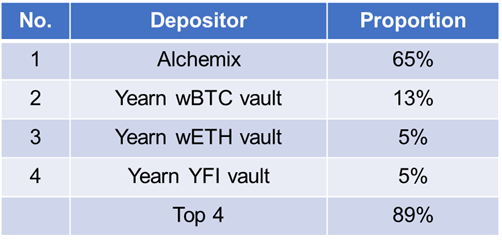

# **Yearn’s Dai Vault —did you know it’s now a top 20 DeFi protocol?**

If you go to [Yearn’s website](https://yearn.finance/vaults) you’ll see a list of nearly 50 crypto vaults, with the [SNX vault](https://twitter.com/iearnfinance/status/1395413780012666881) being the most recent. On [depositing your crypto](https://docs.yearn.finance/resources/guides/how-to-participate-in-a-yvault) into one of Yearn’s vaults, the protocol will begin generating a yield for you.

Although it is buried away midway through the list, Yearn’s Dai vault has become a top 20 DeFi protocol in its own right:

- Earning 13.2% APY for depositors from January 31st to May 31st 2021
- $639.1m TVL on May 31st (this would place it 17th on [DeFiPulse](https://defipulse.com/))
- Allocating 14.4% of all circulating Dai at end May
- Generating $1.7m+ income for Yearn in May alone
- Running [8 strategies](https://medium.com/yearn-state-of-the-vaults/the-vaults-at-yearn-9237905ffed3) concurrently
- Integrations with Alchemix, PoolTogether, Crypto.com and used by Yearn’s other vaults
- Business as usual while [$1 trillion of crypto market cap was wiped out](https://edition.cnn.com/2021/05/22/investing/crypto-crash-bitcoin-regulation/index.html) over the last 2 weeks

This article explains how the vault earns a yield, who comes up with the strategies and who actually uses the vault.

Yearn’s Dai vault is also called the ‘Dai v2 vault’ and ‘yvDai’, where yvDai is the token representing your share of the Dai vault.

# **Depositors come first at Yearn — 13% APY on $639m**

Unlike in traditional finance where depositors are treated as a cheap source of funding, depositors come first at Yearn. This is one of the reasons why the TVL has increased rapidly since its inception.

[Total Value Locked in the Yearn Ecosystem — Grafana](https://yearn.vision/?refresh=1m)

The two large jumps in TVL can be explained by the demand for Alchemix’s self-paying loans. More on the depositors later.

# **Yearn’s Dai vault income exceeds $1.7m in May**

Yearn earns income from a [2% annual management fee and 20% performance fees](https://docs.yearn.finance/yearn-finance/yvaults/overview) (and the strategists receive half of the performance fee).

The net income from the Dai vault alone has shown explosive growth from under $10k in January to over $1.7m in May.

Numbers from [https://twitter.com/Bob_The_Buidler](https://twitter.com/Bob_The_Buidler)

The income shown above is net of affiliation fees used to incentivize protocol integrations.

Traditional financial institutions often don’t publish their results until up to 3 months after the valuation date. However, because Ethereum is a transparent public blockchain and [Bob](https://twitter.com/Bob_The_Buidler)’s put together a website that compiles all of Yearn’s transactions, we already know the income of the Dai vault for May.

# **How does the vault generate income for its depositors?**

At a high level Yearn’s vaults generate income in the three ways:

- Lending
- Liquidity mining
- Trading fees

This income is then increased using leverage.

Lending, liquidity mining and trading fees are the yield generating opportunities in DeFi today. As DeFi grows, for example with perpetual protocols and options protocols, Yearn will be in a great position to take advantage of the new ways of earning yield that new protocols offer.

**Lending**

The original Yearn protocol was a yield optimizer that used the trusted lending protocols available at the time: Compound Finance, Aave and dydx.

Now Yearn can also choose from Cream Finance, targeting the long-tail of assets, and Alpha Homora, which has simplified leveraged yield farming.

Collateralised loans are usually the largest balance sheet item for banks, for example, [HSBC has £351bn of real estate loans](https://www.wsj.com/market-data/quotes/HSBC/financials/annual/balance-sheet). The difference is that in DeFi the collateral is crypto instead of real estate, therefore the LTVs need to be significantly lower in DeFi to reduce the risk of insolvency. DeFi lenders also charge high liquidation penalties to discourage borrowers from taking too much risk.

HSBC does not disclose how many of their 226,059 employees are required to keep the interest rates updated, but in DeFi the interest rates are set according to a formula that is chosen by the lending protocols’ token holders. The graph below shows how Compound Finance sets the interest rate for Dai to be dependent on the utilization ratio.

[https://compound.finance/governance/proposals/18](https://compound.finance/governance/proposals/18)

Although the collateral is crypto today, [real-world assets are on their way to DeFi](https://thedefiant.io/makerdao-will-soon-hold-real-world-assets-as-collateral/).

**Liquidity mining**

Liquidity mining involves rewarding users of the protocol with the protocol’s native tokens. I wrote about the different ways protocols incentivize behaviour in [section 3 here](https://medium.com/can-yearn-disrupt-the-110-trillion-asset-management-industry-8fea100cead0).

Liquidity mining is used by DeFi protocols to:

- Decentralize the protocol, thereby making it censorship resistant
- Bring liquidity (and attention) to the protocol, which creates a honeypot to entice hackers and test its security
- Distribute tokens to the users, so that the incentives of the owners and the users of the protocol are aligned. This increases the chances that the users and owners of the protocol will come together and build something useful and sustainable

Yearn’s Dai vault earns:

- CRV rewards which are then swapped for Dai in the single-sided Curve strategy
- COMP rewards by supplying Dai onto Compound Finance
- IDLE and COMP rewards by supplying Dai onto IDLE Finance
- ROOK rewards by supplying Dai to KeeperDAO
- POOL rewards by entering PoolTogether’s Dai lottery. On 23rd April the vault even won [$70k in the weekly lottery](https://app.pooltogether.com/prizes/mainnet/PT-cDAI/26)

You can earn these rewards without Yearn and avoid paying fees but using Yearn has the following advantages:

- A bunch of full-timers on-hand to find new protocols
- The recently established [YFI Safe Farming Committee](https://gov.yearn.finance/t/introducing-yearn-safe-farming-committee/10533) to check whether the contracts are secure
- Developers to codify the strategies
- Close monitoring of each of these strategies to quickly withdraw funds, or move funds to a higher returning strategy
- A team determining the optimal allocation across different strategies
- Able to spread the transaction fees across large amounts of capital. Ethereum charges the same gas fee to sell 0.1 COMP tokens for Dai on Uniswap or Sushiswap as it does 10 COMP tokens
- It is the largest holder of veCRV which is used to [boost the CRV rewards](https://docs.yearn.finance/resources/guides/how-to-understand-crv-vote-locking). To get the same level of rewards a user would have to lock a significant proportion of CRV tokens

**Trading fees**

Trading fees can be earned by supplying liquidity to automated market-makers (AMMs) such as Uniswap or Sushiswap, however, this gives rise to the risk of [impermanent loss](https://academy.binance.com/en/articles/impermanent-loss-explained). Yearn does not expose the Dai valt to impermanent loss using these AMMs because this gives rise to the risk of not being able to pay the depositors the same token that they deposited.

However, Curve Finance is an AMM designed to allow the trading of pairs that are similarly priced (for example, Dai/USDT or Dai/USDC) and therefore has a low risk of impermanent loss.

The single-sided CRV strategy earns trading fees from Curve Finance by providing Dai liquidity.

**Leverage**

It can be difficult to keep up with all the ways of accessing leverage in DeFi. Leverage itself is not a means of generating income, but it can be used to increase the yield if you can earn a higher rate than the cost of borrowing.

Yearn uses the following approaches for the Dai vault:

- Aave or dydx flashloans to increase the yields in the Leveraged COMP farming strategy
- Uncollateralised borrowing (from Cream’s Ironbank) for strategies that earn a higher income than the cost of debt

In the Dai vault flashloans involve borrowing Dai, deploying it to earn an income and then paying it back in the same transaction.

Uncollateralised loans from Ironbank was a first in protocol-to-protocol lending and borrowing. Essentially, the Ironbank protocol trusts that the Yearn strategies will be able to make enough income to pay back the loan’s interest. If you’re familiar with flashloans then uncollateralised lending from Ironbank can be viewed as a flashloan but over a longer period of time.

See section [v2 DAI yVault (yvDAI)](https://medium.com/yearn-state-of-the-vaults/the-vaults-at-yearn-9237905ffed3) for the strategies in more detail.

# **Who comes up with the strategies?**

Yearn now has [30 full time contributors](https://twitter.com/bantg/status/1395115320344563713?s=20) but it’s the strategists who come up with ways of earning yield. They are incentivized by half of the performance fees earned by the vaults.

The graph below shows how the strategists had earned over $5m by the beginning of May (across all vaults, not just Dai).

y-axis is in $m (source: [https://twitter.com/bantg](https://twitter.com/bantg))

# **Who actually uses Yearn’s Dai vault?**

The largest depositors are not people, they are other protocols.

Alchemix is leading the way in Dai vault deposits

The diversity of the Dai vault integrations discussed below shows:

- What becomes possible with higher interest rates
- That the vaults have been designed with integrations in mind
- How incentivizing other protocols to integrate with affiliation fees can create win-win relationships with other protocols
- That the reliability of Yearn’s vaults means that developers are starting to come up with ways of building on top of them

[**Alchemix**](https://alchemix.fi/)

Alchemix lets you deposit Dai in return for alUSD credit, up to a 200% collateralisation ratio. The protocol then sends the Dai to Yearn’s Dai vault, where it can earn the highest risk-adjusted yields. The interest earned on the full amount of the collateral is then used to pay off your alUSD debt.

Alchemix’s self-paying loans allow you to earn a yield on all of your investment whilst borrowing against it at the same time.

You can listen to [Scoopy Trooples](https://twitter.com/scupytrooples) talk about Alchemix [here](https://podcasts.google.com/feed/aHR0cHM6Ly9mZWVkcy5zaW1wbGVjYXN0LmNvbS9sS21RREc5Ug/episode/MzgzNDBkMDctZDk4Zi00ZmI1LThkMjYtMGM5MzgyZjMwNTdk?ep=14).

[**PoolTogether**](https://app.pooltogether.com/?tab=pools)

PoolTogether’s no-loss lottery earns interest using the Dai vault. Lotteries are just better on Ethereum — tamper-proof, provably random, transparent and the winnings can be paid immediately.

As with many of the best ideas in DeFi, the idea to use Yearn’s Dai vault to earn interest came from a [governance forum post](https://gov.pooltogether.com/t/use-yearn-vaults-to-generate-a-higher-payout/639) (this one by reeserj).

The UK’s biggest savings product is Premium Bonds, which is a no-loss lottery. More than [21 million people save over £107bn](https://www.moneysavingexpert.com/savings/premium-bonds/) in them, for the chance to earn their share of a [1% annual prize fund rate](https://www.nsandi.com/products/premium-bonds).

That’s over £100bn ($140bn) addressable market from no-loss lotteries from the UK alone! That’s over 40 times Yearn’s current TVL. No doubt the addressable market would be a lot higher if the annual interest rate was greater than 1% too.

For those saying that DeFi is in a bubble, the amount “saved” in 1% yielding UK Premium Bonds is more than twice the total TVL of all the DeFi protocols.

**Crypto.com**

Crypto.com, a multi-billion dollar centralized exchange with over 10m users, enables you to [earn interest from Yearn](https://help.crypto.com/en/articles/4933348-defi-earn-yearn-earn-v2). It offers an earlier version of Yearn’s Dai interest earning product.

Integrations with centralized exchanges, which will have a completely different set of risk considerations compared to DeFi protocols, is a vote of confidence in Yearn’s vaults.

[**Inverse Finance**](https://inverse.finance/)

Inverse Finance allows you to earn a yield from the Dai vault that is [paid in the token of your choice](https://medium.com/inversefinance/inverse-finance-deposit-dai-earn-eth-bc5dda6d5867). This is perfect for people who want to have exposure to the volatile crypto market but don’t want to risk their principal (except for smart contract risk).

**Yearn’s other vaults**

You know you’ve designed a good product when you use it yourself, and that’s what Yearn does. One of the highest yielding strategies for Yearn’s wBTC, ETH and YFI vaults has been to mint Dai from MakerDAO, and then deposit the newly minted Dai in the Dai vault. These strategies rely on the cost of borrowing being below the Dai yield net of fees.

[**Yearn’s Treasury (ychad.eth)**](https://t.co/T3ihkeTIQA?amp=1)

Yearn’s treasury also uses the vaults to earn an interest on its holdings. At the time of writing other stablecoin vaults paid a higher APY but the Dai vault is also used.

**Future integrations?**

[**Saffron Finance**](https://saffron.finance/)

The yield on the Dai vault is dependent on several strategies and therefore varies a lot. Although DeFi users are comfortable with variable yields, in traditional finance variable APYs put a lot of investors off. Many people want to use their interest income to pay rent or to cover regular outgoings and are happy to accept a reduced yield in return for more certainty. Saffron Finance does this by tranching risk.

For example, instead of earning a variable APY from Dai you could split the vault’s APY in to a low risk tranche and a high risk tranche. By investing in the lower risk tranche you could earn a fixed 3% APY (still much higher than that available from the bank) and investors in the riskier tranche could earn the remaining interest.

This could open up the addressable market of Yearn’s Dai vault to a much larger group of investors seeking lower risk, fixed returns.

[**Auctus**](https://auctus.org/)

Auctus is an options protocol that allows you to purchase wBTC and ETH options. It also allows you to buy these options with the interest earned from stablecoins using their CRV3Pool strategy. Buying ETH or wBTC call options with the interest earned gives you exposure to the upside of ETH or wBTC without the risk of loss of capital (beyond smart contract risk). This strategy is similar to the one applied by Inverse Finance. As Yearn becomes the go-to place to earn a yield in DeFi more protocols will use the Dai vault to earn the yield for strategies like this.

**How do I keep up with all this?**

To keep up to date with the state of the vaults make sure to subscribe to the [State of the Vaults newsletter](https://medium.com/yearn-state-of-the-vaults) (written by [qosmonot](https://twitter.com/qosmonot?lang=en-gb)) or catch up on YouTube [here](https://www.youtube.com/channel/UC_o4_cOevPVYC5pXs9OOexg). You can follow me on Twitter [here](https://twitter.com/Wot_Is_Goin_On).
