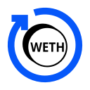
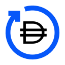
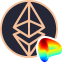
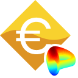
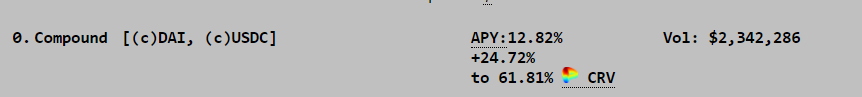

# The Vaults at Yearn

Updated August 9th, 2021

## Overview

Welcome to The Vaults at Yearn, where you can find in-depth information about how Yearn's yVaults operate and the actions (strategies) these vaults perform. This article will maintain a one-stop location for all yVault descriptions. The newest yVaults and strategies are denoted with ✨.

Below you will find 6 sections:

- Yearn and Curve 🔵🤝🌈
- v2 Vaults 🏛️
- v2 Curve Finance Based Vaults 🌈
- v1 Curve Finance Based Vaults 🌈
- v1 Vaults 🏦
- Retired Vaults 💤

## Yearn and Curve Synergy 🔵🤝🌈

One of the critical components of Yearn's infrastructure includes a collaborative relationship with [Curve.fi](http://curve.fi/). Several Yearn vaults provide liquidity into Curve pools and stake the liquidity provider (LP) tokens into the respective gauges, earning CRV rewards. Yearn locks 10% of all CRV rewards earned into the yveCRV-DAO ("Backscratcher") to obtain an additional amount of CRV. In the strategy descriptions below, vaults that are boosted are indicated with a 🚀.

For a deeper understanding, refer to the _Understanding Curve Boost Multipliers_ section near the end of this document.

Furthermore, the remaining 90% of the CRV earned are swapped into the respective LP tokens, and re-deposited into the vault. The only exception is the yvUSDN3Crv vault that locks 50% of the CRV earned into the Backscratcher vault and swaps the remaining 50%.

### veCRV-DAO yVault ([yveCRV-DAO](https://etherscan.io/address/0xc5bDdf9843308380375a611c18B50Fb9341f502A))

_AKA-Backscratcher_ [📺](https://youtu.be/kJEAe2Rlh70)  
This vault converts your CRV into yveCRV, earning you a continuous share of Curve fees which are boosted over what you earn staking at Curve. The more CRV converted, the greater your weekly rewards. Every Friday, these can be claimed from the vault as 3Crv (Curve's 3pool LP token).

Yearn, itself, deposits 10% of all CRV earned into this vault and gives its 3crv rewards to vault token holders which is where the boosted weekly rewards come from.

Depositing is non-reversible: You can only convert CRV into yveCRV, as the CRV is perpetually staked in Curve's voting escrow. All vaults send 10% of earned CRV to this vault to sustain boost levels.

## v2 Vaults 🏛️

v2 yVaults are able to employ multiple strategies per vault (up to 20 strategies simultaneously), unlike v1 yVaults that are only able to employ one strategy per vault. [📺](https://youtu.be/ZES91i-hNAM)

### Yearn Compounding veCRV yVault ([yvBOOST](https://etherscan.io/address/0x9d409a0A012CFbA9B15F6D4B36Ac57A46966Ab9a))

[StrategyYearnVECRV](https://etherscan.io/address/0x2923a58c1831205C854DBEa001809B194FDb3Fa5) [📺](https://youtu.be/Ik6GdGYO_x8)  
This vault accepts [yveCRV-DAO](https://etherscan.io/address/0xc5bDdf9843308380375a611c18B50Fb9341f502A) tokens, which grant you a continuous share of Curve's trading fees (claimed weekly as [3Crv](https://etherscan.io/address/0x6c3F90f043a72FA612cbac8115EE7e52BDe6E490), Curve's 3pool LP token). Rewards are harvested, swapped for more yveCRV-DAO (either via market-buy or mint, depending on which is most efficient at time of harvest), and deposited back into the vault.

### v2 YFI yVault ([yvYFI](https://etherscan.io/address/0xE14d13d8B3b85aF791b2AADD661cDBd5E6097Db1#readContract))

[StrategyLenderYieldOptimiser](https://etherscan.io/address/0x6a97FC93e39b3f792f1fD6e01565ff412B002D20#code)  
This strategy lends YFI tokens on various lending platforms such as CREAM and AAVE to gain yield.

[StrategyMakerYFIDAIDelegate](https://etherscan.io/address/0x4730D10703155Ef4a448B17b0eaf3468fD4fb02d)  
Locks YFI at MakerDAO via YFI-A to mint DAI. The newly minted DAI is then deposited into the v2 DAI yVault to earn yield.

✨ [MakerYFI-DAIv0.4.3Delegate](https://etherscan.io/address/0x7A5D88510cD49E878ADe26E0f08bF374b5eCAF49)  
Locks YFI at MakerDAO via YFI-A to mint DAI. The newly minted DAI is then deposited into the v2 DAI v0.4.3 yVault to earn yield.

### v2 SNX yVault ([yvSNX](https://etherscan.io/address/0xF29AE508698bDeF169B89834F76704C3B205aedf#code))

[StrategySynthetixSusdMinter](https://etherscan.io/address/0xc9a62e09834cEdCFF8c136f33d0Ae3406aea66bD)
Stakes SNX at Synthetix to mint sUSD. **This locks rewards on staked SNX for 1 year**. The newly minted sUSD is then deposited into the v2 sUSD yVault to earn yield. Yield from sUSD and rewards from weekly fees plus vested rewards (when claimable) are swapped for more SNX and re-deposited into the vault.

✨ [StrategyUniverseStaking](https://etherscan.io/address/0x29d23b73Dd0ed729F516bb55622765AF102f0e33)  
Supplies SNX on universe.xyz to earn XYZ. Rewards are harvested, sold for more SNX, and re-deposited into the vault.

### v2 RAI yVault ([yvRAI](https://etherscan.io/address/0x873fB544277FD7b977B196a826459a69E27eA4ea))

[StrategyIdleidleRAIYield](https://etherscan.io/address/0x5D411D2cde10e138d68517c42bE2808C90c22026) 🚀  
Supplies RAI on Idle.finance to earn IDLE and RAI. Rewards are harvested, sold for more RAI, and re-deposited into the vault.

### v2 LINK yVault ([yvLINK](https://etherscan.io/address/0x671a912C10bba0CFA74Cfc2d6Fba9BA1ed9530B2)) [📺](https://youtu.be/LT51QWfAMv8)

[Vesper LINK](https://etherscan.io/address/0x8198815871a45A5a883d083B7B105927eb9919D8)  
Supplies LINK to [Vesper Finance](https://vesper.finance/) LINK Pool to earn VSP. Rewards are harvested, sold for more LINK, and re-deposited into the vault.

[AaveLenderLINKBorrowerSUSD](https://etherscan.io/address/0x906f0a6f23e7160eB0927B0903ab80b5E3f3950D)  
Lends LINK on AAVE to gain interest and accumulate staked AAVE as rewards. Also borrows sUSD which it then deposits into the sUSD yVault for yield. Rewards from vested AAVE and yvSUSD are harvested, sold for more LINK, and re-deposited into the vault.

[StrategyMakerLINKDAIDelegate](https://etherscan.io/address/0x136fe75bfDf142a917C954F58577DB04ef6F294B)  
Locks LINK at MakerDAO via LINK-A to mint DAI. The newly minted DAI is then deposited into the v2 DAI yVault to earn yield.

✨ [StrategyUniverseStaking](https://etherscan.io/address/0xa2a182C5B5Ea1A3c90Cb5Bb718F9e62DBE052927)  
Supplies LINK on universe.xyz to earn XYZ. Rewards are harvested, sold for more LINK, and re-deposited into the vault.

### v2 sUSD yVault ([yvsUSD](https://etherscan.io/address/0xa5cA62D95D24A4a350983D5B8ac4EB8638887396#code))

[StrategyLenderYieldOptimiser](https://etherscan.io/address/0x215DeE632335829155Dcb62452c4878C48c1C884)  
Lends sUSD on AAVE and Cream to gain interest and accumulate staked AAVE as rewards. When the staked AAVE unlocks the AAVE will be harvested, sold for more sUSD, and re-deposited into the vault.

[SingleSidedCrvsUSD](https://etherscan.io/address/0x74b3E5408B1c29E571BbFCd94B09D516A4d81f36) 🚀  
Deposits sUSD to the SAAVE curve pool on curve.fi. Rewards are harvested, sold for more sUSD, and re-deposited into the vault.

[SingleSidedCrvsUSD](https://etherscan.io/address/0x95eA1643699F8DE347975F31CA8d03eCC507616c) 🚀  
Deposits sUSD to the SUSDv2 curve pool on curve.fi. Rewards are harvested, sold for more sUSD, and re-deposited into the vault.

### v2 1INCH yVault ([yv1INCH](https://etherscan.io/address/0xB8C3B7A2A618C552C23B1E4701109a9E756Bab67))

[StrategyLenderYieldOptimiser](https://etherscan.io/address/0x86eD4F77d40182b8686a25e125FB3f5a04203CaA)  
Lends 1INCH tokens on C.R.E.A.M. to gain interest.

[Strategy1INCHGovernance](https://etherscan.io/address/0xB12F6A5776EDd2e923fD1Ce93041B2000A22dDc7)  
Stakes 1INCH token on 1INCH DAO to collect governance rewards. Rewards are harvested and deposited back into the vault.

### v2 WETH yVault ([yvWETH](https://etherscan.io/address/0xa258C4606Ca8206D8aA700cE2143D7db854D168c))

_Any ETH deposited is wrapped into WETH then deposited._

[StrategyLenderYieldOptimiser](https://etherscan.io/address/0xec2DB4A1Ad431CC3b102059FA91Ba643620F0826)  
Lends WETH on Alpha Homora to gain interest.

[StrategysteCurveWETHSingleSided](https://etherscan.io/address/0xC5e385f7Dad49F230AbD53e21b06aA0fE8dA782D) 🚀  
Supplies WETH to the liquidity pool on Curve [here](https://www.curve.fi/steth/deposit) to obtain [steCRV](https://etherscan.io/address/0x06325440D014e39736583c165C2963BA99fAf14E) tokens which it then puts into the v2 Curve stETH Pool yVault ([yvsteCRV](https://etherscan.io/address/0xdcd90c7f6324cfa40d7169ef80b12031770b4325)) to gain yield.

[StrategyeCurveWETHSingleSided](https://etherscan.io/address/0x37770F958447fFa1571fc9624BFB3d673161f37F) 🚀  
Supplies WETH to the liquidity pool on Curve [here](https://curve.fi/seth/deposit) to obtain [eCRV](https://etherscan.io/address/0xA3D87FffcE63B53E0d54fAa1cc983B7eB0b74A9c) tokens which it then puts into the v2 Curve sETH Pool yVault ([yveCRV](https://etherscan.io/address/0x986b4AFF588a109c09B50A03f42E4110E29D353F)) to gain yield.

[AaveWETHLenderUSDTBorrower](https://etherscan.io/address/0xd28b508EA08f14A473a5F332631eA1972cFd7cC0)  
Lends WETH on AAVE to gain interest and accumulate staked AAVE as rewards. Also borrows USDT which it then deposits into the USDT yVault for yield. Rewards from vested AAVE and yvUSDT are harvested, sold for more WETH, and re-deposited into the vault.

[StrategyGenericLevCompFarmWeth](https://hackmd.io/zucTisw_RUOQCWFpZYfksg?view)  
Supplies ETH on Compound and borrows an additional amount of ETH to maximize COMP earnings. Flashloans are used to obtain additional ETH from dYdX in order to gain additional leverage and boost the APY. Earned COMP is harvested and sold for more ETH and re-deposited into the vault.

### v2 USDC yVault ([yvUSDC](https://etherscan.io/address/0x5f18c75abdae578b483e5f43f12a39cf75b973a9))

[StrategyIdleUSDCYield](https://etherscan.io/address/0x414D8F5c21dAF33105eE6416bcdA99a50A47C0e5#code) [📺](https://youtu.be/BcxWAVdXx_U)  
Supplies USDC on Idle.finance to earn COMP and IDLE. Rewards are harvested, sold for more USDC, and re-deposited into the vault.

[StrategyAH2EarncyUSDC](https://etherscan.io/address/0x86Aa49bf28d03B1A4aBEb83872cFC13c89eB4beD#code)  
Lends USDC on Alpha Homora v2 to generate interest.

[StrategyGenericLevCompFarm](https://etherscan.io/address/0x4d7d4485fd600c61d840ccbec328bfd76a050f87) [📺](https://www.youtu.be/jorporcLnCo&t)  
Supplies USDC on Compound and borrows an additional amount of USDC to maximize COMP earnings. Flashloans are used to obtain additional USDC from dYdX in order to gain additional leverage and boost the APY. Earned COMP is harvested and sold for more USDC and re-deposited into the vault.

[SingleSidedCrvUSDC](https://etherscan.io/address/0x80af28cb1e44C44662F144475d7667C9C0aaB3C3) 🚀  
Deposits USDC to a USDC curve pool on [curve.fi](http://curve.fi/), and switches to the most profitable curve pool.

[PoolTogether USD Coin](https://etherscan.io/address/0x387fCa8d7e2e09655b4F49548607B55C0580fC63)  
Supplies USDC to the [PoolTogether](https://pooltogether.com/) protocol to earn POOL. Rewards are harvested, sold for more USDC, and deposited back into the vault. If it gets the prize of the week it will also be added to the vault.

[StrategyRook USD Coin](https://etherscan.io/address/0x4140F350c1B67184fE3AaEa314d8C967F99EE8Cc)  
Supplies USDC to KeeperDAO to earn ROOK. Rewards are harvested, sold for more USDC, and deposited back into the vault.

### v2 DAI yVault ([yvDAI](https://etherscan.io/address/0xdA816459F1AB5631232FE5e97a05BBBb94970c95))

[StrategyLenderYieldOptimiser](https://hackmd.io/zucTisw_RUOQCWFpZYfksg?view)  
Lends DAI on AAVE to gain interest and accumulate staked AAVE as rewards. When the staked AAVE unlocks the AAVE will be harvested, sold for more DAI, and re-deposited into the vault.

[StrategyKashiMultiPairLender](https://hackmd.io/zucTisw_RUOQCWFpZYfksg?view)  
Lends DAI on Sushi via Kashi to gain interest. Rewards are harvested, sold for more DAI, and deposited back into the vault.

[StrategyGenericLevCompFarm](https://hackmd.io/zucTisw_RUOQCWFpZYfksg?view)  
Supplies DAI on Compound and borrows an additional amount of DAI to maximize COMP earnings. Flashloans are used to obtain additional DAI from dYdX in order to gain additional leverage and boost the APY. Earned COMP is harvested and sold for more DAI and re-deposited into the vault.

✨ [ssc dai ib](https://etherscan.io/address/0xa6D1C610B3000F143c18c75D84BaA0eC22681185)  
Deposits DAI into the Iron Bank curve pool on [curve.fi](http://curve.fi/). Rewards are harvested, sold for more DAI, and re-deposited into the vault.

### v2 WBTC yVault ([yvWBTC](https://etherscan.io/address/0xA696a63cc78DfFa1a63E9E50587C197387FF6C7E))

[StrategyMakerWBTCDAIDelegate](https://etherscan.io/address/0x04A508664B053E0A08d5386303E649925CBF763c)  
Locks wBTC at MakerDAO via WBTC-A to mint DAI. This newly minted DAI is then deposited into the v2 DAI yVault.

[SingleSidedCrvWBTC](https://etherscan.io/address/0x40b04B3ed9845B8Be200Aa2D9C3eDC2bE0a5f01f) 🚀  
Deposits wBTC to a BTC Curve Pool on [curve.fi](https://hackmd.io/zucTisw_RUOQCWFpZYfksg?view) and switches to the most profitable curve pool.

[yvWBTCStratMMV1](https://etherscan.io/address/0x53a65c8e238915c79a1e5C366Bc133162DBeE34f)  
Supplies wBTC to [Mushroom Finance's](https://mushrooms.finance/) wBTC Vault then to the wBTC Farm to earn MM. MM are harvested, sold for more wBTC, and re-deposited into the vault.

[Vesper Wrapped BTC](https://etherscan.io/address/0x416647Ddee169156878DC46CD565dee99413c262)  
Supplies wBTC to [Vesper Finance](https://vesper.finance/) vWBTC Pool to earn VSP. Rewards are harvested, sold for more wBTC, and re-deposited into the vault.

✨ [ssc wbtc bbtc](https://etherscan.io/address/0x4b254EbBbb8FDb9D3E848501784692b2726b310c)  
Deposits WBTC into the BBTC curve pool on [curve.fi](http://curve.fi/). Rewards are harvested, sold for more WBTC, and re-deposited into the vault.

✨ [ssc wbtc pbtc](https://etherscan.io/address/0x29367915508e47c631d220caEbA855901c13a3dE)  
Deposits WBTC into the PBTC curve pool on [curve.fi](http://curve.fi/). Rewards are harvested, sold for more WBTC, and re-deposited into the vault.

✨ [ssc wbtc obtc](https://etherscan.io/address/0x64B2a32f030D9210E51ed8884C0D58b89137Ca81)  
Deposits WBTC into the OBTC curve pool on [curve.fi](http://curve.fi/). Rewards are harvested, sold for more WBTC, and re-deposited into the vault.

✨ [Strategy-Levered-AAVE-wBTC](https://etherscan.io/address/0xDD387F2fe0D9B1E5768fc941e7E48AA8BfAf5e41)  
Supplies WBTC as collateral on AAVE V2, borrowed against, and resupplied, in a few loops to achieve the desired leverage on the WBTC lending.

### v2 USDT yVault ([yvUSDT](https://etherscan.io/token/0x7Da96a3891Add058AdA2E826306D812C638D87a7))

[StrategyLenderYieldOptimiser](https://etherscan.io/address/0x2f87c5e8396F0C41b86aad4F3C8358aB21681952)  
Lends USDT on AAVE to gain interest.

[StrategyAH2EarncyUSDT](https://etherscan.io/address/0x82292B8035873d7DD8a96767F6b3F885564aa919)  
Lends USDT on Alpha Homora v2 to generate interest.

[StrategyIdleUSDTYield](https://etherscan.io/address/0x01b54c320d6B3057377cbc71d953d1BBa84df44e)  
Supplies USDT on Idle Finance to earn COMP and IDLE. Rewards are harvested, sold for more USDT, and deposited back to the vault.

[SingleSidedCrvUSDT](https://etherscan.io/address/0xf840d061E83025F4cD6610AE5DDebCcA43327f9f) 🚀  
Deposits USDT to a USDT curve pool on [curve.fi](http://curve.fi/), and switches to the most profitable curve pool.

### v2 UNI yVault ([yvUNI](https://etherscan.io/address/0xFBEB78a723b8087fD2ea7Ef1afEc93d35E8Bed42))

[StrategyLenderYieldOptimiser](https://etherscan.io/address/0x5e882c9f00209315e049B885B9b3dfbEe60D80A4)  
Lends UNI on AAVE to gain interest and accumulate staked AAVE as rewards. When the staked AAVE unlocks the AAVE will be harvested, sold for more UNI, and re-deposited into the vault.

[PoolTogether Uniswap](https://etherscan.io/address/0x6EB00860260CF51623737e17579Db797d71cd337)  
Supplies UNI to the [PoolTogether](https://pooltogether.com/) protocol to earn POOL. Rewards are harvested, sold for more UNI, and deposited back into the vault. If it gets the prize of the week it will also be added to the vault.

[StrategyMakerUNIDAIDelegate](https://etherscan.io/address/0x9Ae0B9a67cF5D603847980D95Ad4D45b57Ff7783)  
Locks UNI at MakerDAO via UNI-A to mint DAI. This newly minted DAI is then deposited into the v2 DAI yVault.

## v2 Curve Finance Strategy Vaults 🌈

v2 Curve yVaults accept deposits of liquidity pool tokens obtained by providing to the liquidity pools on Curve Finance. To enter these vaults you need to deposit the underlying asset(s) to their respective pool on Curve Finance. [📺](https://youtu.be/V47NzWeZjjk)

### ✨ Curve 3Crypto Pool yVault ([yvCurve-3Crypto](https://etherscan.io/address/0xE537B5cc158EB71037D4125BDD7538421981E6AA))

_While this vault is not subject to Impermanent Loss the underlying Curve pool could incur Impermanent Loss on withdrawal, use caution._

✨ [Curvecrv3cryptoVoterProxy](https://etherscan.io/address/0xbA9052141cEf06FD55733D23231c37Fc856CE6F4) 🚀  
This vault accepts deposits of [crv3crypto](https://etherscan.io/address/0xc4AD29ba4B3c580e6D59105FFf484999997675Ff) tokens obtained by supplying either BTC, ETH, or USDT to the liquidity pool on Curve [here](https://curve.fi/tricrypto2/deposit) in exchange for crv3crypto tokens. crv3crypto are staked in the gauge on curve.fi to earn CRV rewards. Rewards are swapped for one of the underlying assets and resupplied to the liquidity pool to obtain more crv3crypto.

### v2 Curve mUSD Pool yVault ([yvCurve-mUSD](https://etherscan.io/address/0x8cc94ccd0f3841a468184aCA3Cc478D2148E1757#code))

[Curvemusd3CRVVoterProxy](https://etherscan.io/address/0xf9fF7f463A7e6f43d4E65c230D3743355fC954e4) 🚀  
This vault accepts deposits of [musd3CRV](https://etherscan.io/address/0x1AEf73d49Dedc4b1778d0706583995958Dc862e6) tokens obtained by supplying either mUSD, DAI, USDC, USDT (or wrapped via 3Crv tokens) to the liquidity pool on Curve [here](https://www.curve.fi/musd/deposit). musd3CRV tokens are staked in the gauge on Curve to earn CRV rewards. Rewards are swapped for one of the underlying assets and resupplied to the liquidity pool to obtain more musd3CRV.

[Convexmusd3CRV](https://etherscan.io/address/0x75be6ABC02a010559Ed5c7b0Eab94abD2B783b65) 🚀  
Supplies musd3CRV to Convex Finance to earn CRV and CVX. Rewards are harvested, sold for more musd3CRV, and deposited back into the vault.

### v2 Huobi BTC Curve yVault ([yvhCRV](https://etherscan.io/address/0x625b7DF2fa8aBe21B0A976736CDa4775523aeD1E))

[CurvehCRVVoterProxy](https://etherscan.io/address/0x91cBf0014a966615e1050c90A1aBf1d1d5d8cffd)🚀  
This vault accepts deposits of [hCRV](https://etherscan.io/address/0xb19059ebb43466C323583928285a49f558E572Fd) tokens obtained by supplying either hBTC or wBTC to the liquidity pool on Curve [here](https://curve.fi/hbtc/deposit) in exchange for hCRV tokens. hCRV are staked in the gauge on curve.finance to earn CRV rewards. Rewards are swapped for one of the underlying assets and resupplied to the liquidity pool to obtain more hCRV.

[ConvexhCRV](https://etherscan.io/address/0x7Ed0d52C5944C7BF92feDC87FEC49D474ee133ce) 🚀  
Supplies hCRV to Convex Finance to earn CRV and farm CVX. Rewards are harvested, sold for more hCRV, and deposited back into the vault.

### v2 Curve USDK Pool yVault ([yvCurve-USDK](https://etherscan.io/address/0x3D27705c64213A5DcD9D26880c1BcFa72d5b6B0E))

[Curveusdk3CRVVoterProxy](https://etherscan.io/address/0x096E2F730c6AB7a048de7d27507E5E4e864c6824)🚀  
This vault accepts deposits of [usdk3CRV](https://etherscan.io/address/0x97E2768e8E73511cA874545DC5Ff8067eB19B787) tokens obtained by supplying either DAI, USDC, USDT (or their wrapped version: 3crv), or USDK to the liquidity pool on Curve [here](https://curve.fi/usdk/deposit) in exchange for usdk3CRV tokens. usdk3CRV are staked in the gauge on curve.finance to earn CRV rewards. Rewards are swapped for one of the underlying assets and resupplied to the liquidity pool to obtain more usdk3CRV.

[Convexusdk3CRV](https://hackmd.io/zucTisw_RUOQCWFpZYfksg?view) 🚀  
Supplies usdk3CRV to [Convex Finance](https://www.convexfinance.com/stake) to earn CRV and CVX. Earned tokens are harvested, sold for more usdk3CRV which are deposited back into the strategy.

### v2 Curve Pax Pool yVault ([yvCurve-Pax](https://etherscan.io/address/0x80bbeE2fa460dA291e796B9045e93d19eF948C6A))

[CurveypaxCrvVoterProxy](https://etherscan.io/address/0x60A335509E75175E0fF785091f1Baf979148A290)🚀  
This vault accepts deposits of [ypaxCrv](https://etherscan.io/address/0xD905e2eaeBe188fc92179b6350807D8bd91Db0D8) tokens obtained by supplying either DAI, USDC, USDT (or their IronBank wrapped version: ycDAI, ycUSDC, ycUSDT), or PAX to the liquidity pool on Curve [here](https://curve.fi/pax/deposit) in exchange for ypaxCrv tokens. ypaxCrv are staked in the gauge on curve.finance to earn CRV rewards. Rewards are swapped for one of the underlying assets and resupplied to the liquidity pool to obtain more ypaxCrv.

[ConvexypaxCrv](https://hackmd.io/zucTisw_RUOQCWFpZYfksg?view) 🚀  
Supplies ypaxCrv to [Convex Finance](https://www.convexfinance.com/stake) to earn CRV and CVX. Earned tokens are harvested, sold for more ypaxCrv which are deposited back into the strategy.

### v2 Curve RSV Pool yVault ([yvCurve-RSV](https://etherscan.io/address/0xC116dF49c02c5fD147DE25Baa105322ebF26Bd97))

[Curversv3CRVVoterProxy](https://etherscan.io/address/0x57D2E2eD281650A5d987E6ef87BC1BeD4fD0E959)🚀  
This vault accepts deposits of [rsv3CRV](https://etherscan.io/address/0xC2Ee6b0334C261ED60C72f6054450b61B8f18E35) tokens obtained by supplying either DAI, USDC, USDT (or their wrapped version: 3crv), or RSV to the liquidity pool on Curve [here](https://curve.fi/rsv/deposit) in exchange for rsv3CRV tokens. rsv3CRV are staked in the gauge on curve.finance to earn CRV and RSR rewards. Rewards are swapped for one of the underlying assets and resupplied to the liquidity pool to obtain more rsv3CRV.

[Convexrsv3CRV](https://hackmd.io/zucTisw_RUOQCWFpZYfksg?view) 🚀  
Supplies rsv3CRV to [Convex Finance](https://www.convexfinance.com/stake) to earn CRV and CVX. Earned tokens are harvested, sold for more rsv3CRV which are deposited back into the strategy.

### v2 Curve USDT Pool yVault ([yvCurve-USDT](https://etherscan.io/address/0x28a5b95C101df3Ded0C0d9074DB80C438774B6a9))

[CurvecDAI+cUSDC+USDTVoterProxy](https://etherscan.io/address/0x5Fa22A8527Ae20f4ed8Ed3E0a6A5359Ad5EA3A4e)🚀  
This vault accepts deposits of [tCrv](https://etherscan.io/address/0x9fC689CCaDa600B6DF723D9E47D84d76664a1F23) tokens obtained by supplying either DAI, USDC (or their wrapped Compound version: cDAI, cUSDC), or USDT to the liquidity pool on Curve [here](https://curve.fi/usdt/deposit) in exchange for tCrv tokens. tCrv are staked in the gauge on curve.finance to earn CRV rewards. Rewards are swapped for one of the underlying assets and resupplied to the liquidity pool to obtain more tCrv.

[ConvexcDAI+cUSDC+USDT](https://hackmd.io/zucTisw_RUOQCWFpZYfksg?view) 🚀  
Supplies tCrv to [Convex Finance](https://www.convexfinance.com/stake) to earn CRV and CVX. Earned tokens are harvested, sold for more tCrv which are deposited back into the strategy.

### v2 Curve triCrypto Pool yVault ([yvCurve-triCrypto](https://etherscan.io/address/0x3D980E50508CFd41a13837A60149927a11c03731))

_While this vault is not subject to Impermanent Loss the underlying Curve pool could incur Impermanent Loss on withdrawal, use caution._

[CurvecrvTricryptoVoterProxy](https://etherscan.io/address/0xb9267f1427Ddb937003b9cA0Ca7716DDa4026D19) 🚀  
This vault accepts deposits of [crvTricrypto](https://etherscan.io/address/0xcA3d75aC011BF5aD07a98d02f18225F9bD9A6BDF) tokens obtained by supplying either USDT, wBTC, or ETH to the liquidity pool on Curve [here](https://curve.fi/tricrypto/deposit) in exchange for crvTricrypto tokens. crvTricrypto are staked in the gauge on curve.finance to earn CRV rewards. Rewards are swapped for one of the underlying assets and resupplied to the liquidity pool to obtain more crvTricrypto.

[ConvexcrvTricrypto](https://hackmd.io/zucTisw_RUOQCWFpZYfksg?view) 🚀  
Supplies crvTricrypto to [Convex Finance](https://www.convexfinance.com/stake) to earn CRV and CVX. Earned tokens are harvested, sold for more crvTricrypto which are deposited back into the strategy.

### v2 Curve EURS Pool yVault ([yvCurve-EURS](https://etherscan.io/address/0x25212Df29073FfFA7A67399AcEfC2dd75a831A1A))

[CurveeursCRVVoterProxy](https://etherscan.io/address/0x53cE22d5b4F667eC73710d428E828Cd96E9a37C9) 🚀  
This vault accepts deposits of [eursCRV](https://etherscan.io/address/0x194eBd173F6cDacE046C53eACcE9B953F28411d1) tokens obtained supplying either EURs or sEUR to the liquidity pool on Curve [here](https://www.curve.fi/eurs/deposit). eursCRV tokens are staked in the gauge on Curve to earn CRV rewards. Rewards are swapped for one of the underlying assets and resupplied to the liquidity pool to obtain more eursCRV.

[ConvexeursCRV](https://etherscan.io/address/0x4DC2CCC9E76bD30982243C1cB915003e17a88Eb9) 🚀  
Supplies eursCRV to Convex Finance to earn CRV and CVX. Rewards are harvested, sold for more eursCRV, and deposited back into the vault.

### v2 Curve sUSD Pool yVault ([yvCurve-sUSD](https://etherscan.io/address/0x5a770DbD3Ee6bAF2802D29a901Ef11501C44797A))

[CurvecrvPlain3andSUSDVoterProxy](https://etherscan.io/address/0x9730F52AB5BcEc960bE41b0fE4913a09c0B57066) 🚀  
This vault accepts deposits of [sCrv](https://etherscan.io/address/0xC25a3A3b969415c80451098fa907EC722572917F) tokens obtained by supplying either sUSD, DAI, USDC or USDT to the liquidity pool on Curve [here](https://www.curve.fi/susdv2/deposit). sCrv tokens are staked in the gauge on Curve to earn CRV and SNX rewards. Rewards are swapped for one of the underlying assets and resupplied to the liquidity pool to obtain more sCRV.

[ConvexcrvPlain3andSUSD](https://etherscan.io/address/0xFA773b91b59B0895877c769000b9824b46b13a20) 🚀  
Supplies sCRV to Convex Finance to earn CRV and CVX. Rewards are harvested, sold for more sCRV, and deposited back into the vault.

### v2 Curve AAVE Pool yVault ([yvCurve-Aave](https://etherscan.io/address/0x39CAF13a104FF567f71fd2A4c68C026FDB6E740B))

[Curvea3CRVVoterProxy](https://etherscan.io/address/0xB11FC91DF59ADc604485f1B25ABa1F96A685473f) 🚀  
This vault accepts deposits of [a3CRV](https://etherscan.io/address/0xFd2a8fA60Abd58Efe3EeE34dd494cD491dC14900) tokens obtained by supplying either DAI, USDC, or USDT (or their wrapped aTokens) to the liquidity pool on Curve [here](https://curve.fi/aave/deposit). a3CRV tokens are staked in the gauge on Curve to earn CRV rewards. Rewards are swapped for one of the underlying assets and resupplied to the liquidity pool to obtain more a3CRV.

[Convexa3CRV](https://etherscan.io/address/0xAC4AE0B06C913dF4608dB60E2571a8e91b74C619) 🚀  
Supplies a3CRV to Convex Finance to earn CRV and CVX. Rewards are harvested, sold for more a3CRV, and deposited back into the vault.

### v2 Curve HUSD Pool yVault ([yvCurve-HUSD](https://etherscan.io/address/0x054AF22E1519b020516D72D749221c24756385C9))

[Curvehusd3CRVVoterProxy](https://etherscan.io/address/0x5ED527A2cfC5411EB63b12E46e270b07b6813824) 🚀  
This vault accepts deposits of [husd3CRV](https://etherscan.io/address/0x5B5CFE992AdAC0C9D48E05854B2d91C73a003858) tokens obtained by supplying either DAI, USDC, USDT (or their wrapped version: 3crv), or HUSD to the liquidity pool on Curve [here](https://www.curve.fi/husd/deposit). husd3CRV tokens are staked in the gauge on Curve to earn CRV rewards. Rewards are swapped for one of the underlying assets and resupplied to the liquidity pool to obtain more husd3CRV.

[Convexhusd3CRV](https://etherscan.io/address/0xdC929e76081a78e5c32552C2e79D29ECab3F6755) 🚀  
Supplies husd3CRV to Convex Finance to earn CRV and CVX. Rewards are harvested, sold for more husd3CRV, and deposited back into the vault.

### v2 Curve USDN Pool yVault ([yvCurve-USDN](https://etherscan.io/address/0x3B96d491f067912D18563d56858Ba7d6EC67a6fa))

[Curveusdn3CRVVoterProxy](https://etherscan.io/address/0x23a09D84e50fF3fDFa270308851443734b0a4b6D) 🚀  
This vault accepts deposits of [usdn3CRV](https://etherscan.io/address/0x4f3E8F405CF5aFC05D68142F3783bDfE13811522) tokens obtained by supplying either DAI, USDC, USDT (or their wrapped version: 3crv), or USDN to the liquidity pool on Curve [here](https://curve.fi/usdn/deposit). usdn3CRV tokens are staked in the gauge on Curve to earn CRV rewards. Rewards are swapped for one of the underlying assets and resupplied to the liquidity pool to obtain more usdn3CRV.

[Convexusdn3CRV](https://etherscan.io/address/0x8e87e65Cb28c069550012f92d5470dB6EB6897c0) 🚀  
Supplies usdn3CRV to Convex Finance to earn CRV and CVX. Rewards are harvested, sold for more usdn3CRV, and deposited back into the vault.

### v2 Curve rETH Pool yVault ([yvCurve-rETH](https://etherscan.io/address/0xBfedbcbe27171C418CDabC2477042554b1904857))

[CurverCRVVoterProxy](https://etherscan.io/address/0x16468a3999d931Dd6b6ffA0086Cf195D6C5BDAFA) 🚀  
This vault accepts deposits of [rCRV](https://etherscan.io/address/0x53a901d48795C58f485cBB38df08FA96a24669D5) tokens obtained by supplying either ETH or rETH to the liquidity pool on Curve [here](https://curve.fi/reth/deposit). rCRV tokens are staked in the gauge on Curve to earn CRV and [FIS](https://www.coingecko.com/en/coins/stafi) rewards. Rewards are swapped for one of the underlying assets and resupplied to the liquidity pool to obtain more rCRV.

[ConvexrCRV](https://etherscan.io/address/0x8E4AA2E00694Adaf37f0311651262671f4d7Ac16) 🚀  
Supplies rCRV to Convex Finance to earn CRV, CVX, & FIS. Rewards are harvested, sold for more rCRV, and deposited back into the vault.

### v2 Curve ankrETH Pool yVault ([yvCurve-ankrETH](https://etherscan.io/address/0x132d8D2C76Db3812403431fAcB00F3453Fc42125))

[CurveankrCRVVoterProxy](https://etherscan.io/address/0x32EF165F2ABbdbE7dcC25B86EdB14a2C0dc52571) 🚀  
This vault accepts deposits of [ankrCRV](https://etherscan.io/address/0xaA17A236F2bAdc98DDc0Cf999AbB47D47Fc0A6Cf) tokens obtained by supplying either ETH or ankrETH to the liquidity pool on Curve [here](https://www.curve.fi/ankreth/deposit). ankrCRV tokens are staked in the gauge on Curve to earn CRV, [ANKR](https://www.coingecko.com/en/coins/ankr-network), and [ONX](https://www.coingecko.com/en/coins/onx-finance) rewards. Rewards are swapped for one of the underlying assets and resupplied to the liquidity pool to obtain more ankrCRV.

[ConvexankrCRV](https://etherscan.io/address/0xB194dCFF4E11d26919Ce3B3255F69aEca5951e88) 🚀  
Supplies ankrCRV to Convex Finance to earn CRV, CVX, ANKR, & ONX. Rewards are harvested, sold for more ankrCRV, and deposited back into the vault.

### v2 Curve LINK Pool yVault ([yvCurve-LINK](https://etherscan.io/address/0xf2db9a7c0ACd427A680D640F02d90f6186E71725))

[CurvelinkCRVVoterProxy](https://etherscan.io/address/0x0E94D346D8A53FEF83484b178a581695E0001E55) 🚀  
This vault accepts deposits of [linkCRV](https://etherscan.io/address/0xcee60cFa923170e4f8204AE08B4fA6A3F5656F3a) tokens obtained by supplying either LINK or sLINK to the liquidity pool on Curve [here](https://curve.fi/link/deposit). linkCRV tokens are staked in the gauge on Curve to earn CRV rewards. Rewards are swapped for one of the underlying assets and resupplied to the liquidity pool to obtain more linkCRV.

[ConvexlinkCRV](https://etherscan.io/address/0xb7f013426d33fe27e4E8ABEE58500268554736bD) 🚀  
Supplies linkCRV to Convex Finance to earn CRV and CVX. Rewards are harvested, sold for more linkCRV, and deposited back into the vault.

### v2 Curve alUSD Pool yVault ([yvCurve-alUSD](https://etherscan.io/address/0xA74d4B67b3368E83797a35382AFB776bAAE4F5C8))

[CurvealUSD3CRV-fVoterProxy](https://etherscan.io/address/0x31CD90D60516ED18750bA49b2C9d1053190F40d9) 🚀  
This vault accepts deposits of [alUSD3CRV-f](https://etherscan.io/address/0x43b4FdFD4Ff969587185cDB6f0BD875c5Fc83f8c) tokens obtained supplying either DAI, USDC, USDT (or their wrapped version: 3crv), or alUSD to the liquidity pool on Curve [here](https://curve.fi/alusd/deposit). alUSD3CRV-f tokens are staked in the gauge on Curve to earn CRV and [ALCX](https://www.coingecko.com/en/coins/alchemix) rewards. Rewards are swapped for one of the underlying assets and resupplied to the liquidity pool to obtain more alUSD3CRV-f.

[ConvexalUSD3CRV-f](https://etherscan.io/address/0xf8Fb278DeeaF30Ff3F6326d928A61eA8b9397d16) 🚀  
Supplies alUSD3CRV-f to Convex Finance to earn CRV, CVX, & ALCX. Rewards are harvested, sold for more alUSD3CRV-f, and deposited back into the vault.

### v2 Curve USDP Pool yVault ([yvCurve-USDP](https://etherscan.io/address/0xC4dAf3b5e2A9e93861c3FBDd25f1e943B8D87417))

[Curveusdp3CRVVoterProxy](https://etherscan.io/address/0x94fA3A90E680f6b866545C904D1dc9DEe6416de9) 🚀  
This vault accepts deposits of [usdp3CRV](https://etherscan.io/address/0x7Eb40E450b9655f4B3cC4259BCC731c63ff55ae6) tokens obtained supplying either DAI, USDC, USDT (or their wrapped version: 3crv), or USDP to the liquidity pool on Curve [here](https://www.curve.fi/usdp/deposit). usdp3CRV tokens are staked in the gauge on Curve to earn CRV rewards. Rewards are swapped for one of the underlying assets and resupplied to the liquidity pool to obtain more usdp3CRV.

[Convexusdp3CRV](https://etherscan.io/address/0xfb0702469A1a0440E87C06605461E8660FD0F43d) 🚀  
Supplies usdp3CRV to Convex Finance to earn CRV and CVX. Rewards are harvested, sold for more usdp3CRV, and deposited back into the vault.

### v2 Curve UST Pool yVault ([yvCurve-UST](https://etherscan.io/address/0x1C6a9783F812b3Af3aBbf7de64c3cD7CC7D1af44))

[Curveust3CRVVoterProxy](https://etherscan.io/address/0xbf811462955DEeD9aaD62EFE771E34e8B5811857) 🚀  
This vault accepts deposits of [ust3CRV](https://etherscan.io/address/0x94e131324b6054c0D789b190b2dAC504e4361b53) tokens obtained by supplying either UST, DAI, USDC, USDT(or wrapped via 3Crv tokens) to the liquidity pool on Curve [here](https://www.curve.fi/ust/deposit). ust3CRV tokens are staked in the gauge on Curve rewards. Rewards are swapped for one of the underlying assets and resupplied to the liquidity pool to obtain more ust3CRV.

[Convexust3CRV](https://etherscan.io/address/0x0921E388e86bbE0356e37413F946ccE47EDd294D) 🚀  
Supplies ust3CRV to Convex Finance to earn CRV and CVX. Rewards are harvested, sold for more ust3CRV, and deposited back into the vault.

### v2 Curve DUSD Pool yVault ([yvCurve-DUSD](https://etherscan.io/address/0x30FCf7c6cDfC46eC237783D94Fc78553E79d4E9C))

[Curvedusd3CRVVoterProxy](https://etherscan.io/address/0x4C547b6202247E7B7c45A95d7747A85704530ab3) 🚀  
This vault accepts deposits of [dusd3CRV](https://etherscan.io/address/0x3a664ab939fd8482048609f652f9a0b0677337b9) tokens obtained by supplying either DAI, USDC, USDT, (or their wrapped version: 3CRV), or DUSD to the liquidity pool on Curve [here](https://curve.fi/dusd/deposit). dusd3CR tokens are staked in the gauge on Curve to earn CRV and [DFD](https://www.coingecko.com/en/coins/defidollar-dao) rewards. CRV and DFD rewards are swapped for one of the underlying assets and resupplied to the liquidity pool to obtain more dusd3CRV.

[Convexdusd3CRV](https://etherscan.io/address/0x33d7E0Fa2c7Db85Ef3AbC1C44e07E0b5cB2E4C14) 🚀  
Supplies dusd3CRV to Convex Finance to earn CRV and CVX. Rewards are harvested, sold for more dusd3CRV, and deposited back into the vault.

### v2 Curve TUSD Pool yVault ([yvCurve-TUSD](https://etherscan.io/address/0xf8768814b88281DE4F532a3beEfA5b85B69b9324))

[CurveTUSD3CRV-fVoterProxy](https://etherscan.io/address/0xE7C32D413341bfc84BB58492BEA8a69e8D06E0b4) 🚀  
This vault accepts deposits of [TUSD3CRV-f](https://etherscan.io/address/0xecd5e75afb02efa118af914515d6521aabd189f1) tokens obtained by supplying either DAI, USDC, USDT, (or their wrapped version: 3CRV), or TUSD to the liquidity pool on Curve [here](https://curve.fi/tusd/deposit). TUSD3CRV-f tokens are staked in the gauge on Curve to earn CRV rewards. Rewards are swapped for one of the underlying assets and resupplied to the liquidity pool to obtain more TUSD3CRV-f.

[ConvexTUSD3CRV-f](https://etherscan.io/address/0x270101459e9A38Db38Ba4Cb8718FfA31953A9Af3) 🚀  
Supplies TUSD3CRV-f to Convex Finance to earn CRV and CVX. Rewards are harvested, sold for more TUSD3CRV-f, and deposited back into the vault.

### v2 Curve Y Pool yVault ([yUSD](https://etherscan.io/address/0x4B5BfD52124784745c1071dcB244C6688d2533d3))

[CurveyDAI+yUSDC+yUSDT+yTUSDVoterProxy](https://etherscan.io/address/0x6d45c5a8C1cF1f77Ab89cAF8D44917730298bab7) 🚀  
This vault accepts deposits of [yDAI+yUSDC+yUSDT+yTUSD](https://etherscan.io/address/0xdF5e0e81Dff6FAF3A7e52BA697820c5e32D806A8) tokens obtained by supplying DAI, USDC, USDT, or TUSD (or their wrapped versions from [yEarn: y.curve.fi](https://v1.yearn.finance/earn)) to the liquidity pool on Curve [here](https://curve.fi/iearn/deposit). yDAI+yUSDC+yUSDT+yTUSD tokens are staked in the gauge on Curve to earn CRV rewards. Rewards are swapped for one of the underlying assets and resupplied to the liquidity pool to obtain more yDAI+yUSDC+yUSDT+yTUSD.

[ConvexyDAI+yUSDC+yUSDT+yTUSD](https://etherscan.io/address/0xA5189cb0149761A8346D64E384924b2394dFa595) 🚀  
Supplies yDAI+yUSDC+yUSDT+yTUSD to Convex Finance to earn CRV and CVX. Rewards are harvested, sold for more yDAI+yUSDC+yUSDT+yTUSD, and deposited back into the vault.

### v2 Curve 3Pool yVault ([yvCurve-3pool](https://etherscan.io/address/0x84E13785B5a27879921D6F685f041421C7F482dA))

[Curve3CrvVoterProxy](https://etherscan.io/address/0x9d7c11D1268C8FD831f1b92A304aCcb2aBEbfDe1) 🚀  
This vault accepts deposits of [3crv](https://etherscan.io/address/0x6c3f90f043a72fa612cbac8115ee7e52bde6e490) tokens obtained by supplying DAI, USDC, USDT to the liquidity pool on Curve [here](https://curve.fi/3pool/deposit). 3crv tokens are staked in the gauge on Curve to earn CRV rewards. Rewards are swapped for one of the underlying assets and resupplied to the liquidity pool to obtain more 3crv.

[Convex3Crv](https://etherscan.io/address/0xeC088B98e71Ba5FFAf520c2f6A6F0153f1bf494B) 🚀  
Supplies 3crv to Convex Finance to earn CRV and CVX. Rewards are harvested, sold for more 3crv, and deposited back into the vault.

### v2 Curve GUSD yVault ([yvCurve-GUSD](https://etherscan.io/address/0x2a38B9B0201Ca39B17B460eD2f11e4929559071E))

[Curvegusd3CRVVoterProxy](https://etherscan.io/address/0x9C1117cf2ED3A0F4A9F069001F517c1D511c8B53) 🚀  
This vault accepts deposits of [gusd3CRV](https://etherscan.io/address/0xd2967f45c4f384deea880f807be904762a3dea07) tokens obtained by supplying either DAI, USDC, USDT, (or their wrapped version: 3CRV), or GUSD to the liquidity pool on Curve [here](https://curve.fi/gusd/deposit). gusd3CRV tokens are staked in the gauge on Curve to earn CRV rewards. Rewards are swapped for one of the underlying assets and resupplied to the liquidity pool to obtain more gusd3CRV.

[Convexgusd3CRV](https://etherscan.io/address/0x2D42CFdC6a1B03490892AdF7DC6c62AA7228E5D6) 🚀  
Supplies gusd3CRV to Convex Finance to earn CRV and CVX Rewards are harvested, sold for more gusd3CRV, and deposited back into the vault.

### v2 Curve Iron Bank yVault ([yvCurve-IB](https://etherscan.io/address/0x27b7b1ad7288079A66d12350c828D3C00A6F07d7))

[StrategyCurveIBVoterProxy](https://etherscan.io/address/0x5148C3124B42e73CA4e15EEd1B304DB59E0F2AF7) 🚀  
This vault accepts deposits of [ib3CRV](https://etherscan.io/address/0x5282a4eF67D9C33135340fB3289cc1711c13638C) tokens obtained by supplying either cyDAI, cyUSDC, or cyUSDT to the liquidity pool on Curve [here](https://www.curve.fi/ib/deposit) in exchange for ib3CRV tokens. ib3CRV are staked in the gauge on Curve Finance to earn CRV rewards. Rewards are swapped for one of the underlying assets and resupplied to the liquidity pool to obtain more ib3CRV.

[StrategyConvexIronBank](https://etherscan.io/address/0x864F408B422B7d33416AC678b1a1A7E6fbcF5C8c) 🚀  
Supplies ib3CRV to Convex Finance to earn CRV and CVX. Rewards are harvested, sold for more ib3CRV, and deposited back into the vault.

### v2 Curve sETH Pool yvault ([yveCRV](https://etherscan.io/address/0x986b4AFF588a109c09B50A03f42E4110E29D353F))

[StrategyCurveEcrvVoterProxy](https://etherscan.io/address/0xB5F6747147990c4ddCeBbd0d4ef25461a967D079#code) 🚀 [📺](https://youtu.be/V47NzWeZjjk)  
This vault accepts deposits of [eCRV](https://etherscan.io/address/0xA3D87FffcE63B53E0d54fAa1cc983B7eB0b74A9c) tokens obtained by supplying either ETH or sETH to the liquidity pool on Curve [here](https://www.curve.fi/seth/deposit). eCRV tokens are staked in the gauge on Curve to earn CRV rewards. Rewards are swapped for one of the underlying assets and resupplied to the liquidity pool to obtain more eCRV.

[StrategyConvexsETH](https://etherscan.io/address/0xc2fC89E79D4Fd2570dD9B413b851F38076bCd930) 🚀  
Supplies eCRV to Convex Finance to earn CRV and CVX. Rewards are harvested, sold for more eCRV, and deposited back into the vault.

### v2 Curve stETH Pool yVault ([yvsteCRV](https://etherscan.io/address/0xdcd90c7f6324cfa40d7169ef80b12031770b4325))

[StrategystETHCurve](https://etherscan.io/address/0xebfc9451d19e8dbf36aaf547855b4dc789ca793c) 🚀 [📺](https://www.youtu.be/0LyxSrAnIxU&t)  
This vault accepts deposits of [steCRV](https://etherscan.io/address/0x06325440D014e39736583c165C2963BA99fAf14E) tokens obtained by supplying either ETH or stETH to the liquidity pool on Curve [here](https://www.curve.fi/steth/deposit). steCRV are staked in the gauge on curve.finance to earn CRV and [LDO](https://www.coingecko.com/en/coins/lido-dao) rewards. Rewards are swapped for WETH and resupplied to the liquidity pool to obtain more steCRV.

[StrategyConvexstETH](https://etherscan.io/address/0x6C0496fC55Eb4089f1Cf91A4344a2D56fAcE51e3) 🚀  
Supplies steCRV to Convex Finance to earn CRV and CVX. Rewards are harvested, sold for more steCRV, and deposited back into the vault.

### v2 Curve sBTC Pool yVault ([yvCurve-sBTC](https://etherscan.io/address/0x8414Db07a7F743dEbaFb402070AB01a4E0d2E45e))

[CurvecrvRenWSBTCVoterProxy](https://etherscan.io/address/0xdD92491B9F55620C043d55D25620a7B126451ddD) 🚀  
This vault accepts deposits of [sbtcCrv](https://etherscan.io/address/0x075b1bb99792c9E1041bA13afEf80C91a1e70fB3) tokens obtained by supplying either renBTC, wBTC or sBTC to the liquidity pool on Curve [here](https://www.curve.fi/sbtc/deposit). sbtcCrv tokens are staked in the gauge on Curve to earn CRV rewards. Rewards are swapped for one of the underlying assets and resupplied to the liquidity pool to obtain more sbtcCrv.

[ConvexcrvRenWSBTC](https://etherscan.io/address/0x7aB4DB515bf258A88Bb14f3685769a0f70B8778f) 🚀  
Supplies sbtcCrv to Convex Finance to earn CRV and CVX. Rewards are harvested, sold for more sbtcCrv, and deposited back into the vault.

### v2 Curve renBTC Pool yVault ([yvCurve-renBTC](https://etherscan.io/address/0x7047F90229a057C13BF847C0744D646CFb6c9E1A))

[CurvecrvRenWBTCVoterProxy](https://etherscan.io/address/0x2A94A56fBEE72ACEC39ea0269c1356a8DFbC4765) 🚀  
This vault accepts deposits of [crvRenWBTC](https://etherscan.io/address/0x49849C98ae39Fff122806C06791Fa73784FB3675) tokens obtained by supplying either renBTC or wBTC to the liquidity pool on Curve [here](https://curve.fi/ren/deposit) in exchange for crvRenWBTC tokens. crvRenWBTC are staked in the gauge on curve.finance to earn CRV rewards. Rewards are swapped for one of the underlying assets and resupplied to the liquidity pool to obtain more crvRenWBTC.

[ConvexcrvRenWBTC](https://etherscan.io/address/0x7799F476522Ebe259fc525C1A21E84f7Dd551955) 🚀  
Supplies crvRenWBTC to Convex Finance to earn CRV and CVX. Rewards are harvested, sold for more crvRenWBTC, and deposited back into the vault.

### v2 Curve oBTC Pool yVault (yvCurve-oBTC)

[CurveoBTC/sbtcCRVVoterProxy](https://etherscan.io/address/0x24579b82E06aBe25C8ffC4Ee6C2dB676e57F1a32) 🚀  
This vault accepts deposits of [oBTC/sbtcCRV](https://etherscan.io/address/0x2fE94ea3d5d4a175184081439753DE15AeF9d614) tokens obtained by supplying either oBTC, renBTC, wBTC or sBTC to the liquidity pool on Curve [here](https://www.curve.fi/obtc/deposit). oBTC/sbtcCRV tokens are staked in the gauge on Curve to earn CRV and [BOR](https://www.coingecko.com/en/coins/boringdao). Rewards are swapped for one of the underlying assets and resupplied to the liquidity pool to obtain more oBTC/sbtcCRV.

[ConvexoBTC/sbtcCRV](https://etherscan.io/address/0xDb2D3F149270630382D4E6B4dbCd47e665D78D76) 🚀  
Supplies oBTC/sbtcCRV to Convex Finance to earn CRV and CVX. Rewards are harvested, sold for more oBTC/sbtcCRV, and deposited back into the vault.

### v2 Curve pBTC Pool yVault ([yvCurve-pBTC](https://etherscan.io/address/0x3c5DF3077BcF800640B5DAE8c91106575a4826E6))

[CurvepBTC/sbtcCRVVoterProxy](https://etherscan.io/address/0x04a6E58aAd4Ed8053Ba436B00C02A8a000639e93) 🚀  
This vault accepts deposits of [pBTC/sbtcCRV](https://etherscan.io/address/0xDE5331AC4B3630f94853Ff322B66407e0D6331E8) tokens obtained by supplying either pBTC, renBTC, wBTC or sBTC to the liquidity pool on Curve [here](https://www.curve.fi/pbtc/deposit). pBTC/sbtcCRV tokens are staked in the gauge on Curve to earn CRV and [PNT](https://www.coingecko.com/en/coins/pnetwork). Rewards are swapped for one of the underlying assets and resupplied to the liquidity pool to obtain more pBTC/sbtcCRV.

[ConvexpBTC/sbtcCRV](https://etherscan.io/address/0x7b5cb4694b0A299ED2F65db7d87B286461549e84) 🚀  
Supplies pBTC/sbtcCRV to Convex Finance to earn CRV and CVX. Rewards are harvested, sold for more pBTC/sbtcCRV, and deposited back into the vault.

### v2 Curve tBTC Pool yVault ([yvCurve-tBTC](https://etherscan.io/address/0x23D3D0f1c697247d5e0a9efB37d8b0ED0C464f7f))

[Curvetbtc/sbtcCrvVoterProxy](https://etherscan.io/address/0x92D03B12E5f67b0df3B50c7c01c141Bf4BD98eA6) 🚀  
This vault accepts deposits of [tBTC/sbtcCrv](https://etherscan.io/address/0x64eda51d3Ad40D56b9dFc5554E06F94e1Dd786Fd) tokens obtained by supplying either tBTC, renBTC, wBTC or sBTC to the liquidity pool on Curve [here](https://www.curve.fi/tbtc/deposit). tBTC/sbtcCrv tokens are staked in the gauge on Curve to earn CRV. Rewards are swapped for one of the underlying assets and resupplied to the liquidity pool to obtain more tBTC/sbtcCrv.

[Convextbtc/sbtcCrv](https://etherscan.io/address/0x07fb6A53185E2F095253099A47F34CD410eB2A89) 🚀  
Supplies tBTC/sbtcCrv to Convex Finance to earn CRV and CVX. Rewards are harvested, sold for more tBTC/sbtcCrv, and deposited back into the vault.

### v2 Curve FRAX Pool yVault ([yvCurve-FRAX](https://etherscan.io/address/0xB4AdA607B9d6b2c9Ee07A275e9616B84AC560139#code))

[CurveFRAX3CRV-fVoterProxy](https://etherscan.io/address/0xb622F17e1ba8C51b9BD760Fb37994a55b1e5CD85#code) 🚀  
This vault accepts deposits of [FRAX3CRV-f](https://etherscan.io/address/0xd632f22692FaC7611d2AA1C0D552930D43CAEd3B) tokens obtained by supplying either FRAX, DAI, USDC, or USDT to the liquidity pool on Curve [here](https://www.curve.fi/frax/deposit). FRAX3CRV-f tokens are staked in the gauge on Curve to earn CRV and [FXS](https://www.coingecko.com/en/coins/frax-share) rewards. Rewards are swapped for one of the underlying assets and resupplied to the liquidity pool to obtain more FRAX3CRV-f.

[ConvexFRAX3CRV-f](https://etherscan.io/address/0x8c312B63Bc4000f61E1C4df4868A3A1f09b31A73) 🚀  
Supplies FRAX3CRV-f to Convex Finance to earn CRV, CVX, & FXS. Rewards are harvested, sold for more FRAX3CRV-f, and deposited back into the vault.

### v2 Curve LUSD Pool yVault ([yvCurve-LUSD](https://etherscan.io/address/0x5fA5B62c8AF877CB37031e0a3B2f34A78e3C56A6#code))

[CurveLUSD3CRV-fVoterProxy](https://etherscan.io/address/0x21e5a745d77430568C074569C06e6c765922626a#code) 🚀  
This vault accepts deposits of [LUSD3CRV-f](https://etherscan.io/address/0xEd279fDD11cA84bEef15AF5D39BB4d4bEE23F0cA) tokens obtained by supplying either LUSD, DAI, USDC, or USDT to the liquidity pool on Curve [here](https://www.curve.fi/lusd/deposit). LUSD3CRV-f tokens are staked in the gauge on Curve to earn CRV rewards. Rewards are swapped for one of the underlying assets and resupplied to the liquidity pool to obtain more LUSD3CRV-f.

[ConvexLUSD3CRV-f](https://etherscan.io/address/0x789685963DF287337759A9FaB65d8c645a3B4cba) 🚀  
Supplies LUSD3CRV-f to Convex Finance to earn CRV and CVX. Rewards are harvested, sold for more LUSD3CRV-f, and deposited back into the vault.

### v2 Curve SAAVE Pool yVault ([yvCurve-sAave](https://etherscan.io/address/0xb4D1Be44BfF40ad6e506edf43156577a3f8672eC#code))

[CurvesaCRVVoterProxy](https://etherscan.io/address/0xE73817de3418bB44A4FeCeBa53Aa835333C550e7#code) 🚀  
This vault accepts deposits of [saCRV](https://etherscan.io/address/0x02d341CcB60fAaf662bC0554d13778015d1b285C) tokens obtained by supplying either DAI or sUSD to the liquidity pool on Curve [here](https://www.curve.fi/saave/deposit). saCRV tokens are staked in the gauge on Curve to earn CRV rewards. Rewards are swapped for one of the underlying assets and resupplied to the liquidity pool to obtain more saCRV.

[ConvexsaCRV](https://etherscan.io/address/0xF5636591256195414f25d19034B70A4742Fc2A2e) 🚀  
Supplies saCRV to Convex Finance to earn CRV and CVX. Rewards are harvested, sold for more saCRV, and deposited back into the vault.

### v2 Curve bBTC Pool yVault ([yvCurve-bBTC](https://etherscan.io/address/0x8fA3A9ecd9EFb07A8CE90A6eb014CF3c0E3B32Ef))

[CurvebBTC/sbtcCRVVoterProxy](https://etherscan.io/address/0xABCBB67Ef2757bCCff074014658d9BD13f559632) 🚀  
This vault accepts deposits of [bBTC/sbtcCrv](https://etherscan.io/address/0x410e3E86ef427e30B9235497143881f717d93c2A) tokens obtained by supplying either BBTC, renBTC, wBTC or sBTC to the liquidity pool on Curve [here](https://www.curve.fi/bbtc/deposit). bBTC/sbtcCrv tokens are staked in the gauge on Curve to earn CRV rewards. Rewards are swapped for one of the underlying assets and resupplied to the liquidity pool to obtain more bBTC/sbtcCrv.

[ConvexbBTC/sbtcCRV](https://etherscan.io/address/0xE9ac8D34C546CBfdAD98F9a4546Db5fE08D01bF2) 🚀  
Supplies bBTC/sbtcCrv to Convex Finance to earn CRV and CVX. Rewards are harvested, sold for more bBTC/sbtcCrv, and deposited back into the vault.

### v2 Curve BUSD Pool yVault ([yvCurve-BUSD](https://etherscan.io/address/0x6Ede7F19df5df6EF23bD5B9CeDb651580Bdf56Ca#code))

[CurveBUSD3CRV-fVoterProxy](https://etherscan.io/address/0xD670439D889f9Eb16497d8D6EA9a5E549ae5bFF5) 🚀  
This vault accepts deposits of [BUSD3CRV-f](https://etherscan.io/address/0x4807862AA8b2bF68830e4C8dc86D0e9A998e085a) tokens obtained by supplying BUSD, DAI, USDC, USDT, (or wrapped via 3Crv tokens) to the liquidity pool on Curve [here](https://curve.fi/busdv2/deposit). BUSD3CRV-f tokens are staked in the gauge on Curve to earn CRV rewards. Rewards are swapped for one of the underlying assets and resupplied to the liquidity pool to obtain more BUSD3CRV-f.

[ConvexBUSD3CRV-f](https://etherscan.io/address/0xA44F947e51Ec6456A1d786F82ea5865F87Da9C30) 🚀  
Supplies BUSD3CRV-f to Convex Finance to earn CRV and CVX. Rewards are harvested, sold for more BUSD3CRV-f, and deposited back into the vault.

### v2 Curve yBUSD Pool yVault ([yyDAI+yUSDC+yUSDT+yBUSD](https://etherscan.io/address/0x2994529C0652D127b7842094103715ec5299bBed#code))

[CurveyDAI+yUSDC+yUSDT+yBUSDVoterProxy](https://etherscan.io/address/0xB3E1a513a2fE74EcF397dF9C0E6BCe5B57A961C8) 🚀  
This vault accepts deposits of [yDAI+yUSDC+yUSDT+yBUSD](https://etherscan.io/address/0x3B3Ac5386837Dc563660FB6a0937DFAa5924333B) tokens obtained by supplying BUSD, DAI, USDC, USDT, (or their wrapped version yBUSD, yDAI, yUSDC or yUSDT) to the liquidity pool on Curve [here](https://curve.fi/busd/deposit). yDAI+yUSDC+yUSDT+yBUSD tokens are staked in the gauge on Curve to earn CRV rewards. Rewards are swapped for one of the underlying assets and resupplied to the liquidity pool to obtain more yDAI+yUSDC+yUSDT+yBUSD.

[ConvexyDAI+yUSDC+yUSDT+yBUSD](https://etherscan.io/address/0x3cA0B4d7eedE71061B0bAdb4F0E86E99b0FEa613) 🚀  
Supplies yDAI+yUSDC+yUSDT+yBUSD to Convex Finance to earn CRV and CVX. Rewards are harvested, sold for more yDAI+yUSDC+yUSDT+yBUSD, and deposited back into the vault.

### v2 Curve Compound Pool yVault ([yvCurve-Compound](https://etherscan.io/address/0xD6Ea40597Be05c201845c0bFd2e96A60bACde267))

[CurvecDAI+cUSDCVoterProxy](https://etherscan.io/address/0xdDAAc8B5Dd65d079b6572e43890BDD8d95bD5cc3) 🚀  
This vault accepts deposits of [cDAI+cUSDC](https://etherscan.io/address/0x845838df265dcd2c412a1dc9e959c7d08537f8a2) tokens obtained by supplying DAI or USDC (or their wrapped versions from Compound) to the liquidity pool on Curve [here](https://curve.fi/compound/deposit). cDAI+cUSDC tokens are staked in the gauge on curve.finance to earn CRV rewards. Rewards are swapped for one of the underlying assets and resupplied to the liquidity pool to obtain more cDAI+cUSDC.

[ConvexcDAI+cUSDC](https://etherscan.io/address/0x2b0b941d98848d6c9C729d944E3B1BD9C00A5529) 🚀  
Supplies cDAI+cUSDC to Convex Finance to earn CRV and CVX. Rewards are harvested, sold for more cDAI+cUSDC, and deposited back into the vault.

## v1 Curve Finance Strategy Vaults 🌈

v1 yVaults accept deposits of liquidity pool tokens obtained by providing to the liquidity pools on Curve Finance. To enter these vaults you need to deposit the underlying asset(s) to their respective pool on Curve Finance. [📺](https://youtu.be/V47NzWeZjjk)

**All v1 Curve yVaults have migrated to v2 Curve yVaults. Please migrate your funds via our zap or withdrawal.**

## v1 Vaults 🏦

These v1 yVaults run single-asset time-tested strategies.

### v1 TrueUSD yVault ([yTUSD](https://etherscan.io/address/0x37d19d1c4E1fa9DC47bD1eA12f742a0887eDa74a#code))

[StrategyTUSDypool](https://etherscan.io/address/0xe3a711987612BFD1DAFa076506f3793c78D81558#code)  
This vault deposits TUSD into the YPool on Curve [here](https://www.curve.fi/iearn/deposit). The yCRV are then deposited into the Curve YPool yVault.

## Retired Vaults 💤

These vaults are no longer active or are in the process of migrating to a newer version and being phased out. Strategies might have been paused, deposits might be closed, or they might have been removed from the website entirely.

### v2 DAI yVault ([yvDAI](https://etherscan.io/address/0x19d3364a399d251e894ac732651be8b0e4e85001))[📺](https://youtu.be/4kHgQuTx6_U) — v0.3.0

⚠️ **This vault is being migrated to a newer version.** It is recommended you migrate your balance to the v2 DAI yVault — v0.4.2 to continue earning the best yield.

### v2 WBTC yVault ([yvWBTC](https://etherscan.io/address/0xcb550a6d4c8e3517a939bc79d0c7093eb7cf56b5)) — 0xcb550

⚠️ **This vault is no longer active.** Withdraw funds or migrate your balance to the v2 WBTC yVault to continue earning yield.

### v2 WETH yVault ([yvWETH](https://etherscan.io/address/0xa9fE4601811213c340e850ea305481afF02f5b28)) — 0xa9fe4 — v0.3.2

⚠️ **This vault is being migrated to a newer version.** It is recommended you migrate your balance to the v2 WETH yVault ' v0.4.2 to continue earning the best yield.

### v2 HEGIC yVault ([yvHEGIC](https://etherscan.io/address/0xe11ba472f74869176652c35d30db89854b5ae84d))

⚠️ **This vault is no longer active.** Please withdraw your funds.

### v1 aLINK yVault ([yaLINK](https://etherscan.io/address/0x29E240CFD7946BA20895a7a02eDb25C210f9f324#code))

⚠️ **This vault is no longer active.** Please withdraw your funds.

### v1 YFI yVault ([yvYFI](https://etherscan.io/address/0xBA2E7Fed597fd0E3e70f5130BcDbbFE06bB94fe1#code))

⚠️ **Inactive with YIP-56: Buyback and Build.** Please migrate your funds via our zap or withdrawal from the vault. This vault will no longer generate yield and you cannot vote with your YFI while in this vault.

### v1 USDT yVault ([yUSDT](https://etherscan.io/address/0x2f08119C6f07c006695E079AAFc638b8789FAf18#code))

⚠️ **This vault is no longer active.** This vault is inactive and will no longer generate any yield. The v1 USDT yVault has been deprecated for the v2 USDT yVault. Please migrate your funds via our zap or withdrawal.

### v1 USDC yVault ([yUSDC](https://etherscan.io/address/0x597aD1e0c13Bfe8025993D9e79C69E1c0233522e#code))

⚠️ **This vault is no longer active.** This vault is inactive and will no longer generate any yield. The v1 USDC yVault has been deprecated for the v2 USDC yVault. Please migrate your funds via our zap or withdrawal.

### v1 LINK yVault ([yLINK](https://etherscan.io/address/0x881b06da56BB5675c54E4Ed311c21E54C5025298#code))

⚠️ **This vault is no longer active.** The v1 LINK yVault has been deprecated for the v2 LINK yVault. Please migrate your funds via our zap or withdrawal.

### v1 Ethereum yVault ([yvETH](https://etherscan.io/address/0xe1237aA7f535b0CC33Fd973D66cBf830354D16c7#code))

⚠️ **This vault is no longer active.** The v1 Ethereum yVault has been deprecated for the v2 Ethereum yVault. Please migrate your funds via our zap or withdrawal.

### v1 WETH yVault ([yvWETH](https://etherscan.io/address/0xe1237aA7f535b0CC33Fd973D66cBf830354D16c7#code))

⚠️ **This vault is no longer active.** This vault is inactive and will no longer generate any yield. The v1 WETH yVault has been deprecated for the v2 WETH yVault. Please migrate your funds via our zap or withdrawal.

### v1 DAI yVault ([yDAI](https://etherscan.io/address/0xACd43E627e64355f1861cEC6d3a6688B31a6F952#code))

⚠️ **This vault is no longer active.** This vault is inactive and will no longer generate any yield. The v1 DAI yVault has been deprecated for the v2 DAI yVault. Please migrate your funds via our zap or withdrawal.

### v1 mStable USD yVault ([yvmUSD](https://etherscan.io/address/0xE0db48B4F71752C4bEf16De1DBD042B82976b8C7#code))

⚠️ **This vault is no longer active.** Withdraw funds or migrate your balance to the v2 Curve mUSD Pool yVault to continue earning yield.

### v1 Curve hBTC Pool yVault ([yvhCRV](https://etherscan.io/address/0x46AFc2dfBd1ea0c0760CAD8262A5838e803A37e5#code))

⚠️ **This vault is no longer active.** Withdraw funds or migrate your balance to the v2 Curve hBTC Pool yVault to continue earning yield.

### v1 Curve USDP yVault ([yvusdp3CRV](https://etherscan.io/address/0x1B5eb1173D2Bf770e50F10410C9a96F7a8eB6e75))

⚠️ **This vault is no longer active.** Withdraw funds or migrate your balance to the v2 Curve USDP yVault to continue earning yield.

### v1 Curve AnkrETH Pool yVault ([yvankrCRV](https://etherscan.io/address/0xE625F5923303f1CE7A43ACFEFd11fd12f30DbcA4#code))

⚠️ **This vault is no longer active.** Withdraw funds or migrate your balance to the v2 Curve AnkrETH Pool yVault to continue earning yield.

### v1 Curve HUSD Pool yVault ([yvhusd3CRV](https://etherscan.io/address/0x39546945695DCb1c037C836925B355262f551f55#code))

⚠️ **This vault is no longer active.** Withdraw funds or migrate your balance to the v2 Curve HUSD Pool yVault to continue earning yield.

### v1 Curve BUSD Pool yVault ([yvcrvBUSD](https://etherscan.io/address/0x2994529C0652D127b7842094103715ec5299bBed#code))

⚠️ **This vault is no longer active.** Withdraw funds or migrate your balance to the v2 Curve BUSD Pool yVault to continue earning yield.

### v1 Curve USDN Pool yVault ([yvusdn3CRV](https://etherscan.io/address/0xFe39Ce91437C76178665D64d7a2694B0f6f17fE3#code))

⚠️ **This vault is no longer active.** Withdraw funds or migrate your balance to the v2 Curve USDN Pool yVault to continue earning yield.

### v1 Curve EURS Pool yVault ([yveursCRV](https://etherscan.io/address/0x98B058b2CBacF5E99bC7012DF757ea7CFEbd35BC#code))

⚠️ **This vault is no longer active.** Withdraw funds or migrate your balance to the v2 Curve EURS Pool yVault to continue earning yield.

### v1 Curve sUSD Pool yVault ([yvcrvSUSD](https://etherscan.io/address/0x5533ed0a3b83F70c3c4a1f69Ef5546D3D4713E44#code))

⚠️ **This vault is no longer active.** Withdraw funds or migrate your balance to the v2 Curve sUSD Pool yVault to continue earning yield.

### v1 Curve AAVE Pool yVault ([yva3CRV](https://etherscan.io/address/0x03403154afc09Ce8e44C3B185C82C6aD5f86b9ab#code))

⚠️ **This vault is no longer active.** Withdraw funds or migrate your balance to the v2 Curve AAVE Pool yVault to continue earning yield.

### v1 Curve 3pool yVault ([yv3Crv](https://etherscan.io/address/0x9cA85572E6A3EbF24dEDd195623F188735A5179f#code))

⚠️ **This vault is no longer active.** Withdraw funds or migrate your balance to the v2 Curve 3Pool yVault to continue earning yield.

### v1 Curve LINK yVault ([yvlinkCRV](https://etherscan.io/address/0x96Ea6AF74Af09522fCB4c28C269C26F59a31ced6))

⚠️ **This vault is no longer active.** Withdraw funds or migrate your balance to the v2 Curve LINK Pool yVault to continue earning yield.

### v1 Curve mUSD Pool yVault ([yvmusd3Crv](https://etherscan.io/address/0x0FCDAeDFb8A7DfDa2e9838564c5A1665d856AFDF#code))

⚠️ **This vault is no longer active.** Withdraw funds or migrate your balance to the v2 Curve mUSD Pool yVault to continue earning yield.

### v1 Curve UST Pool yVault ([yvust3CRV](https://etherscan.io/address/0xF6C9E9AF314982A4b38366f4AbfAa00595C5A6fC#code))

⚠️ **This vault is no longer active.** Withdraw funds or migrate your balance to the v2 Curve UST Pool yVault to continue earning yield.

### v1 Curve YPool yVault ([yUSD](https://etherscan.io/address/0xdF5e0e81Dff6FAF3A7e52BA697820c5e32D806A8))

⚠️ **This vault is no longer active.** Withdraw funds or migrate your balance to the v2 Curve Y Pool yVault to continue earning yield.

### v1 Curve GUSD Pool yVault ([yvgusd3CRV](https://etherscan.io/address/0xcC7E70A958917cCe67B4B87a8C30E6297451aE98#code))

⚠️ **This vault is no longer active.** Withdraw funds or migrate your balance to the v2 Curve GUSD yVault to continue earning yield.

### v1 Curve DUSD Pool yVault ([yvdusd3CRV](https://etherscan.io/address/0x8e6741b456a074F0Bc45B8b82A755d4aF7E965dF#code))

⚠️ **This vault is no longer active.** Withdraw funds or migrate your balance to the v2 Curve DUSD Pool yVault to continue earning yield.

### v1 Curve Compound Pool yVault ([yvcDAI+cUSDC](https://etherscan.io/address/0x629c759D1E83eFbF63d84eb3868B564d9521C129#code))

⚠️ **This vault is no longer active.** Withdraw funds or migrate your balance to the v2 Curve Compound Pool yVault to continue earning yield.

### v1 Curve sBTC Pool yVault ([ycrvRenWSBTC](https://etherscan.io/address/0x7Ff566E1d69DEfF32a7b244aE7276b9f90e9D0f6))

⚠️ **This vault is no longer active.** Withdraw funds or migrate your balance to the v2 Curve sBTC Pool yVault to continue earning yield.

### v1 Curve renBTC Pool yVault ([yvcrvRenWBTC](https://etherscan.io/address/0x5334e150B938dd2b6bd040D9c4a03Cff0cED3765#code))

⚠️ **This vault is no longer active.** Withdraw funds or migrate your balance to the v2 Curve renBTC Pool yVault to continue earning yield.

### v1 Curve SAAVE Pool yVault ([yvsaCRV](https://etherscan.io/address/0xBacB69571323575C6a5A3b4F9EEde1DC7D31FBc1#code))

⚠️ **This vault is no longer active.** Withdraw funds or migrate your balance to the v2 Curve SAAVE Pool yVault to continue earning yield.

### v1 Curve bBTC Pool yVault ([ycrvbBTC](https://etherscan.io/address/0xA8B1Cb4ed612ee179BDeA16CCa6Ba596321AE52D))

⚠️ **This vault is no longer active.** Withdraw funds or migrate your balance to the v2 Curve bBTC Pool yVault to continue earning yield.

### v1 Curve pBTC Pool yVault ([ycrvpBTC](https://etherscan.io/address/0x123964EbE096A920dae00Fb795FFBfA0c9Ff4675))

⚠️ **This vault is no longer active.** Withdraw funds or migrate your balance to the v2 Curve pBTC Pool yVault to continue earning yield.

### v1 Curve tBTC Pool yVault ([ycrvtBTC](https://etherscan.io/address/0x07FB4756f67bD46B748b16119E802F1f880fb2CC))

⚠️ **This vault is no longer active.** Withdraw funds or migrate your balance to the v2 Curve tBTC Pool yVault to continue earning yield.

### v1 Curve oBTC Pool yVault ([ycrvoBTC](https://etherscan.io/address/0x7F83935EcFe4729c4Ea592Ab2bC1A32588409797))

⚠️ **This vault is no longer active.** Withdraw funds or migrate your balance to the v2 Curve oBTC Pool yVault to continue earning yield.

## Understanding Curve 🚀 Boost Multipliers

Using the crvCOMP pool, as an example, liquidity providers earn approximately 12.82% APY in trading fees, and an additional 24.72% APY (as of the date of this publication) in the form of CRV rewards, if they stake their liquidity provider tokens in the Curve gauge.

Depositors can boost the CRV rewards earned by locking CRV into the voting escrow module, with a max boost of **2.5x**. This size of the boost is dependent on the amount of CRV locked in the voter escrow, and the size of the deposit in the liquidity pool, however, this [calculator](https://dao.curve.fi/minter/calc) is useful in modeling potential boost multipliers. The max boost for the crvCOMP pool yields an additional 61.81% APY in the form of CRV rewards, which is displayed below.

Yearn stakes the Curve liquidity provider token into the gauge to earn CRV rewards. 10% of these rewards are locked in our yveCRV-DAO vault (described above) to boost the rewards of all yVaults with Curve strategies.

For more information on Curve boost multipliers please see Curve's documentation for this topic — [here](https://hackmd.io/CawF8dfsSk2OlN7-ubjipQ)
