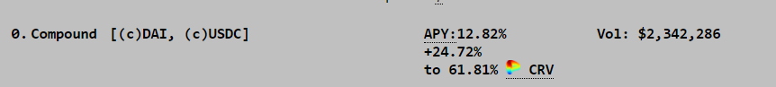

# Os Vaults de Yearn

Atualizado em 9 de agosto de 2021

## Visão geral

Bem-vindo ao Vaults na Yearn, onde você pode encontrar informações detalhadas sobre como os yVaults de Yearn operam e as ações (estratégias) que esses vaults executam. Este artigo manterá num local único todas as descrições dos yVaults. Os yVaults e estratégias mais recentes são denotados com ✨.

Abaixo você encontrará 6 seções:

- Yearn e Curve 🔵🤝🌈
- Vaults v2 🏛️
- Vaults v2 baseados no Curve Finance 🌈
- Vaults v1 baseados no Curve Finance 🌈
- Vaults v1 🏦
- Vaults Aposentados 💤

- Sinergia entre Yearn e Curve 🔵🤝🌈

Um dos componentes críticos da infraestrutura de Yearn inclui um relacionamento colaborativo com [Curve.fi] (http://curve.fi/). Vários vaults Yearn fornecem liquidez para pools Curve e fazem stake dos tokens de provedor de liquidez (LP) nos respectivos gauges, ganhando incentivos em forma do token CRV. Yearn trava 10% de todas as recompensas CRV ganhas no yveCRV-DAO (“Backscratcher”) para obter uma quantia adicional de CRV. Nas descrições de estratégia abaixo, os vaults que estão incentivados são indicadas com um 🚀.

Para uma compreensão mais profunda, consulte a seção _Compreendendo os multiplicadores de incentivo do Curve_ próximo ao final deste documento.

Além disso, os 90% restantes do CRV recebidos são trocados pelos respectivos tokens LP, e depositados novamente no vault. A única exceção é o vault yvUSDN3Crv que trava 50% do CRV ganho no vault Backscratcher e vende os restantes 50%.

### veCRV-DAO yVault ([yveCRV-DAO] (https://etherscan.io/address/0xc5bDdf9843308380375a611c18B50Fb9341f502A))

_AKA-Backscratcher_ [📺] (https://youtu.be/kJEAe2Rlh70) 
Este vault converte seu CRV em yveCRV, obtendo para você uma parte contínua das taxas da Curve, que são aumentadas sobre o que você ganha fazendo stake na Curve. Quanto mais CRV for convertido, maiores serão suas recompensas semanais. Todas as sextas-feiras, eles podem ser reivindicados do cofre como 3Crv (token LP do 3pool da Curve).

Yearn, por si só, deposita 10% de todos os CRV ganhos neste vault e dá suas recompensas de 3crv aos detentores de tokens do vault, sendo daí de onde vêm as recompensas semanais incentivadas.

O depósito é irreversível: Você só pode converter CRV em yveCRV, já que o CRV está perpetuamente em stake no escrow de voto da Curve. Todos os vaults enviam 10% do CRV ganho para este vault para manter os níveis de incentivo.

## Vaults v2 🏛️

Os v2 yVaults são capazes de empregar várias estratégias por cofre (até 20 estratégias simultaneamente), ao contrário dos v1 yVaults que só são capazes de empregar uma estratégia por cofre. [📺] (https://youtu.be/ZES91i-hNAM)

### Yearn Compounding veCRV yVault ([yvBOOST](https://etherscan.io/address/0x9d409a0A012CFbA9B15F6D4B36Ac57A46966Ab9a))

[StrategyYearnVECRV] (https://etherscan.io/address/0x2923a58c1831205C854DBEa001809B194FDb3Fa5) [📺] (https://youtu.be/Ik6GdGYO_x8) 
Este vault aceita tokens [yveCRV-DAO] (https://etherscan.io/address/0xc5bDdf9843308380375a611c18B50Fb9341f502A), que concedem a você uma parte contínua das taxas de negociação da Curve (reivindicadas semanalmente como [3Crv] (https://etherscan.io/address/0x6c3F90f043a72FA612cbac8115EE7e52BDe6E490), token LP de 3 pools da Curve). As recompensas são colhidas, trocadas por mais yveCRV-DAO (via compra no mercado ou emissão, dependendo do quê é mais eficiente na época da colheita) e depositadas de volta no vault.

### v2 YFI yVault ([yvYFI] (https://etherscan.io/address/0xE14d13d8B3b85aF791b2AADD661cDBd5E6097Db1#readContract))

[StrategyLenderYieldOptimiser] (https://etherscan.io/address/0x6a97FC93e39b3f792f1fD6e01565ff412B002D20#code) 
Esta estratégia empresta tokens YFI em várias plataformas de empréstimo, como CREAM e AAVE, para obter rendimento.

[StrategyMakerYFIDAIDelegate] (https://etherscan.io/address/0x4730D10703155Ef4a448B17b0eaf3468fD4fb02d) 
Trava YFI na MakerDAO via YFI-A para criar DAI. O DAI recém-criado é então depositado no v2 DAI yVault para obter rendimento.

✨ [MakerYFI-DAIv0.4.3Delegate] (https://etherscan.io/address/0x7A5D88510cD49E878ADe26E0f08bF374b5eCAF49) 
Trava YFI na MakerDAO via YFI-A para criar DAI. O DAI recém-criado é então depositado no DAI v2 v0.4.3 yVault para obter rendimento.

### v2 SNX yVault ([yvSNX] (https://etherscan.io/address/0xF29AE508698bDeF169B89834F76704C3B205aedf#code))

[StrategySynthetixSusdMinter] (https://etherscan.io/address/0xc9a62e09834cEdCFF8c136f33d0Ae3406aea66bD)
Faz stake de SNX na Synthetix para criar sUSD. **Isso gera recompensas pelo SNX em stake por 1 ano**. O uUSD recém-criado é então depositado no v2 sUSD yVault para obter rendimento. O rendimento de sUSD e recompensas de taxas semanais, mais recompensas com trava de tempo (quando liberadas) são negociadas por mais SNX e depositadas novamente no vault.

✨ [StrategyUniverseStaking] (https://etherscan.io/address/0x29d23b73Dd0ed729F516bb55622765AF102f0e33) 
Fornece SNX em universe.xyz para ganhar XYZ. As recompensas são colhidas, vendidas por mais SNX e depositadas novamente no vault.

### v2 RAI yVault ([yvRAI] (https://etherscan.io/address/0x873fB544277FD7b977B196a826459a69E27eA4ea))

[StrategyIdleidleRAIYield] (https://etherscan.io/address/0x5D411D2cde10e138d68517c42bE2808C90c22026) 🚀 
Fornece RAI em Idle.finance para ganhar IDLE e RAI. As recompensas são colhidas, vendidas por mais RAI e depositadas novamente no vault.

### v2 LINK yVault ([yvLINK] (https://etherscan.io/address/0x671a912C10bba0CFA74Cfc2d6Fba9BA1ed9530B2)) [📺] (https://youtu.be/LT51QWfAMv8)

[Vesper LINK] (https://etherscan.io/address/0x8198815871a45A5a883d083B7B105927eb9919D8) 
Fornece LINK para [Vesper Finance] (https://vesper.finance/) LINK Pool para ganhar VSP. As recompensas são colhidas, vendidas por mais LINK e depositadas novamente no vault.

[AaveLenderLINKBorrowerSUSD] (https://etherscan.io/address/0x906f0a6f23e7160eB0927B0903ab80b5E3f3950D) 
Empresta LINK no AAVE para ganhar juros e acumular AAVE em stake como recompensa. Também toma emprestado sUSD, que é então depositado no sUSD yVault para obter rendimento. Recompensas de AAVE em stake, e yvSUSD são colhidas, vendidas por mais LINK e depositadas novamente no vault.

[StrategyMakerLINKDAIDelegate] (https://etherscan.io/address/0x136fe75bfDf142a917C954F58577DB04ef6F294B) 
Trava LINK no MakerDAO via LINK-A para criar DAI. O DAI recém-criado é então depositado no v2 DAI yVault para obter rendimento.

✨ [StrategyUniverseStaking] (https://etherscan.io/address/0xa2a182C5B5Ea1A3c90Cb5Bb718F9e62DBE052927) 
Fornece LINK em universe.xyz para ganhar XYZ. As recompensas são colhidas, vendidas por mais LINK e depositadas novamente no vault.

### v2 sUSD yVault ([yvsUSD] (https://etherscan.io/address/0xa5cA62D95D24A4a350983D5B8ac4EB8638887396#code))

[StrategyLenderYieldOptimiser] (https://etherscan.io/address/0x215DeE632335829155Dcb62452c4878C48c1C884) 
Empresta sUSD em AAVE e Cream para obter rendimento e acumular AAVE em stake como recompensa. Quando o AAVE em stake for desbloqueado, o AAVE será colhido, vendido por mais sUSD e depositado novamente no vault.

[SingleSidedCrvsUSD] (https://etherscan.io/address/0x74b3E5408B1c29E571BbFCd94B09D516A4d81f36) 🚀 
Deposita sUSD para o pool SAAVE em curve.fi. As recompensas são colhidas, vendidas por mais sUSD e depositadas novamente no vault.

[SingleSidedCrvsUSD] (https://etherscan.io/address/0x95eA1643699F8DE347975F31CA8d03eCC507616c) 🚀 
Deposita sUSD no pool SUSDv2 em curve.fi. As recompensas são colhidas, vendidas por mais sUSD e depositadas novamente no vault.

### v2 1INCH yVault ([yv1INCH] (https://etherscan.io/address/0xB8C3B7A2A618C552C23B1E4701109a9E756Bab67))

[StrategyLenderYieldOptimiser] (https://etherscan.io/address/0x86eD4F77d40182b8686a25e125FB3f5a04203CaA) 
Empresta tokens 1INCH no CREAM para obter rendimento.

[Strategy1INCHGovernance] (https://etherscan.io/address/0xB12F6A5776EDd2e923fD1Ce93041B2000A22dDc7) 
Faz stake do token 1INCH em 1INCH DAO para coletar recompensas de governança. As recompensas são colhidas e depositadas de volta no vault.

### v2 WETH yVault ([yvWETH] (https://etherscan.io/address/0xa258C4606Ca8206D8aA700cE2143D7db854D168c))

_Qualquer ETH depositado é envelopado como WETH e depois depositado._

[StrategyLenderYieldOptimiser] (https://etherscan.io/address/0xec2DB4A1Ad431CC3b102059FA91Ba643620F0826) 
Empresta WETH em Alpha Homora para obter rendimento.

[StrategysteCurveWETHSingleSided] (https://etherscan.io/address/0xC5e385f7Dad49F230AbD53e21b06aA0fE8dA782D) 🚀 
Fornece WETH para o pool de liquidez na Curve [aqui] (https://www.curve.fi/steth/deposit) para obter [steCRV] (https://etherscan.io/address/0x06325440D014e39736583c165C2963BA99fAf14E) tokens que ele então coloca no v2 Curve stETH Pool yVault ([yvsteCRV] (https://etherscan.io/address/0xdcd90c7f6324cfa40d7169ef80b12031770b4325)) para obter rendimento.

[StrategyeCurveWETHSingleSided] (https://etherscan.io/address/0x37770F958447fFa1571fc9624BFB3d673161f37F) 🚀 
Fornece WETH para o pool de liquidez na Curve [aqui] (https://curve.fi/seth/deposit) para obter [eCRV] (https://etherscan.io/address/0xA3D87FffcE63B53E0d54fAa1cc983B7eB0b74A9c) tokens que ele então coloca no v2 Curve sETH Pool yVault ([yveCRV] (https://etherscan.io/address/0x986b4AFF588a109c09B50A03f42E4110E29D353F)) para obter rendimento.

[AaveWETHLenderUSDTBorrower] (https://etherscan.io/address/0xd28b508EA08f14A473a5F332631eA1972cFd7cC0) 
Empresta WETH no AAVE para ganhar juros e acumular AAVE em stake como recompensa. Também toma emprestado USDT, que é então depositado no USDT yVault para obter rendimento. Recompensas de AAVE em stake, e yvUSDT são colhidas, vendidas por mais WETH e depositadas novamente no vault.

[StrategyGenericLevCompFarmWeth] (https://hackmd.io/zucTisw_RUOQCWFpZYfksg?view) 
Fornece ETH no Compound e pega emprestado um montante adicional de ETH para maximizar os ganhos COMP. Os empréstimos instantâneos (flashloans) são usados para obter ETH adicional de dYdX para obter alavancagem adicional e impulsionar o APY. O COMP ganho é colhido e vendido por mais ETH, e depositado novamente no vault.

[StrategystETHAccumulator](https://etherscan.io/address/0x0967aFe627C732d152e3dFCAdd6f9DBfecDE18c3)  
Stakes wETH at [Lido.fi](http://lido.fi/) to mint stETH which accumulates ETH 2.0 staking rewards. This strategy will buy stETH off the market if its cheaper than staking.

[ssc\_eth\_seth](https://etherscan.io/address/0xc57A4D3FBEF85e675f6C3656498beEfe6F9DcB55)  
Deposits ETH into the sETH curve pool on [curve.fi](http://curve.fi/). Rewards are harvested, sold for more ETH, and re-deposited into the vault.

[ssc\_eth\_steth](https://etherscan.io/address/0xF9fDc2B5F60355A237deb8BD62CC117b1C907f7b)  
Deposits ETH into the stETH curve pool on [curve.fi](http://curve.fi/). Rewards are harvested, sold for more ETH, and re-deposited into the vault.

[StrategyMakerV2\_ETH-C](https://etherscan.io/address/0xd33535e9F2E09485aC9cE8b27F865251161065E0)  
Locks ETH at MakerDAO via ETH-C to mint DAI. This newly minted DAI is then deposited into the v2 DAI yVault.

### v2 USDC yVault ([yvUSDC] (https://etherscan.io/address/0x5f18c75abdae578b483e5f43f12a39cf75b973a9))

[StrategyIdleUSDCYield] (https://etherscan.io/address/0x414D8F5c21dAF33105eE6416bcdA99a50A47C0e5#code) [📺] (https://youtu.be/BcxWAVdXx_U) 
Fornece USDC em Idle.finance para ganhar COMP e IDLE. As recompensas são colhidas, vendidas por mais USDC e depositadas novamente no vault.

[StrategyAH2EarncyUSDC] (https://etherscan.io/address/0x86Aa49bf28d03B1A4aBEb83872cFC13c89eB4beD#code) 
Empresta USDC no Alpha Homora v2 para gerar rendimento.

[StrategyGenericLevCompFarm] (https://etherscan.io/address/0x4d7d4485fd600c61d840ccbec328bfd76a050f87) [📺] (https://www.youtu.be/jorporcLnCo&t) 
Fornece USDC no Compound e pega emprestado um montante adicional de USDC para maximizar os ganhos COMP. Os empréstimos instantâneos (flashloans) são usados para obter USDC adicional de dYdX para obter alavancagem adicional e impulsionar o APY. O COMP ganho é colhido e vendido por mais USDC, e depositado novamente no vault.

[SingleSidedCrvUSDC] (https://etherscan.io/address/0x80af28cb1e44C44662F144475d7667C9C0aaB3C3) 🚀 
Deposita USDC em um pool de USDC em [curve.fi](http://curve.fi/),e o direciona para o pool mais lucrativo na Curve.

[PoolTogether USD Coin] (https://etherscan.io/address/0x387fCa8d7e2e09655b4F49548607B55C0580fC63) 
Fornece USDC para o protocolo [PoolTogether] (https://pooltogether.com/) para ganhar POOL. As recompensas são colhidas, vendidas por mais USDC e depositadas novamente no vault. Se receber o prêmio da semana, também será adicionado ao vault.

[StrategyRook USD Coin] (https://etherscan.io/address/0x4140F350c1B67184fE3AaEa314d8C967F99EE8Cc) 
Fornece USDC para KeeperDAO para ganhar ROOK. As recompensas são colhidas, vendidas por mais USDC e depositadas novamente no vault.

### v2 DAI yVault ([yvDAI] (https://etherscan.io/address/0xdA816459F1AB5631232FE5e97a05BBBb94970c95))

[StrategyLenderYieldOptimiser] (https://hackmd.io/zucTisw_RUOQCWFpZYfksg?view) 
Empresta DAI em AAVE para obter rendimento e acumular AAVE em stake como recompensa. Quando o AAVE em stake for desbloqueado, o AAVE será colhido, vendido por mais DAI e depositado novamente no vault.

[StrategyKashiMultiPairLender] (https://hackmd.io/zucTisw_RUOQCWFpZYfksg?view) 
Empresta DAI no Sushi via Kashi para ganhar rendimento. As recompensas são colhidas, vendidas por mais DAI e depositadas novamente no vault.

[StrategyGenericLevCompFarm] (https://hackmd.io/zucTisw_RUOQCWFpZYfksg?view) 
Fornece DAI no Compound e toma emprestado uma quantia adicional de DAI para maximizar os ganhos em COMP. Os empréstimos instantâneos (flashloans) são usados para obter DAI adicional de dYdX para obter alavancagem adicional e impulsionar o APY. O COMP ganho é colhido e vendido por mais DAI, e depositado novamente no vault.

✨ [ssc dai ib] (https://etherscan.io/address/0xa6D1C610B3000F143c18c75D84BaA0eC22681185) 
Deposita DAI no pool curve do Iron Bank em [curve.fi] (http://curve.fi/). As recompensas são colhidas, vendidas por mais DAI e depositadas novamente no vault.

### v2 WBTC yVault ([yvWBTC] (https://etherscan.io/address/0xA696a63cc78DfFa1a63E9E50587C197387FF6C7E))

[StrategyMakerWBTCDAIDelegate] (https://etherscan.io/address/0x04A508664B053E0A08d5386303E649925CBF763c) 
Trava wBTC no MakerDAO via WBTC-A para emitir DAI. Este DAI recém- emitido é então depositado no v2 DAI yVault.

[SingleSidedCrvWBTC] (https://etherscan.io/address/0x40b04B3ed9845B8Be200Aa2D9C3eDC2bE0a5f01f) 🚀 
Deposita wBTC em um pool BTC em [curve.fi] (https://hackmd.io/zucTisw_RUOQCWFpZYfksg?view) e alterna para o pool Curve mais lucrativo.

[yvWBTCStratMMV1] (https://etherscan.io/address/0x53a65c8e238915c79a1e5C366Bc133162DBeE34f) 
Fornece wBTC para o [Mushroom Finance's] (https://mushrooms.finance/) WBTC Vault e então para o Farm wBTC para ganhar MM. MM são colhidos, vendidos por mais wBTC e depositados novamente no vault.

[Vesper Wrapped BTC] (https://etherscan.io/address/0x416647Ddee169156878DC46CD565dee99413c262) 
Fornece wBTC para [Vesper Finance] (https://vesper.finance/) vWBTC Pool para ganhar VSP. As recompensas são colhidas, vendidas por mais wBTC e depositadas novamente no vault.

✨ [ssc wbtc bbtc] (https://etherscan.io/address/0x4b254EbBbb8FDb9D3E848501784692b2726b310c) 
Deposita WBTC no pool curve do Iron Bank em [curve.fi] (http://curve.fi/). As recompensas são colhidas, vendidas por mais wBTC e depositadas novamente no vault.

✨ [ssc wbtc pbtc] (https://etherscan.io/address/0x29367915508e47c631d220caEbA855901c13a3dE) 
Deposita WBTC no pool Curve PBTC em [curve.fi] (http://curve.fi/). As recompensas são colhidas, vendidas por mais wBTC e depositadas novamente no vault.

✨ [ssc wbtc obtc] (https://etherscan.io/address/0x64B2a32f030D9210E51ed8884C0D58b89137Ca81) 
Deposita WBTC no OBTC pool curve do Iron Bank em [curve.fi] (http://curve.fi/). As recompensas são colhidas, vendidas por mais wBTC e depositadas novamente no vault.

✨ [Strategy-Levered-AAVE-wBTC] (https://etherscan.io/address/0xDD387F2fe0D9B1E5768fc941e7E48AA8BfAf5e41) 
Fornece o WBTC como garantia no AAVE V2, é usado em um empréstimo refornecido ao protocolo em alguns loops para alcançar a alavancagem desejada no empréstimo do WBTC.

### v2 USDT yVault ([yvUSDT] (https://etherscan.io/token/0x7Da96a3891Add058AdA2E826306D812C638D87a7))

[StrategyLenderYieldOptimiser] (https://etherscan.io/address/0x2f87c5e8396F0C41b86aad4F3C8358aB21681952) 
Empresta USDT em AAVE para ganhar juros.

[StrategyAH2EarncyUSDT] (https://etherscan.io/address/0x82292B8035873d7DD8a96767F6b3F885564aa919) 
Empresta USDT no Alpha Homora v2 para gerar rendimento.

[StrategyIdleUSDTYield] (https://etherscan.io/address/0x01b54c320d6B3057377cbc71d953d1BBa84df44e) 
Fornece USDT em Idle.finance para ganhar COMP e IDLE. As recompensas são colhidas, vendidas por mais USDT e depositadas novamente no vault.

[SingleSidedCrvUSDT] (https://etherscan.io/address/0xf840d061E83025F4cD6610AE5DDebCcA43327f9f) 🚀 
Deposita USDT em um pool de USDT em [curve.fi](http://curve.fi/),e o direciona para o pool mais lucrativo na Curve.

### v2 UNI yVault ([yvUNI] (https://etherscan.io/address/0xFBEB78a723b8087fD2ea7Ef1afEc93d35E8Bed42))

[StrategyLenderYieldOptimiser] (https://etherscan.io/address/0x5e882c9f00209315e049B885B9b3dfbEe60D80A4) 
Empresta UNI em AAVE para obter rendimento e acumular AAVE em stake como recompensa. Quando o AAVE em stake for desbloqueado, o AAVE será colhido, vendido por mais UNI e depositado novamente no vault.

[PoolTogether Uniswap] (https://etherscan.io/address/0x6EB00860260CF51623737e17579Db797d71cd337) 
Fornece UNI para o protocolo [PoolTogether] (https://pooltogether.com/) para ganhar POOL. As recompensas são colhidas, vendidas por mais UNI e depositadas novamente no vault. Se receber o prêmio da semana, também será adicionado ao vault.

[StrategyMakerUNIDAIDelegate] (https://etherscan.io/address/0x9Ae0B9a67cF5D603847980D95Ad4D45b57Ff7783) 
Trava UNI na MakerDAO via UNI-A para criar DAI. Este DAI recém- emitido é então depositado no v2 DAI yVault.

## v2 Curve Finance Strategy Vaults 🌈

v2 Curve yVaults aceitam depósitos de tokens de pool de liquidez obtidos ao fornecer capital aos pools de liquidez no Curve Finance. Para entrar nesses vaults, você precisa depositar o (s) ativo (s) subjacente (s) em seu respectivo pool na Curve Finance. [📺] (https://youtu.be/V47NzWeZjjk)

### ✨ Curve 3Crypto Pool yVault ([yvCurve-3Crypto] (https://etherscan.io/address/0xE537B5cc158EB71037D4125BDD7538421981E6AA))

Embora este vault não esteja sujeito a Perda Impermanente, o pool da Curve subjacente pode incorrer em Perda Impermanente na retirada, tenha cuidado._

✨ [Curvecrv3cryptoVoterProxy] (https://etherscan.io/address/0xbA9052141cEf06FD55733D23231c37Fc856CE6F4) 🚀 
Este vault aceita depósitos de tokens [crv3crypto] (https://etherscan.io/address/0xc4AD29ba4B3c580e6D59105FFf484999997675Ff) obtidos pelo fornecimento de BTC, ETH ou USDT para o pool de liquidez em Curve [aqui] (https://curve.fi tricrypto2 / deposit) em troca de tokens crv3crypto. crv3crypto são colocados em stake no gauge de curve.fi para ganhar recompensas CRV. As recompensas são negociadas por um dos ativos subjacentes e depositadas novamente no pool de liquidez, para obter mais crv3crypto.

[StrategyConvex3Crypto](https://etherscan.io/address/0x2055CFD5CDbc90c60A202A1AC3DDfB71AeC1cE98) 🚀  
Supplies crv3crypto to Convex Finance to earn CRV and CVX. Rewards are harvested, sold for more crv3crypto, and deposited back into the vault.

### ✨ Curve USDM Pool yVault ([yvCurve-USDM](https://etherscan.io/address/0x6FAfCA7f49B4Fd9dC38117469cd31A1E5aec91F5))

✨ [StrategyCurveUSDM](https://etherscan.io/address/0x81329ecb1AB448DacF6b9ae696A097f790898899)  
This vault accepts deposits of USDM3CRV-f tokens obtained by supplying either USDM, DAI, USDC, USDT (or wrapped via 3Crv tokens) to the liquidity pool on Curve [here](https://curve.fi/factory/23/deposit). USDM3CRV-f tokens are staked in the gauge on Curve to earn CRV rewards. Rewards are swapped for one of the underlying assets and resupplied to the liquidity pool to obtain more USDM3CRV-f.

✨ [StrategyConvexUSDM](https://etherscan.io/address/0x240f5167A98Bc2198110BcdD4CB04D06Dd52d55d)  
Supplies USDM3CRV-f to [Convex Finance](https://www.convexfinance.com/) to earn CRV. Rewards are harvested, sold for more USDM3CRV-f, and deposited back into the strategy.

### ✨ Curve alETH Pool yVault ([yvCurve-alETH](https://etherscan.io/address/0x718AbE90777F5B778B52D553a5aBaa148DD0dc5D))

✨ [StrategyCurvealETH](https://etherscan.io/address/0x3f4a63F3Ee9bA49004953f6879c7516D85969F5F)  
This vault accepts deposits of alETH+ETH-f tokens obtained by supplying either alETH or ETH to the liquidity pool on Curve [here](https://curve.fi/factory/38/deposit). alETH+ETH-f tokens are staked in the gauge on Curve to earn CRV rewards. Rewards are swapped for one of the underlying assets and resupplied to the liquidity pool to obtain more alETH+ETH-f.

✨ [StrategyConvexalETH](https://etherscan.io/address/0x4ec142d094BecA5f7789CCd9341D0215c8B1e43f)  
Supplies alETH+ETH-f to [Convex Finance](https://www.convexfinance.com/) to earn CRV. Rewards are harvested, sold for more alETH+ETH-f, and deposited back into the strategy.

### ✨ Curve EURN Pool yVault ([yvCurve-EURN](https://etherscan.io/address/0x8b9C0c24307344B6D7941ab654b2Aeee25347473))

✨ [StrategyCurveEURN](https://etherscan.io/address/0x7847b7027cab6Fc4ea08cA0fF3b7464727712f91)  
This vault accepts deposits of EURN/EURT-f tokens obtained by supplying either EURN or EURT to the liquidity pool on Curve [here](https://curve.fi/factory/33/deposit). EURN/EURT-f tokens are staked in the gauge on Curve to earn CRV rewards. Rewards are swapped for one of the underlying assets and resupplied to the liquidity pool to obtain more EURN/EURT-f.

✨ [StrategyConvexEURN](https://etherscan.io/address/0x3199437193625DCcD6F9C9e98BDf93582200Eb1f)  
Supplies EURN/EURT-f to [Convex Finance](https://www.convexfinance.com/) to earn CRV. Rewards are harvested, sold for more EURN/EURT-f, and deposited back into the strategy.

### ✨ Curve MIM-UST ([yvCurve-MIMUST](https://etherscan.io/address/0xd8C620991b8E626C099eAaB29B1E3eEa279763bb))

✨ [StrategyCurveMIMUST](https://etherscan.io/address/0xbb241fD9A2A3742ef9E10ccfd8a6C4E0EbEb03f2)  
This vault accepts deposits of MIM-UST-f tokens obtained by supplying either MIM or UST to the liquidity pool on Curve [here](https://curve.fi/factory/48/deposit). MIM-UST-f tokens are staked in the gauge on Curve to earn CRV rewards. Rewards are swapped for one of the underlying assets and resupplied to the liquidity pool to obtain more MIM-UST-f.

✨ [StrategyConvexMIMUST](https://etherscan.io/address/0x5796698A29F3626c9FE13C4d3d3dEE987c84EBB3)  
Supplies MIM-UST-f to [Convex Finance](https://www.convexfinance.com/) to earn CRV. Rewards are harvested, sold for more MIM-UST-f, and deposited back into the strategy.

### Curve EURT Pool yVault ([yvCurve-EURT](https://etherscan.io/address/0x0d4EA8536F9A13e4FBa16042a46c30f092b06aA5))

[StrategyCurveEURT](https://etherscan.io/address/0x26AB2029083909FeEFF8Cb0fA04c1CfF52499DE7)  
This vault accepts deposits of EURT-f tokens obtained by supplying either EURT or sEUR to the liquidity pool on Curve [here](https://curve.fi/eurt/deposit). EURT-f tokens are staked in the gauge on Curve to earn CRV rewards. Rewards are swapped for one of the underlying assets and resupplied to the liquidity pool to obtain more EURT-f.

[StrategyConvexEURT](https://etherscan.io/address/0x5E10E27DEae12877e23A68cC0d6F1b134b4d517A)  
Supplies EURT-f to Convex Finance to earn CRV and CVX. Rewards are harvested, sold for more EURT-f, and deposited back into the vault.

### Curve MIM Pool yVault ([yvCurve-MIM](https://etherscan.io/address/0x2DfB14E32e2F8156ec15a2c21c3A6c053af52Be8))

[StrategyCurveMIM](https://etherscan.io/address/0x9E1FF8638a2F1aD4B924A4B9677aD9d9b74361Cf)  
This vault accepts deposits of MIM-3LP3CRV-f tokens obtained by supplying either MIM, DAI, USDC, USDT (or wrapped via 3Crv tokens) to the liquidity pool on Curve [here](https://curve.fi/mim/deposit). MIM-3LP3CRV-f tokens are staked in the gauge on Curve to earn CRV and SPELL rewards. Rewards are swapped for one of the underlying assets and resupplied to the liquidity pool to obtain more MIM-3LP3CRV-f.

[StrategyConvexMIM](https://etherscan.io/address/0x6570B0a1593a59CcB378fb0b01A753875FCa99c4)  
Supplies MIM-3LP3CRV-f to Convex Finance to earn CRV, SPELL, and CVX. Rewards are harvested, sold for more MIM-3LP3CRV-f, and deposited back into the vault.

### Curve cvxCRV Pool yVault ([yvCurve-cvxCRV](https://etherscan.io/address/0x4560b99C904aAD03027B5178CCa81584744AC01f))

[StrategyCurvecvxCRV](https://etherscan.io/address/0xDCecD8DC5F3dDD480d2A06C56063DBf9c2a07E09)  
This vault accepts deposits of cvxcrv-f tokens obtained by supplying either CRV or cvxCRV to the liquidity pool on Curve [here](https://curve.fi/factory/22/deposit). cvxcrv-f tokens are staked in the gauge on Curve to earn CRV rewards. Rewards are swapped for one of the underlying assets and resupplied to the liquidity pool to obtain more cvxcrv-f.

✨ [StrategyConvexcvxCRV](https://etherscan.io/address/0xAF6F42bfB29e90dFe51f2341fF1B1f99Fd776A70)  
Supplies cvxcrv-f to [Convex Finance](https://www.convexfinance.com/) to earn CRV and CVX. Rewards are harvested, sold for more cvxcrv-f, and deposited back into the strategy.

### Curve ibEUR Pool yVault ([yvCurve-ibEUR](https://etherscan.io/address/0x67e019bfbd5a67207755D04467D6A70c0B75bF60))

[StrategyCurveibEUR](https://etherscan.io/address/0xB431A88a6cFFfa66dBCf96Ebc89aE72Ff7Fcc34f)  
This vault accepts deposits of ibEUR+sEUR-f tokens obtained by supplying either ibEUR or sEUR to the liquidity pool on Curve [here](https://curve.fi/factory/3/deposit). ibEUR+sEUR-f tokens are staked in the gauge on Curve to earn CRV and rKP3R rewards. Rewards are swapped for one of the underlying assets and resupplied to the liquidity pool to obtain more ibEUR+sEUR-f.

✨ [StrategyConvexibEUR](https://etherscan.io/address/0x214D14f94a63B1714CCc39d12b4942e8Fdd56bA7)  
Supplies ibEUR+sEUR-f to Convex Finance to earn CRV and CVX. Rewards are harvested, sold for more ibEUR+sEUR-f, and deposited back into the vault.

### Curve ibKRW Pool yVault ([yvCurve-ibKRW](https://etherscan.io/address/0x528D50dC9a333f01544177a924893FA1F5b9F748))

[StrategyCurveibKRW](https://etherscan.io/address/0x10Ae24bce6F06b1BFfdA701736BEB2069eCd5a49)  
This vault accepts deposits of ibKRW+sKRW-f tokens obtained by supplying either ibKRW or sKRW to the liquidity pool on Curve [here](https://curve.fi/factory/2/deposit). ibKRW+sKRW-f tokens are staked in the gauge on Curve to earn CRV and rKP3R rewards. Rewards are swapped for one of the underlying assets and resupplied to the liquidity pool to obtain more ibKRW+sKRW-f.

✨ [StrategyConvexibKRW](https://etherscan.io/address/0x73c3533c159F93C924f072B065F9DAA6C0445Be2)  
Supplies ibKRW+sKRW-f to Convex Finance to earn CRV and CVX. Rewards are harvested, sold for more ibKRW+sKRW-f, and deposited back into the vault.

### Curve ibGBP Pool yVault ([yvCurve-ibGBP](https://etherscan.io/address/0x595a68a8c9D5C230001848B69b1947ee2A607164))

[StrategyCurveibGBP](https://etherscan.io/address/0x2063FcF4883E688FEc10e984d43bDa3ed9C00fd6)  
This vault accepts deposits of ibGBP+sGBP-f tokens obtained by supplying either ibGBP or sGBP to the liquidity pool on Curve [here](https://curve.fi/factory/30/deposit). ibGBP+sGBP-f tokens are staked in the gauge on Curve to earn CRV and rKP3R rewards. Rewards are swapped for one of the underlying assets and resupplied to the liquidity pool to obtain more ibGBP+sGBP-f.

✨ [StrategyConvexibGBP](https://etherscan.io/address/0x6CfAcEf79cA2AaE173Dc5089b9179a4193dC5784)  
Supplies ibGBP+sGBP-f to Convex Finance to earn CRV and CVX. Rewards are harvested, sold for more ibGBP+sGBP-f, and deposited back into the vault.

### Curve ibAUD Pool yVault ([yvCurve-ibAUD](https://etherscan.io/address/0x1b905331F7dE2748F4D6a0678e1521E20347643F))

[StrategyCurveibAUD](https://etherscan.io/address/0x2c9740Fc1E03457bF7FDe9dA08e04476D91c038c)  
This vault accepts deposits of ibAUD+sAUD-f tokens obtained by supplying either ibAUD or sAUD to the liquidity pool on Curve [here](https://curve.fi/factory/29/deposit). ibAUD+sAUD-f tokens are staked in the gauge on Curve to earn CRV and rKP3R rewards. Rewards are swapped for one of the underlying assets and resupplied to the liquidity pool to obtain more ibAUD+sAUD-f.

✨ [StrategyConvexibAUD](https://etherscan.io/address/0x68d8dAd442102d1aECCa4f71246E20eBA9ab7216)  
Supplies ibAUD+sAUD-f to Convex Finance to earn CRV and CVX. Rewards are harvested, sold for more ibAUD+sAUD-f, and deposited back into the vault.

### v2 Curve mUSD Pool yVault ([yvCurve-mUSD] (https://etherscan.io/address/0x8cc94ccd0f3841a468184aCA3Cc478D2148E1757#code))

[Curvemusd3CRVVoterProxy] (https://etherscan.io/address/0xf9fF7f463A7e6f43d4E65c230D3743355fC954e4) 🚀 
Este vault aceita depósitos de tokens [musd3CRV] (https://etherscan.io/address/0x1AEf73d49Dedc4b1778d0706583995958Dc862e6) obtidos através do fornecimento de mUSD, DAI, USDC, USDT (ou envelopado por meio de tokens Curve) para o pool de liquidez Curve [aqui] (https://www.curve.fi/musd/deposit). Os tokens musd3CRV são colocados no gauge Curve para ganhar recompensas CRV. As recompensas são trocadas por um dos ativos subjacentes e depositadas novamente no pool de liquidez, para obter mais musd3CRV.

[Convexmusd3CRV] (https://etherscan.io/address/0x75be6ABC02a010559Ed5c7b0Eab94abD2B783b65) 🚀 
Fornece musd3CRV para Convex Finance para obter CRV e CVX. As recompensas são colhidas, vendidas por mais musd3CRV e depositadas novamente no vault.

### v2 Huobi BTC Curve yVault ([yvhCRV] (https://etherscan.io/address/0x625b7DF2fa8aBe21B0A976736CDa4775523aeD1E))

[CurvehCRVVoterProxy] (https://etherscan.io/address/0x91cBf0014a966615e1050c90A1aBf1d1d5d8cffd) 🚀 
Este vault aceita depósitos de tokens [hCRV] (https://etherscan.io/address/0xb19059ebb43466C323583928285a49f558E572Fd) obtidos fornecendo hBTC ou wBTC para o pool de liquidez na Curve [aqui] (https://curve.fi/hbtc/deposit ) em troca de tokens hCRV. hCRV são colocados em stake no gauge de curve.finance para ganhar recompensas CRV. As recompensas são negociadas por um dos ativos subjacentes e depositadas novamente no pool de liquidez, para obter mais hCRV.

[ConvexhCRV] (https://etherscan.io/address/0x7Ed0d52C5944C7BF92feDC87FEC49D474ee133ce) 🚀 
Fornece hCRV para Convex Finance para obter CRV e CVX. As recompensas são colhidas, vendidas por mais hCRV e depositadas novamente no vault.

### v2 Curve USDK Pool yVault ([yvCurve-USDK] (https://etherscan.io/address/0x3D27705c64213A5DcD9D26880c1BcFa72d5b6B0E))

[Curveusdk3CRVVoterProxy] (https://etherscan.io/address/0x096E2F730c6AB7a048de7d27507E5E4e864c6824) 🚀 
Este vault aceita depósitos de tokens [usdk3CRV] (https://etherscan.io/address/0x97E2768e8E73511cA874545DC5Ff8067eB19B787) obtidos fornecendo DAI, USDC, USDT (ou sua versão envelopada: 3crv), ou USDK para o pool de liquidez na Curve [aqui] (https://curve.fi/usdk/deposit) em troca de tokens usdk3CRV. usdk3CRV são colcoados em stake no gauge em curve.finance para ganhar recompensas CRV. As recompensas são trocadas por um dos ativos subjacentes e depositadas novamente no pool de liquidez, para obter mais usdk3CRV.

[Convexusdk3CRV] (https://hackmd.io/zucTisw_RUOQCWFpZYfksg?view) 🚀 
Fornece usdk3CRV para [Convex Finance] (https://www.convexfinance.com/stake) para obter CRV e CVX. Os tokens ganhos são coletados, vendidos por mais usdk3CRV, que são depositados de volta na estratégia.

### v2 Curve Pax Pool yVault ([yvCurve-Pax] (https://etherscan.io/address/0x80bbeE2fa460dA291e796B9045e93d19eF948C6A))

[CurveypaxCrvVoterProxy] (https://etherscan.io/address/0x60A335509E75175E0fF785091f1Baf979148A290) 🚀 
Este vault aceita depósitos de tokens [ypaxCrv] (https://etherscan.io/address/0xD905e2eaeBe188fc92179b6350807D8bd91Db0D8) obtidos fornecendo DAI, USDC, USDT (ou sua versão envelopada IronBank: ycDAI, ycUSDC para o ycDAI, ycUSDC líquido), líquido pool no Curve [aqui] (https://curve.fi/pax/deposit) em troca de tokens ypaxCrv. ypaxCrv são colocados em stake no gauge em curve.finance para ganhar recompensas CRV. As recompensas são trocadas por um dos ativos subjacentes e depositadas novamente no pool de liquidez, para obter mais ypaxCRV.

[ConvexypaxCrv](https://hackmd.io/zucTisw_RUOQCWFpZYfksg?view) 🚀  
Fornece ypaxCrv para [Convex Finance] (https://www.convexfinance.com/stake) para obter CRV e CVX. Os tokens ganhos são coletados, vendidos por mais ypaxCRV, que são depositados de volta na estratégia.

### v2 Curve RSV Pool yVault ([yvCurve-RSV] (https://etherscan.io/address/0xC116dF49c02c5fD147DE25Baa105322ebF26Bd97))

[Curversv3CRVVoterProxy] (https://etherscan.io/address/0x57D2E2eD281650A5d987E6ef87BC1BeD4fD0E959) 🚀 
Este vault aceita depósitos de tokens [rsv3CRV] (https://etherscan.io/address/0xC2Ee6b0334C261ED60C72f6054450b61B8f18E35) obtidos fornecendo DAI, USDC, USDT (ou sua versão: 3crv) ou RSV para o pool de liquidez na Curve [aqui ] (https://curve.fi/rsv/deposit) em troca de tokens rsv3CRV. rsv3CRV são colocados em stake no gauge em curve.finance para ganhar recompensas CRV e RSR. As recompensas são trocadas por um dos ativos subjacentes e depositadas novamente no pool de liquidez, para obter mais rsv3CRV.

[Convexrsv3CRV](https://hackmd.io/zucTisw_RUOQCWFpZYfksg?view) 🚀  
Fornece rsv3CRV para [Convex Finance] (https://www.convexfinance.com/stake) para obter CRV e CVX. Os tokens ganhos são coletados, vendidos por mais rsv3CRV, que são depositados de volta na estratégia.

### v2 Curve USDT Pool yVault ([yvCurve-USDT] (https://etherscan.io/address/0x28a5b95C101df3Ded0C0d9074DB80C438774B6a9))

[CurvecDAI + cUSDC + USDTVoterProxy] (https://etherscan.io/address/0x5Fa22A8527Ae20f4ed8Ed3E0a6A5359Ad5EA3A4e) 🚀 
Este vault aceita depósitos de tokens [tCrv] (https://etherscan.io/address/0x9fC689CCaDa600B6DF723D9E47D84d76664a1F23) obtidos fornecendo DAI, USDC (ou sua versão envelopada Compound: cDAI, cUSDC) ou USDT para o pool de liquidez Curve [aqui] (https://curve.fi/usdt/deposit) em troca de tokens tCrv. tCrv são colocados em stake no gauge em curve.finance para ganhar recompensas CRV. As recompensas são trocadas por um dos ativos subjacentes e depositadas novamente no pool de liquidez, para obter mais tCRV.

[ConvexcDAI + cUSDC + USDT] (https://hackmd.io/zucTisw_RUOQCWFpZYfksg?view) 🚀 
Fornece tCrv para [Convex Finance] (https://www.convexfinance.com/stake) para obter CRV e CVX. Os tokens ganhos são coletados, vendidos por mais tCRV, que são depositados de volta na estratégia.

### v2 Curve triCrypto Pool yVault ([yvCurve-triCrypto] (https://etherscan.io/address/0x3D980E50508CFd41a13837A60149927a11c03731))

Embora este vault não esteja sujeito a Perda Impermanente, o pool da Curve subjacente pode incorrer em Perda Impermanente na retirada, tenha cuidado._

[CurvecrvTricryptoVoterProxy] (https://etherscan.io/address/0xb9267f1427Ddb937003b9cA0Ca7716DDa4026D19) 🚀 
Este vault aceita depósitos de tokens [crvTricrypto] (https://etherscan.io/address/0xcA3d75aC011BF5aD07a98d02f18225F9bD9A6BDF) obtidos através do fornecimento de USDT, wBTC ou ETH para o pool de liquidez em Curve [aqui](https://curve.fi/tricrypto/deposit) em troca de tokens crvTricrypto. crvTricrypto são colocados em stake no gauge de curve.finance para ganhar recompensas CRV. As recompensas são trocadas por um dos ativos subjacentes e depositadas novamente no pool de liquidez, para obter mais crvTricrypto.

[ConvexcrvTricrypto](https://hackmd.io/zucTisw_RUOQCWFpZYfksg?view) 🚀  
Supplies crvTricrypto to [Convex Finance](https://www.convexfinance.com/stake) to earn CRV and CVX. Os tokens ganhos são coletados, vendidos por mais crvTricrypto, que são depositados de volta na estratégia.

### v2 Curve EURS Pool yVault ([yvCurve-EURS] (https://etherscan.io/address/0x25212Df29073FfFA7A67399AcEfC2dd75a831A1A))

[CurveeursCRVVoterProxy] (https://etherscan.io/address/0x53cE22d5b4F667eC73710d428E828Cd96E9a37C9) 🚀 
Este vault aceita depósitos de tokens [eursCRV] (https://etherscan.io/address/0x194eBd173F6cDacE046C53eACcE9B953F28411d1) obtidos fornecendo EURs ou sEUR para o pool de liquidez na Curve [aqui] (https://www.curve.fi/eurs/deposit). Os tokens eursCRV são colocados no gauge na Curve para ganhar recompensas CRV. As recompensas são trocadas por um dos ativos subjacentes e depositadas novamente no pool de liquidez, para obter mais eursCRV.

[ConvexeursCRV] (https://etherscan.io/address/0x4DC2CCC9E76bD30982243C1cB915003e17a88Eb9) 🚀 
Fornece eursCRV para Convex Finance para obter CRV e CVX. As recompensas são colhidas, vendidas por mais eursCRV e depositadas novamente no vault.

### v2 Curve sUSD Pool yVault ([yvCurve-sUSD] (https://etherscan.io/address/0x5a770DbD3Ee6bAF2802D29a901Ef11501C44797A))

[CurvecrvPlain3andSUSDVoterProxy] (https://etherscan.io/address/0x9730F52AB5BcEc960bE41b0fE4913a09c0B57066) 🚀 
Este vault aceita depósitos de tokens [sCrv] (https://etherscan.io/address/0xC25a3A3b969415c80451098fa907EC722572917F) obtidos fornecendo sUSD, DAI, USDC ou USDT para o pool de liquidez na Curve [aqui] (https://www.curve.fi/susdv2/deposit). Os tokens sCrv são colocados no medidor no Curve para ganhar recompensas CRV e SNX. As recompensas são trocadas por um dos ativos subjacentes e depositadas novamente no pool de liquidez, para obter mais sCRV.

[ConvexcrvPlain3andSUSD] (https://etherscan.io/address/0xFA773b91b59B0895877c769000b9824b46b13a20) 🚀 
Fornece sCRV para Convex Finance para obter CRV e CVX. As recompensas são colhidas, vendidas por mais sCRV e depositadas novamente no vault.

### v2 Curve AAVE Pool yVault ([yvCurve-Aave] (https://etherscan.io/address/0x39CAF13a104FF567f71fd2A4c68C026FDB6E740B))

[Curvea3CRVVoterProxy] (https://etherscan.io/address/0xB11FC91DF59ADc604485f1B25ABa1F96A685473f) 🚀 
Este vault aceita depósitos de tokens [a3CRV] (https://etherscan.io/address/0xFd2a8fA60Abd58Efe3EeE34dd494cD491dC14900) obtidos fornecendo DAI, USDC ou USDT (ou seus aTokens envelopados) para o pool de liquidez na Curve [aqui] (https://curve.fi/aave/deposit). )s tokens a3CRV são colocados no gauge na Curve para ganhar recompensas CRV. As recompensas são trocadas por um dos ativos subjacentes e depositadas novamente no pool de liquidez, para obter mais a3CRV.

[Convexa3CRV] (https://etherscan.io/address/0xAC4AE0B06C913dF4608dB60E2571a8e91b74C619) 🚀 
Fornece a3CRV para Convex Finance para obter CRV e CVX. As recompensas são colhidas, vendidas por mais a3CRV e depositadas novamente no vault.

### V2 Curve HUSD Pool yVault ([yvCurve-HUSD] (https://etherscan.io/address/0x054AF22E1519b020516D72D749221c24756385C9))

[Curvehusd3CRVVoterProxy] (https://etherscan.io/address/0x5ED527A2cfC5411EB63b12E46e270b07b6813824) 🚀 
Este vault aceita depósitos de tokens [husd3CRV] (https://etherscan.io/address/0x5B5CFE992AdAC0C9D48E05854B2d91C73a003858) obtidos fornecendo DAI, USDC, USDT (ou sua versão envelopada: 3crv) ou HUSD para o pool de liquidez na Curve [aqui] (https://www.curve.fi/husd/deposit). Os tokens husd3CRV são colocados no gauge na Curve para ganhar recompensas CRV. As recompensas são trocadas por um dos ativos subjacentes e depositadas novamente no pool de liquidez, para obter mais husd3CRV.

[Convexhusd3CRV] (https://etherscan.io/address/0xdC929e76081a78e5c32552C2e79D29ECab3F6755) 🚀 
Fornece husd3CRV para Convex Finance para obter CRV e CVX. As recompensas são colhidas, vendidas por mais husd3CRV e depositadas novamente no vault.

### v2 Curve USDN Pool yVault ([yvCurve-USDN] (https://etherscan.io/address/0x3B96d491f067912D18563d56858Ba7d6EC67a6fa))

[Curveusdn3CRVVoterProxy] (https://etherscan.io/address/0x23a09D84e50fF3fDFa270308851443734b0a4b6D) 🚀 
Este vault aceita depósitos de tokens [usdn3CRV] (https://etherscan.io/address/0x4f3E8F405CF5aFC05D68142F3783bDfE13811522) obtidos fornecendo DAI, USDC, USDT (ou sua versão envelopada: 3crv) ou USDN para o pool de liquidez Curve [aqui] (https://curve.fi/usdn/deposit). Os tokens usdn3CRV são colocados no gauge da Curve para ganhar recompensas CRV. As recompensas são trocadas por um dos ativos subjacentes e depositadas novamente no pool de liquidez, para obter mais usdn3CRV.

[Convexusdn3CRV] (https://etherscan.io/address/0x8e87e65Cb28c069550012f92d5470dB6EB6897c0) 🚀 
Fornece usdn3CRV para Convex Finance para obter CRV e CVX. As recompensas são colhidas, vendidas por mais usdn3CRV e depositadas novamente no vault.

### v2 Curve rETH Pool yVault ([yvCurve-rETH] (https://etherscan.io/address/0xBfedbcbe27171C418CDabC2477042554b1904857))

[CurverCRVVoterProxy] (https://etherscan.io/address/0x16468a3999d931Dd6b6ffA0086Cf195D6C5BDAFA) 🚀 
Este vault aceita depósitos de tokens [rCRV] (https://etherscan.io/address/0x53a901d48795C58f485cBB38df08FA96a24669D5) obtidos fornecendo ETH ou rETH para o pool de liquidez na Curve [aqui] (https://curve.fi/reth/deposit ) Os tokens rCRV são colocados em stake no gauge da Curve para ganhar CRV e recompensas [FIS] (https://www.coingecko.com/en/coins/stafi). As recompensas são trocadas por um dos ativos subjacentes e depositadas novamente no pool de liquidez, para obter mais rCRV.

[ConvexrCRV] (https://etherscan.io/address/0x8E4AA2E00694Adaf37f0311651262671f4d7Ac16) 🚀 
Fornece rCRV para a Convex Finance para obter CRV, CVX e FIS. As recompensas são colhidas, vendidas por mais rCRV e depositadas novamente no vault.

### v2 Curve ankrETH Pool yVault ([yvCurve-ankrETH] (https://etherscan.io/address/0x132d8D2C76Db3812403431fAcB00F3453Fc42125))

[CurveankrCRVVoterProxy] (https://etherscan.io/address/0x32EF165F2ABbdbE7dcC25B86EdB14a2C0dc52571) 🚀 
Este vault aceita depósitos de tokens [ankrCRV] (https://etherscan.io/address/0xaA17A236F2bAdc98DDc0Cf999AbB47D47Fc0A6Cf) obtidos pelo fornecimento de ETH ou ankrETH para o pool de liquidez na Curve [aqui] (https://www.curve.fi/ankreth/deposit). Os tokens ankrCRV são colocados em stake no gauge na Curve para obter CRV, [ANKR] (https://www.coingecko.com/en/coins/ankr-network) e recompensas [ONX] (https://www.coingecko.com/en/coins/onx-finance) . As recompensas são negociadas por um dos ativos subjacentes e depositadas novamente no pool de liquidez, para obter mais ankrCRV.

[ConvexankrCRV] (https://etherscan.io/address/0xB194dCFF4E11d26919Ce3B3255F69aEca5951e88) 🚀 
Fornece ankrCRV para Convex Finance para obter CRV, CVX, ANKR e ONX. As recompensas são colhidas, vendidas por mais ankrCRV e depositadas novamente no vault.

### v2 Curve LINK Pool yVault ([yvCurve-LINK] (https://etherscan.io/address/0xf2db9a7c0ACd427A680D640F02d90f6186E71725))

[CurvelinkCRVVoterProxy] (https://etherscan.io/address/0x0E94D346D8A53FEF83484b178a581695E0001E55) 🚀 
Este vault aceita depósitos de tokens [linkCRV] (https://etherscan.io/address/0xcee60cFa923170e4f8204AE08B4fA6A3F5656F3a) obtidos fornecendo LINK ou sLINK para o pool de liquidez em Curve [aqui] (https://curve.fi/link/deposit) Os tokens linkCRV são colcoados em stake no gauge na Curve para ganhar recompensas CRV. As recompensas são negociadas por um dos ativos subjacentes e depositadas novamente no pool de liquidez, para obter mais linkCRV.

[ConvexlinkCRV] (https://etherscan.io/address/0xb7f013426d33fe27e4E8ABEE58500268554736bD) 🚀 
Fornece linkCRV para Convex Finance para obter CRV e CVX. As recompensas são colhidas, vendidas por mais linkCRV e depositadas novamente no vault.

### v2 Curve alUSD Pool yVault ([yvCurve-alUSD] (https://etherscan.io/address/0xA74d4B67b3368E83797a35382AFB776bAAE4F5C8))

[CurvealUSD3CRV-fVoterProxy] (https://etherscan.io/address/0x31CD90D60516ED18750bA49b2C9d1053190F40d9) 🚀 
Este vault aceita depósitos de tokens [alUSD3CRV-f] (https://etherscan.io/address/0x43b4FdFD4Ff969587185cDB6f0BD875c5Fc83f8c) obtidos fornecendo DAI, USDC, USDT (ou sua versão envelopada: 3crv), ou alUSD para o pool de liquidez na Curve [aqui] (https://curve.fi/alusd/deposit). Os tokens alUSD3CRV-f são colocados em stake no gauge na Curve para obter CRV e recompensas [ALCX] (https://www.coingecko.com/en/coins/alchemix). As recompensas são trocadas por um dos ativos subjacentes e depositadas novamente no pool de liquidez, para obter mais alUSD3CRV-f.

[ConvexalUSD3CRV-f] (https://etherscan.io/address/0xf8Fb278DeeaF30Ff3F6326d928A61eA8b9397d16) 🚀 
Fornece alUSD3CRV-f para Convex Finance para obter CRV, CVX e ALCX. As recompensas são colhidas, vendidas por mais alUSD3CRV-f e depositadas novamente no vault.

### v2 Curve USDP Pool yVault ([yvCurve-USDP] (https://etherscan.io/address/0xC4dAf3b5e2A9e93861c3FBDd25f1e943B8D87417))

[Curveusdp3CRVVoterProxy] (https://etherscan.io/address/0x94fA3A90E680f6b866545C904D1dc9DEe6416de9) 🚀 
Este vault aceita depósitos de tokens [usdp3CRV] (https://etherscan.io/address/0x7Eb40E450b9655f4B3cC4259BCC731c63ff55ae6) obtidos fornecendo DAI, USDC, USDT (ou sua versão envelopada: 3crv), ou USDP para o pool de liquidez em Curve [aqui] (https://www.curve.fi/usdp/deposit). Os tokens usdp3CRV são colocados no gauge de Curve para obter recompensas CRV. As recompensas são trocadas por um dos ativos subjacentes e depositadas novamente no pool de liquidez, para obter mais usdp3CRV.

[Convexusdp3CRV] (https://etherscan.io/address/0xfb0702469A1a0440E87C06605461E8660FD0F43d) 🚀 
Fornece usdp3CRV para Convex Finance para obter CRV e CVX. As recompensas são colhidas, vendidas por mais usdp3CRV e depositadas novamente no vault.

### v2 Curve UST Pool yVault ([yvCurve-UST] (https://etherscan.io/address/0x1C6a9783F812b3Af3aBbf7de64c3cD7CC7D1af44))

[Curveust3CRVVoterProxy] (https://etherscan.io/address/0xbf811462955DEeD9aaD62EFE771E34e8B5811857) 🚀 
Este vault aceita depósitos de tokens [ust3CRV] (https://etherscan.io/address/0x94e131324b6054c0D789b190b2dAC504e4361b53) obtidos fornecendo UST, DAI, USDC, USDT (ou através de tokens 3Crv) para o pool de liquidez em Curve [aqui] https://www.curve.fi/ust/deposit). Os tokens ust3CRV são colocados no gauge para obter recompensas de Curva. As recompensas são trocadas por um dos ativos subjacentes e depositadas novamente no pool de liquidez, para obter mais ust3CRV.

[Convexust3CRV] (https://etherscan.io/address/0x0921E388e86bbE0356e37413F946ccE47EDd294D) 🚀 
Fornece ust3CRV para Convex Finance para obter CRV e CVX. As recompensas são colhidas, vendidas por mais ust3CRV e depositadas novamente no vault.

### v2 Curve DUSD Pool yVault ([yvCurve-DUSD] (https://etherscan.io/address/0x30FCf7c6cDfC46eC237783D94Fc78553E79d4E9C))

[Curvedusd3CRVVoterProxy] (https://etherscan.io/address/0x4C547b6202247E7B7c45A95d7747A85704530ab3) 🚀 
Este vault aceita depósitos de tokens [dusd3CRV] (https://etherscan.io/address/0x3a664ab939fd8482048609f652f9a0b0677337b9) obtidos fornecendo DAI, USDC, USDT, (ou sua versão envelopada: 3CRV), ou DUSD para o pool de liquidez em Curve [aqui] (https://curve.fi/dusd/deposit). Os tokens dusd3CR são colocados em stake no gauge no Curve para obter CRV e recompensas [DFD] (https://www.coingecko.com/en/coins/defidollar-dao). As recompensas são trocadas por um dos ativos subjacentes e depositadas novamente no pool de liquidez, para obter mais dusd3CRV.

[Convexdusd3CRV] (https://etherscan.io/address/0x33d7E0Fa2c7Db85Ef3AbC1C44e07E0b5cB2E4C14) 🚀 
Fornece dusd3CRV para Convex Finance para obter CRV e CVX. As recompensas são colhidas, vendidas por mais dusd3CRV e depositadas novamente no vault.

### v2 Curve TUSD Pool yVault ([yvCurve-TUSD] (https://etherscan.io/address/0xf8768814b88281DE4F532a3beEfA5b85B69b9324))

[CurveTUSD3CRV-fVoterProxy] (https://etherscan.io/address/0xE7C32D413341bfc84BB58492BEA8a69e8D06E0b4) 🚀 
Este vault aceita depósitos de tokens [TUSD3CRV-f] (https://etherscan.io/address/0xecd5e75afb02efa118af914515d6521aabd189f1) obtidos fornecendo DAI, USDC, USDT, (ou sua versão envelopada: 3CRV), ou TUSD para o pool de liquidez Curve [aqui] (https://curve.fi/tusd/deposit). Os tokens TUSD3CRV-f são colocados em stake no gauge da Curve para obter recompensas CRV. As recompensas são trocadas por um dos ativos subjacentes e depositadas novamente no pool de liquidez, para obter mais TUSD3CRV-f.

[ConvexTUSD3CRV-f] (https://etherscan.io/address/0x270101459e9A38Db38Ba4Cb8718FfA31953A9Af3) 🚀 
Fornece TUSD3CRV-f para Convex Finance para obter CRV e CVX. As recompensas são colhidas, vendidas por mais TUSD3CRV-f e depositadas novamente no vault.

### v2 Curve Y Pool yVault ([yUSD] (https://etherscan.io/address/0x4B5BfD52124784745c1071dcB244C6688d2533d3))

[CurveyDAI + yUSDC + yUSDT + yTUSDVoterProxy] (https://etherscan.io/address/0x6d45c5a8C1cF1f77Ab89cAF8D44917730298bab7) 🚀 
Este vault aceita depósitos de tokens [yDAI + yUSDC + yUSDT + yTUSD] (https://etherscan.io/address/0xdF5e0e81Dff6FAF3A7e52BA697820c5e32D806A8) obtidos através do fornecimento de DAI, USDC, USDT ou TUSD (ou suas versões envelopadas de [yEarn: y.curve.fi] (https://v1.yearn.finance/earn)) para o pool de liquidez na Curve [aqui] (https://curve.fi/iearn/deposit). Os tokens yDAI + yUSDC + yUSDT + yTUSD são colocados no gauge de Curve para ganhar recompensas CRV. As recompensas são negociadas por um dos ativos subjacentes e depositadas no pool de liquidez para obter mais yDAI + yUSDC + yUSDT + yTUSD.

[ConvexyDAI + yUSDC + yUSDT + yTUSD] (https://etherscan.io/address/0xA5189cb0149761A8346D64E384924b2394dFa595) 🚀 
Fornece yDAI + yUSDC + yUSDT + yTUSD para a Convex Finance para ganhar CRV e CVX. As recompensas são colhidas, vendidas por mais yDAI + yUSDC + yUSDT + yTUSD e depositadas de volta no vault.

### v2 Curve 3Pool yVault ([yvCurve-3pool] (https://etherscan.io/address/0x84E13785B5a27879921D6F685f041421C7F482dA))

[Curve3CrvVoterProxy] (https://etherscan.io/address/0x9d7c11D1268C8FD831f1b92A304aCcb2aBEbfDe1) 🚀 
Este vault aceita depósitos de tokens [3crv] (https://etherscan.io/address/0x6c3f90f043a72fa612cbac8115ee7e52bde6e490) obtidos fornecendo DAI, USDC, USDT para o pool de liquidez em Curve [aqui] (https://curve.fi/3pool/deposit). Os tokens 3crv são colocados em stake no gauge da Curve para obter recompensas CRV. As recompensas são negociadas por um dos ativos subjacentes e depositadas novamente no pool de liquidez, para obter mais 3CRV.

[Convex3Crv] (https://etherscan.io/address/0xeC088B98e71Ba5FFAf520c2f6A6F0153f1bf494B) 🚀 
Fornece 3crv para Convex Finance para obter CRV e CVX. As recompensas são colhidas, vendidas por mais 3CRV e depositadas novamente no vault.

### v2 Curve GUSD yVault ([yvCurve-GUSD] (https://etherscan.io/address/0x2a38B9B0201Ca39B17B460eD2f11e4929559071E))

[Curvegusd3CRVVoterProxy] (https://etherscan.io/address/0x9C1117cf2ED3A0F4A9F069001F517c1D511c8B53) 🚀 
Este vault aceita depósitos de tokens [gusd3CRV] (https://etherscan.io/address/0xd2967f45c4f384deea880f807be904762a3dea07) obtidos fornecendo DAI, USDC, USDT (ou sua versão envelopada: 3crv) ou GUSD para o pool de liquidez Curve [aqui] (https://curve.fi/gusd/deposit). Os tokens gusd3CRV são colocados no gauge da Curve para ganhar recompensas CRV. As recompensas são negociadas por um dos ativos subjacentes e depositadas novamente no pool de liquidez, para obter mais gusd3CRV.

[Convexgusd3CRV] (https://etherscan.io/address/0x2D42CFdC6a1B03490892AdF7DC6c62AA7228E5D6) 🚀 
Fornece gusd3CRV para Convex Finance para ganhar CRV e as recompensas CVX são colhidas, vendidas por mais gusd3CRV e depositadas de volta no vault.

### v2 Curve Iron Bank yVault ([yvCurve-IB] (https://etherscan.io/address/0x27b7b1ad7288079A66d12350c828D3C00A6F07d7))

[StrategyCurveIBVoterProxy] (https://etherscan.io/address/0x5148C3124B42e73CA4e15EEd1B304DB59E0F2AF7) 🚀 
Este vault aceita depósitos de tokens [ib3CRV] (https://etherscan.io/address/0x5282a4eF67D9C33135340fB3289cc1711c13638C) obtidos fornecendo cyDAI, cyUSDC ou cyUSDT para o pool de liquidez na Curve [aqui] (https://www.curve.fi/ib/deposit) em troca de tokens ib3CRV. O ib3CRV está em stake no gauge no Curve Finance para ganhar recompensas CRV. As recompensas são negociadas por um dos ativos subjacentes e depositadas novamente no pool de liquidez, para obter mais ib3CRV.

[StrategyConvexIronBank] (https://etherscan.io/address/0x864F408B422B7d33416AC678b1a1A7E6fbcF5C8c) 🚀 
Fornece ib3crv para Convex Finance para obter CRV e CVX. As recompensas são colhidas, vendidas por mais ib3CRV e depositadas novamente no vault.

### v2 Curve sETH Pool yvault ([yveCRV] (https://etherscan.io/address/0x986b4AFF588a109c09B50A03f42E4110E29D353F))

[StrategyCurveEcrvVoterProxy] (https://etherscan.io/address/0xB5F6747147990c4ddCeBbd0d4ef25461a967D079#code) 🚀 [📺] (https://youtu.be/V47NzWeZjjk) 
Este vault aceita depósitos de tokens [eCRV] (https://etherscan.io/address/0xA3D87FffcE63B53E0d54fAa1cc983B7eB0b74A9c) obtidos fornecendo ETH ou sETH para o pool de liquidez em Curve [aqui] (https://www.curve.fi/seth/deposit). Os tokens eCRV são colocados no gauge na Curve para ganhar recompensas CRV. As recompensas são negociadas por um dos ativos subjacentes e depositadas novamente no pool de liquidez, para obter mais eCRV.

[StrategyConvexsETH] (https://etherscan.io/address/0xc2fC89E79D4Fd2570dD9B413b851F38076bCd930) 🚀 
Fornece ecrv para Convex Finance para obter CRV e CVX. As recompensas são colhidas, vendidas por mais eCRV e depositadas novamente no vault.

### v2 Curve stETH Pool yVault ([yvsteCRV] (https://etherscan.io/address/0xdcd90c7f6324cfa40d7169ef80b12031770b4325))

[StrategystETHCurve] (https://etherscan.io/address/0xebfc9451d19e8dbf36aaf547855b4dc789ca793c) 🚀 [📺] (https://www.youtu.be/0LyxSrAnIxU&t) 
Este vault aceita depósitos de tokens [steCRV] (https://etherscan.io/address/0x06325440D014e39736583c165C2963BA99fAf14E) obtidos fornecendo ETH ou stETH para o pool de liquidez em Curve [aqui] (https://www.curve.fi/steth/deposit). steCRV é colocado no gauge em curve.finance para ganhar CRV e recompensas [LDO] (https://www.coingecko.com/en/coins/lido-dao). As recompensas são trocadas por WETH e reabastecidas ao pool de liquidez para obter mais steCRV.

[StrategyConvexstETH] (https://etherscan.io/address/0x6C0496fC55Eb4089f1Cf91A4344a2D56fAcE51e3) 🚀 
Fornece stecrv para Convex Finance para obter CRV e CVX. As recompensas são colhidas, vendidas por mais steCRV e depositadas novamente no vault.

### v2 Curve sBTC Pool yVault ([yvCurve-sBTC] (https://etherscan.io/address/0x8414Db07a7F743dEbaFb402070AB01a4E0d2E45e))

[CurvecrvRenWSBTCVoterProxy] (https://etherscan.io/address/0xdD92491B9F55620C043d55D25620a7B126451ddD) 🚀 
Este vault aceita depósitos de tokens [sbtcCrv] (https://etherscan.io/address/0x075b1bb99792c9E1041bA13afEf80C91a1e70fB3) obtidos fornecendo renBTC, wBTC ou sBTC para o pool de liquidez em Curve [aqui] (https://www.curve.fi/sbtc/deposit). Os tokens sbtcCrv são colocados em stake no gauge de Curve para ganhar recompensas CRV. As recompensas são negociadas por um dos ativos subjacentes e depositadas novamente no pool de liquidez, para obter mais sbtcCRV.

[ConvexcrvRenWSBTC] (https://etherscan.io/address/0x7aB4DB515bf258A88Bb14f3685769a0f70B8778f) 🚀 
Fornece sbtccrv para Convex Finance para obter CRV e CVX. As recompensas são colhidas, vendidas por mais sbtcCRV e depositadas novamente no vault.

### v2 Curve renBTC Pool yVault ([yvCurve-renBTC] (https://etherscan.io/address/0x7047F90229a057C13BF847C0744D646CFb6c9E1A))

[CurvecrvRenWBTCVoterProxy] (https://etherscan.io/address/0x2A94A56fBEE72ACEC39ea0269c1356a8DFbC4765) 🚀 
Este vault aceita depósitos de tokens [crvRenWBTC] (https://etherscan.io/address/0x49849C98ae39Fff122806C06791Fa73784FB3675) obtidos fornecendo renBTC ou wBTC para o pool de liquidez na Curve [aqui] (https://curve.fi/ren/deposit) em troca de tokens crvRenWBTC. crvRenWBTC são colocados no gauge em curve.finance para ganhar recompensas CRV. As recompensas são negociadas por um dos ativos subjacentes e depositadas novamente no pool de liquidez, para obter mais crvRenWBTC.

[ConvexcrvRenWBTC] (https://etherscan.io/address/0x7799F476522Ebe259fc525C1A21E84f7Dd551955) 🚀 
Fornece crvRenWBTC para Convex Finance para obter CRV e CVX. As recompensas são colhidas, vendidas por mais crvRenWBTC e depositadas novamente no vault.

### Curve oBTC Pool yVault (yvCurve-oBTC)

[CurveoBTC / sbtcCRVVoterProxy] (https://etherscan.io/address/0x24579b82E06aBe25C8ffC4Ee6C2dB676e57F1a32) 🚀 
Este vault aceita depósitos de tokens [oBTC / sbtcCRV] (https://etherscan.io/address/0x2fE94ea3d5d4a175184081439753DE15AeF9d614) obtidos através do fornecimento de oBTC, renBTC, wBTC ou sBTC para o pool de liquidez na Curve [aqui] (https:// curve.fi/obtc/deposit). Os tokens oBTC/sbtcCRV são colocados no gauge na Curve para ganhar CRV e [BOR] (https://www.coingecko.com/en/coins/boringdao). As recompensas são negociadas por um dos ativos subjacentes e depositadas novamente no pool de liquidez, para obter mais oBTC/sbtcCRV.

[ConvexoBTC / sbtcCRV] (https://etherscan.io/address/0xDb2D3F149270630382D4E6B4dbCd47e665D78D76) 🚀 
Fornece oBTC/sbtcCRV para Convex Finance para obter CRV e CVX. As recompensas são colhidas, vendidas por mais oBTC/sbtcCRV e depositadas novamente no vault.

### v2 Curve pBTC Pool yVault ([yvCurve-pBTC] (https://etherscan.io/address/0x3c5DF3077BcF800640B5DAE8c91106575a4826E6))

[CurvepBTC / sbtcCRVVoterProxy] (https://etherscan.io/address/0x04a6E58aAd4Ed8053Ba436B00C02A8a000639e93) 🚀 
Este vault aceita depósitos de tokens [pBTC / sbtcCRV] (https://etherscan.io/address/0xDE5331AC4B3630f94853Ff322B66407e0D6331E8) obtidos fornecendo pBTC, renBTC, wBTC ou sBTC para o pool de liquidez na Curve [aqui] (https://curve.fi/pbtc/deposit). Os tokens pBTC/sbtcCRV são colocados no gauge na Curve para ganhar CRV e [PNT] (https://www.coingecko.com/en/coins/pnetwork). As recompensas são negociadas por um dos ativos subjacentes e depositadas novamente no pool de liquidez, para obter mais pBTC/sbtcCRV.

[ConvexpBTC / sbtcCRV] (https://etherscan.io/address/0x7b5cb4694b0A299ED2F65db7d87B286461549e84) 🚀 
Fornece pBTC/sbtcCRV para Convex Finance para obter CRV e CVX. As recompensas são colhidas, vendidas por mais pBTC/sbtcCRV e depositadas novamente no vault.

### v2 Curve tBTC Pool yVault ([yvCurve-tBTC] (https://etherscan.io/address/0x23D3D0f1c697247d5e0a9efB37d8b0ED0C464f7f))

[Curvetbtc / sbtcCrvVoterProxy] (https://etherscan.io/address/0x92D03B12E5f67b0df3B50c7c01c141Bf4BD98eA6) 🚀 
Este vault aceita depósitos de tokens [tBTC/sbtcCrv] (https://etherscan.io/address/0x64eda51d3Ad40D56b9dFc5554E06F94e1Dd786Fd) obtidos fornecendo tBTC, renBTC, wBTC ou sBTC para o reservatório de liquidez em Curve [aqui] (https://www.curve.fi/tbtc/deposit). Os tokens tBTC/sbtcCrv são colocados no gauge na Curve para ganhar CRV. As recompensas são negociadas por um dos ativos subjacentes e depositadas novamente no pool de liquidez, para obter mais tBTC/sbtcCRV.

[Convextbtc / sbtcCrv] (https://etherscan.io/address/0x07fb6A53185E2F095253099A47F34CD410eB2A89) 🚀 
Fornece tBTC/sbtcCrv para Convex Finance para obter CRV e CVX. As recompensas são colhidas, vendidas por mais tBTC/sbtcCRV e depositadas novamente no vault.

### v2 Curve FRAX Pool yVault ([yvCurve-FRAX] (https://etherscan.io/address/0xB4AdA607B9d6b2c9Ee07A275e9616B84AC560139#code))

[CurveFRAX3CRV-fVoterProxy] (https://etherscan.io/address/0xb622F17e1ba8C51b9BD760Fb37994a55b1e5CD85#code) 🚀 
Este vault aceita depósitos de tokens [FRAX3CRV-f] (https://etherscan.io/address/0xd632f22692FaC7611d2AA1C0D552930D43CAEd3B) obtidos através do fornecimento de FRAX, DAI, USDC ou USDT para o pool de liquidez na Curve [aqui] (https://www.curve.fi/frax/deposit). Os tokens FRAX3CRV-f são colocados em stake no gauge em Curve para obter CRV e recompensas [FXS] (https://www.coingecko.com/en/coins/frax-share). As recompensas são trocadas por um dos ativos subjacentes e depositadas novamente no pool de liquidez, para obter mais FRAX3CRV-f.

[ConvexFRAX3CRV-f] (https://etherscan.io/address/0x8c312B63Bc4000f61E1C4df4868A3A1f09b31A73) 🚀 
Fornece FRAX3CRV-f para Convex Finance para ganhar CRV, CVX e FXS. As recompensas são colhidas, vendidas por mais FRAX3CRV-f e depositadas novamente no vault.

### v2 Curve LUSD Pool yVault ([yvCurve-LUSD] (https://etherscan.io/address/0x5fA5B62c8AF877CB37031e0a3B2f34A78e3C56A6#code))

[CurveLUSD3CRV-fVoterProxy] (https://etherscan.io/address/0x21e5a745d77430568C074569C06e6c765922626a#code) 🚀 
Este vault aceita depósitos de tokens  [LUSD3CRV-f](https://etherscan.io/address/0xEd279fDD11cA84bEef15AF5D39BB4d4bEE23F0cA) obtidos através do fornecimento de FRAX, DAI, USDC ou USDT para o pool de liquidez na Curve [aqui] (https://www.curve.fi/lusd/deposit). Os tokens LUSD3CRV-f são colocados em stake no gauge da Curve para obter recompensas CRV. As recompensas são trocadas por um dos ativos subjacentes e depositadas novamente no pool de liquidez, para obter mais LUSD3CRV-f.

[ConvexLUSD3CRV-f] (https://etherscan.io/address/0x789685963DF287337759A9FaB65d8c645a3B4cba) 🚀 
Fornece LUSD3CRV-f para Convex Finance para obter CRV e CVX. As recompensas são colhidas, vendidas por mais LUSD3CRV-f e depositadas novamente no vault.

### v2 Curve SAAVE Pool yVault ([yvCurve-sAave] (https://etherscan.io/address/0xb4D1Be44BfF40ad6e506edf43156577a3f8672eC#code))

[CurvesaCRVVoterProxy] (https://etherscan.io/address/0xE73817de3418bB44A4FeCeBa53Aa835333C550e7#code) 🚀 
Este vault aceita depósitos de tokens [saCRV] (https://etherscan.io/address/0x02d341CcB60fAaf662bC0554d13778015d1b285C) obtidos fornecendo ETH ou sETH para o pool de liquidez em Curve [aqui] (https://www.curve.fi/saave/deposit). Os tokens saCRV são colocados no gauge na Curve para ganhar recompensas CRV. As recompensas são negociadas por um dos ativos subjacentes e depositadas novamente no pool de liquidez, para obter mais saCRV.

[ConvexsaCRV] (https://etherscan.io/address/0xF5636591256195414f25d19034B70A4742Fc2A2e) 🚀 
Fornece saCRV para Convex Finance para obter CRV e CVX. As recompensas são colhidas, vendidas por mais saCRV e depositadas novamente no vault.

### v2 Curve bBTC Pool yVault ([yvCurve-bBTC] (https://etherscan.io/address/0x8fA3A9ecd9EFb07A8CE90A6eb014CF3c0E3B32Ef))

[CurvebBTC / sbtcCRVVoterProxy] (https://etherscan.io/address/0xABCBB67Ef2757bCCff074014658d9BD13f559632) 🚀 
Este vault aceita depósitos de tokens [bBTC/sbtcCrv] (https://etherscan.io/address/0x410e3E86ef427e30B9235497143881f717d93c2A) obtidos fornecendo renBTC, wBTC ou sBTC para o pool de liquidez em Curve [aqui] (https://www.curve.fi/bbtc/deposit). Os tokens bBTC/sbtcCrv são colocados em stake no gauge de Curve para ganhar recompensas CRV. As recompensas são negociadas por um dos ativos subjacentes e depositadas novamente no pool de liquidez, para obter mais bBTC/sbtcCRV.

[ConvexbBTC / sbtcCRV] (https://etherscan.io/address/0xE9ac8D34C546CBfdAD98F9a4546Db5fE08D01bF2) 🚀 
Fornece bBTC/sbtccrv para Convex Finance para obter CRV e CVX. As recompensas são colhidas, vendidas por mais bBTC/sbtcCRV e depositadas novamente no vault.

### v2 Curve BUSD Pool yVault ([yvCurve-BUSD] (https://etherscan.io/address/0x6Ede7F19df5df6EF23bD5B9CeDb651580Bdf56Ca#code))

[CurveBUSD3CRV-fVoterProxy] (https://etherscan.io/address/0xD670439D889f9Eb16497d8D6EA9a5E549ae5bFF5) 🚀 
Este vault aceita depósitos de tokens [BUSD3CRV-f] (https://etherscan.io/address/0x4807862AA8b2bF68830e4C8dc86D0e9A998e085a) obtidos através do fornecimento de BUSD, DAI, USDC, USDT, (ou envelopados via 3Crv) para o pool de liquidez em Curve [aqui] (https://curve.fi/busdv2/deposit). Os tokens BUSD3CRV-f são colocados em stake no gauge da Curve para obter recompensas CRV. As recompensas são trocadas por um dos ativos subjacentes e depositadas novamente no pool de liquidez, para obter mais BUSD3CRV-f.

[ConvexBUSD3CRV-f] (https://etherscan.io/address/0xA44F947e51Ec6456A1d786F82ea5865F87Da9C30) 🚀 
Fornece BUSD3CRV-f para Convex Finance para obter CRV e CVX. As recompensas são colhidas, vendidas por mais BUSD3CRV-f e depositadas novamente no vault.

### v2 Curve yBUSD Pool yVault ([yyDAI + yUSDC + yUSDT + yBUSD] (https://etherscan.io/address/0x2994529C0652D127b7842094103715ec5299bBed#code))

[CurveyDAI + yUSDC + yUSDT + yBUSDVoterProxy] (https://etherscan.io/address/0xB3E1a513a2fE74EcF397dF9C0E6BCe5B57A961C8) 🚀 
Este vault aceita depósitos de tokens [yDAI + yUSDC + yUSDT + yBUSD] (https://etherscan.io/address/0x3B3Ac5386837Dc563660FB6a0937DFAa5924333B) obtidos através do fornecimento de BUSD, DAI, USDC, yDT, (ou sua versão envelopada yBUSD, yDAI, yUSDC ou yUSDT) para o pool de liquidez na Curve [aqui] (https://curve.fi/busd/deposit). Os tokens yDAI + yUSDC + yUSDT + yBUSD são colocados no gauge de Curve para ganhar recompensas CRV. As recompensas são negociadas por um dos ativos subjacentes e depositadas no pool de liquidez para obter mais yDAI + yUSDC + yUSDT + yBUSD.

[ConvexyDAI + yUSDC + yUSDT + yBUSD] (https://etherscan.io/address/0x3cA0B4d7eedE71061B0bAdb4F0E86E99b0FEa613) 🚀 
Fornece yDAI + yUSDC + yUSDT + yTUSD para a Convex Finance para ganhar CRV e CVX. As recompensas são colhidas, vendidas por mais yDAI + yUSDC + yUSDT + yBUSD e depositadas de volta no vault.

### v2 Curve Compound Pool yVault ([yvCurve-Compound] (https://etherscan.io/address/0xD6Ea40597Be05c201845c0bFd2e96A60bACde267))

[CurvecDAI + cUSDCVoterProxy] (https://etherscan.io/address/0xdDAAc8B5Dd65d079b6572e43890BDD8d95bD5cc3) 🚀 
Este vault aceita depósitos de tokens [cDAI + cUSDC] (https://etherscan.io/address/0x845838df265dcd2c412a1dc9e959c7d08537f8a2) obtidos fornecendo DAI ou USDC (ou suas versões envelopadas de Compound) para o pool de liquidez na Curve [aqui] (https://curve.fi/compound/deposit). Os tokens cDAI + cUSDC são colocados no medidor em curve.finance para ganhar recompensas CRV. As recompensas são negociadas por um dos ativos subjacentes e depositadas novamente no pool de liquidez, para obter mais cDAI+cUSDC.

[ConvexcDAI + cUSDC] (https://etherscan.io/address/0x2b0b941d98848d6c9C729d944E3B1BD9C00A5529) 🚀 
Fornece cDAI + cUSDC para Convex Finance para ganhar CRV e CVX. As recompensas são colhidas, vendidas por mais cDAI+cUSDC e depositadas novamente no vault.

## v1 Curve Finance Strategy Vaults 🌈

v1 yVaults aceitam depósitos de tokens de pool de liquidez obtidos ao fornecer capital aos pools de liquidez no Curve Finance. Para entrar nesses vaults, você precisa depositar o (s) ativo (s) subjacente (s) em seu respectivo pool na Curve Finance. [📺] (https://youtu.be/V47NzWeZjjk)

** Todos os v1 yVaults Curve migraram para os v2 yVaults Curve. Migre seus fundos por meio de nosso zap ou saque seu capital.**

## v1 Vaults 🏦

Esses v1 yVaults executam estratégias de ativo único testadas ao longo do tempo.

### v1 TrueUSD yVault ([yTUSD] (https://etherscan.io/address/0x37d19d1c4E1fa9DC47bD1eA12f742a0887eDa74a#code))

[StrategyTUSDypool] (https://etherscan.io/address/0xe3a711987612BFD1DAFa076506f3793c78D81558#code) 
Este vault deposita o TUSD no YPool on Curve [aqui] (https://www.curve.fi/iearn/deposit). O yCRV é então depositado no Curve YPool yVault.

## Vaults Aposentados 💤

Esses vaults não estão mais ativos ou estão em processo de migração para uma versão mais recente, e sendo eliminados gradualmente. As estratégias podem ter sido pausadas, os depósitos podem ter sido fechados ou podem ter sido removidos inteiramente do site.

### v2 YFI yVault ([yvYFI](https://etherscan.io/address/0xE14d13d8B3b85aF791b2AADD661cDBd5E6097Db1#readContract)) — v0.3.2

⚠️ **This vault is being migrated to a newer version.** It is recommended you migrate your balance to the v2 YFI yVault — v0.4.2 to continue earning the best yield.

### v2 DAI yVault ([yvDAI](https://etherscan.io/address/0x19d3364a399d251e894ac732651be8b0e4e85001))[📺](https://youtu.be/4kHgQuTx6_U) — v0.3.0

⚠️**Este vault está sendo migrado para uma versão mais recente.** Recomenda-se que você migre seu saldo para o v2 DAI yVault - v0.4.2 para continuar obtendo o melhor rendimento.

### v2 WBTC yVault ([yvWBTC](https://etherscan.io/address/0xcb550a6d4c8e3517a939bc79d0c7093eb7cf56b5)) — 0xcb550

⚠️ **Este vault não está mais ativo.** Retire fundos ou migre seu saldo para o v2 WBTC yVault para continuar obtendo rendimento.

### v2 WETH yVault ([yvWETH](https://etherscan.io/address/0xa9fE4601811213c340e850ea305481afF02f5b28)) — 0xa9fe4 — v0.3.2

⚠️**Este vault está sendo migrado para uma versão mais recente.** É recomendável que você migre seu saldo para o v2 WETH yVault 'v0.4.2 para continuar ganhando o melhor rendimento.

### v2 HEGIC yVault ([yvHEGIC](https://etherscan.io/address/0xe11ba472f74869176652c35d30db89854b5ae84d))

⚠️ **Este vault não está mais ativo.** Favor retirar seus fundos.

### v1 TrueUSD yVault ([yTUSD](https://etherscan.io/address/0x37d19d1c4E1fa9DC47bD1eA12f742a0887eDa74a#code))

⚠️ **This vault is no longer active.** This vault is inactive and will no longer generate any yield. The v1 TrueUSD yVault has been deprecated for the v2 TrueUSD yVault. Please migrate your funds via our zap or withdrawal.

### v1 aLINK yVault ([yaLINK](https://etherscan.io/address/0x29E240CFD7946BA20895a7a02eDb25C210f9f324#code))

⚠️ **Este vault não está mais ativo.** Favor retirar seus fundos.

### v1 YFI yVault ([yvYFI] (https://etherscan.io/address/0xBA2E7Fed597fd0E3e70f5130BcDbbFE06bB94fe1#code))

⚠️ **Inativo com YIP-56: buyback and Build.** Migre seus fundos por meio de nosso zap ou saque seu capital do vault. Este vault não irá mais gerar rendimento e você não pode votar com seu YFI enquanto estiver neste vault.

### v1 USDT yVault ([yUSDT] (https://etherscan.io/address/0x2f08119C6f07c006695E079AAFc638b8789FAf18#code))

⚠️ **Este vault não está mais ativo.** Este vault está inativo e não gerará mais nenhum rendimento. O v1 USDT yVault foi descontinuado e substituído pelo v2 USDT yVault. Migre seus fundos por meio de nosso zap ou saque seu capital.

### v1 USDC yVault ([yUSDC] (https://etherscan.io/address/0x597aD1e0c13Bfe8025993D9e79C69E1c0233522e#code))

⚠️ **Este vault não está mais ativo.** Este vault está inativo e não gerará mais nenhum rendimento. O v1 USDC yVault foi descontinuado e substituído pelo v2 USDC yVault. Migre seus fundos por meio de nosso zap ou saque seu capital.

### v1 LINK yVault ([yLINK] (https://etherscan.io/address/0x881b06da56BB5675c54E4Ed311c21E54C5025298#code))

⚠️ **Este vault não está mais ativo.** O v1 LINK yVault foi descontinuado e substituído pelo v2 LINK yVault. Migre seus fundos por meio de nosso zap ou saque seu capital.

### v1 Ethereum yVault ([yvETH] (https://etherscan.io/address/0xe1237aA7f535b0CC33Fd973D66cBf830354D16c7#code))

⚠️ **Este vault não está mais ativo.** O v1 Ethereum yVault foi descontinuado e substituído pelo v2 Ethereum yVault. Migre seus fundos por meio de nosso zap ou saque seu capital.

### v1 WETH yVault ([yvWETH] (https://etherscan.io/address/0xe1237aA7f535b0CC33Fd973D66cBf830354D16c7#code))

⚠️ **Este vault não está mais ativo.** Este vault está inativo e não gerará mais nenhum rendimento. O v1 WETH yVault foi descontinuado e substituído pelo v2 WETH yVault. Migre seus fundos por meio de nosso zap ou saque seu capital.

### v1 DAI yVault ([yDAI] (https://etherscan.io/address/0xACd43E627e64355f1861cEC6d3a6688B31a6F952#code))

⚠️ **Este vault não está mais ativo.** Este vault está inativo e não gerará mais nenhum rendimento. O v1 DAI yVault foi descontinuado e substituído pelo v2 DAI yVault. Migre seus fundos por meio de nosso zap ou saque seu capital.

### v1 mStable USD yVault ([yvmUSD] (https://etherscan.io/address/0xE0db48B4F71752C4bEf16De1DBD042B82976b8C7#code))

⚠️ **Este vault não está mais ativo.** Retire fundos ou migre seu saldo para o v2 mUSD Curve yVault para continuar obtendo rendimento.

### v1 Curve hBTC Pool yVault ([yvhCRV] (https://etherscan.io/address/0x46AFc2dfBd1ea0c0760CAD8262A5838e803A37e5#code))

⚠️ **Este vault não está mais ativo.** Retire fundos ou migre seu saldo para o v2 hBTC yVault para continuar obtendo rendimento.

### v1 Curve USDP yVault ([yvusdp3CRV] (https://etherscan.io/address/0x1B5eb1173D2Bf770e50F10410C9a96F7a8eB6e75))

⚠️ **Este vault não está mais ativo.** Retire fundos ou migre seu saldo para o v2 USDP Curve yVault para continuar obtendo rendimento.

### v1 Curve AnkrETH Pool yVault ([yvankrCRV] (https://etherscan.io/address/0xE625F5923303f1CE7A43ACFEFd11fd12f30DbcA4#code))

⚠️ **Este vault não está mais ativo.** Retire fundos ou migre seu saldo para o v2 AnkrETH Curve yVault para continuar obtendo rendimento.

### v1 Curve HUSD Pool yVault ([yvhusd3CRV] (https://etherscan.io/address/0x39546945695DCb1c037C836925B355262f551f55#code))

⚠️ **Este vault não está mais ativo.** Retire fundos ou migre seu saldo para o v2 Curve HUSD yVault para continuar obtendo rendimento.

### v1 Curve BUSD Pool yVault ([yvcrvBUSD] (https://etherscan.io/address/0x2994529C0652D127b7842094103715ec5299bBed#code))

⚠️ **Este vault não está mais ativo.** Retire fundos ou migre seu saldo para o v2 Curve BUSD yVault para continuar obtendo rendimento.

### v1 Curve USDN Pool yVault ([yvusdn3CRV] (https://etherscan.io/address/0xFe39Ce91437C76178665D64d7a2694B0f6f17fE3#code))

⚠️ **Este vault não está mais ativo.** Retire fundos ou migre seu saldo para o v2 Curve USDN Pool yVault para continuar obtendo rendimento.

### v1 Curve EURS Pool yVault ([yveursCRV] (https://etherscan.io/address/0x98B058b2CBacF5E99bC7012DF757ea7CFEbd35BC#code))

⚠️ **Este vault não está mais ativo.** Retire fundos ou migre seu saldo para o v2 Curve EURS yVault para continuar obtendo rendimento.

### v1 Curve sUSD Pool yVault ([yvcrvSUSD] (https://etherscan.io/address/0x5533ed0a3b83F70c3c4a1f69Ef5546D3D4713E44#code))

⚠️ **Este vault não está mais ativo.** Retire fundos ou migre seu saldo para o v2 Curve sUSD Pool yVault para continuar obtendo rendimento.

### v1 Curve AAVE Pool yVault ([yva3CRV] (https://etherscan.io/address/0x03403154afc09Ce8e44C3B185C82C6aD5f86b9ab#code))

⚠️ **Este vault não está mais ativo.** Retire fundos ou migre seu saldo para o v2 Curve AAVE yVault para continuar obtendo rendimento.

### v1 Curve 3pool yVault ([yv3Crv] (https://etherscan.io/address/0x9cA85572E6A3EbF24dEDd195623F188735A5179f#code))

⚠️ **Este vault não está mais ativo.** Retire fundos ou migre seu saldo para o v2 3Pool Curve yVault para continuar obtendo rendimento.

### v1 Curve LINK yVault ([yvlinkCRV] (https://etherscan.io/address/0x96Ea6AF74Af09522fCB4c28C269C26F59a31ced6))

⚠️ **Este vault não está mais ativo.** Retire fundos ou migre seu saldo para o v2 Curve LINK Pool yVault para continuar obtendo rendimento.

### v1 Curve mUSD Pool yVault ([yvmusd3Crv] (https://etherscan.io/address/0x0FCDAeDFb8A7DfDa2e9838564c5A1665d856AFDF#code))

⚠️ **Este vault não está mais ativo.** Retire fundos ou migre seu saldo para o v2 mUSD Curve yVault para continuar obtendo rendimento.

### v1 Curve UST Pool yVault ([yvust3CRV] (https://etherscan.io/address/0xF6C9E9AF314982A4b38366f4AbfAa00595C5A6fC#code))

⚠️ **Este vault não está mais ativo.** Retire fundos ou migre seu saldo para o v2 Curve UST Pool yVault para continuar obtendo rendimento.

### v1 Curve YPool yVault ([yUSD] (https://etherscan.io/address/0xdF5e0e81Dff6FAF3A7e52BA697820c5e32D806A8))

⚠️ **Este vault não está mais ativo.** Retire fundos ou migre seu saldo para o v2 Curve Y Pool yVault para continuar obtendo rendimento.

### v1 Curve GUSD Pool yVault ([yvgusd3CRV] (https://etherscan.io/address/0xcC7E70A958917cCe67B4B87a8C30E6297451aE98#code))

⚠️ **Este vault não está mais ativo.** Retire fundos ou migre seu saldo para o v2 Curve GUSD yVault para continuar obtendo rendimento.

### v1 Curve DUSD Pool yVault ([yvdusd3CRV] (https://etherscan.io/address/0x8e6741b456a074F0Bc45B8b82A755d4aF7E965dF#code))

⚠️ **Este vault não está mais ativo.** Retire fundos ou migre seu saldo para o v2 Curve DUSD yVault para continuar obtendo rendimento.

### v1 Curve Compound Pool yVault ([yvcDAI + cUSDC] (https://etherscan.io/address/0x629c759D1E83eFbF63d84eb3868B564d9521C129#code))

⚠️ **Este vault não está mais ativo.** Retire fundos ou migre seu saldo para o v2 Curve Compound Pool yVault para continuar obtendo rendimento.

### v1 Curve sBTC Pool yVault ([ycrvRenWSBTC] (https://etherscan.io/address/0x7Ff566E1d69DEfF32a7b244aE7276b9f90e9D0f6))

⚠️ **Este vault não está mais ativo.** Retire fundos ou migre seu saldo para o v2 Curve sBTC Pool yVault para continuar obtendo rendimento.

### v1 Curve renBTC Pool yVault ([yvcrvRenWBTC] (https://etherscan.io/address/0x5334e150B938dd2b6bd040D9c4a03Cff0cED3765#code))

⚠️ **Este vault não está mais ativo.** Retire fundos ou migre seu saldo para o v2 renBTC Curve yVault para continuar obtendo rendimento.

### v1 Curve SAAVE Pool yVault ([yvsaCRV] (https://etherscan.io/address/0xBacB69571323575C6a5A3b4F9EEde1DC7D31FBc1#code))

⚠️ **Este vault não está mais ativo.** Retire fundos ou migre seu saldo para o v2 SAAVE Pool Curve yVault para continuar obtendo rendimento.

### v1 Curve bBTC Pool yVault ([ycrvbBTC] (https://etherscan.io/address/0xA8B1Cb4ed612ee179BDeA16CCa6Ba596321AE52D))

⚠️ **Este vault não está mais ativo.** Retire fundos ou migre seu saldo para o v2 Curve bBTC Pool yVault para continuar obtendo rendimento.

### v1 Curve pBTC Pool yVault ([ycrvpBTC] (https://etherscan.io/address/0x123964EbE096A920dae00Fb795FFBfA0c9Ff4675))

⚠️ **Este vault não está mais ativo.** Retire fundos ou migre seu saldo para o v2 Curve pBTC Pool yVault para continuar obtendo rendimento.

### v1 Curve tBTC Pool yVault ([ycrvtBTC] (https://etherscan.io/address/0x07FB4756f67bD46B748b16119E802F1f880fb2CC))

⚠️ **Este vault não está mais ativo.** Retire fundos ou migre seu saldo para o v2 Curve tBTC Pool yVault para continuar obtendo rendimento.

### v1 Curve oBTC Pool yVault ([ycrvoBTC] (https://etherscan.io/address/0x7F83935EcFe4729c4Ea592Ab2bC1A32588409797))

⚠️ **Este vault não está mais ativo.** Retire fundos ou migre seu saldo para o v2 Curve oBTC Pool yVault para continuar obtendo rendimento.

## Compreendendo os multiplicadores 🚀 de Incentivo de Curve

Usando o pool crvCOMP, como exemplo, os provedores de liquidez ganham aproximadamente 12,82% APY em taxas de negociação e um adicional de 24,72% APY (na data desta publicação) na forma de recompensas CRV, se eles fizerem o stake de seus tokens de provedor de liquidez no gauge da Curve.

Os depositantes podem aumentar as recompensas de CRV ganhas travando o CRV no módulo de escrow de voto, com um aumento máximo de **2,5x**. O tamanho do incentivo depende da quantidade de CRV travado no escrow de voto e do tamanho do depósito no pool de liquidez; no entanto, esta [calculadora](https://dao.curve.fi/minter/calc) é útil na modelagem de potenciais multiplicadores de incentivos. O inventivo máximo para o pool crvCOMP rende um APY de 61,81% adicional na forma de recompensas CRV, que é exibido abaixo.

Yearn faz stake do token de provedor de liquidez Curve no gauge para obter recompensas CRV. 10% dessas recompensas estão travadas em nosso vault yveCRV-DAO (descrito acima) para aumentar as recompensas de todos os yVaults com estratégias Curve.

Para obter mais informações sobre multiplicadores de inventivo da Curve, consulte a documentação da Curve para este tópico [aqui](https://hackmd.io/CawF8dfsSk2OlN7-ubjipQ)
