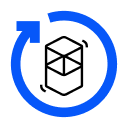
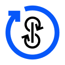
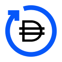
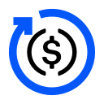
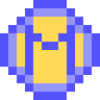

# यर्न के वॉल्ट्स 

९ अगस्त, २०२१  को अपडेट किया गया

## अवलोकन

यर्न के वॉल्ट्स में आपका स्वागत है, जहां आप इस बारे में गहन जानकारी प्राप्त कर सकते हैं कि यर्न के yVaults कैसे काम करते है और इन वाल्टों के कार्यों (रणनीतियों) का प्रदर्शन होता है। यह लेख सभी yVault विवरणों के लिए वन-स्टॉप स्थान बनाए रखेगा। नवीनतम yVaults और रणनीतियों को के साथ दर्शाया गया है: ✨।

नीचे आपको ६ खंड मिलेंगे:

- यर्न और कर्व  🔵🤝🌈
- v2 वॉल्ट्स  🏛️
- v2 कर्व पर चलने वाले वॉल्ट्स  🌈
- v1 कर्व पर चलने वाले वॉल्ट्स 🌈
- v1 वॉल्ट्स 🏦
- सेवानिवृत्त वाल्ट 💤

## यर्न और कर्व 🔵🤝🌈

यर्न के बुनियादी ढांचे के महत्वपूर्ण घटकों में से एक में [कर्व.फाई](http://curve.fi/) के साथ सहयोगात्मक संबंध शामिल हैं। कई यर्न के वॉल्ट कर्व पूल में तरलता प्रदान करते हैं और सीआरवी पुरस्कार अर्जित करते हुए तरलता प्रदाता (एलपी) टोकन को संबंधित गेज में दांव पर लगाते हैं। यर्न लॉक yveCRV-DAO ("बैकस्क्रैचर") में अर्जित सभी CRV पुरस्कारों का १० % CRV की एक अतिरिक्त राशि प्राप्त करने के लिए लॉक करता है। नीचे दिए गए रणनीति विवरण में, बूस्ट किए गए वॉल्ट के साथ दर्शाया गया है।

एक गहरी समझ के लिए, इस दस्तावेज़ के अंत में _अंडरस्टैंडिंग कर्व बूस्ट मल्टीप्लायर्स_ अनुभाग देखें।

इसके अलावा, अर्जित सीआरवी के शेष ९० % को संबंधित एलपी टोकन में बदल दिया जाता है, और तिजोरी में फिर से जमा कर दिया जाता है। एकमात्र अपवाद yvUSDN3Crv वॉल्ट है जो बैकस्क्रैचर वॉल्ट में अर्जित सीआरवी के ५० % को लॉक करता है और शेष ५० % को स्वैप करता है।

### veCRV-DAO yVault ([yveCRV-DAO](https://etherscan.io/address/0xc5bDdf9843308380375a611c18B50Fb9341f502A))

_AKA-Backscratcher_ [📺](https://youtu.be/kJEAe2Rlh70)  
यह वॉल्ट आपके CRV को yveCRV में बदल देता है, जिससे आपको कर्व फीस का एक निरंतर हिस्सा मिलता है, जो कि कर्व पर आपके द्वारा अर्जित की गई कमाई पर बढ़ाया जाता है। जितना अधिक CRV रूपांतरित होगा, आपके साप्ताहिक पुरस्कार उतने ही अधिक होंगे। प्रत्येक शुक्रवार को तिजोरी से 3Crv (वक्र का 3pool LP टोकन) के रूप में इनका दावा किया जा सकता है।

यर्न, स्वयं, इस तिजोरी में अर्जित सभी सीआरवी का १० % जमा करता है और तिजोरी टोकन धारकों को अपना 3crv पुरस्कार देता है, जहां से बूस्टेड साप्ताहिक पुरस्कार आते हैं।

जमा करना अपरिवर्तनीय है: आप केवल CRV को yveCRV में बदल सकते हैं, क्योंकि CRV हमेशा कर्व के वोटिंग एस्क्रो में दांव पर लगा रहता है। सभी वाल्ट बूस्ट स्तरों को बनाए रखने के लिए अर्जित सीआरवी का १० % इस वॉल्ट में भेजते हैं।

## v2 ॉल्ट्स 🏛️

v2 yVaults, v1 yVaults के विपरीत, प्रति तिजोरी (एक साथ २० रणनीतियों तक) कई रणनीतियों को नियोजित करने में सक्षम हैं, जो प्रति तिजोरी केवल एक रणनीति को नियोजित करने में सक्षम हैं। [📺](https://youtu.be/ZES91i-hNAM)

### यर्न कंपाउंडिंग veCRV yVault ([yvBOOST](https://etherscan.io/address/0x9d409a0A012CFbA9B15F6D4B36Ac57A46966Ab9a))

[StrategyYearnVECRV](https://etherscan.io/address/0x2923a58c1831205C854DBEa001809B194FDb3Fa5) [📺](https://youtu.be/Ik6GdGYO_x8)  
यह तिजोरी [yveCRV-DAO](https://etherscan.io/address/0xc5bDdf9843308380375a611c18B50Fb9341f502A) टोकन स्वीकार करती है, जो आपको कर्व की ट्रेडिंग फीस का एक निरंतर हिस्सा प्रदान करती है (जिसका दावा साप्ताहिक [3Crv](https://etherscan.io/address) के रूप में किया जाता है। /0x6c3F90f043a72FA612cbac8115EE7e52BDe6E490), कर्व का 3पूल एलपी टोकन)। पुरस्कारों को काटा जाता है, अधिक yveCRV-DAO के लिए स्वैप किया जाता है (या तो बाजार-खरीद या टकसाल के माध्यम से, जिसके आधार पर फसल के समय सबसे कुशल होता है), और वापस तिजोरी में जमा कर दिया जाता है।

### v2 YFI yVault ([yvYFI](https://etherscan.io/address/0xE14d13d8B3b85aF791b2AADD661cDBd5E6097Db1#readContract))

[StrategyLenderYieldOptimiser](https://etherscan.io/address/0x6a97FC93e39b3f792f1fD6e01565ff412B002D20#code)  
यह रणनीति उपज हासिल करने के लिए क्रीम और आवे जैसे विभिन्न उधार प्लेटफार्मों पर YFI टोकन देती है।

[StrategyMakerYFIDAIDelegate](https://etherscan.io/address/0x4730D10703155Ef4a448B17b0eaf3468fD4fb02d)  
मेकरडीएओ में YFI-A  के माध्यम से मिंट DAI में YFI को लॉक करता है। नवनिर्मित DAI को फिर उपज अर्जित करने के लिए v2 DAI yVault में जमा किया जाता है।

✨ [MakerYFI-DAIv0.4.3Delegate](https://etherscan.io/address/0x7A5D88510cD49E878ADe26E0f08bF374b5eCAF49)  
मेकरडीएओ में YFI-A के माध्यम से मिंट DAI में YFI को लॉक करता है। नवनिर्मित DAI को फिर उपज अर्जित करने के लिए v2 DAI v0.4.3 yVault में जमा किया जाता है।

### v2 SNX yVault ([yvSNX](https://etherscan.io/address/0xF29AE508698bDeF169B89834F76704C3B205aedf#code))

[StrategySynthetixSusdMinter](https://etherscan.io/address/0xc9a62e09834cEdCFF8c136f33d0Ae3406aea66bD)
SNX को सिंथेटिक्स से टकसाल sUSD में दांव पर लगाया। **यह १  वर्ष के लिए दांव पर लगे SNX पर पुरस्कार लॉक करता है**। नवनिर्मित sUSD को फिर उपज अर्जित करने के लिए v2 sUSD yVault में जमा किया जाता है। sUSD से प्रतिफल और साप्ताहिक शुल्क से पुरस्कार और निहित पुरस्कार (जब दावा योग्य हो) को अधिक SNX के लिए स्वैप किया जाता है और तिजोरी में फिर से जमा किया जाता है।

✨ [StrategyUniverseStaking](https://etherscan.io/address/0x29d23b73Dd0ed729F516bb55622765AF102f0e33)  
XYZ कमाने के लिए universe.xyz पर SNX की आपूर्ति करता है। पुरस्कारों को काटा जाता है, अधिक SNX के लिए बेचा जाता है, और तिजोरी में फिर से जमा किया जाता है।

### v2 RAI yVault ([yvRAI](https://etherscan.io/address/0x873fB544277FD7b977B196a826459a69E27eA4ea))

[StrategyIdleidleRAIYield](https://etherscan.io/address/0x5D411D2cde10e138d68517c42bE2808C90c22026) 🚀  
IDLE और RAI अर्जित करने के लिए Idle.finance पर RAI की आपूर्ति करता है। पुरस्कारों को काटा जाता है, अधिक RAI के लिए बेचा जाता है, और तिजोरी में फिर से जमा किया जाता है।

### v2 LINK yVault ([yvLINK](https://etherscan.io/address/0x671a912C10bba0CFA74Cfc2d6Fba9BA1ed9530B2)) [📺](https://youtu.be/LT51QWfAMv8)

[Vesper LINK](https://etherscan.io/address/0x8198815871a45A5a883d083B7B105927eb9919D8)  
आपूर्ति LINK से [वेस्पर फाइनेंस](https://vesper.finance/) लिंक पूल वीएसपी LINK करने के लिए। पुरस्कारों को काटा जाता है, अधिक LINK के लिए बेचा जाता है, और तिजोरी में फिर से जमा किया जाता है।

[AaveLenderLINKBorrowerSUSD](https://etherscan.io/address/0x906f0a6f23e7160eB0927B0903ab80b5E3f3950D)  
ब्याज हासिल करने के लिए AAVE पर LINK उधार देता है और पुरस्कार के रूप में AAVE जमा करता है। साथ ही sUSD उधार लेता है जिसे वह यील्ड के लिए sUSD yVault में जमा करता है। निहित AAVE और yvSUSD के पुरस्कारों को काटा जाता है, अधिक LINK के लिए बेचा जाता है, और तिजोरी में फिर से जमा किया जाता है।

[StrategyMakerLINKDAIDelegate](https://etherscan.io/address/0x136fe75bfDf142a917C954F58577DB04ef6F294B)  
मेकरडाओ में LINK को LINK-A से मिंट DAI तक लॉक करता है। नवनिर्मित DAI को फिर उपज अर्जित करने के लिए v2 DAI yVault में जमा किया जाता है।

✨ [StrategyUniverseStaking](https://etherscan.io/address/0xa2a182C5B5Ea1A3c90Cb5Bb718F9e62DBE052927)  
XYZ कमाने के लिए universe.xyz पर आपूर्ति LINK की। पुरस्कारों को काटा जाता है, अधिक LINK के लिए बेचा जाता है, और तिजोरी में फिर से जमा किया जाता है।

### v2 sUSD yVault ([yvsUSD](https://etherscan.io/address/0xa5cA62D95D24A4a350983D5B8ac4EB8638887396#code))

[StrategyLenderYieldOptimiser](https://etherscan.io/address/0x215DeE632335829155Dcb62452c4878C48c1C884)  
ब्याज हासिल करने के लिए AAVE और क्रीम पर sUSD उधार देता है और पुरस्कार के रूप में AAVE जमा करता है। जब दांव पर लगा AAVE अनलॉक करता है तो AAVE काटा जाएगा, अधिक sUSD के लिए बेचा जाएगा, और तिजोरी में फिर से जमा किया जाएगा।

[SingleSidedCrvsUSD](https://etherscan.io/address/0x74b3E5408B1c29E571BbFCd94B09D516A4d81f36) 🚀  
Curve.fi पर SAAVE कर्व पूल में sUSD जमा करता है। पुरस्कारों को काटा जाता है, अधिक sUSD में बेचा जाता है, और तिजोरी में फिर से जमा किया जाता है।

[SingleSidedCrvsUSD](https://etherscan.io/address/0x95eA1643699F8DE347975F31CA8d03eCC507616c) 🚀  
curve.fi पर SUSDv2 कर्व पूल में sUSD जमा करता है। पुरस्कारों को काटा जाता है, अधिक sUSD में बेचा जाता है, और तिजोरी में फिर से जमा किया जाता है।

### v2 1INCH yVault ([yv1INCH](https://etherscan.io/address/0xB8C3B7A2A618C552C23B1E4701109a9E756Bab67))

[StrategyLenderYieldOptimiser](https://etherscan.io/address/0x86eD4F77d40182b8686a25e125FB3f5a04203CaA)  
C.R.E.A.M पर 1INCH टोकन उधार देता है। ब्याज हासिल करने के लिए।

[Strategy1INCHGovernance](https://etherscan.io/address/0xB12F6A5776EDd2e923fD1Ce93041B2000A22dDc7)  
शासन पुरस्कार प्राप्त करने के लिए 1INCH DAO पर 1INCH टोकन दांव पर लगाता है। पुरस्कारों को काटा जाता है और वापस तिजोरी में जमा किया जाता है।

### v2 WETH yVault ([yvWETH](https://etherscan.io/address/0xa258C4606Ca8206D8aA700cE2143D7db854D168c))

_जमा किए गए किसी भी ETH को WETH में लपेटा जाता है और फिर जमा किया जाता है_

[StrategyLenderYieldOptimiser](https://etherscan.io/address/0xec2DB4A1Ad431CC3b102059FA91Ba643620F0826)  
ब्याज हासिल करने के लिए अल्फा होमोरा पर WETH उधार देता है।

[StrategysteCurveWETHSingleSided](https://etherscan.io/address/0xC5e385f7Dad49F230AbD53e21b06aA0fE8dA782D) 🚀  
[steCRV](https://etherscan.io/address/0x06325440D014e39736583c165C2963BA99fAf14E) टोकन प्राप्त करने के लिए कर्व [यहां](https://www.curve.fi/steth/deposit) पर लिक्विडिटी पूल में WETH की आपूर्ति करता है, जिसे बाद में इसमें डालता है। उपज हासिल करने के लिए v2 कर्व stETH पूल yVault ([yvsteCRV](https://etherscan.io/address/0xdcd90c7f6324cfa40d7169ef80b12031770b4325))।

[StrategyeCurveWETHSingleSided](https://etherscan.io/address/0x37770F958447fFa1571fc9624BFB3d673161f37F) 🚀  
[eCRV](https://etherscan.io/address/0xA3D87FffcE63B53E0d54fAa1cc983B7eB0b74A9c) टोकन प्राप्त करने के लिए कर्व [यहां](https://curve.fi/seth/deposit) पर लिक्विडिटी पूल में WETH की आपूर्ति करता है, जिसे वह फिर v2 में डालता है। उपज हासिल करने के लिए वक्र SETH पूल yVault ([yveCRV](https://etherscan.io/address/0x986b4AFF588a109c09B50A03f42E4110E29D353F))।

[AaveWETHLenderUSDTBorrower](https://etherscan.io/address/0xd28b508EA08f14A473a5F332631eA1972cFd7cC0)  
ब्याज हासिल करने के लिए AAVE पर WETH को उधार देता है और पुरस्कार के रूप में स्टॉकेड AAVE को जमा करता है। साथ ही USDT उधार लेता है जिसे वह फिर उपज के लिए USDT yVault में जमा करता है। स्टॉकेड AAVE और yvUSDT के पुरस्कारों को काटा जाता है, अधिक WETH के लिए बेचा जाता है, और तिजोरी में फिर से जमा किया जाता है।

[StrategyGenericLevCompFarmWeth](https://hackmd.io/zucTisw_RUOQCWFpZYfksg?view)  
कंपाउंड पर ETH की आपूर्ति करता है और COMP आय को अधिकतम करने के लिए ETH की एक अतिरिक्त राशि उधार लेता है। अतिरिक्त उत्तोलन प्राप्त करने और APY को बढ़ावा देने के लिए dYdX से अतिरिक्त ETH प्राप्त करने के लिए फ़्लैशलोन का उपयोग किया जाता है। अर्जित COMP को अधिक ETH के लिए काटा और बेचा जाता है और तिजोरी में फिर से जमा किया जाता है।

### v2 USDC yVault ([yvUSDC](https://etherscan.io/address/0x5f18c75abdae578b483e5f43f12a39cf75b973a9))

[StrategyIdleUSDCYield](https://etherscan.io/address/0x414D8F5c21dAF33105eE6416bcdA99a50A47C0e5#code) [📺](https://youtu.be/BcxWAVdXx_U)  
COMP और IDLE कमाने के लिए Idle.finance पर USDC की आपूर्ति करता है। पुरस्कारों को काटा जाता है, अधिक यूएसडीसी के लिए बेचा जाता है, और तिजोरी में फिर से जमा किया जाता है।

[StrategyAH2EarncyUSDC](https://etherscan.io/address/0x86Aa49bf28d03B1A4aBEb83872cFC13c89eB4beD#code)  
ब्याज उत्पन्न करने के लिए अल्फा होमोरा v2 पर USDC उधार देता है।

[StrategyGenericLevCompFarm](https://etherscan.io/address/0x4d7d4485fd600c61d840ccbec328bfd76a050f87) [📺](https://www.youtu.be/jorporcLnCo&t)  
कंपाउंड पर USDC की आपूर्ति करता है और COMP आय को अधिकतम करने के लिए USDC की एक अतिरिक्त राशि उधार लेता है। अतिरिक्त उत्तोलन प्राप्त करने और APY को बढ़ावा देने के लिए dYdX से अतिरिक्त USDC प्राप्त करने के लिए फ़्लैशलोन का उपयोग किया जाता है। अर्जित COMP को अधिक USDC के लिए काटा और बेचा जाता है और तिजोरी में फिर से जमा किया जाता है।

[SingleSidedCrvUSDC](https://etherscan.io/address/0x80af28cb1e44C44662F144475d7667C9C0aaB3C3) 🚀  
USDC को [curve.fi](http://curve.fi/) पर एक USDC कर्व पूल में जमा करता है, और सबसे अधिक लाभदायक कर्व पूल में बदल जाता है।

[PoolTogether USD Coin](https://etherscan.io/address/0x387fCa8d7e2e09655b4F49548607B55C0580fC63)  
POOL अर्जित करने के लिए [PoolTogether] (https://pooltogether.com/) प्रोटोकॉल के लिए USDC की आपूर्ति करता है। पुरस्कारों को काटा जाता है, अधिक USDC के लिए बेचा जाता है, और वापस तिजोरी में जमा किया जाता है। यदि इसे सप्ताह का पुरस्कार मिलता है तो इसे भी तिजोरी में जोड़ दिया जाएगा।

[StrategyRook USD Coin](https://etherscan.io/address/0x4140F350c1B67184fE3AaEa314d8C967F99EE8Cc)  
ROOK कमाने के लिए कीपरडाओ को USDC की आपूर्ति करता है। पुरस्कारों को काटा जाता है, अधिक USDC के लिए बेचा जाता है, और वापस तिजोरी में जमा किया जाता है।

### v2 DAI yVault ([yvDAI](https://etherscan.io/address/0xdA816459F1AB5631232FE5e97a05BBBb94970c95))

[StrategyLenderYieldOptimiser](https://hackmd.io/zucTisw_RUOQCWFpZYfksg?view)  
ब्याज हासिल करने के लिए AAVE पर DAI  को उधार देता है और पुरस्कार के रूप में AAVE जमा करता है। जब दांव पर लगा AAVE अनलॉक करता है तो AAVE  काटा जाएगा, अधिक DAI के लिए बेचा जाएगा, और तिजोरी में फिर से जमा किया जाएगा।

[StrategyKashiMultiPairLender](https://hackmd.io/zucTisw_RUOQCWFpZYfksg?view)  
ब्याज हासिल करने के लिए काशी के रास्ते सुशी पर DAI उधार देता है। पुरस्कारों को काटा जाता है, अधिक DAI के लिए बेचा जाता है, और वापस तिजोरी में जमा किया जाता है।

[StrategyGenericLevCompFarm](https://hackmd.io/zucTisw_RUOQCWFpZYfksg?view)  
कम्पाउंड पर DAI की आपूर्ति करता है और COMP आय को अधिकतम करने के लिए DAI की अतिरिक्त राशि उधार लेता है। अतिरिक्त उत्तोलन प्राप्त करने और APY को बढ़ावा देने के लिए dYdX से अतिरिक्त DAI प्राप्त करने के लिए फ़्लैश लोन का उपयोग किया जाता है। अर्जित COMP को अधिक DAI के लिए काटा और बेचा जाता है और तिजोरी में फिर से जमा किया जाता है।

✨ [ssc dai ib](https://etherscan.io/address/0xa6D1C610B3000F143c18c75D84BaA0eC22681185)  
DAI को [curve.fi](http://curve.fi/) पर आयरन बैंक कर्व पूल में जमा करता है। पुरस्कारों को काटा जाता है, अधिक DAI के लिए बेचा जाता है, और तिजोरी में फिर से जमा किया जाता है।

### v2 WBTC yVault ([yvWBTC](https://etherscan.io/address/0xA696a63cc78DfFa1a63E9E50587C197387FF6C7E))

[StrategyMakerWBTCDAIDelegate](https://etherscan.io/address/0x04A508664B053E0A08d5386303E649925CBF763c)  
WBTC-A के माध्यम से मेकरडीएओ में wBTC को लॉक करके DAI मिंट करता है। यह नवनिर्मित DAI तब v2 DAI yVault में जमा किया जाता है।

[SingleSidedCrvWBTC](https://etherscan.io/address/0x40b04B3ed9845B8Be200Aa2D9C3eDC2bE0a5f01f) 🚀  
[curve.fi](https://hackmd.io/zucTisw_RUOQCWFpZYfksg?view) पर एक BTC कर्व पूल में wBTC जमा करता है और सबसे लाभदायक कर्व पूल में बदल जाता है।

[yvWBTCStratMMV1](https://etherscan.io/address/0x53a65c8e238915c79a1e5C366Bc133162DBeE34f)  
[मशरूम फाइनेंस](https://mushrooms.finance/) wBTC वॉल्ट को wBTC की आपूर्ति करता है और फिर MM कमाने के लिए wBTC फ़ार्म को आपूर्ति करता है। MM को काटा जाता है, अधिक wBTC पर बेचा जाता है, और तिजोरी में फिर से जमा किया जाता है।

[Vesper Wrapped BTC](https://etherscan.io/address/0x416647Ddee169156878DC46CD565dee99413c262)  
VSP अर्जित करने के लिए [वेस्पर फाइनेंस](https://vesper.finance/) vWBTC पूल को WBTC की आपूर्ति करता है। पुरस्कारों को काटा जाता है, अधिक wBTC के लिए बेचा जाता है, और तिजोरी में फिर से जमा किया जाता है।

✨ [ssc wbtc bbtc](https://etherscan.io/address/0x4b254EbBbb8FDb9D3E848501784692b2726b310c)  
WBTC को [curve.fi](http://curve.fi/) पर BBTC कर्व पूल में जमा करता है। पुरस्कारों को काटा जाता है, अधिक WBTC के लिए बेचा जाता है, और तिजोरी में फिर से जमा किया जाता है।

✨ [ssc wbtc pbtc](https://etherscan.io/address/0x29367915508e47c631d220caEbA855901c13a3dE)  
[curve.fi](http://curve.fi/) पर WBTC को PBTC कर्व पूल में जमा करता है। पुरस्कारों को काटा जाता है, अधिक WBTC के लिए बेचा जाता है, और तिजोरी में फिर से जमा किया जाता है।

✨ [ssc wbtc obtc](https://etherscan.io/address/0x64B2a32f030D9210E51ed8884C0D58b89137Ca81)  
WBTC को [curve.fi](http://curve.fi/) पर OBTC कर्व पूल में जमा करता है। पुरस्कारों को काटा जाता है, अधिक WBTC के लिए बेचा जाता है, और तिजोरी में फिर से जमा किया जाता है।

✨ [Strategy-Levered-AAVE-wBTC](https://etherscan.io/address/0xDD387F2fe0D9B1E5768fc941e7E48AA8BfAf5e41)  
WBTC उधार पर वांछित उत्तोलन प्राप्त करने के लिए AAVE V2 पर संपार्श्विक के रूप में WBTC की आपूर्ति करता है, जिसके खिलाफ उधार लिया जाता है और कुछ लूपों में पुन: आपूर्ति की जाती है।

### v2 USDT yVault ([yvUSDT](https://etherscan.io/token/0x7Da96a3891Add058AdA2E826306D812C638D87a7))

[StrategyLenderYieldOptimiser](https://etherscan.io/address/0x2f87c5e8396F0C41b86aad4F3C8358aB21681952)  
ब्याज हासिल करने के लिए AAVE पर USDT उधार देता है।

[StrategyAH2EarncyUSDT](https://etherscan.io/address/0x82292B8035873d7DD8a96767F6b3F885564aa919)  
ब्याज उत्पन्न करने के लिए अल्फा होमोरा v2 पर USDT उधार देता है।

[StrategyIdleUSDTYield](https://etherscan.io/address/0x01b54c320d6B3057377cbc71d953d1BBa84df44e)  
COMP और IDLE कमाने के लिए इडली फिनने पर USDT की आपूर्ति करता है। पुरस्कारों को काटा जाता है, अधिक USDT के लिए बेचा जाता है, और वापस तिजोरी में जमा किया जाता है।

[SingleSidedCrvUSDT](https://etherscan.io/address/0xf840d061E83025F4cD6610AE5DDebCcA43327f9f) 🚀  
USDT को [curve.fi](http://curve.fi/) पर एक USDT कर्व पूल में जमा करता है, और सबसे अधिक लाभदायक कर्व पूल में बदल जाता है।

### v2 UNI yVault ([yvUNI](https://etherscan.io/address/0xFBEB78a723b8087fD2ea7Ef1afEc93d35E8Bed42))

[StrategyLenderYieldOptimiser](https://etherscan.io/address/0x5e882c9f00209315e049B885B9b3dfbEe60D80A4)  
ब्याज हासिल करने के लिए AAVE पर UNI को उधार देता है और पुरस्कार के रूप में AAVE जमा करता है। जब दांव पर लगा AAVE अनलॉक करता है तो AAVE काटा जाएगा, अधिक UNI के लिए बेचा जाएगा, और तिजोरी में फिर से जमा किया जाएगा।

[PoolTogether Uniswap](https://etherscan.io/address/0x6EB00860260CF51623737e17579Db797d71cd337)  
POOL कमाने के लिए UNI को [PoolTogether](https://pooltogether.com/) प्रोटोकॉल की आपूर्ति करता है। पुरस्कारों को काटा जाता है, अधिक UNI के लिए बेचा जाता है, और वापस तिजोरी में जमा कर दिया जाता है। यदि इसे सप्ताह का पुरस्कार मिलता है तो इसे भी तिजोरी में जोड़ दिया जाएगा।

[StrategyMakerUNIDAIDelegate](https://etherscan.io/address/0x9Ae0B9a67cF5D603847980D95Ad4D45b57Ff7783)  
मेकरडाओ  में UNI-A के माध्यम से टकसाल DAI के लिए UNI को लॉक करता है। यह नवनिर्मित DAI तब v2 DAI yVault में जमा किया जाता है।

## v2 कर्व पर चलने वाले वॉल्ट्स 🌈

v2 कर्व yVaults कर्व फाइनेंस पर लिक्विडिटी पूल प्रदान करके प्राप्त लिक्विडिटी पूल टोकन की जमा राशि स्वीकार करते हैं। इन वाल्टों में प्रवेश करने के लिए आपको अंतर्निहित परिसंपत्ति (संपत्तियों) को कर्व फाइनेंस पर उनके संबंधित पूल में जमा करना होगा। [📺](https://youtu.be/V47NzWeZjjk)

### ✨ Curve 3Crypto Pool yVault ([yvCurve-3Crypto](https://etherscan.io/address/0xE537B5cc158EB71037D4125BDD7538421981E6AA))

_हालांकि यह तिजोरी अस्थायी नुकसान के अधीन नहीं है, अंतर्निहित वक्र पूल निकासी पर अस्थायी नुकसान उठा सकता है, सावधानी बरतें।_

✨ [Curvecrv3cryptoVoterProxy](https://etherscan.io/address/0xbA9052141cEf06FD55733D23231c37Fc856CE6F4) 🚀  
यह तिजोरी [crv3crypto](https://etherscan.io/address/0xc4AD29ba4B3c580e6D59105FFf484999997675Ff) टोकन की जमा राशि स्वीकार करती है, जो वक्र पर तरलता पूल में BTC, ETH, या USDT की आपूर्ति करके प्राप्त की जाती है [यहां](https://curve.fi/ tricrypto2/जमा) crv3crypto टोकन के बदले में। crv3crypto को CRV पुरस्कार अर्जित करने के लिए curve.fi पर गेज में रखा गया है। अंतर्निहित परिसंपत्तियों में से एक के लिए पुरस्कारों की अदला-बदली की जाती है और अधिक crv3crypto प्राप्त करने के लिए तरलता पूल में पुन: आपूर्ति की जाती है।

### v2 Curve mUSD Pool yVault ([yvCurve-mUSD](https://etherscan.io/address/0x8cc94ccd0f3841a468184aCA3Cc478D2148E1757#code))

[Curvemusd3CRVVoterProxy](https://etherscan.io/address/0xf9fF7f463A7e6f43d4E65c230D3743355fC954e4) 🚀  
यह वॉल्ट कर्व पर लिक्विडिटी पूल [यहां]( https://www.curve.fi/musd/deposit)। musd3CRV टोकन CRV पुरस्कार अर्जित करने के लिए कर्व पर गेज में दांव पर लगे हैं। अंतर्निहित परिसंपत्तियों में से एक के लिए पुरस्कारों की अदला-बदली की जाती है और अधिक musd3CRV प्राप्त करने के लिए तरलता पूल में पुन: आपूर्ति की जाती है।

[Convexmusd3CRV](https://etherscan.io/address/0x75be6ABC02a010559Ed5c7b0Eab94abD2B783b65) 🚀  
CRV और CVX अर्जित करने के लिए Convex Finance को musd3CRV की आपूर्ति करता है। पुरस्कारों को काटा जाता है, अधिक musd3CRV के लिए बेचा जाता है, और वापस तिजोरी में जमा किया जाता है।

### v2 Huobi BTC Curve yVault ([yvhCRV](https://etherscan.io/address/0x625b7DF2fa8aBe21B0A976736CDa4775523aeD1E))

[CurvehCRVVoterProxy](https://etherscan.io/address/0x91cBf0014a966615e1050c90A1aBf1d1d5d8cffd)🚀  
यह तिजोरी [hCRV](https://etherscan.io/address/0xb19059ebb43466C323583928285a49f558E572Fd) टोकन की जमा राशि स्वीकार करती है, जो कर्व पर तरलता पूल में hBTC या wBTC की आपूर्ति करके प्राप्त की जाती है [यहां](https://curve.fi/hbtc/deposit) ) hCRV टोकन के बदले में। hCRV CRV पुरस्कार अर्जित करने के लिए कर्व.फाइनेंस पर गेज में दांव पर लगाया जाता है। अंतर्निहित परिसंपत्तियों में से एक के लिए पुरस्कारों की अदला-बदली की जाती है और अधिक hCRV प्राप्त करने के लिए चलनिधि पूल में पुन: आपूर्ति की जाती है।

[ConvexhCRV](https://etherscan.io/address/0x7Ed0d52C5944C7BF92feDC87FEC49D474ee133ce) 🚀  
CRV और फार्म CVX अर्जित करने के लिए कॉन्वेक्स फाइनांस को hCRV की आपूर्ति करता है। पुरस्कारों को काटा जाता है, अधिक hCRV के लिए बेचा जाता है, और वापस तिजोरी में जमा किया जाता है।

### v2 Curve USDK Pool yVault ([yvCurve-USDK](https://etherscan.io/address/0x3D27705c64213A5DcD9D26880c1BcFa72d5b6B0E))

[Curveusdk3CRVVoterProxy](https://etherscan.io/address/0x096E2F730c6AB7a048de7d27507E5E4e864c6824)🚀  
यह तिजोरी [usdk3CRV](https://etherscan.io/address/0x97E2768e8E73511cA874545DC5Ff8067eB19B787) की जमा राशि स्वीकार करती है, जो कर्व पर तरलता पूल में DAI, USDC, USDT (या उनके लिपटे संस्करण: 3crv), या USDK की आपूर्ति करके प्राप्त की जाती है [यहां ](https://curve.fi/usdk/deposit) usdk3CRV टोकन के बदले। usdk3CRV CRV पुरस्कार अर्जित करने के लिए कर्व.फाइनेंस पर गेज में दांव पर लगे हैं। अंतर्निहित परिसंपत्तियों में से एक के लिए पुरस्कारों की अदला-बदली की जाती है और अधिक usdk3CRV प्राप्त करने के लिए चलनिधि पूल में पुन: आपूर्ति की जाती है।

[Convexusdk3CRV](https://hackmd.io/zucTisw_RUOQCWFpZYfksg?view) 🚀  
CRV और CVX अर्जित करने के लिए [Convex Finance](https://www.convexfinance.com/stake) को usdk3CRV की आपूर्ति करता है। अर्जित टोकन काटा जाता है, और अधिक usdk3CRV के लिए बेचा जाता है जिसे वापस रणनीति में जमा किया जाता है।

### v2 Curve Pax Pool yVault ([yvCurve-Pax](https://etherscan.io/address/0x80bbeE2fa460dA291e796B9045e93d19eF948C6A))

[CurveypaxCrvVoterProxy](https://etherscan.io/address/0x60A335509E75175E0fF785091f1Baf979148A290)🚀  
यह तिजोरी [ypaxCrv](https://etherscan.io/address/0xD905e2eaeBe188fc92179b635807D8bd91Db0D8) की जमाराशियों को स्वीकार करती है, जो DAI, USDC, USDT (या उनके आयरनबैंक के लिपटे संस्करण: ycDAI, ycUSDC, या ycUSDT को लिक्विडिटी में आपूर्ति करके प्राप्त किए गए हैं) ypaxCrv टोकन के बदले में कर्व पर पूल [यहां](https://curve.fi/pax/deposit)। CRV पुरस्कार अर्जित करने के लिए ypaxCrv को कर्व.फाइनेंस पर गेज में दांव पर लगाया जाता है। अंतर्निहित परिसंपत्तियों में से एक के लिए पुरस्कारों की अदला-बदली की जाती है और अधिक ypaxCrv प्राप्त करने के लिए तरलता पूल में पुन: आपूर्ति की जाती है।

[ConvexypaxCrv](https://hackmd.io/zucTisw_RUOQCWFpZYfksg?view) 🚀  
CRV और CVX कमाने के लिए ypaxCrv को [Convex Finance](https://www.convexfinance.com/stake) को सप्लाई करता है। अर्जित टोकन काटा जाता है, और अधिक ypaxCrv के लिए बेचा जाता है जिसे वापस रणनीति में जमा किया जाता है।

### v2 Curve RSV Pool yVault ([yvCurve-RSV](https://etherscan.io/address/0xC116dF49c02c5fD147DE25Baa105322ebF26Bd97))

[Curversv3CRVVoterProxy](https://etherscan.io/address/0x57D2E2eD281650A5d987E6ef87BC1BeD4fD0E959)🚀  
यह तिजोरी [rsv3CRV](https://etherscan.io/address/0xC2Ee6b0334C261ED60C72f6054450b61B8f18E35) टोकन की जमा राशि स्वीकार करती है, जो कर्व पर तरलता पूल में DAI, USDC, USDT (या उनके लिपटे संस्करण: 3crv), या RSV की आपूर्ति करके प्राप्त की जाती है [यहां ](https://curve.fi/rsv/deposit) rsv3CRV टोकन के बदले। rsv3CRV CRV और RSR पुरस्कार अर्जित करने के लिए कर्व.फाइनेंस पर गेज में दांव पर लगे हैं। अंतर्निहित परिसंपत्तियों में से एक के लिए पुरस्कारों की अदला-बदली की जाती है और अधिक rsv3CRV प्राप्त करने के लिए चलनिधि पूल में पुन: आपूर्ति की जाती है।

[Convexrsv3CRV](https://hackmd.io/zucTisw_RUOQCWFpZYfksg?view) 🚀  
CRV और CVX अर्जित करने के लिए [Convex Finance](https://www.convexfinance.com/stake) को rsv3CRV की आपूर्ति करता है। अर्जित टोकन काटा जाता है, अधिक rsv3CRV के लिए बेचा जाता है जिसे वापस रणनीति में जमा किया जाता है।

### v2 Curve USDT Pool yVault ([yvCurve-USDT](https://etherscan.io/address/0x28a5b95C101df3Ded0C0d9074DB80C438774B6a9))

[CurvecDAI+cUSDC+USDTVoterProxy](https://etherscan.io/address/0x5Fa22A8527Ae20f4ed8Ed3E0a6A5359Ad5EA3A4e)🚀  
यह तिजोरी [tCrv](https://etherscan.io/address/0x9fC689CCaDa600B6DF723D9E47D84d76664a1F23) की जमा राशि स्वीकार करती है, जो कर्व  पर तरलता पूल में DAI, USDC (या उनके लिपटे कंपाउंड संस्करण: cDAI, cUSDC), या USDT की आपूर्ति करके प्राप्त की जाती है [ यहाँ](https://curve.fi/usdt/deposit) tCrv टोकन के बदले। CRV पुरस्कार अर्जित करने के लिए tCrv को कर्व.फाइनेंस पर गेज में दांव पर लगाया जाता है। अंतर्निहित परिसंपत्तियों में से एक के लिए पुरस्कारों की अदला-बदली की जाती है और अधिक tCrv प्राप्त करने के लिए तरलता पूल में पुन: आपूर्ति की जाती है।

[ConvexcDAI+cUSDC+USDT](https://hackmd.io/zucTisw_RUOQCWFpZYfksg?view) 🚀  
CRV और CVX अर्जित करने के लिए [Convex Finance](https://www.convexfinance.com/stake) को tCrv की आपूर्ति करता है। अर्जित टोकन काटा जाता है, अधिक tCrv के लिए बेचा जाता है जिसे वापस रणनीति में जमा किया जाता है।

### v2 Curve triCrypto Pool yVault ([yvCurve-triCrypto](https://etherscan.io/address/0x3D980E50508CFd41a13837A60149927a11c03731))

_हालांकि यह तिजोरी अस्थायी नुकसान के अधीन नहीं है, अंतर्निहित कर्व पूल निकासी पर अस्थायी नुकसान उठा सकता है, सावधानी बरतें।_

[CurvecrvTricryptoVoterProxy](https://etherscan.io/address/0xb9267f1427Ddb937003b9cA0Ca7716DDa4026D19) 🚀  
यह तिजोरी [crvTricrypto](https://etherscan.io/address/0xcA3d75aC011BF5aD07a98d02f18225F9bD9A6BDF) टोकन की जमा राशि स्वीकार करती है, जो कर्व पर लिक्विडिटी पूल में USDT, wBTC, या ETH की आपूर्ति करके प्राप्त की जाती है। tricrypto/जमा) crvTricrypto टोकन के बदले में। crvTricrypto को CRV पुरस्कार अर्जित करने के लिए कर्व.फाइनेंस पर गेज में दांव पर लगाया जाता है। अंतर्निहित परिसंपत्तियों में से एक के लिए पुरस्कारों की अदला-बदली की जाती है और अधिक crvTricrypto प्राप्त करने के लिए तरलता पूल में पुन: आपूर्ति की जाती है।

[ConvexcrvTricrypto](https://hackmd.io/zucTisw_RUOQCWFpZYfksg?view) 🚀  
CRV और CVX अर्जित करने के लिए [Convex Finance](https://www.convexfinance.com/stake) को crvTricrypto की आपूर्ति करता है। अर्जित टोकन काटा जाता है, अधिक crvTricrypto के लिए बेचा जाता है जिसे वापस रणनीति में जमा किया जाता है।

### v2 Curve EURS Pool yVault ([yvCurve-EURS](https://etherscan.io/address/0x25212Df29073FfFA7A67399AcEfC2dd75a831A1A))

[CurveeursCRVVoterProxy](https://etherscan.io/address/0x53cE22d5b4F667eC73710d428E828Cd96E9a37C9) 🚀  
यह तिजोरी [eursCRV](https://etherscan.io/address/0x194eBd173F6cDacE046C53eACcE9B953F28411d1) टोकन की जमा राशि स्वीकार करती है, जो कर्व पर तरलता पूल में EUR या sEUR की आपूर्ति करते हैं [यहां](https://www.curve.fi/eurs/ जमा)। CRV पुरस्कार अर्जित करने के लिए eursCRV टोकन को कर्व पर गेज में दांव पर लगाया जाता है। अंतर्निहित परिसंपत्तियों में से एक के लिए पुरस्कारों की अदला-बदली की जाती है और अधिक eursCRV प्राप्त करने के लिए चलनिधि पूल में पुन: आपूर्ति की जाती है।

[ConvexeursCRV](https://etherscan.io/address/0x4DC2CCC9E76bD30982243C1cB915003e17a88Eb9) 🚀  
CRV और CVX अर्जित करने के लिए कोन्वेक्स फाइनेंस को eursCRV की आपूर्ति करता है। पुरस्कारों को काटा जाता है, अधिक eursCRV में बेचा जाता है, और वापस तिजोरी में जमा कर दिया जाता है।

### v2 Curve sUSD Pool yVault ([yvCurve-sUSD](https://etherscan.io/address/0x5a770DbD3Ee6bAF2802D29a901Ef11501C44797A))

[CurvecrvPlain3andSUSDVoterProxy](https://etherscan.io/address/0x9730F52AB5BcEc960bE41b0fE4913a09c0B57066) 🚀  
यह तिजोरी [sCrv](https://etherscan.io/address/0xC25a3A3b969415c80451098fa907EC722572917F) की जमा राशि स्वीकार करती है, जो कर्व  पर तरलता पूल में sUSD, DAI, USDC या USDT की आपूर्ति करके प्राप्त की जाती है [यहां](https://www.curve) .fi/susdv2/जमा)। CRV और SNX पुरस्कार अर्जित करने के लिए कर्व पर गेज में sCRV टोकन लगाए जाते हैं। अंतर्निहित परिसंपत्तियों में से एक के लिए पुरस्कारों की अदला-बदली की जाती है और अधिक sCRV प्राप्त करने के लिए चलनिधि पूल में पुन: आपूर्ति की जाती है।

[ConvexcrvPlain3andSUSD](https://etherscan.io/address/0xFA773b91b59B0895877c769000b9824b46b13a20) 🚀  
CRV और CVX अर्जित करने के लिए कॉन्वेक्स फाइनेंस को sCRV की आपूर्ति करता है। पुरस्कारों को काटा जाता है, अधिक sCRV के लिए बेचा जाता है, और वापस तिजोरी में जमा किया जाता है।

### v2 Curve AAVE Pool yVault ([yvCurve-Aave](https://etherscan.io/address/0x39CAF13a104FF567f71fd2A4c68C026FDB6E740B))

[Curvea3CRVVoterProxy](https://etherscan.io/address/0xB11FC91DF59ADc604485f1B25ABa1F96A685473f) 🚀  
यह तिजोरी [a3CRV](https://etherscan.io/address/0xFd2a8fA60Abd58Efe3EeE34dd494cD491dC14900) टोकन की जमा स्वीकार करती है, जो कर्व पर तरलता पूल में DAI, USDC, या USDT (या उनके लिपटे aTokens) की आपूर्ति करके प्राप्त की जाती है [यहां](https: //curve.fi/aave/deposit)। a3CRV टोकन CRV पुरस्कार अर्जित करने के लिए कर्व पर गेज में दांव पर लगे हैं। अंतर्निहित परिसंपत्तियों में से एक के लिए पुरस्कारों की अदला-बदली की जाती है और अधिक a3CRV प्राप्त करने के लिए चलनिधि पूल में पुन: आपूर्ति की जाती है।

[Convexa3CRV](https://etherscan.io/address/0xAC4AE0B06C913dF4608dB60E2571a8e91b74C619) 🚀  
CRV और CVX अर्जित करने के लिए Convex Finance को a3CRV की आपूर्ति करता है। पुरस्कारों को काटा जाता है, अधिक a3CRV में बेचा जाता है, और वापस तिजोरी में जमा किया जाता है।

### v2 Curve HUSD Pool yVault ([yvCurve-HUSD](https://etherscan.io/address/0x054AF22E1519b020516D72D749221c24756385C9))

[Curvehusd3CRVVoterProxy](https://etherscan.io/address/0x5ED527A2cfC5411EB63b12E46e270b07b6813824) 🚀  
यह तिजोरी [husd3CRV](https://etherscan.io/address/0x5B5CFE992AdAC0C9D48E05854B2d91C73a003858) की जमा राशि स्वीकार करती है, जो कर्व पर तरलता पूल में DAI, USDC, USDT (या उनके लिपटे संस्करण: 3crv), या HUSD की आपूर्ति करके प्राप्त की जाती है [यहां ](https://www.curve.fi/husd/deposit)। husd3CRV टोकन CRV पुरस्कार अर्जित करने के लिए कर्व पर गेज में दांव पर लगे हैं। अंतर्निहित परिसंपत्तियों में से एक के लिए पुरस्कारों की अदला-बदली की जाती है और अधिक husd3CRV प्राप्त करने के लिए चलनिधि पूल में पुन: आपूर्ति की जाती है।

[Convexhusd3CRV](https://etherscan.io/address/0xdC929e76081a78e5c32552C2e79D29ECab3F6755) 🚀  
CRV और CVX अर्जित करने के लिए Convex Finance को husd3CRV की आपूर्ति करता है। पुरस्कारों को काटा जाता है, अधिक husd3CRV में बेचा जाता है, और वापस तिजोरी में जमा कर दिया जाता है।

### v2 Curve USDN Pool yVault ([yvCurve-USDN](https://etherscan.io/address/0x3B96d491f067912D18563d56858Ba7d6EC67a6fa))

[Curveusdn3CRVVoterProxy](https://etherscan.io/address/0x23a09D84e50fF3fDFa270308851443734b0a4b6D) 🚀  
यह तिजोरी [usdn3CRV](https://etherscan.io/address/0x4f3E8F405CF5aFC05D68142F3783bDfE13811522) की जमा राशि स्वीकार करती है, जो कर्व पर तरलता पूल में DAI, USDC, USDT (या उनके लिपटे संस्करण: 3crv), या USDN की आपूर्ति करके प्राप्त की जाती है [यहां ](https://curve.fi/usdn/deposit)। usdn3CRV टोकन CRV पुरस्कार अर्जित करने के लिए कर्व पर गेज में दांव पर लगे हैं। अंतर्निहित परिसंपत्तियों में से एक के लिए पुरस्कारों की अदला-बदली की जाती है और अधिक usdn3CRV प्राप्त करने के लिए चलनिधि पूल में पुन: आपूर्ति की जाती है।

[Convexusdn3CRV](https://etherscan.io/address/0x8e87e65Cb28c069550012f92d5470dB6EB6897c0) 🚀  
CRV और CVX अर्जित करने के लिए कॉन्वेक्स फाइनेंस को usdn3CRV की आपूर्ति करता है। पुरस्कारों को काटा जाता है, अधिक usdn3CRV में बेचा जाता है, और वापस तिजोरी में जमा कर दिया जाता है।

### v2 Curve rETH Pool yVault ([yvCurve-rETH](https://etherscan.io/address/0xBfedbcbe27171C418CDabC2477042554b1904857))

[CurverCRVVoterProxy](https://etherscan.io/address/0x16468a3999d931Dd6b6ffA0086Cf195D6C5BDAFA) 🚀  
यह तिजोरी [rCRV](https://etherscan.io/address/0x53a901d48795C58f485cBB38df08FA96a24669D5) की जमा राशि स्वीकार करती है, जो कर्व पर तरलता पूल में ETH या rETH की आपूर्ति करके प्राप्त की जाती है [यहां](https://curve.fi/reth/deposit) ) CRV और [FIS](https://www.coingecko.com/en/coins/stafi) पुरस्कार अर्जित करने के लिए rCRV टोकन को कर्व पर गेज में लगाया जाता है। अंतर्निहित परिसंपत्तियों में से एक के लिए पुरस्कारों की अदला-बदली की जाती है और अधिक rCRV प्राप्त करने के लिए चलनिधि पूल में पुन: आपूर्ति की जाती है।

[ConvexrCRV](https://etherscan.io/address/0x8E4AA2E00694Adaf37f0311651262671f4d7Ac16) 🚀  
CRV, CVX और FIS अर्जित करने के लिए कॉन्वेक्स फाइनेंस को rCRV की आपूर्ति करता है। पुरस्कारों को काटा जाता है, अधिक rCRV पर बेचा जाता है, और वापस तिजोरी में जमा कर दिया जाता है।

### v2 Curve ankrETH Pool yVault ([yvCurve-ankrETH](https://etherscan.io/address/0x132d8D2C76Db3812403431fAcB00F3453Fc42125))

[CurveankrCRVVoterProxy](https://etherscan.io/address/0x32EF165F2ABbdbE7dcC25B86EdB14a2C0dc52571) 🚀  
यह वॉल्ट कर्व [यहां](https://www.curve.fi/ankre) पर लिक्विडिटी पूल में ETH या ankrETH की आपूर्ति करके प्राप्त [ankrCRV](https://etherscan.io/address/0xaA17A236F2bAdc98DDc0Cf999AbB47D47Fc0A6Cf) टोकन जमा स्वीकार करता है। CRV, [ANKR](https://www.coingecko.com/en/coins/ankr-network), और [ONX](https://www.coingecko.com) अर्जित करने के लिए ankrCRV टोकन को कर्व पर गेज में दांव पर लगाया जाता है। अंतर्निहित परिसंपत्तियों में से एक के लिए पुरस्कारों की अदला-बदली की जाती है और अधिक ankrCRV प्राप्त करने के लिए लिक्विडिटी पूल में पुन: आपूर्ति की जाती है।

[ConvexankrCRV](https://etherscan.io/address/0xB194dCFF4E11d26919Ce3B3255F69aEca5951e88) 🚀  
CRV, CVX, ANKR और ONX अर्जित करने के लिए उत्तल वित्त को ankrCRV की आपूर्ति करता है। पुरस्कारों को काटा जाता है, अधिक ankrCRV में बेचा जाता है, और वापस तिजोरी में जमा कर दिया जाता है।

### v2 Curve LINK Pool yVault ([yvCurve-LINK](https://etherscan.io/address/0xf2db9a7c0ACd427A680D640F02d90f6186E71725))

[CurvelinkCRVVoterProxy](https://etherscan.io/address/0x0E94D346D8A53FEF83484b178a581695E0001E55) 🚀  
यह तिजोरी [linkCRV](https://etherscan.io/address/0xcee60cFa923170e4f8204AE08B4fA6A3F5656F3a) टोकन की जमा राशि स्वीकार करती है, जो कर्व पर तरलता पूल [यहां](https://curve.fi/link/deposit) पर लिंक या sLINK की आपूर्ति करके प्राप्त की जाती है। ) linkCRV टोकन CRV पुरस्कार अर्जित करने के लिए कर्व पर गेज में दांव पर लगाए जाते हैं। अंतर्निहित परिसंपत्तियों में से एक के लिए पुरस्कारों की अदला-बदली की जाती है और अधिक linkCRV प्राप्त करने के लिए चलनिधि पूल में पुन: आपूर्ति की जाती है।

[ConvexlinkCRV](https://etherscan.io/address/0xb7f013426d33fe27e4E8ABEE58500268554736bD) 🚀  
CRV और CVX अर्जित करने के लिए कॉन्वेक्स फाइनेंस कॉन्वेक्स को rCRV की आपूर्ति करता है। पुरस्कारों को काटा जाता है, अधिक linkCRV के लिए बेचा जाता है, और वापस तिजोरी में जमा किया जाता है।

### v2 Curve alUSD Pool yVault ([yvCurve-alUSD](https://etherscan.io/address/0xA74d4B67b3368E83797a35382AFB776bAAE4F5C8))

[CurvealUSD3CRV-fVoterProxy](https://etherscan.io/address/0x31CD90D60516ED18750bA49b2C9d1053190F40d9) 🚀  
यह तिजोरी [alUSD3CRV-f](https://etherscan.io/address/0x43b4FdFD4Ff969587185cDB6f0BD875c5Fc83f8c) टोकन की जमा राशि स्वीकार करती है जो DAI, USDC, USDT (या उनके लिपटे संस्करण: 3crv), या ALUSD [वक्र पर तरलता पूल] की आपूर्ति करती है। यहाँ](https://curve.fi/alusd/deposit)। alUSD3CRV-f टोकन CRV और [ALCX](https://www.coingecko.com/en/coins/alchemix) पुरस्कार अर्जित करने के लिए कर्व पर गेज में दांव पर लगे हैं। अंतर्निहित परिसंपत्तियों में से एक के लिए पुरस्कारों की अदला-बदली की जाती है और अधिक alUSD3CRV-f प्राप्त करने के लिए चलनिधि पूल में पुन: आपूर्ति की जाती है।

[ConvexalUSD3CRV-f](https://etherscan.io/address/0xf8Fb278DeeaF30Ff3F6326d928A61eA8b9397d16) 🚀  
CRV, CVX, और ALCX अर्जित करने के लिए Convex Finance को alUSD3CRV-f की आपूर्ति करता है। पुरस्कारों को काटा जाता है, अधिक alUSD3CRV-f में बेचा जाता है, और वापस तिजोरी में जमा किया जाता है।

### v2 Curve USDP Pool yVault ([yvCurve-USDP](https://etherscan.io/address/0xC4dAf3b5e2A9e93861c3FBDd25f1e943B8D87417))

[Curveusdp3CRVVoterProxy](https://etherscan.io/address/0x94fA3A90E680f6b866545C904D1dc9DEe6416de9) 🚀  
यह तिजोरी [usdp3CRV](https://etherscan.io/address/0x7Eb40E450b9655f4B3cC4259BCC731c63ff55ae6) की जमा राशि स्वीकार करती है, जो कर्व पर तरलता पूल में DAI, USDC, USDT (या उनके लिपटे संस्करण: 3crv), या USDP की आपूर्ति करते हैं [यहां] (https://www.curve.fi/usdp/deposit)। usdp3CRV टोकन CRV पुरस्कार अर्जित करने के लिए कर्व पर गेज में दांव पर लगे हैं। अंतर्निहित परिसंपत्तियों में से एक के लिए पुरस्कारों की अदला-बदली की जाती है और अधिक usdp3CRV प्राप्त करने के लिए चलनिधि पूल में पुन: आपूर्ति की जाती है।

[Convexusdp3CRV](https://etherscan.io/address/0xfb0702469A1a0440E87C06605461E8660FD0F43d) 🚀  
CRV और CVX अर्जित करने के लिए कॉन्वेक्स फाइनेंस को usdp3CRV की आपूर्ति करता है। पुरस्कारों को काटा जाता है, अधिक usdp3CRV में बेचा जाता है, और वापस तिजोरी में जमा कर दिया जाता है।

### v2 Curve UST Pool yVault ([yvCurve-UST](https://etherscan.io/address/0x1C6a9783F812b3Af3aBbf7de64c3cD7CC7D1af44))

[Curveust3CRVVoterProxy](https://etherscan.io/address/0xbf811462955DEeD9aaD62EFE771E34e8B5811857) 🚀  
यह तिजोरी कर्व [यहां]( https://www.curve.fi/ust/deposit) पर तरलता पूल में पर तरलता पूल में UST, DAI, USDC, USDT की आपूर्ति करके प्राप्त [ust3CRV] टोकन की जमा राशि स्वीकार करती है। ust3CRV टोकन कर्व रिवार्ड्स पर गेज में दांव पर लगे हैं। अंतर्निहित परिसंपत्तियों में से एक के लिए पुरस्कारों की अदला-बदली की जाती है और अधिक ust3CRV प्राप्त करने के लिए चलनिधि पूल में पुन: आपूर्ति की जाती है।यह तिजोरी वक्र [यहां] 

[Convexust3CRV](https://etherscan.io/address/0x0921E388e86bbE0356e37413F946ccE47EDd294D) 🚀  
CRV और CVX अर्जित करने के लिए Convex Finance को ust3CRV की आपूर्ति करता है। पुरस्कारों को काटा जाता है, अधिक ust3CRV में बेचा जाता है, और वापस तिजोरी में जमा कर दिया जाता है।

### v2 Curve DUSD Pool yVault ([yvCurve-DUSD](https://etherscan.io/address/0x30FCf7c6cDfC46eC237783D94Fc78553E79d4E9C))

[Curvedusd3CRVVoterProxy](https://etherscan.io/address/0x4C547b6202247E7B7c45A95d7747A85704530ab3) 🚀  
यह तिजोरी [dusd3CRV](https://etherscan.io/address/0x3a664ab939fd8482048609f652f9a0b0677337b9) की जमा राशि स्वीकार करती है, जो कर्व पर तरलता पूल में DAI, USDC, USDT, (या उनके लिपटे संस्करण: 3CRV), या DUSD की आपूर्ति करके प्राप्त की जाती है [ यहाँ](https://curve.fi/dusd/deposit)। dusd3CR टोकन CRV और [DFD](https://www.coingecko.com/en/coins/defidallar-dao) पुरस्कार अर्जित करने के लिए कर्व पर गेज में दांव पर लगे हैं। CRV और DFD रिवार्ड्स को अंतर्निहित परिसंपत्तियों में से एक के लिए स्वैप किया जाता है और अधिक dusd3CRV प्राप्त करने के लिए तरलता पूल में फिर से लागू किया जाता है।

[Convexdusd3CRV](https://etherscan.io/address/0x33d7E0Fa2c7Db85Ef3AbC1C44e07E0b5cB2E4C14) 🚀  
CRV और CVX अर्जित करने के लिए Convex Finance को dusd3CRV की आपूर्ति करता है। पुरस्कारों को काटा जाता है, अधिक dusd3CRV में बेचा जाता है, और वापस तिजोरी में जमा कर दिया जाता है।

### v2 Curve TUSD Pool yVault ([yvCurve-TUSD](https://etherscan.io/address/0xf8768814b88281DE4F532a3beEfA5b85B69b9324))

[CurveTUSD3CRV-fVoterProxy](https://etherscan.io/address/0xE7C32D413341bfc84BB58492BEA8a69e8D06E0b4) 🚀  
यह तिजोरी [TUSD3CRV-f](https://etherscan.io/address/0xecd5e75afb02efa118af914515d6521aabd189f1) की जमाराशियों को स्वीकार करती है जो DAI, USDC, USDT, (या उनके लिपटे संस्करण: 3CRV), या TUSD को कर्व [यहां](https://curve.fi/tusd/deposit) तरलता पूल में आपूर्ति करके प्राप्त की जाती हैं। TUSD3CRV-f टोकन CRV पुरस्कार अर्जित करने के लिए कर्व पर गेज में दांव पर लगे हैं। अंतर्निहित परिसंपत्तियों में से एक के लिए पुरस्कारों की अदला-बदली की जाती है और अधिक TUSD3CRV-f प्राप्त करने के लिए चलनिधि पूल में पुन: आपूर्ति की जाती है।

[ConvexTUSD3CRV-f](https://etherscan.io/address/0x270101459e9A38Db38Ba4Cb8718FfA31953A9Af3) 🚀  
CRV और CVX अर्जित करने के लिए Convex Finance को TUSD3CRV-f की आपूर्ति करता है। पुरस्कारों को काटा जाता है, अधिक TUSD3CRV-f में बेचा जाता है, और वापस तिजोरी में जमा किया जाता है।

### v2 Curve Y Pool yVault ([yUSD](https://etherscan.io/address/0x4B5BfD52124784745c1071dcB244C6688d2533d3))

[CurveyDAI+yUSDC+yUSDT+yTUSDVoterProxy](https://etherscan.io/address/0x6d45c5a8C1cF1f77Ab89cAF8D44917730298bab7) 🚀  
यह तिजोरी [yDAI+yUSDC+yUSDT+yTUSD](https://etherscan.io/address/0xdF5e0e81Dff6FAF3A7e52BA697820c5e32D806A8) की जमाराशियों को स्वीकार करती है जो DAI, USDC, USDT, या TUSD (या [y.Earn:y.curve.fi](https://v1.yearn.finance/earn))  से उनके लिपटे संस्करणों की आपूर्ति करके प्राप्त की जाती हैं।  कर्व पर लिक्विडिटी पूल के लिए [यहां](https://curve.fi/iearn/deposit)। yDAI+yUSDC+yUSDT+yTUSD टोकन CRV पुरस्कार अर्जित करने के लिए कर्व पर गेज में दांव पर लगे हैं। अंतर्निहित परिसंपत्तियों में से एक के लिए पुरस्कारों की अदला-बदली की जाती है और अधिक yDAI+yUSDC+yUSDT+yTUSD प्राप्त करने के लिए तरलता पूल में पुन: आपूर्ति की जाती है।

[ConvexyDAI+yUSDC+yUSDT+yTUSD](https://etherscan.io/address/0xA5189cb0149761A8346D64E384924b2394dFa595) 🚀  
CRV और CVX अर्जित करने के लिए Convex Finance को yDAI+yUSDC+yUSDT+yTUSD की आपूर्ति करता है। पुरस्कारों को काटा जाता है, अधिक yDAI+yUSDC+yUSDT+yTUSD में बेचा जाता है, और वापस तिजोरी में जमा किया जाता है।

### v2 Curve 3Pool yVault ([yvCurve-3pool](https://etherscan.io/address/0x84E13785B5a27879921D6F685f041421C7F482dA))

[Curve3CrvVoterProxy](https://etherscan.io/address/0x9d7c11D1268C8FD831f1b92A304aCcb2aBEbfDe1) 🚀  
यह तिजोरी [3crv](https://etherscan.io/address/0x6c3f90f043a72fa612cbac8115ee7e52bde6e490) की जमा राशि स्वीकार करती है, जो कर्व पर तरलता पूल में DAI, USDC, USDT की आपूर्ति करके प्राप्त की गई है [यहां](https://curve.fi/3pool/ जमा)। CRV पुरस्कार अर्जित करने के लिए कर्व पर गेज में 3crv टोकन लगाए जाते हैं। अंतर्निहित परिसंपत्तियों में से एक के लिए पुरस्कारों की अदला-बदली की जाती है और अधिक 3crv प्राप्त करने के लिए तरलता पूल में पुन: आपूर्ति की जाती है।

[Convex3Crv](https://etherscan.io/address/0xeC088B98e71Ba5FFAf520c2f6A6F0153f1bf494B) 🚀  
CRV और CVX अर्जित करने के लिए Convex Finance को 3crv की आपूर्ति करता है। पुरस्कारों को काटा जाता है, अधिक 3crv में बेचा जाता है, और वापस तिजोरी में जमा किया जाता है।

### v2 Curve GUSD yVault ([yvCurve-GUSD](https://etherscan.io/address/0x2a38B9B0201Ca39B17B460eD2f11e4929559071E))

[Curvegusd3CRVVoterProxy](https://etherscan.io/address/0x9C1117cf2ED3A0F4A9F069001F517c1D511c8B53) 🚀  
यह तिजोरी [gusd3CRV](https://etherscan.io/address/0xd2967f45c4f384deea880f807be904762a3dea07) की जमा राशि स्वीकार करती है, जो कर्व पर तरलता पूल में DAI, USDC, USDT, (या उनके लिपटे संस्करण: 3CRV), या GUSD की आपूर्ति करके प्राप्त की जाती है [ यहां] (https://curve.fi/gusd/deposit)। CRV पुरस्कार अर्जित करने के लिए gusd3CRV टोकन को कर्व पर गेज में दांव पर लगाया जाता है। अंतर्निहित परिसंपत्तियों में से एक के लिए पुरस्कारों की अदला-बदली की जाती है और अधिक gusd3CRV प्राप्त करने के लिए चलनिधि पूल में पुन: आपूर्ति की जाती है।

[Convexgusd3CRV](https://etherscan.io/address/0x2D42CFdC6a1B03490892AdF7DC6c62AA7228E5D6) 🚀  
CRV और CVX पुरस्कार अर्जित करने के लिए Convex Finance को gusd3CRV की आपूर्ति काटा जाता है, अधिक gusd3CRV के लिए बेचा जाता है, और वापस तिजोरी में जमा किया जाता है।

### v2 Curve Iron Bank yVault ([yvCurve-IB](https://etherscan.io/address/0x27b7b1ad7288079A66d12350c828D3C00A6F07d7))

[StrategyCurveIBVoterProxy](https://etherscan.io/address/0x5148C3124B42e73CA4e15EEd1B304DB59E0F2AF7) 🚀  
यह तिजोरी [ib3CRV](https://etherscan.io/address/0x5282a4eF67D9C33135340fB3289cc1711c13638C) टोकन की जमा राशि स्वीकार करती है, जो कर्व [यहां](https://www.curve) पर तरलता पूल में cyDAI, cyUSDC, या cyUSDT की आपूर्ति करके प्राप्त की जाती है। ib3CRV टोकन के बदले में fi/ib/जमा)। ib3CRV CRV पुरस्कार अर्जित करने के लिए कर्व फाइनेंस पर गेज में दांव पर लगा है। अंतर्निहित परिसंपत्तियों में से एक के लिए पुरस्कारों की अदला-बदली की जाती है और अधिक ib3CRV प्राप्त करने के लिए चलनिधि पूल में पुन: आपूर्ति की जाती है।

[StrategyConvexIronBank](https://etherscan.io/address/0x864F408B422B7d33416AC678b1a1A7E6fbcF5C8c) 🚀  
CRV और CVX अर्जित करने के लिए Convex Finance को ib3CRV की आपूर्ति करता है। पुरस्कारों को काटा जाता है, अधिक ib3CRV में बेचा जाता है, और वापस तिजोरी में जमा कर दिया जाता है।

### v2 Curve sETH Pool yvault ([yveCRV](https://etherscan.io/address/0x986b4AFF588a109c09B50A03f42E4110E29D353F))

[StrategyCurveEcrvVoterProxy](https://etherscan.io/address/0xB5F6747147990c4ddCeBbd0d4ef25461a967D079#code) 🚀 [📺](https://youtu.be/V47NzWeZjjk)  
यह तिजोरी [eCRV](https://etherscan.io/address/0xA3D87FffcE63B53E0d54fAa1cc983B7eB0b74A9c) टोकन की जमा राशि स्वीकार करती है, जो कर्व पर तरलता पूल में ETH या SETH की आपूर्ति करके प्राप्त की जाती है [यहां](https://www.ethcurve.fi/s /जमा)। CRV पुरस्कार अर्जित करने के लिए eCRV टोकन कर्व पर गेज में रखे जाते हैं। अंतर्निहित परिसंपत्तियों में से एक के लिए पुरस्कारों की अदला-बदली की जाती है और अधिक eCRV प्राप्त करने के लिए चलनिधि पूल में पुन: आपूर्ति की जाती है।

[StrategyConvexsETH](https://etherscan.io/address/0xc2fC89E79D4Fd2570dD9B413b851F38076bCd930) 🚀  
CRV  और CXV अर्जित करने के लिए कॉन्वेक्स फाइनेंस को eCRV की आपूर्ति करता है। पुरस्कारों को काटा जाता है, अधिक eCRV के लिए बेचा जाता है, और वापस तिजोरी में जमा किया जाता है।

### v2 Curve stETH Pool yVault ([yvsteCRV](https://etherscan.io/address/0xdcd90c7f6324cfa40d7169ef80b12031770b4325))

[StrategystETHCurve](https://etherscan.io/address/0xebfc9451d19e8dbf36aaf547855b4dc789ca793c) 🚀 [📺](https://www.youtu.be/0LyxSrAnIxU&t)  
यह तिजोरी [steCRV](https://etherscan.io/address/0x06325440D014e39736583c165C2963BA99fAf14E) टोकन की जमा राशि स्वीकार करती है, जो वक्र पर तरलता पूल में ETH या stETH की आपूर्ति करके प्राप्त की जाती है [यहां](https://www.curve.fi/steth /जमा)। CRV और [LDO](https://www.coingecko.com/en/coins/lido-dao) पुरस्कार अर्जित करने के लिए steCRV को कर्व.फाइनेंस पर गेज में दांव पर लगाया गया है। WETH के लिए पुरस्कारों की अदला-बदली की जाती है और अधिक steCRV प्राप्त करने के लिए चलनिधि पूल में पुन: आपूर्ति की जाती है।

[StrategyConvexstETH](https://etherscan.io/address/0x6C0496fC55Eb4089f1Cf91A4344a2D56fAcE51e3) 🚀  
CRV और CVX अर्जित करने के लिए Convex Finance को steCRV की आपूर्ति करता है। पुरस्कारों को काटा जाता है, अधिक steCRV के लिए बेचा जाता है, और वापस तिजोरी में जमा किया जाता है।

### v2 Curve sBTC Pool yVault ([yvCurve-sBTC](https://etherscan.io/address/0x8414Db07a7F743dEbaFb402070AB01a4E0d2E45e))

[CurvecrvRenWSBTCVoterProxy](https://etherscan.io/address/0xdD92491B9F55620C043d55D25620a7B126451ddD) 🚀  
यह तिजोरी [sbtcCrv](https://etherscan.io/address/0x075b1bb99792c9E1041bA13afEf80C91a1e70fB3) टोकन की जमा राशि स्वीकार करती है, जो कर्व पर तरलता पूल में renBTC, wBTC या sBTC की आपूर्ति करके प्राप्त की जाती है [यहां](https://www.curve.curve. /एसबीटीसी/जमा)। sbtcCrv टोकन CRV पुरस्कार अर्जित करने के लिए कर्व पर गेज में दांव पर लगाए जाते हैं। अंतर्निहित परिसंपत्तियों में से एक के लिए पुरस्कारों की अदला-बदली की जाती है और अधिक sbtcCrv प्राप्त करने के लिए चलनिधि पूल में पुन: आपूर्ति की जाती है।

[ConvexcrvRenWSBTC](https://etherscan.io/address/0x7aB4DB515bf258A88Bb14f3685769a0f70B8778f) 🚀  
CRV और CVX  अर्जित करने के लिए कॉन्वेक्स फाइनेंस को sbtcCrv की आपूर्ति करता है। पुरस्कारों को काटा जाता है, अधिक sbtcCrv में बेचा जाता है, और वापस तिजोरी में जमा कर दिया जाता है।

### v2 Curve renBTC Pool yVault ([yvCurve-renBTC](https://etherscan.io/address/0x7047F90229a057C13BF847C0744D646CFb6c9E1A))

[CurvecrvRenWBTCVoterProxy](https://etherscan.io/address/0x2A94A56fBEE72ACEC39ea0269c1356a8DFbC4765) 🚀  
यह तिजोरी [crvRenWBTC](https://etherscan.io/address/0x49849C98ae39Fff122806C06791Fa73784FB3675) टोकन की जमा स्वीकार करती है, जो कर्व पर तरलता पूल में renBTC या wBTC की आपूर्ति करके प्राप्त की जाती है [यहां](https://curve.fi/ren/deposit) ) crvRenWBTC टोकन के बदले। crvRenWBTC को CRV पुरस्कार अर्जित करने के लिए कर्व.फाइनेंस पर गेज में दांव पर लगाया गया है। अंतर्निहित परिसंपत्तियों में से एक के लिए पुरस्कारों की अदला-बदली की जाती है और अधिक crvRenWBTC प्राप्त करने के लिए तरलता पूल में पुन: आपूर्ति की जाती है।

[ConvexcrvRenWBTC](https://etherscan.io/address/0x7799F476522Ebe259fc525C1A21E84f7Dd551955) 🚀  
CRV और CVX अर्जित करने के लिए उत्तल वित्त को crvRenWBTC की आपूर्ति करता है। पुरस्कारों को काटा जाता है, अधिक crvRenWBTC में बेचा जाता है, और वापस तिजोरी में जमा किया जाता है।

### v2 Curve oBTC Pool yVault (yvCurve-oBTC)

[CurveoBTC/sbtcCRVVoterProxy](https://etherscan.io/address/0x24579b82E06aBe25C8ffC4Ee6C2dB676e57F1a32) 🚀  
यह तिजोरी [oBTC/sbtcCRV](https://etherscan.io/address/0x2fE94ea3d5d4a175184081439753DE15AeF9d614) की जमाराशियों को स्वीकार करती है, जो कि कर्व पर लिक्विडिटी पूल में oBTC, renBTC, wBTC या sBTC की आपूर्ति करके प्राप्त की जाती हैं। .curve.fi/obtc/जमा)। oBTC/sbtcCRV टोकन CRV और [BOR](https://www.coingecko.com/en/coins/boringdao) कमाने के लिए कर्व पर गेज में दांव पर लगे हैं। अंतर्निहित परिसंपत्तियों में से एक के लिए पुरस्कारों की अदला-बदली की जाती है और अधिक oBTC/sbtcCRV प्राप्त करने के लिए चलनिधि पूल में पुन: आपूर्ति की जाती है।

[ConvexoBTC/sbtcCRV](https://etherscan.io/address/0xDb2D3F149270630382D4E6B4dbCd47e665D78D76) 🚀  
CRV और CVX अर्जित करने के लिए उत्तल वित्त को oBTC/sbtcCRV की आपूर्ति करता है। पुरस्कारों को काटा जाता है, अधिक oBTC/sbtcCRV के लिए बेचा जाता है, और वापस तिजोरी में जमा किया जाता है।

### v2 Curve pBTC Pool yVault ([yvCurve-pBTC](https://etherscan.io/address/0x3c5DF3077BcF800640B5DAE8c91106575a4826E6))

[CurvepBTC/sbtcCRVVoterProxy](https://etherscan.io/address/0x04a6E58aAd4Ed8053Ba436B00C02A8a000639e93) 🚀  
यह तिजोरी [pBTC/sbtcCRV](https://etherscan.io/address/0xDE5331AC4B3630f94853Ff322B66407e0D6331E8) टोकन की जमा स्वीकार करती है, जो कर्व पर तरलता पूल में pBTC, renBTC, wBTC या sBTC की आपूर्ति करके प्राप्त की जाती है। .curve.fi/pbtc/जमा)। pBTC/sbtcCRV टोकन CRV और [PNT](https://www.coingecko.com/en/coins/pnetwork) अर्जित करने के लिए कर्व पर गेज में दांव पर लगे हैं। अंतर्निहित परिसंपत्तियों में से एक के लिए पुरस्कारों की अदला-बदली की जाती है और अधिक pBTC/sbtcCRV प्राप्त करने के लिए चलनिधि पूल में पुन: आपूर्ति की जाती है।

[ConvexpBTC/sbtcCRV](https://etherscan.io/address/0x7b5cb4694b0A299ED2F65db7d87B286461549e84) 🚀  
CRV और CVX अर्जित करने के लिए कॉन्वेक्स फाइनेंस  को pBTC/sbtcCRV की आपूर्ति करता है। पुरस्कारों को काटा जाता है, अधिक pBTC/sbtcCRV के लिए बेचा जाता है, और वापस तिजोरी में जमा किया जाता है।

### v2 Curve tBTC Pool yVault ([yvCurve-tBTC](https://etherscan.io/address/0x23D3D0f1c697247d5e0a9efB37d8b0ED0C464f7f))

[Curvetbtc/sbtcCrvVoterProxy](https://etherscan.io/address/0x92D03B12E5f67b0df3B50c7c01c141Bf4BD98eA6) 🚀  
यह तिजोरी [tBTC/sbtcCrv](https://etherscan.io/address/0x64eda51d3Ad40D56b9dFc5554E06F94e1Dd786Fd) टोकन की जमा राशि स्वीकार करती है, जो tBTC, renBTC, wBTC या sBTC में से किसी एक की आपूर्ति करके प्राप्त की जाती है। .curve.fi/tbtc/जमा)। tBTC/sbtcCrv टोकन CRV अर्जित करने के लिए कर्व पर गेज में दांव पर लगाए जाते हैं। अंतर्निहित परिसंपत्तियों में से एक के लिए पुरस्कारों की अदला-बदली की जाती है और अधिक tBTC/sbtcCrv प्राप्त करने के लिए चलनिधि पूल में पुन: आपूर्ति की जाती है।

[Convextbtc/sbtcCrv](https://etherscan.io/address/0x07fb6A53185E2F095253099A47F34CD410eB2A89) 🚀  
CRV और CVX अर्जित करने के लिए उत्तल वित्त को tBTC/sbtcCrv की आपूर्ति करता है। पुरस्कारों को काटा जाता है, अधिक tBTC/sbtcCrv के लिए बेचा जाता है, और वापस तिजोरी में जमा किया जाता है।

### v2 Curve FRAX Pool yVault ([yvCurve-FRAX](https://etherscan.io/address/0xB4AdA607B9d6b2c9Ee07A275e9616B84AC560139#code))

[CurveFRAX3CRV-fVoterProxy](https://etherscan.io/address/0xb622F17e1ba8C51b9BD760Fb37994a55b1e5CD85#code) 🚀  
यह तिजोरी [FRAX3CRV-f](https://etherscan.io/address/0xd632f22692FaC7611d2AA1C0D552930D43CAEd3B) टोकन की जमा राशि स्वीकार करती है, जो कर्व पर तरलता पूल में FRAX, DAI, USDC, या USDT की आपूर्ति करके प्राप्त की जाती है [यहां](https:// www.curve.fi/frax/deposit)। FRAX3CRV-f टोकन CRV और [FXS](https://www.coingecko.com/en/coins/frax-share) पुरस्कार अर्जित करने के लिए कर्व पर गेज में दांव पर लगे हैं। अंतर्निहित परिसंपत्तियों में से एक के लिए पुरस्कारों की अदला-बदली की जाती है और अधिक FRAX3CRV-f प्राप्त करने के लिए चलनिधि पूल में पुन: आपूर्ति की जाती है।

[ConvexFRAX3CRV-f](https://etherscan.io/address/0x8c312B63Bc4000f61E1C4df4868A3A1f09b31A73) 🚀  
CRV, CVX और FXS अर्जित करने के लिए उत्तल वित्त को FRAX3CRV-f की आपूर्ति करता है। पुरस्कारों को काटा जाता है, अधिक FRAX3CRV-f में बेचा जाता है, और वापस तिजोरी में जमा कर दिया जाता है।

### v2 Curve LUSD Pool yVault ([yvCurve-LUSD](https://etherscan.io/address/0x5fA5B62c8AF877CB37031e0a3B2f34A78e3C56A6#code))

[CurveLUSD3CRV-fVoterProxy](https://etherscan.io/address/0x21e5a745d77430568C074569C06e6c765922626a#code) 🚀  
यह तिजोरी [LUSD3CRV-f](https://etherscan.io/address/0xEd279fDD11cA84bEef15AF5D39BB4d4bEE23F0cA) टोकन की जमा राशि स्वीकार करती है, जो कर्व पर तरलता पूल में LUSD, DAI, USDC, या USDT की आपूर्ति करके प्राप्त की जाती है [यहां](https:// www.curve.fi/lusd/deposit)। LUSD3CRV-f टोकन CRV पुरस्कार अर्जित करने के लिए कर्व पर गेज में दांव पर लगे हैं। अंतर्निहित परिसंपत्तियों में से एक के लिए पुरस्कारों की अदला-बदली की जाती है और अधिक LUSD3CRV-f प्राप्त करने के लिए तरलता पूल में पुन: आपूर्ति की जाती है।

[ConvexLUSD3CRV-f](https://etherscan.io/address/0x789685963DF287337759A9FaB65d8c645a3B4cba) 🚀  
CRV और CVX अर्जित करने के लिए उत्तल वित्त को LUSD3CRV-f की आपूर्ति करता है। पुरस्कारों को काटा जाता है, अधिक LUSD3CRV-f में बेचा जाता है, और वापस तिजोरी में जमा किया जाता है।

### v2 Curve SAAVE Pool yVault ([yvCurve-sAave](https://etherscan.io/address/0xb4D1Be44BfF40ad6e506edf43156577a3f8672eC#code))

[CurvesaCRVVoterProxy](https://etherscan.io/address/0xE73817de3418bB44A4FeCeBa53Aa835333C550e7#code) 🚀  
यह तिजोरी [saCRV](https://etherscan.io/address/0x02d341CcB60fAaf662bC0554d13778015d1b285C) टोकन की जमा राशि स्वीकार करती है, जो कर्व पर लिक्विडिटी पूल में DAI या sUSD की आपूर्ति करके प्राप्त की जाती है [यहां](https://www.curve.fi/save /जमा)। SaCRV टोकन CRV पुरस्कार अर्जित करने के लिए कर्व पर गेज में दांव पर लगाए जाते हैं। अंतर्निहित परिसंपत्तियों में से एक के लिए पुरस्कारों की अदला-बदली की जाती है और अधिक saCRV प्राप्त करने के लिए चलनिधि पूल में पुन: आपूर्ति की जाती है।

[ConvexsaCRV](https://etherscan.io/address/0xF5636591256195414f25d19034B70A4742Fc2A2e) 🚀  
CRV और CVX अर्जित करने के लिए convex finance को saCRV की आपूर्ति करता है। पुरस्कारों को काटा जाता है, अधिक saCRV में बेचा जाता है, और वापस तिजोरी में जमा कर दिया जाता है।

### v2 Curve bBTC Pool yVault ([yvCurve-bBTC](https://etherscan.io/address/0x8fA3A9ecd9EFb07A8CE90A6eb014CF3c0E3B32Ef))

[CurvebBTC/sbtcCRVVoterProxy](https://etherscan.io/address/0xABCBB67Ef2757bCCff074014658d9BD13f559632) 🚀  
यह तिजोरी [bBTC/sbtcCrv](https://etherscan.io/address/0x410e3E86ef427e30B9235497143881f717d93c2A) टोकन की जमा राशि स्वीकार करती है, जो कर्व पर लिक्विडिटी पूल में BBTC, renBTC, wBTC या sBTC की आपूर्ति करके प्राप्त की जाती है। .curve.fi/bbtc/जमा)। bBTC/sbtcCrv टोकन CRV पुरस्कार अर्जित करने के लिए कर्व पर गेज में दांव पर लगाए जाते हैं। अंतर्निहित परिसंपत्तियों में से एक के लिए पुरस्कारों की अदला-बदली की जाती है और अधिक bBTC/sbtcCrv प्राप्त करने के लिए तरलता पूल में पुन: आपूर्ति की जाती है।

[ConvexbBTC/sbtcCRV](https://etherscan.io/address/0xE9ac8D34C546CBfdAD98F9a4546Db5fE08D01bF2) 🚀  
CRV और CVX अर्जित करने के लिए उत्तल वित्त को bBTC/sbtcCrv की आपूर्ति करता है। पुरस्कारों को काटा जाता है, अधिक bBTC/sbtcCrv पर बेचा जाता है, और वापस तिजोरी में जमा किया जाता है।

### v2 Curve BUSD Pool yVault ([yvCurve-BUSD](https://etherscan.io/address/0x6Ede7F19df5df6EF23bD5B9CeDb651580Bdf56Ca#code))

[CurveBUSD3CRV-fVoterProxy](https://etherscan.io/address/0xD670439D889f9Eb16497d8D6EA9a5E549ae5bFF5) 🚀  
यह तिजोरी [BUSD3CRV-f](https://etherscan.io/address/0x4807862AA8b2bF68830e4C8dc86D0e9A998e085a) टोकन की जमा राशि स्वीकार करती है जो BUSD, DAI, USDC, USDT, (या 3Crv टोकन के माध्यम से लिपटे) की आपूर्ति करके प्राप्त की जाती है। ](https://curve.fi/busdv2/deposit)। BUSD3CRV-f टोकन CRV पुरस्कार अर्जित करने के लिए कर्व पर गेज में दांव पर लगे हैं। अंतर्निहित परिसंपत्तियों में से एक के लिए पुरस्कारों की अदला-बदली की जाती है और अधिक BUSD3CRV-f प्राप्त करने के लिए चलनिधि पूल में पुन: आपूर्ति की जाती है।

[ConvexBUSD3CRV-f](https://etherscan.io/address/0xA44F947e51Ec6456A1d786F82ea5865F87Da9C30) 🚀  
CRV और CVX अर्जित करने के लिए Convex Finance को BUSD3CRV-f की आपूर्ति करता है। पुरस्कारों को काटा जाता है, अधिक BUSD3CRV-f में बेचा जाता है, और वापस तिजोरी में जमा किया जाता है।

### v2 Curve yBUSD Pool yVault ([yyDAI+yUSDC+yUSDT+yBUSD](https://etherscan.io/address/0x2994529C0652D127b7842094103715ec5299bBed#code))

[CurveyDAI+yUSDC+yUSDT+yBUSDVoterProxy](https://etherscan.io/address/0xB3E1a513a2fE74EcF397dF9C0E6BCe5B57A961C8) 🚀  
यह तिजोरी [yDAI+yUSDC+yUSDT+yBUSD](https://etherscan.io/address/0x3B3Ac5386837Dc563660FB6a0937DFa5924333B) टोकन की जमाराशियां स्वीकार करती है, जो BUSD, DAI, USDC, USDT, (या उनके लिपटे संस्करण yDAI, USDC, yDAI, USDC  या yUSDT) की आपूर्ति से प्राप्त होती हैं कर्व पर लिक्विडिटी पूल के लिए [यहां](https://curve.fi/busd/deposit)। yDAI+yUSDC+yUSDT+yBUSD टोकन CRV पुरस्कार अर्जित करने के लिए कर्व पर गेज में दांव पर लगे हैं। अंतर्निहित परिसंपत्तियों में से एक के लिए पुरस्कारों की अदला-बदली की जाती है और अधिक yDAI+yUSDC+yUSDT+yBUSD प्राप्त करने के लिए तरलता पूल में पुन: आपूर्ति की जाती है।

[ConvexyDAI+yUSDC+yUSDT+yBUSD](https://etherscan.io/address/0x3cA0B4d7eedE71061B0bAdb4F0E86E99b0FEa613) 🚀  
CRV और CVX अर्जित करने के लिए Convex Finance को yDAI+yUSDC+yUSDT+yBUSD की आपूर्ति करता है। पुरस्कारों को काटा जाता है, अधिक yDAI+yUSDC+yUSDT+yBUSD में बेचा जाता है, और वापस तिजोरी में जमा किया जाता है।

### v2 Curve Compound Pool yVault ([yvCurve-Compound](https://etherscan.io/address/0xD6Ea40597Be05c201845c0bFd2e96A60bACde267))

[CurvecDAI+cUSDCVoterProxy](https://etherscan.io/address/0xdDAAc8B5Dd65d079b6572e43890BDD8d95bD5cc3) 🚀  
यह तिजोरी [cDAI+cUSDC](https://etherscan.io/address/0x845838df265dcd2c412a1dc9e959c7d08537f8a2) की जमा राशि स्वीकार करती है, जो कर्व पर तरलता पूल में DAI या USDC (या कंपाउंड से उनके लिपटे संस्करण) की आपूर्ति करके प्राप्त की जाती है [यहां](https: //curve.fi/compound/जमा)। cDAI+cUSDC टोकन CRV पुरस्कार अर्जित करने के लिए कर्व.फाइनेंस पर गेज में दांव पर लगे हैं। अंतर्निहित परिसंपत्तियों में से एक के लिए पुरस्कारों की अदला-बदली की जाती है और अधिक cDAI+cUSDC प्राप्त करने के लिए चलनिधि पूल में पुन: आपूर्ति की जाती है।

[ConvexcDAI+cUSDC](https://etherscan.io/address/0x2b0b941d98848d6c9C729d944E3B1BD9C00A5529) 🚀  
CRV और CVX अर्जित करने के लिए उत्तल वित्त को cDAI+cUSDC की आपूर्ति करता है। पुरस्कारों को काटा जाता है, अधिक cDAI+cUSDC में बेचा जाता है, और वापस तिजोरी में जमा किया जाता है।

## v1 Curve Finance Strategy Vaults 🌈

v1 yVaults कर्व फाइनेंस पर लिक्विडिटी पूल प्रदान करके प्राप्त लिक्विडिटी पूल टोकन की जमा राशि स्वीकार करते हैं। इन वाल्टों में प्रवेश करने के लिए आपको अंतर्निहित परिसंपत्ति (संपत्तियों) को कर्व फाइनेंस पर उनके संबंधित पूल में जमा करना होगा। [📺](https://youtu.be/V47NzWeZjjk)

**सभी v1 कर्व yVaults, v2 कर्व yVaults में माइग्रेट हो गए हैं। कृपया अपने फंड को हमारे जैप या निकासी के माध्यम से माइग्रेट करें।**

## v1 Vaults 🏦

ये v1 yVaults एकल-परिसंपत्ति समय-परीक्षण रणनीतियां चलाते हैं।

### v1 TrueUSD yVault ([yTUSD](https://etherscan.io/address/0x37d19d1c4E1fa9DC47bD1eA12f742a0887eDa74a#code))

[StrategyTUSDypool](https://etherscan.io/address/0xe3a711987612BFD1DAFa076506f3793c78D81558#code)  
यह तिजोरी TUSD को कर्वे [here](https://www.curve.fi/iearn/deposit) के YPool में जमा करती है। फिर yCRV को कर्व YPool yVault में जमा किया जाता है।

## सेवानिवृत्त वाल्ट 💤

ये वॉल्ट अब सक्रिय नहीं हैं या एक नए संस्करण में माइग्रेट करने और चरणबद्ध होने की प्रक्रिया में हैं। हो सकता है कि कार्यनीतियों को रोक दिया गया हो, जमा को बंद कर दिया गया हो, या उन्हें पूरी तरह से वेबसाइट से हटा दिया गया हो।

### v2 DAI yVault ([yvDAI](https://etherscan.io/address/0x19d3364a399d251e894ac732651be8b0e4e85001))[📺](https://youtu.be/4kHgQuTx6_U) — v0.3.0

⚠️ **इस तिजोरी को एक नए संस्करण में माइग्रेट किया जा रहा है।** सर्वोत्तम उपज अर्जित करना जारी रखने के लिए यह अनुशंसा की जाती है कि आप अपनी शेष राशि को v2 DAI yVault — v0.4.2 में माइग्रेट करें।

### v2 WBTC yVault ([yvWBTC](https://etherscan.io/address/0xcb550a6d4c8e3517a939bc79d0c7093eb7cf56b5)) — 0xcb550

⚠️ **यह तिजोरी अब सक्रिय नहीं है।** आय अर्जित करना जारी रखने के लिए धन की निकासी करें या अपनी शेष राशि को v2 WBTC yVault में माइग्रेट करें।

### v2 WETH yVault ([yvWETH](https://etherscan.io/address/0xa9fE4601811213c340e850ea305481afF02f5b28)) — 0xa9fe4 — v0.3.2

⚠️ **इस तिजोरी को एक नए संस्करण में माइग्रेट किया जा रहा है।** यह अनुशंसा की जाती है कि आप सर्वोत्तम उपज अर्जित करना जारी रखने के लिए अपनी शेष राशि को v2 WETH yVault ' v0.4.2 पर माइग्रेट करें।

### v2 HEGIC yVault ([yvHEGIC](https://etherscan.io/address/0xe11ba472f74869176652c35d30db89854b5ae84d))

⚠️ **यह तिजोरी अब सक्रिय नहीं है।** कृपया अपना धन वापस ले लें।

### v1 aLINK yVault ([yaLINK](https://etherscan.io/address/0x29E240CFD7946BA20895a7a02eDb25C210f9f324#code))

⚠️ **यह तिजोरी अब सक्रिय नहीं है।** कृपया अपना धन वापस ले लें।

### v1 YFI yVault ([yvYFI](https://etherscan.io/address/0xBA2E7Fed597fd0E3e70f5130BcDbbFE06bB94fe1#code))

⚠️ **YIP-56 के साथ निष्क्रिय: बायबैक और बिल्ड.** कृपया अपने फंड को हमारे जैप या तिजोरी से निकासी के माध्यम से माइग्रेट करें। यह तिजोरी अब उपज उत्पन्न नहीं करेगी और आप इस तिजोरी में रहते हुए अपने YFI के साथ मतदान नहीं कर सकते।

### v1 USDT yVault ([yUSDT](https://etherscan.io/address/0x2f08119C6f07c006695E079AAFc638b8789FAf18#code))

⚠️ **यह तिजोरी अब सक्रिय नहीं है।** यह तिजोरी निष्क्रिय है और अब कोई प्रतिफल उत्पन्न नहीं करेगी। v1 USDT yVault को v2 USDT yVault के लिए हटा दिया गया है। कृपया अपने फंड को हमारे जैप या निकासी के माध्यम से माइग्रेट करें।

### v1 USDC yVault ([yUSDC](https://etherscan.io/address/0x597aD1e0c13Bfe8025993D9e79C69E1c0233522e#code))

⚠️ **यह तिजोरी अब सक्रिय नहीं है।** यह तिजोरी निष्क्रिय है और अब कोई प्रतिफल उत्पन्न नहीं करेगी। v1 USDC yVault को v2 USDC yVault के लिए हटा दिया गया है। कृपया अपने फंड को हमारे जैप या निकासी के माध्यम से माइग्रेट करें।

### v1 LINK yVault ([yLINK](https://etherscan.io/address/0x881b06da56BB5675c54E4Ed311c21E54C5025298#code))

⚠️ **यह तिजोरी अब सक्रिय नहीं है।** v1 LINK yVault को v2 LINK yVault के लिए हटा दिया गया है। कृपया अपने फंड को हमारे जैप या निकासी के माध्यम से माइग्रेट करें।

### v1 Ethereum yVault ([yvETH](https://etherscan.io/address/0xe1237aA7f535b0CC33Fd973D66cBf830354D16c7#code))

⚠️ **यह तिजोरी अब सक्रिय नहीं है।** v1 Ethereum yVault को v2 Ethereum yVault के लिए हटा दिया गया है। कृपया अपने फंड को हमारे जैप या निकासी के माध्यम से माइग्रेट करें।

### v1 WETH yVault ([yvWETH](https://etherscan.io/address/0xe1237aA7f535b0CC33Fd973D66cBf830354D16c7#code))

⚠️ **यह तिजोरी अब सक्रिय नहीं है।** यह तिजोरी निष्क्रिय है और अब कोई प्रतिफल उत्पन्न नहीं करेगी। v1 WETH yVault को v2 WETH yVault के लिए हटा दिया गया है। कृपया अपने फंड को हमारे जैप या निकासी के माध्यम से माइग्रेट करें।

### v1 DAI yVault ([yDAI](https://etherscan.io/address/0xACd43E627e64355f1861cEC6d3a6688B31a6F952#code))

⚠️ **यह तिजोरी अब सक्रिय नहीं है।** यह तिजोरी निष्क्रिय है और अब कोई प्रतिफल उत्पन्न नहीं करेगी। v1 DAI yVault को v2 DAI yVault के लिए हटा दिया गया है। कृपया अपने फंड को हमारे जैप या निकासी के माध्यम से माइग्रेट करें।

### v1 mStable USD yVault ([yvmUSD](https://etherscan.io/address/0xE0db48B4F71752C4bEf16De1DBD042B82976b8C7#code))

⚠️ **यह तिजोरी अब सक्रिय नहीं है।** आय अर्जित करना जारी रखने के लिए धन की निकासी करें या अपनी शेष राशि को v2 कर्व mUSD पूल yVault में माइग्रेट करें।

### v1 Curve hBTC Pool yVault ([yvhCRV](https://etherscan.io/address/0x46AFc2dfBd1ea0c0760CAD8262A5838e803A37e5#code))

⚠️ **यह तिजोरी अब सक्रिय नहीं है।** आय अर्जित करना जारी रखने के लिए धन की निकासी करें या अपनी शेष राशि को v2 कर्व hBTC पूल yVault में माइग्रेट करें।

### v1 Curve USDP yVault ([yvusdp3CRV](https://etherscan.io/address/0x1B5eb1173D2Bf770e50F10410C9a96F7a8eB6e75))

⚠️ **यह तिजोरी अब सक्रिय नहीं है।** आय अर्जित करना जारी रखने के लिए धन की निकासी करें या अपनी शेष राशि को v2 Curve USDP yVault में माइग्रेट करें।

### v1 Curve AnkrETH Pool yVault ([yvankrCRV](https://etherscan.io/address/0xE625F5923303f1CE7A43ACFEFd11fd12f30DbcA4#code))

⚠️ **यह तिजोरी अब सक्रिय नहीं है।** आय अर्जित करना जारी रखने के लिए धन की निकासी करें या अपनी शेष राशि को v2 कर्व अंकरेथ पूल yVault में माइग्रेट करें।

### v1 Curve HUSD Pool yVault ([yvhusd3CRV](https://etherscan.io/address/0x39546945695DCb1c037C836925B355262f551f55#code))

⚠️ **यह तिजोरी अब सक्रिय नहीं है।** आय अर्जित करना जारी रखने के लिए धन की निकासी करें या अपनी शेष राशि को v2 कर्व HUSD पूल yVault में माइग्रेट करें।

### v1 Curve BUSD Pool yVault ([yvcrvBUSD](https://etherscan.io/address/0x2994529C0652D127b7842094103715ec5299bBed#code))

⚠️ **यह तिजोरी अब सक्रिय नहीं है।** आय अर्जित करना जारी रखने के लिए धन की निकासी करें या अपनी शेष राशि को v2 कर्व BUSD पूल yVault में माइग्रेट करें।

### v1 Curve USDN Pool yVault ([yvusdn3CRV](https://etherscan.io/address/0xFe39Ce91437C76178665D64d7a2694B0f6f17fE3#code))

⚠️ **यह तिजोरी अब सक्रिय नहीं है।** आय अर्जित करना जारी रखने के लिए धन की निकासी करें या अपनी शेष राशि को v2 कर्व USDN पूल yVault में माइग्रेट करें।

### v1 Curve EURS Pool yVault ([yveursCRV](https://etherscan.io/address/0x98B058b2CBacF5E99bC7012DF757ea7CFEbd35BC#code))

⚠️ **यह तिजोरी अब सक्रिय नहीं है।** आय अर्जित करना जारी रखने के लिए धन की निकासी करें या अपनी शेष राशि को v2 कर्व EURS पूल yVault में माइग्रेट करें।

### v1 Curve sUSD Pool yVault ([yvcrvSUSD](https://etherscan.io/address/0x5533ed0a3b83F70c3c4a1f69Ef5546D3D4713E44#code))

⚠️ **यह तिजोरी अब सक्रिय नहीं है।** आय अर्जित करना जारी रखने के लिए धन की निकासी करें या अपनी शेष राशि को v2 कर्व EURS पूल yVault में माइग्रेट करें।

### v1 Curve AAVE Pool yVault ([yva3CRV](https://etherscan.io/address/0x03403154afc09Ce8e44C3B185C82C6aD5f86b9ab#code))

⚠️ **यह तिजोरी अब सक्रिय नहीं है।** आय अर्जित करना जारी रखने के लिए धन की निकासी करें या अपनी शेष राशि को v2 कर्व AAVE पूल yVault में माइग्रेट करें।

### v1 Curve 3pool yVault ([yv3Crv](https://etherscan.io/address/0x9cA85572E6A3EbF24dEDd195623F188735A5179f#code))

⚠️ **यह तिजोरी अब सक्रिय नहीं है।** आय अर्जित करना जारी रखने के लिए धन की निकासी करें या अपनी शेष राशि को v2 कर्व 3Pool yVault में माइग्रेट करें।

### v1 Curve LINK yVault ([yvlinkCRV](https://etherscan.io/address/0x96Ea6AF74Af09522fCB4c28C269C26F59a31ced6))

⚠️ **यह तिजोरी अब सक्रिय नहीं है।** आय अर्जित करना जारी रखने के लिए धन की निकासी करें या अपनी शेष राशि को v2 कर्व लिंक पूल yVault में माइग्रेट करें।

### v1 Curve mUSD Pool yVault ([yvmusd3Crv](https://etherscan.io/address/0x0FCDAeDFb8A7DfDa2e9838564c5A1665d856AFDF#code))

⚠️ **यह तिजोरी अब सक्रिय नहीं है।** आय अर्जित करना जारी रखने के लिए धन की निकासी करें या अपनी शेष राशि को v2 कर्व mUSD पूल yVault में माइग्रेट करें।

### v1 Curve UST Pool yVault ([yvust3CRV](https://etherscan.io/address/0xF6C9E9AF314982A4b38366f4AbfAa00595C5A6fC#code))

⚠️ **यह तिजोरी अब सक्रिय नहीं है।** आय अर्जित करना जारी रखने के लिए धन की निकासी करें या अपनी शेष राशि को v2 कर्व यूएसटी पूल yVault में माइग्रेट करें।

### v1 Curve YPool yVault ([yUSD](https://etherscan.io/address/0xdF5e0e81Dff6FAF3A7e52BA697820c5e32D806A8))

⚠️ **यह तिजोरी अब सक्रिय नहीं है।** आय अर्जित करना जारी रखने के लिए धन की निकासी करें या अपनी शेष राशि को v2 कर्व वाई पूल yVault में माइग्रेट करें।

### v1 Curve GUSD Pool yVault ([yvgusd3CRV](https://etherscan.io/address/0xcC7E70A958917cCe67B4B87a8C30E6297451aE98#code))

⚠️ **यह तिजोरी अब सक्रिय नहीं है।** आय अर्जित करना जारी रखने के लिए धन की निकासी करें या अपनी शेष राशि को v2 कर्व GUSD yVault में माइग्रेट करें।

### v1 Curve DUSD Pool yVault ([yvdusd3CRV](https://etherscan.io/address/0x8e6741b456a074F0Bc45B8b82A755d4aF7E965dF#code))

⚠️ **यह तिजोरी अब सक्रिय नहीं है।** आय अर्जित करना जारी रखने के लिए धन की निकासी करें या अपनी शेष राशि को v2 कर्व DUSD पूल yVault में माइग्रेट करें।

### v1 Curve Compound Pool yVault ([yvcDAI+cUSDC](https://etherscan.io/address/0x629c759D1E83eFbF63d84eb3868B564d9521C129#code))

⚠️ **यह तिजोरी अब सक्रिय नहीं है।** आय अर्जित करना जारी रखने के लिए धन की निकासी करें या अपनी शेष राशि को v2 कर्व कंपाउंड पूल yVault में माइग्रेट करें।

### v1 Curve sBTC Pool yVault ([ycrvRenWSBTC](https://etherscan.io/address/0x7Ff566E1d69DEfF32a7b244aE7276b9f90e9D0f6))

⚠️ **यह तिजोरी अब सक्रिय नहीं है।** आय अर्जित करना जारी रखने के लिए धन की निकासी करें या अपनी शेष राशि को v2 कर्व sBTC पूल yVault में माइग्रेट करें।

### v1 Curve renBTC Pool yVault ([yvcrvRenWBTC](https://etherscan.io/address/0x5334e150B938dd2b6bd040D9c4a03Cff0cED3765#code))

⚠️ **यह तिजोरी अब सक्रिय नहीं है।** आय अर्जित करना जारी रखने के लिए धन की निकासी करें या अपनी शेष राशि को v2 कर्व renBTC पूल yVault में माइग्रेट करें।

### v1 Curve SAAVE Pool yVault ([yvsaCRV](https://etherscan.io/address/0xBacB69571323575C6a5A3b4F9EEde1DC7D31FBc1#code))

⚠️ **यह तिजोरी अब सक्रिय नहीं है।** आय अर्जित करना जारी रखने के लिए धन की निकासी करें या अपनी शेष राशि को v2 कर्व सेव पूल yVault में माइग्रेट करें।

### v1 Curve bBTC Pool yVault ([ycrvbBTC](https://etherscan.io/address/0xA8B1Cb4ed612ee179BDeA16CCa6Ba596321AE52D))

⚠️ **यह तिजोरी अब सक्रिय नहीं है।** आय अर्जित करना जारी रखने के लिए धन की निकासी करें या अपनी शेष राशि को v2 कर्व bBTC पूल yVault में माइग्रेट करें।

### v1 Curve pBTC Pool yVault ([ycrvpBTC](https://etherscan.io/address/0x123964EbE096A920dae00Fb795FFBfA0c9Ff4675))

⚠️ **यह तिजोरी अब सक्रिय नहीं है।** आय अर्जित करना जारी रखने के लिए धन की निकासी करें या अपनी शेष राशि को v2 कर्व pBTC पूल yVault में माइग्रेट करें।

### v1 Curve tBTC Pool yVault ([ycrvtBTC](https://etherscan.io/address/0x07FB4756f67bD46B748b16119E802F1f880fb2CC))

⚠️ **यह तिजोरी अब सक्रिय नहीं है।** आय अर्जित करना जारी रखने के लिए धन की निकासी करें या अपनी शेष राशि को v2 कर्व tBTC पूल yVault में माइग्रेट करें।

### v1 Curve oBTC Pool yVault ([ycrvoBTC](https://etherscan.io/address/0x7F83935EcFe4729c4Ea592Ab2bC1A32588409797))

⚠️ **यह तिजोरी अब सक्रिय नहीं है।** आय अर्जित करना जारी रखने के लिए धन की निकासी करें या अपनी शेष राशि को v2 कर्व oBTC पूल yVault में माइग्रेट करें।

## जानो कर्व 🚀 बूस्ट मल्टीप्लायर्स

उदाहरण के तौर पर crvCOMP पूल का उपयोग करते हुए, तरलता प्रदाता ट्रेडिंग शुल्क में लगभग १२.८२% APY कमाते हैं, और अतिरिक्त २४.७२ % APY (इस प्रकाशन की तिथि के अनुसार) CRV पुरस्कारों के रूप में, यदि वे अपने तरलता प्रदाता टोकन को दांव पर लगाते हैं कर्व गेज। 

जमाकर्ता **२.५x** के अधिकतम बूस्ट के साथ CRV को वोटिंग एस्क्रो मॉड्यूल में लॉक करके अर्जित CRV पुरस्कारों को बढ़ा सकते हैं। बूस्ट का यह आकार वोटर एस्क्रो में बंद CRV की मात्रा और लिक्विडिटी पूल में जमा के आकार पर निर्भर है, हालांकि, यह [कैलकुलेटर](https://dao.curve.fi/minter/calc) संभावित बूस्ट मल्टीप्लायरों के मॉडलिंग में उपयोगी है। crvCOMP पूल के लिए अधिकतम बूस्ट CRV पुरस्कारों के रूप में अतिरिक्त ६१.८१ % APY प्राप्त करता है, जिसे नीचे प्रदर्शित किया गया है।

CRV पुरस्कार अर्जित करने के लिए यर्न ने कर्व लिक्विडिटी प्रदाता टोकन को गेज में दांव पर लगा दिया। कर्व रणनीतियों के साथ सभी yVaults के पुरस्कारों को बढ़ावा देने के लिए इन पुरस्कारों में से १०% हमारे yveCRV-DAO वॉल्ट (ऊपर वर्णित) में बंद हैं।

कर्व बूस्ट मल्टीप्लायरों के बारे में अधिक जानकारी के लिए कृपया इस विषय के लिए कर्व के दस्तावेज़ देखें - [यहां](https://hackmd.io/CawF8dfsSk2OlN7-ubjipQ)

# फैंटम वाल्ट्स 👻

यर्न फाइनेंस अब मल्टी-चेन है! यर्न yVaults अब [फैंटम नेटवर्क पर लाइव](https://beta.yearn.finance/#/vaults) हैं! हमारे v2 yVaults की तरह ही, नए Fantom yVaults प्रति तिजोरी कई रणनीतियों को नियोजित करने में सक्षम हैं।

### ✨ WFTM yVault ([yvWFTM](https://ftmscan.com/address/0x0DEC85e74A92c52b7F708c4B10207D9560CEFaf0))

✨ [StrategyTarotLender](https://ftmscan.com/address/0x1922fde0c9f09cd1aeae20c6021a2c18a9cbd589)  
TAROT कमाने के लिए [टैरो](https://hackmd.io/zucTisw_RUOQCWFpZYfksg?view) को wFTM की आपूर्ति करता है। पुरस्कारों को काटा जाता है, अधिक wFTM पर बेचा जाता है, और वापस रणनीति में जमा किया जाता है।

✨ [StrategyLenderYieldOptimiser](https://ftmscan.com/address/0x695a4a6e5888934828cb97a3a7adbfc71a70922d)  
या तो [आयरन बैंक](https://beta.yearn.finance/#/ironbank) या [Scream](https://hackmd.io/zucTisw_RUOQCWFpZYfksg?view) को wFTM की आपूर्ति करता है, जिसके आधार पर ब्याज उत्पन्न करने के लिए सबसे अच्छी उपज होती है। पुरस्कारों को काटा जाता है, अधिक wFTM पर बेचा जाता है, और वापस रणनीति में जमा किया जाता है।

✨ [ProviderOfWFTMToBooJointOfWFTMUSDC](https://ftmscan.com/address/0xb51a8a88a3ed9e5043e710BFfC8EaD680395566b)  
[Spookyswap](https://hackmd.io/zucTisw_RUOQCWFpZYfksg?view) पर USDC-WFTM पूल के लिए संयुक्त चलनिधि प्रदाता के आधे के रूप में wFTM की आपूर्ति करता है। पुरस्कारों को काटा जाता है, दो जोड़ियों के बीच विभाजित किया जाता है, अधिक wFTM के लिए बेचा जाता है, और वापस रणनीति में जमा किया जाता है।

✨ [GenLevCompV3NoFlash](https://ftmscan.com/address/0x935601c5694f23491921c14aA235c65c2ea2c4DE)  
[Scream](https://hackmd.io/zucTisw_RUOQCWFpZYfksg?view) पर wFTM की आपूर्ति करता है और SCREAM आय को अधिकतम करने के लिए wFTM की अतिरिक्त राशि उधार लेता है। अर्जित SCREAM को काटा जाता है, अधिक wFTM में बेचा जाता है, और वापस रणनीति में जमा किया जाता है।

✨ [Rebalancer WFTM JointProvider WFTM-MIM](https://ftmscan.com/address/0xff3AeA00d3d58ba1a3672c766cc5060FfCb8cca3)  
[Beethoven-x](https://www.beets.fi/) पर रीबैलेंसर WFTM-MIM पूल के लिए संयुक्त चलनिधि प्रदाता के आधे के रूप में WFTM की आपूर्ति करता है। पुरस्कारों को काटा जाता है, दो जोड़ियों के बीच विभाजित किया जाता है, अधिक wFTM के लिए बेचा जाता है, और वापस रणनीति में जमा किया जाता है।

### ✨ YFI yVault ([yvYFI](https://ftmscan.com/address/0x2C850cceD00ce2b14AA9D658b7Cad5dF659493Db))

[StrategyLenderYieldOptimiser](https://ftmscan.com/address/0xDf262B43bea0ACd0dD5832cf2422e0c9b2C539dc)  
ब्याज उत्पन्न करने के लिए [आयरन बैंक](https://beta.yearn.finance/#/ironbank) को YFI की आपूर्ति करता है। पुरस्कारों को काटा जाता है, अधिक YFI के लिए बेचा जाता है, और वापस रणनीति में जमा किया जाता है।

### ✨ DAI yVault ([yvDAI](https://ftmscan.com/address/0x637eC617c86D24E421328e6CAEa1d92114892439))

✨ [StrategyLenderYieldOptimiser](https://ftmscan.com/address/0xd025b85db175EF1b175Af223BD37f330dB277786)  
या तो [आयरन बैंक](https://beta.yearn.finance/#/ironbank) या [Scream](https://hackmd.io/zucTisw_RUOQCWFpZYfksg?view) को DAI की आपूर्ति करता है, जिसके आधार पर ब्याज उत्पन्न करने के लिए सबसे अच्छा प्रतिफल मिलता है। पुरस्कारों को काटा जाता है, अधिक wFTM पर बेचा जाता है, और वापस रणनीति में जमा किया जाता है।

### ✨ USDC yVault ([yvUSDC](https://ftmscan.com/address/0xEF0210eB96c7EB36AF8ed1c20306462764935607))

✨ [StrategyLenderYieldOptimiser](https://ftmscan.com/address/0x27a5ce447f4E581aE69061E90521da4B5b298818)  
USDC की आपूर्ति या तो [आयरन बैंक](https://beta.yearn.finance/#/ironbank) या [Scream](https://hackmd.io/zucTisw_RUOQCWFpZYfksg?view) को करती है, जिसके आधार पर ब्याज उत्पन्न करने के लिए सबसे अच्छा प्रतिफल मिलता है। पुरस्कारों को काटा जाता है, अधिक wFTM पर बेचा जाता है, और वापस रणनीति में जमा किया जाता है।

### ✨ MIM yVault ([yvMIM](https://ftmscan.com/address/0x0A0b23D9786963DE69CB2447dC125c49929419d8))

✨ [StrategyLenderYieldOptimiser](https://ftmscan.com/address/0xd0d1f041f93c0ff1091457618e529610c67a76de)  
MIM की आपूर्ति या तो [आयरन बैंक](https://beta.yearn.finance/#/ironbank) या [Scream](https://hackmd.io/zucTisw_RUOQCWFpZYfksg?view) को करती है, जिसके आधार पर ब्याज उत्पन्न करने के लिए सबसे अच्छा प्रतिफल मिलता है। पुरस्कारों को काटा जाता है, अधिक wFTM के लिए बेचा जाता है, और वापस रणनीति में जमा किया जाता है।

✨ [Rebalancer MIM JointProvider WFTM-MIM](https://ftmscan.com/address/0xab1d2abbe31fa5945bfa0864f29daddcb9cd9eac)  
[Beethoven-x](https://www.beets.fi/) पर रीबैलेंसर WFTM-MIM पूल के लिए एक संयुक्त तरलता प्रदाता के आधे के रूप में MIM की आपूर्ति करता है। पुरस्कारों को काटा जाता है, दो जोड़ियों के बीच विभाजित किया जाता है, अधिक MIM के लिए बेचा जाता है, और वापस रणनीति में जमा किया जाता है।
