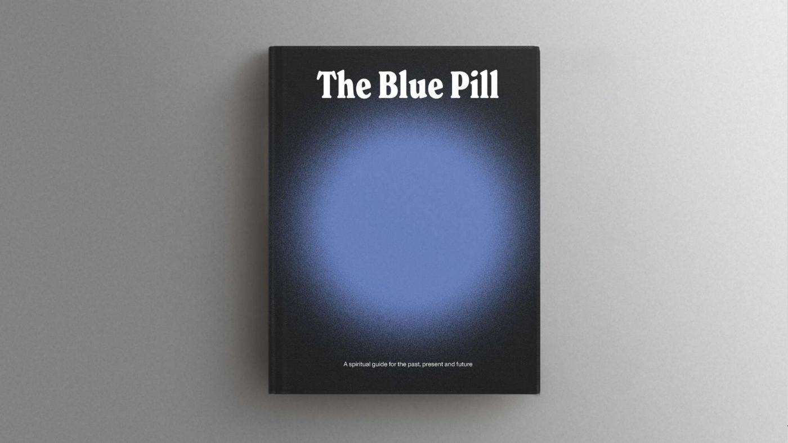
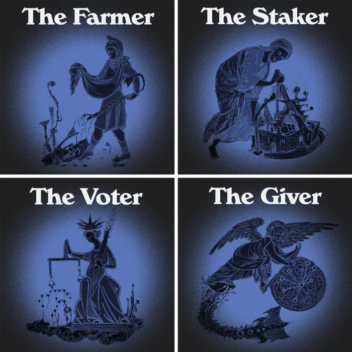
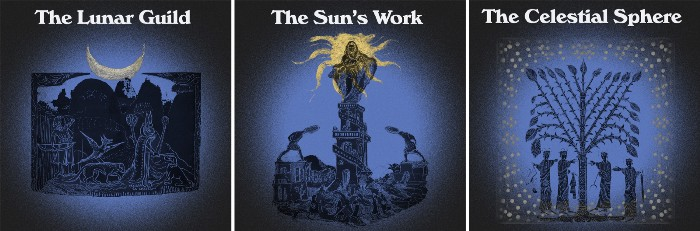

# The Blue Pill

We refer to it simply as The Gift.

One year ago in July 2020, Andre gave YFI tokens to anyone in the DeFi community who wanted to be a part of the project by staking, farming or voting.

Nobody, including Andre, knew what YFI and Yearn would become…

A DeFi blue chip.

A magnet for talent and for billions in TVL.

A collective of builders who value collaboration over competition and integrity over all else.

Today, just 12 months later, we honor the makers, doers, builders and believers, with the release of a book:

The Blue Pill: A spiritual guide for the past, present, and future of Yearn.

Its pages document the origin story of Yearn and lay out a crude map for where we go next.

Yearn is reimagining and rebuilding finance, but it’s also reimagining and rebuilding organizations and the very nature of collaboration, too.

The book is an invitation for you to join us in the land of infinite possibilities and contribute to the journey ahead.

To honor the legends who participated in Yearn during Year One, we’ve worked with artist [@ZemmNFT](https://twitter.com/Zemm_NFT) to create [a series of legendary and rare NFTs](https://galaxy.eco/yearn) that grant online access to the book.

You are the farmers, the stakers, the voters, and the givers who shaped and held YFI from the beginning. We’ve taken snapshots of each of these groups and worked with our friends [@ProjectGalaxyHQ](https://twitter.com/ProjectGalaxyHQ) to bring them to you today.

Yearn OGs appearing on multiple snapshots can also claim special, rare NFTs. All of the Blue Pill NFTs come with a link to the digital version of The Blue Pill book.

Those on the snapshots will be the first to view the book, but just as YFI began with a gift this digital book is free and intended to be shared by all.

So go forth, ye original sowers of the seeds of Yearn.

Accept our humble invitation to join us in celebration of one year of YFI.

[Claim the NFTs](https://galaxy.eco/yearn) as a symbol of your place in Yearn history, and share this book those who might join us in building what Yearn is yet to become.

