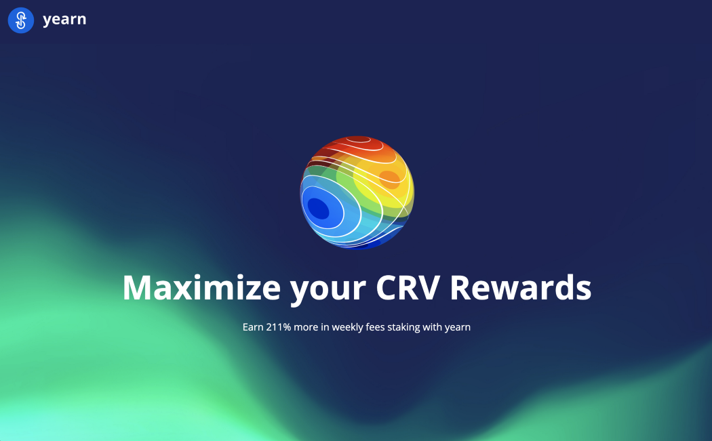

# More boosts, compounding, and mojitos for you with yvBOOST

### Yearn’s collaborative relationship with [Curve.fi](http://curve.fi/) is core to our infrastructure, and core to you boosting your boosts.

🔵🤝🌈

_post written by Yearn contributor_ [_qosmonot_](http://twitter.com/qosmonot)

Many Yearn vaults have strategies built on Curve pools and therefore use CRV token to optimize them by voting to direct reward allocations towards those pools. Yearn has been steadily growing its stack of CRV tokens to provide increasing rewards for those vaults.

Anyone can benefit from this by choosing to stake their CRV tokens through Yearn. Let us walk you through what Yearn can offer you and how you too can grow your CRV holdings with a boost!

## What is CRV?

CRV is the governance and utility token for CurveDAO, the decentralized organization running the [Curve.fi](http://curve.fi/) protocol. The CRV token’s main purpose is to incentivize liquidity providers on the [Curve.fi](http://curve.fi/) platform as well as getting as many users as possible involved in the protocol’s governance. The CRV token has three main uses: voting, staking, and boosting. Those three things require the users to “vote lock” their CRV in exchange for veCRV. veCRV stands for vote-escrowed CRV, and simply represents CRV locked for a period of time (anywhere from 1 week to 4 years).

### Staking

veCRV (staked CRV), receives a share of trading fees from the Curve protocol (50% of all trading fees generated). Those fees are collected and used to buy 3CRV, the LP token for the TriPool (DAI+USDC+USDT), which are then distributed to veCRV holders.

### Boosting

Beyond staking, another major incentive for CRV is the ability to boost your rewards on provided liquidity. Vote locking CRV allows you to acquire voting power to participate in the DAO and direct CRV reward allocations towards selected pools, earning a boost of up to 2.5x on the liquidity you are providing.

### Voting

Once CRV holders vote-lock their CRV, changing it into veCRV, they can then vote on various DAO proposals and pool parameter changes which are proposed, or propose their own changes.

It is worth noting that native veCRV cannot be transferred, and the only way to obtain it is by vote-locking CRV.

You can stake CRV on [Curve.fi](http://curve.fi/) and actively manage your boosts for Liquidity Pools yourself, or you can let Yearn take care of CRV staking for you with our dedicated vaults: yveCRV, and yvBOOST. Also our yVault tokens are tradeable and transferable unlike staking CRV at [Curve.fi](http://curve.fi/).

## The yveCRV yVault

### Earn CRV with a better boost

When a user deposits CRV into the vault, that CRV is locked on the [Curve.fi](http://curve.fi/) platform as veCRV and the user is returned a tokenized version of veCRV, yveCRV. This vault earns you a continuous share of Curve’s trading fees. Every week, these rewards can be claimed as 3Crv (Curve’s 3pool LP token).

You could do this yourself directly on the [Curve.fi](http://curve.fi/), but there is a very good reason one would prefer to use the yveCRV yVault: **more rewards!**

How much more? Your rewards through this vault can be more than double! Yearn achieves this because it periodically donates 10% of the farmed CRV it earns through all [Curve.fi](http://curve.fi/) based strategies to this yveCRV vault and allows yveCRV vault depositors to claim Yearn’s share of Curve protocol fees. This means we give all of Yearn’s rewards, which we could have claimed for the protocol, to yveCRV depositors, boosting their weekly rewards.

Locking your CRV tokens into the vault means that you delegate your [Curve.fi](http://curve.fi/) voting power to yearn. Yearn constantly runs simulations to optimize its voting allocations which maximizes yield across all vaults, benefiting your deposits in other vaults!

**You can now claim your rewards and spend that money on mojitos while you enjoy retirement.** Though, another option you might want instead is to add your rewards back into the vault to compound your gains and you can even find a “Restake” button to do just that. You could very well do this manually, but Yearn has you covered here with …

## The yvBOOST yVault

### Earn boosted CRV with compounding

The yvBOOST yVault is a fully automated and compounding version of the yveCRV yVault explained above.

To put it simply, this vault claims your weekly 3CRV rewards automatically and uses them to acquire more yveCRV (either via market-buy or mint, depending on which is most efficient at time of harvest).

Once deposited, just as in the yveCRV yVault, your CRV tokens’s voting power is handled and optimized by Yearn. You do not need to worry about claiming [Curve.fi](http://curve.fi/)’s weekly protocol fees, the vault does this for you!

This is a “set-and-forget” vault where your CRV tokens grow exponentially, harnessing the power of compound interest!

Now you might be wondering how one would extract any gains made from your CRV tokens in the vault, when as mentioned earlier, any CRV deposited into either the yveCRV or the yvBOOST are locked. While you cannot withdraw from the yveCRV vault, you can actually swap both of these vault tokens on Sushiswap. This is because Yearn and its users provide liquidity on Sushiswap to allow swapping of your yveCRV and yvBOOST tokens for ETH (or anything, really).

### A little alpha.

Yearn buys yvBOOST from the market, unwraps it into yveCRV, and donates that yveCRV into the yvBOOST vault, increasing the underlying value of yvBOOST.

## Yearn yVaults for CRV Stakers

Staking your CRV directly on the [Curve.fi](http://curve.fi/) platform means locking your CRV token in exchange for a non-transferrable veCRV token that allows you to manually claim a share of the protocol’s fee (3CRV). You can use this veCRV token to manually rebalance your votes to obtain a boost on your provided liquidity to the [Curve.fi](http://curve.fi/) platform.

## Enter Yearn’s yveCRV and yveBOOST vaults

Both of these Yearn vaults reward CRV stakers with a share of the CRV locked by Yearn, making it an ideal destination for those who wish to stake CRV whilst remaining liquid:

-   Earn a share of trading fees from the [Curve.fi](http://curve.fi/) protocol (3Crv), automatically reinvested (for the yvBOOST vault).
-   Earn a share of Yearn’s claim of [Curve.fi](http://curve.fi/) protocol fees, on top of your own rewards (more 3CRV!), automatically reinvested (for the yvBOOST vault).
-   The collective voting power of the veCRV tokens is optimized and rebalanced automatically to maximize rewards in all of Yearn’s Curve Pool vaults.
-   Receive yveCRV or yvBOOST tokens for your deposited CRV, allowing you to easily extract profit or exit your staked CRV position

Yearn’s work to automate the yield generation and rebalancing of your crypto assets is especially true in the case of your CRV holdings, and Yearn’s yveCRV or yvBOOST offers a powerful, compounding, “set-and-forget” place to stake your CRV!

In our next post, we’ll cover keepCRV and the processes for bribes and EPS. Until then…

