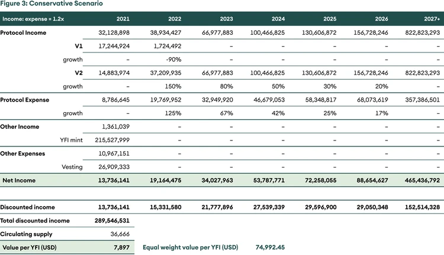
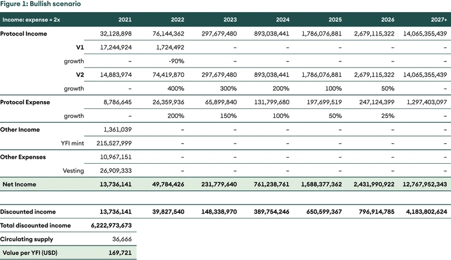
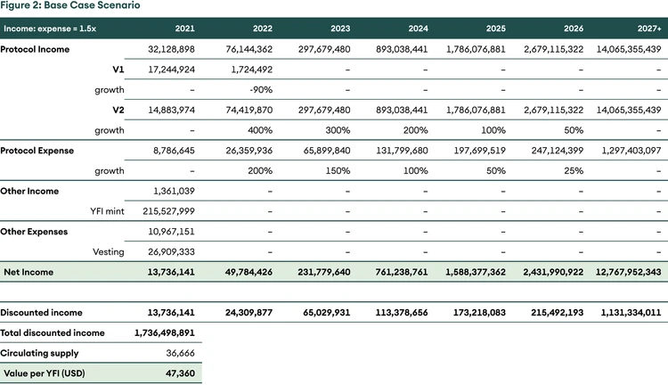

## Yearn Finance - Dezentrale Vermögensverwaltung

Zusammenfassung

_In dieser Ausgabe von Digital Investor befassen wir uns mit dem größten dezentralen Vermögensverwaltungsprotokoll, Yearn Finance. Wir behandeln seine faire Einführung, die Werttreiber für den Token, seinen Burggraben und wichtige Protokoll-Updates. Schließlich versuchen wir, einen fairen Wert für den Token mithilfe von DCF zu finden_

## Einführung

Yearn Finance ist ein dezentralisiertes Finanzprotokoll (DeFi), das Pionierarbeit bei der Vermögensverwaltung leistet, um passiv Renditen auf stabile und riskante Vermögenswerte zu erzielen. Man kann es sich als automatisierten Vermögensverwalter vorstellen, der die Gelder der Einleger in die besten Renditestrategien investiert, um die höchsten Erträge zu erzielen.

Was als einfaches, renditeerzeugendes Produkt namens iEarn von Andre Cronje begann, hat sich zu einem Finanzgebäude entwickelt, das auf dem Fundament von Smart Contracts aufgebaut ist. iEarn war ein einfaches Produkt, das Vermögenswerte über das Protokoll mit der höchsten Verzinsung unter Compound, Aave und dYdX verleihen würde. Yearn Finance bietet jedoch viel mehr als nur die Zuweisung von Geldern auf verschiedene Stablecoins-Sparkonten.

Yearn Finance bietet eine breite Palette von Produkten an, von denen die Vaults das wichtigste sind. Vaults sind dynamische Strategie-Aggregatoren, die Gelder verschiedenen Strategien zuweisen, die die beste Rendite für die Einleger in ihrem bevorzugten Vermögenswert (statt nur Stablecoin) bieten, so dass die Nutzer eine Rendite erzielen und gleichzeitig in ihrem bevorzugten Vermögenswert engagiert bleiben können.

### Hintergrund

Yearn hat seinen Governance-Token YFI Mitte Juli 2020 auf den Markt gebracht und wird als eine der fairsten Token-Verteilungen in diesem Bereich angepriesen. YFI-Token wurden an Liquiditätsanbieter bestimmter Curve- und Balancer-Pools vergeben, die ihre Liquidität in das Protokoll eingebracht hatten. Zu Beginn wurden nur 30.000 YFI geprägt und vollständig an alle Staker verteilt. Die Community stimmte dem Vorschlag 0 zu, der die Prägung von mehr YFI erlaubte, um kontinuierliche Anreize für Liquiditätsanbieter, Entwickler und Mitwirkende zu schaffen.

Aufgrund des begrenzten Angebots und der hohen Nutzung ist der Preis von YFI innerhalb weniger Monate nach dem Start von 32 USD auf einen Höchststand von etwa 43.000 USD gestiegen, obwohl der Gründer behauptet, dass der Token keinen finanziellen Wert hat. Wir sind jedoch der Meinung, dass der [Governance-Token](https://www.seba.swiss/research/governance-tokens-coordinating-the-human-element/) YFI einen erheblichen Wert haben muss, damit die Plattform gut funktioniert, da die Token-Inhaber über das Ergebnis für die Einleger entscheiden. Zum Zeitpunkt der Erstellung dieses Berichts hat Yearn Finance einen Wert von 3,8 Mrd. USD, wovon etwa [78%](https://yearn.science/) in den Vaults eingeschlossen sind.

### Warum sollte YFI einen Wert ungleich Null haben?

Nicht alle Governance-Token sind gleich. YFI ermöglicht es den Inhabern, über Strategien für verschiedene Vaults abzustimmen, die Gebührenstruktur zu ändern, neue Münzen zu minten und Belohnungen an Mitwirkende zu verteilen. Die Token-Inhaber kontrollieren auch die Protokoll-Schatzkammer von etwa 0,6 Mrd. USD. Ein Preis ungleich Null bedeutet, dass diejenigen, die Governance-Entscheidungen treffen, etwas zu verlieren haben, falls eine schlechte Entscheidung getroffen wird. Folglich haben die Token-Inhaber einen Anreiz, gute Entscheidungen zu treffen, die die Attraktivität der Strategien erhöhen und die AuM und die Protokolleinnahmen steigern.

## Die Vertretbarkeit von Yearn

Open-Source-Projekte können geforkt werden. Wie lässt sich Yearn in diesem Fall verteidigen? Eine der wichtigsten Argumente für Yearn ist, dass es die Einnahmen mit den Strategieautoren teilt. Gemäß dem YIP-52 (Yearn Improvement Proposal) hat Yearn die Vault-Strategen zu gleichberechtigten Partnern in der Strategie gemacht. Yearn Vault erhebt eine jährliche Wartungsgebühr von 2 % und eine Leistungsgebühr von 20 % von den Einlegern. Vor YIP-52 verdiente der Stratege nur 0,5 % an der Leistungsgebühr, 19,5 % gingen an die Protokollkasse. Nach der Genehmigung von YIP-52 wird der Gewinn zu gleichen Teilen zwischen Stratege und Schatzmeister aufgeteilt. Wenn der Vault groß ist, kann eine gute Strategie dem Verfasser beträchtliche Gewinne einbringen. Yearn verfügt über die höchsten AuM aller dezentralen Vermögensverwalter und bietet daher den besten Strategieautoren den größten Anreiz, ihre Strategie nur mit Yearn zu teilen. So entsteht ein positiver Kreislauf aus besseren Renditen, höheren AuM und besseren Strategen.

Zweitens ist Vertrauen, wenn auch ironischerweise, ein wesentlicher Aspekt zur Steigerung der Netzwerkeffekte. Wie bei einigen Binance Smart Chain Forks von Ethereum-Projekten zu sehen war, sind Hacks und Exploits wahrscheinlicher, wenn das Team das Projekt geforkt hat und es nicht tiefgehend versteht. Das Team von Yearn ist ein Pionier in diesem Bereich und hat gezeigt, dass es sich an ein verändertes Umfeld anpassen kann. Als die Erträge sanken, änderten sie die Strategien der Vaults, um sie zu erhöhen. Als keine neuen Strategien entwickelt wurden, ergriff die Unternehmensleitung die Initiative, um die Belohnungen für die Strategen zu erhöhen. Die Anpassungsfähigkeit deutet darauf hin, dass das Team in der Lage ist, langfristig zu liefern, während Abzweigungen eine kürzere Lebensdauer haben können.

### Aber ist Rendite ein konstantes Merkmal von Yearn?

Eine offensichtliche Frage ist, ob die Renditen von Kryptoanlagen konstant sind. Glücklicherweise hat das traditionelle Finanzwesen die Messlatte mit Zinssätzen von nahezu 0 % in den Industrieländern nicht zu hoch gelegt. Wir glauben, dass die Renditen im Kryptoasset-Ökosystem Zyklen folgen werden. Höhere Renditen ziehen mehr Nutzer an, was wiederum die Gebühren erhöht. Höhere Gebühren schrecken Kleinanleger ab, und so [sinkt](https://www.seba.swiss/research/yearn-finance-decentralised-asset-management/#1)[^1] die Rendite. Wenn Kleinanleger aufhören, mit der Blockchain zu interagieren, sinken die Gebühren. Der nächste Zyklus des Preisanstiegs in Kombination mit niedrigeren Gebühren ermutigt wiederum kleinere Anleger zur Teilnahme, und der Zyklus wiederholt sich. Unser [früherer Digital Investor](https://www.seba.swiss/research/defi-investment-strategies-a-performance-review) erklärt diese Hypothese.

Obwohl die Preise der DeFi-Token beim jüngsten Krypto-Crash einen Einbruch erlitten, blieb die Anzahl der Token, die in verschiedenen DeFi-Protokollen gesperrt sind, nahezu konstant. Immer mehr Bitcoins und Stable-Coins wollen auf der Suche nach Rendite auf der Ethereum-Blockchain sein. Wir glauben, dass DeFi noch einen weiten Weg vor sich hat.

## Anlagethese

### Von unten nach oben

Der Aufstieg von DeFi ermöglicht es den Inhabern, nicht nur von Kurssteigerungen zu profitieren, sondern auch passive Einkünfte aus verschiedenen Vermögenswerten zu erzielen. Yearn erleichtert letzteres. Obwohl die Inhaber diese Rendite auch ohne Yearn erzielen können, bietet das Protokoll einige Vorteile. Erstens ist es sicherer als der durchschnittliche Inhaber, der sein eigenes Geld bewegt. DeFi ist ein wilder Westen, und selbst diejenigen, die sich mit technischen Aspekten auskennen, sind Opfer von Hacks und Exploits geworden. Ein durchschnittlicher Nutzer ist nicht in der Lage, intelligente Verträge zu prüfen und Gelder in einer dynamischen Umgebung einzusetzen. Das Team von Yearn ist sehr erfahren und kennt die Fallstricke besser als die Nutzer und ist daher in der Lage, bessere risikobereinigte Renditen zu erzielen. Zweitens: Wir wissen, dass die Gaspreise sehr hoch sein können. Kleinanleger (&lt;USD 10,000) werden ausgepreist und können mit den Aktivitäten der Renditewirtschaft nicht mithalten. Yearn bietet die Möglichkeit, die Mittel zu bündeln und so die Gaskosten zu subventionieren.

YFI profitiert direkt von den Erträgen der Plattform. Das Protokoll erhebt 2 % Verwaltungsgebühren und 20 % Leistungsgebühren. Die gesamten Verwaltungsgebühren und 50 % der Leistungsgebühren fließen in die Kasse, die von den Token-Inhabern kontrolliert wird. Abzüglich der Kosten werden die Einnahmen des Protokolls für den Rückkauf von YFI auf dem freien Markt verwendet (siehe YIP-56 unten). Angesichts der begrenzten Anzahl von YFI, der wachsenden TVL und des konstanten Kaufdrucks durch die Staatskasse werden die Tokenomics wahrscheinlich als starker Preistreiber wirken.

### Von oben nach unten - das Makro-Umfeld sehnt sich nach einem Produkt wie Yearn Finance

Der größte Teil der entwickelten Welt altert. Die [geburtenstarken](https://www.seba.swiss/research/yearn-finance-decentralised-asset-management/#2)[^2] Jahrgänge werden in den nächsten Jahren in den Ruhestand gehen, und die Rente wird ein wesentlicher Aspekt ihres Lebens sein. Anders als bei der Generation vor den Babyboomern sind die Bedingungen für den Ruhestand heute anders. Zum einen ist die Lebenserwartung gestiegen, so dass Rentner im Alter von 60 Jahren wahrscheinlich noch 25 Jahre länger leben werden und sich in hohem Maße auf ihre Rente verlassen können. Zweitens: Als die vorherige Generation in den Ruhestand ging, lagen die Zinssätze bei etwa 18 %, was die Sparer begünstigte. Derzeit liegen die Zinssätze bei fast 0, was keinen Anreiz zum Sparen bietet. Die Kombination aus einer großen Bevölkerung, die in den Ruhestand geht, und Zinssätzen nahe Null ist eine schlechte Kombination. Die meisten Industrieländer stehen vor diesem Problem (oder werden vor diesem Problem stehen).

Bitcoin ist der Fahnenträger der Krypto-Asset-Industrie gewesen. Das Jahr 2020 hat jedoch bewiesen, dass auch Stablecoins zu den spannenden Aspekten der Revolution der digitalen Vermögenswerte gehören. Mit Stablecoins bietet sich die Möglichkeit, eine Rendite auf Dollar zu erwirtschaften. Dies ist nicht nur für Krypto-Natives eine spannende Gelegenheit, sondern auch für anspruchsvolle Fonds, deren Mandat darin besteht, auf einen Teil ihres Portfolios eine jährliche Rendite von 6-8 % zu erzielen. Pensionsfonds halten derzeit etwa [USD 32 Billionen](https://www.oecd.org/pensions/Pension-Funds-in-Figures-2020.pdf) an Vermögenswerten (allein die USA halten etwa 18,8 Billionen USD). Wir leben in einer Welt, in der die gesamte negativ verzinste Verschuldung mehr als [USD 17 Billionen](https://www.ft.com/content/378acc52-b1a5-4d58-8a87-8ea052b2c610) beträgt, und börsennotierte Unternehmen wie Microstrategy und Tesla entscheiden sich für Bitcoin als Reserveanlage.

Während es für Pensionsfonds noch zu früh sein mag, könnten abenteuerlustigere Fonds und Einzelpersonen versucht sein, auf Ethereum basierende Plattformen zu testen, um ihrem negativen Renditeumfeld zu entkommen. Mit der zunehmenden Integration von traditionellen und dezentralen Finanzsystemen wird Yearn Finance gut positioniert sein, um einen bedeutenden Anteil des Kapitals als Marktführer im Bereich der dezentralen Vermögensverwaltung zu gewinnen.

## Governance und wesentliche Protokolländerungen

Yearn Finance ist eines der aktivsten Protokolle, wenn es um die Verwaltung geht. Im Allgemeinen werden Vorschläge zunächst im Governance-Forum diskutiert und dann in Form von YIP (Yearn Improvement Proposal) zur Abstimmung auf der Kette gebracht. Yearn ist auch das erste DeFi-Protokoll, das [regelmäßig vierteljährliche Ertragsberichte](https://github.com/yearn/yearn-pm/blob/master/financials/reports/2021Q1-yearn-quarterly-report.pdf) vorlegt. Wir denken, dass dies die Norm im DeFi-Bereich werden sollte.

## Veränderung des YFI-Angebots (Vorschlag 0 und YIP-57)

Der allererste Vorschlag war, das YFI-Angebot zu ändern. YFI hatte mit einem der fairsten Starts begonnen, und die Gemeinschaft beschloss, später mehr Token zu prägen. Kürzlich wurden gemäß [YIP-57](https://gov.yearn.finance/t/yip-57-funding-yearns-future/9319) 6.666 neue YFI-Token geprägt, um die Protokollentwicklung zu unterstützen. Dies ermöglichte es Yearn, Freizügigkeitspakete (2.222 YFI) an Entwickler auszugeben, um die Anreize anzupassen. Der Rest der Token befindet sich in der Staatskasse und wird für das Wachstum des Protokolls verwendet.

### Änderung der Gebührenstruktur für Vaults (YIP-51)

Yearn V1 Vaults hatten eine andere Gebührenstruktur, bei der jede Abhebung berechnet wurde. [YIP-51](https://gov.yearn.finance/t/yip-51-set-vault-v2-fee-structure/7752) änderte die Gebührenstruktur in ein 2/20-Modell, bei dem das Protokoll eine Wartungsgebühr in Höhe von 2 % und eine Leistungsgebühr in Höhe von 20 % berechnet.

### Stratege als Partner für das Spiel (YIP-52)

Von den 20 % Performancegebühr gingen 19,5 % an das Schatzamt, während 0,5 % dem Vault-Strategen zugewiesen wurden. Mit der Genehmigung von [YIP-52](https://gov.yearn.finance/t/yip-52-make-strategist-skin-in-game-partner-for-make-benefit-of-glorious-brain-of-yearn/7856) durch die Unternehmensführung wurde der Stratege zu einem gleichberechtigten Partner bei der Wertentwicklung. Die Begründung für diese Änderung war einfach: Die Vertretbarkeit von Yearn hängt davon ab, dass die Strategen die besten Renditechancen nutzen. Und das Protokoll muss für die besten Strategen einen Anreiz bieten, dies auch zu tun.

### Rückkauf und Aufbau (YIP-56)

Zu Beginn von YFI mussten YFI-Inhaber YFI in den Governance Vault einzahlen, um einen Anteil an den Protokolleinnahmen zu erhalten. Mit dem Inkrafttreten von [YIP-56](https://gov.yearn.finance/t/yip-56-buyback-and-build/8929) wurde der Governance Vault abgeschafft und das Protokoll begann mit der Gewinnausschüttung durch den Rückkauf von YFI auf dem Markt. Dies vereinfachte das Staking und die Governance und verteilte die Gewinne auf alle Token-Inhaber. Das YIP machte Gewinne auch steuerlich effizienter, da Kapitalzuwächse durch Rückkäufe weniger besteuert werden konnten als Dividendenerträge durch Einsätze. Ein weiteres Nebenprodukt dieser Verbesserung war, dass YFI effizienter wurde, da die Inhaber abstimmen können, während sie YFI einsetzen. Zum Beispiel können Nutzer YFI als Sicherheiten einsetzen, um DAI in Maker zu minten und mit anderen DeFi-Protokollen Zinsen auf DAI zu verdienen.

## Bewertung

Insgesamt hat Yearn seit August 2020 mehr als 8 Mio. USD an Belohnungen generiert, davon fast 5 Mio. USD bis April 2021, wobei allein der April 2,7 Mio. USD einbrachte.

Die Bewertung von Yearn Finance ist eine mühsame Aufgabe. Yearn arbeitet mit mehreren anderen Protokollen zusammen, sei es in Form von Kooperationen oder einfach nur durch deren Nutzung. Erwähnenswert sind Curve, Sushiswap, Cream und Badger. Die Kompositionsfähigkeit macht es schwierig zu prognostizieren, wie sich das Wachstum entwickeln wird.

Wir gehen von drei Szenarien aus - bullish, base-case und konservativ. In den Szenarien werden unterschiedliche Annahmen für das Wachstum und die Einnahmen pro ausgegebenem Dollar zugrunde gelegt. Im optimistischen Szenario beträgt das Verhältnis zwischen Einnahmen und Ausgaben das Zweifache, im Basisszenario das 1,5fache und im konservativen Szenario das 1,2fache.

Bei einem Abzinsungssatz von 25%, einer Endwachstumsrate von 5% und gleicher Gewichtung aller drei Szenarien ergibt sich ein fairer Wert von ca. 75.000 USD pro YFI.

### Abbildung 1: Bullisches Szenario

### Abbildung 2: Basisszenario

### Abbildung 3: Konservatives Szenario

## Risiken

Wie alle anderen DeFi-Protokolle ist auch Yearn anfällig für das Risiko von Smart Contracts. Das idiosynkratische Risiko für Yearn besteht darin, dass die Rendite ausbleibt und für lange Zeit niedrig bleibt. Eine niedrige Rendite bedeutet, dass es für Investoren keinen Anreiz gibt, Gelder in Yearn zu binden. Niedrige Renditen können typischerweise ein Bärenmarktphänomen sein. Es bleibt abzuwarten, wie das Yearn-Team mit langen Phasen niedriger Renditen umgeht. Trotz des jüngsten Preisrückgangs und der gedämpften Stimmung bietet Yearn weiterhin lukrative Renditen für Stablecoins und kurvenbezogene Produkte.

## Fazit

Obwohl es sich bei Yearn Finance um ein Open-Source-Protokoll handelt, bei dem Strategien kopiert werden können, sind wir der Meinung, dass Yearn ein einzigartiges Angebot hat: Passive Rotation von Fonds, um hohe risikobereinigte Renditen durch gut motivierte Strategen zu erzielen. Wir sind der Meinung, dass das erfahrene Team von Yearn Finance und seine starke Community seine Stärke ausmachen. Yearn Finance hat die höchste TVL unter den dezentralen Vermögensverwaltern und ist durch die gleiche Gewinnbeteiligung in der besten Position, um intelligente Alpha-Generatoren anzuziehen. Die Fähigkeit, Strategen zu halten, sollte passiven Anlegern die Zuversicht geben, dass die Plattform weiterhin konsistentes Alpha für sie finden wird.

<!-- Footnotes themselves at the bottom. -->

## Fußnoten

[^1]: Eines der wichtigsten Dinge, die es hier zu verstehen gilt, ist der Ursprung der Rendite. Traditionell leihen sich Menschen Geld und schaffen mehr Wert als der geliehene Betrag, um die Zinsen zu zahlen. In DeFi wird die Rendite von Investoren generiert, die glauben, dass ihr risikoreicher Vermögenswert die Zinskosten für das Ausleihen stabiler Münzen übertreffen wird. Die andere Renditequelle ist die Ausgabe von Protokollen, bei der Protokolle Governance-Token an aktive Nutzer und Mitwirkende des Protokolls verteilen
[^2]: Die zwischen 1946 und 1964 Geborenen
