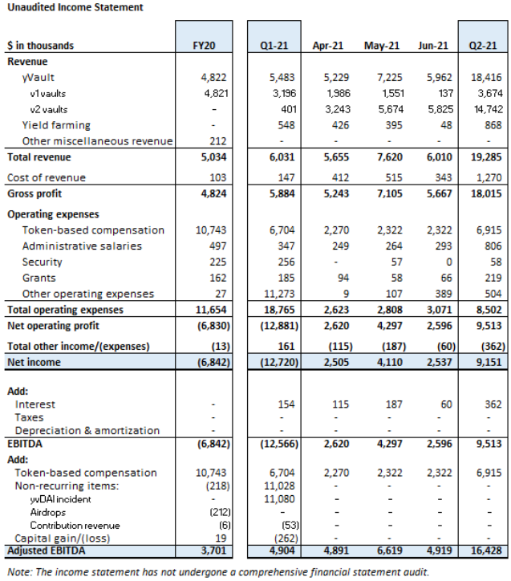
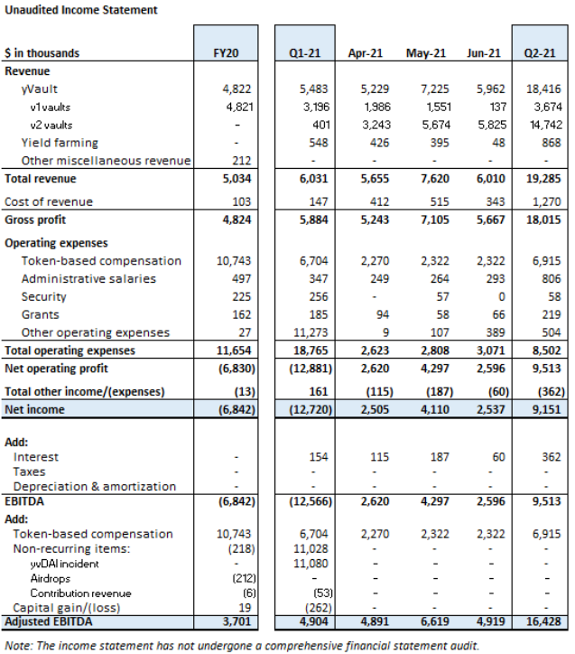
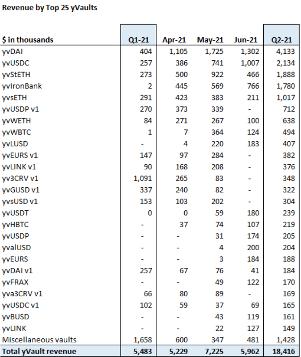
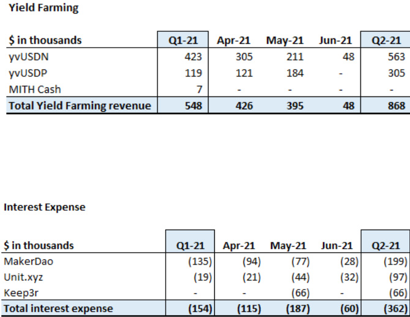
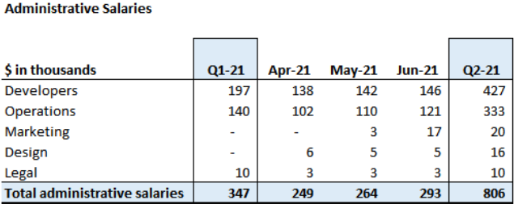
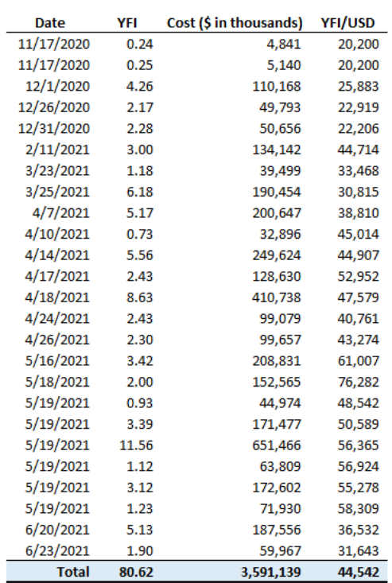
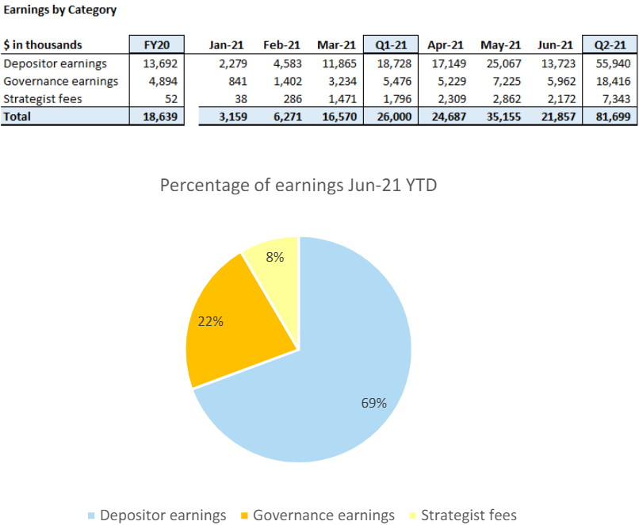
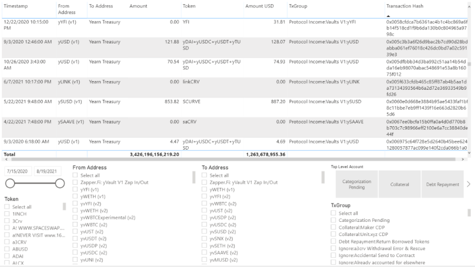

# Yearn Finance Quarterly Report

## For Q2- 2021

DISCLAIMER

The data, statements and information presented in this report is for informational purposes
only, and it does not constitute financial or investment advice. Further, the financial statements
presented have not undergone a comprehensive financial statement audit from a third-party
professional accounting firm. As such, there may exist errors or inaccuracies that materially
misstate the financial statements. We are not responsible for any financial losses or adverse
outcomes that may result from making investment decision based on the data presented
herein. Further, by viewing this report you agree that the statements in this report do not
constitute a representation, warranty or guaranty regarding any matter, and you are not relying
thereon, but will conduct your own due diligence. You hereby release, waive and relinquish any
and all claims, causes of action and disputes against Yearn Finance, its contributors, and the
creators of this document. THIS REPORT DOES NOT CONSTITUTE ADVICE FOR ANY PURPOSE.

The forward-looking statements in this report are subject to numerous assumptions, risks and
uncertainties which are subject to change over time. There are many risk factors, including
those relating to blockchain and cryptographic technology generally, as well as Yearn
specifically, that could cause actual results or developments anticipated by us not to be realized
or, even if substantially realized, to fail to achieve any or all of the benefits that could be
expected therefrom. We reserve the right to change the plans, expectations and intentions
stated herein at any time, and we undertake no obligation to update publicly or revise any
forward-looking statement, whether as a result of new information, future developments or
otherwise. ACCORDINGLY, WE RECOMMEND THAT YOU DO NOT RELY ON, AND DO NOT MAKE
ANY FINANCIAL DECISION OR INVESTMENT BASED ON, THE STATEMENTS CONTAINED IN THIS
UPDATE —INCLUDING BUT NOT LIMITED TO ANY SELLING OR TRADING OF YFI TOKENS, ETHER
OR ANY OTHER CRYPTOGRAPHIC OR BLOCKCHAIN TOKEN.

## Table of Contents

- Introduction to Yearn Finance
- Income Statement
- YFI Buybacks
- Strategist Earnings
- Balance Sheet
- Yearn is Debt Free
- Total Value Locked
- Interactive Financial Dashboard
- Sources

## An Introduction to Yearn Finance

Yearn Finance (“Yearn”) is the leading yield-aggregator protocol in decentralized finance (“DeFi”)
operating on the Ethereum blockchain. The protocol launched in early 2020 with the iEarnproduct
that algorithmically shifts stablecoins(USDC, USDT, DAI) between several lending protocols in DeFi
to obtain the most optimal interest rates at all times. This product is known as the yPoolon Curve
Finance. Curve is a decentralized stablecoin exchange focusing on low-slippage swaps between
various stablecoin assets. In July 2020, the YFI token was distributed over approximately 10 days to
users that provided capital into liquidity pools involving the yPool–a process known as “farming” or
“yield-farming”. The YFI token governs the Yearn protocol.

Shortly after the distribution of the YFI token the yVault product offering was introduced. yVaults
enable users to deposit capital into smart contracts and Strategists –specialized yield-farming
experts –automatically and efficiently earn yield on behalf of the depositors. Gas costs are
socialized across the entire pool making it more economical for small users to participate in yield-
farming. Users also do not need to have an advanced knowledge of DeFi, yield-farming, or liquidity
providing, as the Strategist will perform the necessary actions on behalf of the user. Profits from
yield-farming are periodically harvested by the Strategist and deposited back into the vault;
depositors have claims over these profits. The yVault product represents Yearn’s core business, but
starting in early 2021 Yearn Treasury began engaging in yield-farming with its own assets to
generate additional cash flows.

Yearn engaged in a series of partnerships in the fall of 2020, forming the Yearn Ecosystem. These
partnerships include SushiSwap(Automated Market Maker), C.R.E.A.M (lending), Keep3r Network
(automated job platform), Akropolis, and Pickle Finance (yield-aggregator). While the protocol
specified above in conjunction with Yearn Finance comprise the Yearn ecosystem, the YFI token
does not govern the other protocols in the ecosystem.

Version 2 of the yVault product was launched in early 2021 and includes a revised fee schedule and
the ability for vaults to incorporate multiple strategies per vault. Version 1 yVaults are only able to
employ one strategy per yVault.

## Adjusted EBITDA for _Q2- 21 was $16.4m and $6.6m_ was generated in May-21 alone, representing Yearn’s most profitable month. Quarterly EBITDA growth increased 235% from Q1 to Q2.

### Basis of Presentation

The financial statements are presented on an accrual basis of accounting. The fiscal year for Yearn ends
calendar year ending December 31st. Figures are displayed in United States dollars (“USD”) and rounded to
the nearest thousand. The financial statements are compiled with the use of estimates and non-USD assets
are converted to USD by obtaining closing prices from Coingecko.com, or by obtaining prices directly by
querying the Ethereum blockchain. The financial statements have not undergone a comprehensive financial
audit by a professional third-party accounting firm. They are intended for informational purposes only and
should not be used for financial, investment, or advice of any kind. There may contain immaterial arithmetic
errors in the tables presented, this is due to rounding.

- The yVaultproduct line is Yearn’sprimary revenue generator and experienced phenomenal growth in Q2.
  yVaultgrowth is attributable to increases in total-value-locked (TVL) in Yearn vaults along with increased
  yields in DeFithat affects Yearn’soverall profitability. One of the primary yVaultstrategies involves
  generating yield by earning and selling the Curve governance token (CRV). The price of the CRV token
  increased in Q2 positively affecting Yearn’sprofitability.
- During Q2 Yearn began transitioning from v1 to v2 of it’s yVaultproduct line. v2 yVaultsare more advanced,
  resilient, and sophisticated providing more vault for Yearn’susers. As displayed in the table at left, more
  revenues were generated by v2 vaults –most notably in Jun- 21 – as a large portion of Yearn’sTVL was
  migrated to v2 vaults. _Detailed yVaultdata is presented in a later section of this report._
- In late Feb-21, Yearn began earning yield on idle assets held in Treasury. In late May, Yearn reduced its
  Treasury yield-farming activities due to volatility in the market to protect capital from potential liquidations.
  No Yearn capital was liquidated, but earnings from these yield farming activities decreased in May and June.
- Cost of revenue consists of gas costs used to deploy contracts, payments owed to affiliate partners, or other
  miscellaneous activities related our yVaults. Cost of revenue is a variable costs that increases or decreases
  directly with top-line revenue. Additional harvests of yVaultsor elevated Ethereum gas prices affect this line
  item. Another material component of cost of revenue is the Yearn Partners program.

## Income Statement – continued.

- Yearn contributors are eligible to receive YFI as part of a vesting compensation plan. This vesting was
  approved by Yearn governance with YIP-57: Funding Yearn’sFuture. YFI is vesting monthly for 3 years
  after the contributor commences work with Yearn. Yearn is able to claw back unvested YFI in the
  event the contributor ceases to work for Yearn for any reason. Contributor vesting is expensed in
  accordance with the accrual basis of accounting, however, since it is a non-cash expense it is
  excluded, among other items, to arrive at adjusted EBITDA
- Administrative salaries make up a meaningful portion of operating expenses after excluding token-
  based compensation, which is a non-cash expense. These salaries are necessary to maintain, develop,
  and oversee the protocol. The number of full-time contributors increased during Q2 as Yearn
  onboarded additional developers, engineers, and operations personnel. _A full list of administrative personnel is presented in a later section of this report._
- Security expenses consist of bug bounties and smart contract audits. No material security expenses
  were incurred for Q2, but $57k was spent on smart contract audits in May, along with an unrelated
  $1k bug bounty awarded.
- Yearn launched the Coordinape program to decentralize and distribute community grants to part-
  time contributors within the Yearn community. Grants incurred each month are related to the
  Coordinape program.
- Other operating expenses consist of UX/UI improvement costs, infrastructure costs, promotional
  event costs, and any other unforeseen expenses incurred by the protocol. On a very limited and
  periodic basis users of Yearn vaults experience losses either through their error or other unforeseen
  events. Yearn reimburses these users and bears the costs. $87k and $338k was reimbursed to users
  in May and June, respectively. We anticipate periodic losses to occur in the future, but do not expect
  these costs to be large relative to top-line revenue.
- Other income/(expenses) is interest expense associated with Yearn’syield-farming activities with
  Treasury assets. Interest is charged on any debt borrowed from decentralized lending protocols in
  DeFi. We accrue this interest expense as it occurs in accordance with the accrual basis of accounting.
- Adjusted EBITDA excludes interest, taxes, depreciation & amortization, and various non-cash
  expenses (such as token-based compensation) or non-recurring items.

## Yearn has very high operating margins (~ 50%) as overhead costs are quite low relative to top-line generated revenue primarily from yVaults. This is due to the efficient value accrual model derived from the yVault product line.

### Key Drivers of Financial Results

- Presented in the chart at left is the key financial drivers for Q1-
  21 for adjusted EBITDA. Items adjusted include, interest, taxes,
  depreciation & amortization, non-cash expenses (contributor
  vesting), non-recurring items (airdrops, donations, one-time
  unforeseen losses, and capital gains/(losses)).
- yVault revenue remains the key primary drive of adjusted
  EBITDA for the quarter. Treasury yield-farming revenue offset
  nearly 100% of the administrative salary and grants costs.
- Majority of the operating expenses –though relatively small as a
  percentage of revenue –are related to salaries and grants
  necessary to maintain and develop the protocol.
- Other operating expenses is primarily unforeseen advents
  affecting users that are reimbursed by Yearn.

# yVault revenue has seen tremendous growth in Q2 and both May and June yVault revenue eclipsed the entire revenue generated for Q1-21.

- The table presented at left only displays the top 25 yVaultssorted by total revenue for
  Q2. Yearn has launched over 125 yVaultsincluded vaults phased out and no longer in
  production.
- The yvDAIvault remains our most profitable vault this in partially due to its role within
  the Alchemixprotocol. Users of the Alchemixprotocol deposit DAI into our yvDAIvault
  earning yield. Alchemixenables these users to obtain a line of credit in the form of alUSD,
  a synthetic token native to the Alchemixprotocol. The yvDAIvault is also used by several
  of our other yVaults. We expect this vault to contribute meaningful revenue in the future.
- Several vaults transitioned from v1 to v2 yVaultsin June 2021. Most notably the yvStETH,
  yvUSDPv1, yvEURSv1, yvLINKv1, yv3CRV v1, yvGUSDv1, yvsUSDv1, among others. Our
  v2 vaults are more sophisticated and secure and we encourage all depositors to transition
  to v2 vaults.
- Our most profitable ETH yvaultwas yvStETHwhich earns CRV rewards from the StETH
  liquidity pool on Curve Finance. CRV rewards are periodically harvested and used to
  purchase more of the underlying tokens in the vault. As of the date of this publication,
  ETH depositors can earn approximately 8.5% APY with minimal exposure to impermanent
  loss (IL). This vault represents among the best risk-adjusted way to obtain yield on
  Ethereum without significant IL risks.
- Our yvLINKvault enables Chainlinkholders to obtain yield on their idle tokens without
  significant impermanent loss risks. This vault generated nearly $149k in revenue for Yearn
  for the quarter.
- The majority of our yVaults are focused on Curve Finance strategies by earning CRV
  rewards and depositing into liquidity pools on Curve.

# Yearn earned $868k yield-farming with Treasury assets in Q2.

- Yearn earned a material amount of revenue yield-farming with idle assets owned by
  Treasury in Q2. The amount earned by these activities partially offset the entire salary
  and grants costs ($987k) incurred by Yearn for the quarter.
- Beginning in late May, Yearn substantially reduced its yield-farming activities with
  Treasury assets due to higher than normal volatility in crypto markets. Yield-farming
  activities were reduced as Treasury assets are held as collateral in loans obtained from
  decentralized lending protocols in DeFi. To protect capital Yearn reduced it’s debt.
- As of June 2021, the entire debt owed to Unit protocol was paid down and Yearn
  withdrew its entire collateral balance.
- A small amount of debt, relative to Yearn’scapitalization, is still owed to MakerDAO.
  However, Yearn’scash balances exceed the debt owed. Yearn is using the debt obtained
  from MakerDAOto continue yield-farming activities, though on a lower scale than earlier
  in the quarter.
- Interest is related to debt owed to MakerDAOand Unit.xyz, two protocols in DeFithat
  enable users to open collateralized debt positions. Interest is continuously accrued until
  the debt is paid back and the collateral is unlocked. We expense interest in accordance
  with the accrual basis of accounting.
- In May 2021, Yearn incurred a one-time $66k interest expense to the Keep3r protocol.
  This is associated with a loan Keep3r gave to Yearn related to the KP3R/ETH liquidity pool
  that Yearn utilizes to pay Keepers that harvest Yearn yVaults. We do not expect this
  interest expense to occur in the future.

# The full-time contributor team expanded in Q2 adding additional developers, marketing and operations personnel.

- The full-time contributor team has expanded and now consists of twenty-six individuals.
- There are now thirteen developers, ten operations personnel, and one personnel each
  for marketing, design, and legal.
- Administrative salaries for Q2-21 was less than 5% of gross profit generated for the
  quarter.

# Coordinape distributes the majority of Yearn community grants and is a novel and innovative approach to decentralized payments.

- The majority of Yearn community grants are distributed by the Coordinapeprogram.
  Coordinapeis a decentralized grant selection and disbursement model. Previously
  awarded grant recipients and full-time contributors are each allocated 100 GIVE tokens.
  These tokens can be allocated to contributors in the Yearn ecosystem. Salaried
  contributors are ineligible to receive grants. The Coordinapebudget, approved by the
  yBudgetteam, increased in Q2 and as of June 2021 is approximately $58k per month.
- Redphoneassisted with communication writeups particularly on Yearn’stwitter.
- There are consistently over 50 grant recipients each month from the Coordinape
  program. Due to the large number of recipients we have presented the total Coordinape
  grant figure instead each individual payment in the table at left.
- You can access Coordinapehere: https://coordinape.com/

# Yearn has purchased approximately 81 YFI since beginning it’s buyback program in November 2020.

- YIP-55: Buyback and Build Yearn was approved in November 2020 and replaced the
  earning distribution model (staking) with a buyback model. Earnings after covering
  overhead costs are used to buyback YFI on the accrue to Yearn’sTreasury.
- The yBudgetteam determines monthly budgets for YFI repurchases based on a monthly
  earnings analysis. YFI accrued to Treasury is used to incentivize future contributors
  (vesting), cross-protocol initiatives, or potential future liquidity mining programs and is
  determined by the yBudgetand yPeopleteams and ultimately executed by the Multisig.
- Yearn continues to repurchase YFI each month with protocol earnings unless a new YIP
  changes this policy.

# For Jun-21 YTD depositors, governance, and strategists have earned approximately 69%, 22%, and 8% of revenue generated for yVaults.

- Depositors receive the overwhelming majority of revenue earned from yVaults. Since
  inception they have earned $88m of the total $126m generated by yVaults.
- Treasury has earned $28m and Strategists have earned $9.1m of earnings generated
  since launch.
- Strategists earnings were lower in FY-20 and January and Feburary2021 as there was a
  new fee structure to incentivize strategists more than the prior fee structure. This was
  approved by a Yearn Improvement Proposal (YIP) voted on by YFI token holders.
- The current fee structure is a 2% Management fee earned by governance and a 20%
  performance fee on profits. Strategists split the 20% performance fee equally with
  governance.
- _Note: The strategist fees data presented on this slide is not currently reflected on the income statements displayed in earlier slides. We are in the process of restating the historical income statements to include strategist fees, however; net earnings will not be affected as gross revenue will increase by the same amount as the strategist fee (expense). The next quarterly report will include strategist fees in the income statement._

# Yearn owns approximately $151m in assets held in Treasury, and as of June 2021 has no net debt (outstanding debt less cash).

- **Cash & cash equivalents** –Management fees and performance fees owed to the Yearn
  protocol are sent to Yearn Treasury in the form of the yVault liquidity provider (“LP”)
  token. Over time, Yearn’s Treasury naturally builds up a reserve of these tokens as more
  yVault revenue is generated to the protocol.
- **Accounts receivable** –Represents earned but unharvested revenue generated from Yearn
  Treasury's yield-farming. In June 2021, Yearn realized all earned but unharvested profits
  related to these activities, which is why there is no accounts receivable.
- **Inventory**–Yearn’s internal yield-farming committee began earning yield on assets held in
  Treasury. These items are the line of credit borrowed from MakerDAOor Unit.xyzin order
  to yield-farm. All debt was repaid in June 2021, which is why there is no inventory.
- **Prepaid expenses & security deposits** –Prepaid infrastructure costs primarily to Alchemy.
  Security deposits are related to the Alchemy service agreement.
- **Other short term assets** –Profits from various miscellaneous Yearn yVaults, such the
  yvCurve-LINK or yvCurve-Tricrypto. The majority of the balance in June 2021 is
  attributable to the yvCurve-LINK vault.
- **YFI** –Treasury owned YFI obtained from both the addition YFI minted in Feb-21, in
  accordance with YIP-52, and on-going YFI purchases with protocol earnings. As of June
  2021, Yearn Treasury owns approximately 4,047 YFI. This balance is escrowed for future
  contributors, cross-protocol initiatives, and any potential future liquidity mining
  programs.
- **Other long term assets** –Consists of the KP3R/ETH liquidity pool required to generated
  credits needed to pay keepers performing harvesting functions for Yearn yVaults. The
  market value, including any impermanent losses, of this liquidity pool was obtained from
  apy.visionat each month end.

# Balance Sheet – continued.

- **Accounts payable & accrued expenses** –Accounts payable are due to service providers or
  affiliate partners. Increases in this balance in April and May is largely due to accrued but
  unpaid affiliate partner payments. Large payments were made in June 2021, lowering the
  liability balance. Partners are typically paid 30 days in arrears. Accrued expenses are
  primarily owed but unpaid salaries or grants that eventually get distributed to
  appropriate parties.
- **Interest payable**–Accrued but unpaid interest related to debt related to Treasury yield-
  farming operations described above. Interest is accrued in accordance with the accrual
  basis of accounting.
- **Long term liabilities** –Debt owed to MakerDAOand Unit.xyzrelated to the Treasury yield-
  farming. Unit debt was completely paid off in June 2021.
- **Equity**–includes accumulated other comprehensive income related to valuing assets held
  on Yearn’s balance sheet to fair market value (FMV) at month-end.

# Yearn has sufficient cash to repay all existing debt obligations owed to decentralized lending protocols.

- Users of v1 vaults experienced an adverse event in early Q1 that resulted in an $11m loss.
  Yearn covered this loss and reimbursed users by obtaining a loan from MakerDao. The
  entire loan related to this incident has been paid off from protocol earnings.
- Yearn still has some outstanding debt owed to MakerDao, but possesses enough cash to
  pay this debt at any time.
- The photo presented at left is as of the date of this publication and not reflected of end
  of month balance on June 2021 (Q2 closing).

# Yearn _Total Value Locked exceeded $5.0b in June_, and as of August 19

- There has been phenomenal growth in Total Value Locked (TVL) across all Yearn products
  in Q1 2021 and continuing into Q2 2021. In June TVL peaked at $5.0b, slightly retraced in
  July, but has since rebounded in August. ,
- The majority of our TVL is derived from our v2 yVaultproduct line. In late May and
  throughout June we transitioned a significant portion of our v1 vaults to v2 vaults. We no
  longer support v1 vaults and encourage all depositors to migrate to v2 vaults.
- Iron Bank is Yearn’sin-house lending platform that is in collaboration with C.R.E.A.M.
  Finance. We continued to see growth in Iron Bank TVL from Q1 to Q2.
- It is worth noting that as of August 19th, 2021, **Yearn has over $4.6b in TVL without any
  token subsidies** or other incentives typically offered by competing protocols in DeFi.
- _Note: The chart presented at left is as of August 19th, 2021._
- Source: Github: [yearn/yearn-exporter](https://github.com/yearn/yearn-exporter)

# We continue to make improvements to our financial dashboard displaying transactions, an Income Statement, and a Balance Sheet.

- Our financial dashboard is public to give community members more granular information
  related to financial transactions affecting Yearn’soperations. You can view transactions
  by month, token, category, and various other filters.
- Please note that this dashboard is displayed on a cash-basis of accounting, whereas the
  financial statements presented in this report are on an accrual basis of accounting.
  Specifically, the dashboard does not account for accounts receivable, accrued interest,
  unrealized capital gains and losses, or other accrual based items.
- The financial dashboard has not been audited by a professional third-party accounting
  firm and is intended for information purposes only. It is not to be used for financial,
  investment, or advice of any kind.
- You can access the dashboard at https://www.yfistats.com/financials/financials.html

# Sources

- Revenue data was obtained from token transfers between several addresses controlled by the Yearn protocol. These Ethereum addresses are listed below.

  - Treasury vault: 0x93a62da5a14c80f265dabc077fcee437b1a0efde
  - Multi-sig: 0xfeb4acf3df3cdea7399794d0869ef76a6efaff
  - Governance staking: 0xba37b002abafdd8e89a1995da52740bbc013d

- Expenses were obtained from the yChadaudit reports. These reports are available on Yearn’s GitHub, and are published monthly.

  - https://github.com/iearn-finance/ychad-audit/tree/master/reports/financial

- Token prices were obtained from Coingecko, a historical price provider of all major cryptocurrencies, or by running an archive Ethereum node and querying prices directly from the blockchain.

- Please contact the team either via Telegram or discord for any specific questions.
  - t.me/yearnfinance
  - https://discord.com/yearn
