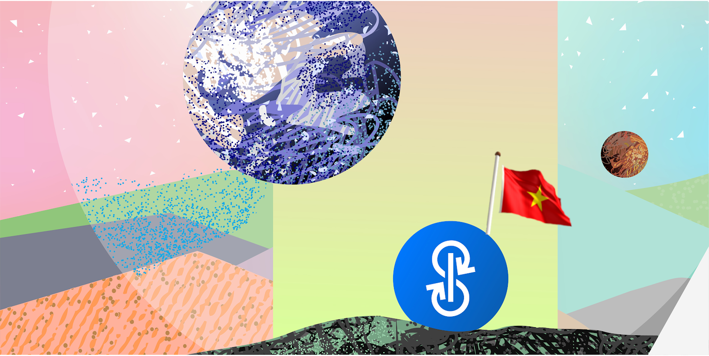
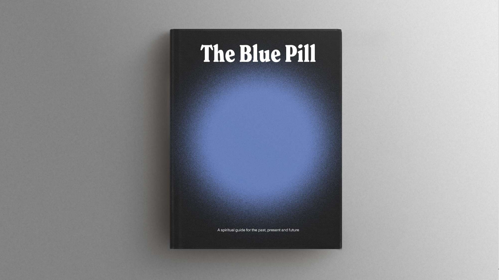
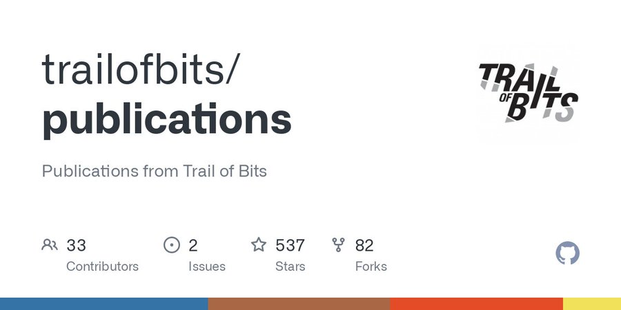

# Bản tin Yearn.Finance Số #42

Chào mừng các bạn đến với Bản tin Yearn.Finance Số 42! Chúng tôi hy vọng sẽ truyền tải được những dữ kiện mới nhất cho cộng đồng tiền mã thuật số (crypto) nói chung lẫn cộng đồng Yearn nói riêng; từ phát hành sản phẩm, thay đổi trong quản trị đến nhiều dự án đối tác trực thuộc hệ sinh thái Yearn. Nếu quan tâm và muốn biết thêm chi tiết về Yearn.Finance, hãy theo dõi tài khoản [Twitter](https://twitter.com/iearnfinance), [Medium](https://medium.com/iearn) cũng như đón chờ nơi phát hành Tiếng Việt chính thức của chúng tôi.

## **Tóm tắt**

- "Viên Thuốc Xanh" Yearn
- Chụp ghi nhận (Snapshot) Woofy Tuần 11
- Di chuyển Hay là Chết
- Chiến lược Biểu quyết Tỷ xích Curve (Curve Gauge Voting) mới
- Kiểm tra các "Lọ Dưa Chua" (Pickle Jar)
- Cần gì để trở thành một Chiến lược gia
- Công bố Kiểm toán An toàn (Audit) cho Yearn V2
- Các Kho bạc (Vault) tại Yearn
- Tin tức trong Hệ sinh thái

## **NFT "Viên Thuốc Xanh"**

Kỷ niệm sinh nhật Yearn 1 tuổi, chúng tôi đã tiếp tục hợp tác với Project Galaxy để mang đến cho các bạn "Viên Thuốc Xanh": Câu chuyện ly kỳ về quá khứ, hiện tại và tương lai của Yearn. Tác giả Zemm đã tạo nên một cuốn sách đầy sinh động cho 13&nbsp;500 tín đồ trung thành của chúng tôi. Đây là một sê-ri gồm 7 NFT độc đáo cho hàng loạt "nông dân" (farmer), "cọc viên" (staker), "cử tri" (voter) và "người hùng" tâm huyết của cộng đồng Yearn. Cùng chúng tôi ăn mừng món quà YFI!

Xem chi tiết về món quà NFT này trên blog của Yearn [tại đây](https://medium.com/iearn/the-blue-pill-ca44ed01f16f) (tiếng Anh).

Nhận sách của bạn [tại đây](https://galaxy.eco/yearn) và đọc bản đầy đủ [ở địa chỉ này](https://thebluepill.eth.link/).

## **Chụp ghi nhận (Snapshot) Woofy Tuần 11**

Những người mới nắm giữ đồng WOOFY sẽ nhận được một món quà NFT qua sự hợp tác giữa Yearn và Project Galaxy. Chúng thuộc sê-ri gồm sáu NFT WOOFY độc đáo như hình trên. Các dữ liệu chụp ghi nhận mọi chủ tôken, bên cấp thanh khoản ("liquidity provider" hay LP), "cọc viên" (staker) và người dùng kho bạc (vault) trải khắp hàng loạt chuỗi khối.

Nhận NFT Woofy của bạn [tại đây](https://galaxy.eco/yearn).

## **Di chuyển Hay là Chết**

Các kho bạc (vault) phiên bản v1 đã trở thành nguồn lãi suất đáng tin cậy cho mọi người trong gần một năm, và giờ là lúc chúng ta nói lời tạm biệt. Tất cả kho bạc (vault) cũ đã được "thu hoạch" lần cuối cùng và "nghỉ hưu" các chiến lược. Một lần nữa, chúng tôi xin nhấn mạnh rằng kho bạc (vault) phiên bản v2 sở hữu nhiều ưu điểm hơn như triển khai vốn khắp vài chiến lược cùng lúc để mang lại hiệu quả lãi suất tốt hơn, giảm bớt rủi ro.

Bạn có thể di chuyển sang v2 bất cứ lúc nào, miễn phí.

Xem ngay các kho bạc (vault) [tại địa chỉ yearn.finance/vaults](https://yearn.finance/vaults).

## **Chiến lược Biểu quyết Tỷ xích Curve (Curve Gauge Voting) mới**

Nhờ công sức tuyệt vời của các Chiến lược gia tại Yearn, chúng tôi đã khám phá ra chiến lược tối ưu nhất khi Biểu quyết ở Tỷ xích Curve (Curve Gauge Voting) để cung cấp lãi suất nhiều nhất cho người dùng. Chiến lược mới này sẽ ghi nhận lãi suất cao hơn lên đến 20% cho những vị trí hiện tại đang sử dụng veCRV.

Như thường lệ, chúng tôi luôn nhắm đến việc mang lại lãi suất tối đa mà đỡ-rủi-ro trong thế giới DeFi, với nhiều Chiến lược gia liên tục triển khai mã lập trình chất lượng. Ký gửi ngay vốn vào yVault và để Chiến lược gia cáng đáng công việc nặng nhọc nhất.

Xem ngay các kho bạc (vault) [tại đây](https://yearn.finance/vaults).

## **Kiểm tra các "Lọ Dưa Chua" (Pickle Jar)**

Ở Pickle.Finance, nhiều lãi suất ấn tượng từ 7% đến 40% đang chờ đón tôken yVault. Bạn có thể thu lời trên Yearn FRAX, Yearn LUSD, yUSDC và còn nhiều nữa!

Pickle là một trong nhiều đối tác tuyệt vời, thành viên trong chương trình chia sẻ doanh thu của chúng tôi (dự án tham dự chương trình này có thể nhận được lên đến 50% phí mà Yearn thu về).

Xem ngay hàng loạt "nông trại" [tại đây](https://app.pickle.finance/farms).

Chi tiết về quan hệ hợp tác [ở liên kết này](https://twitter.com/iearnfinance/status/1367508483952771075) cũng như đăng ký tham gia [tại đây](https://yearnfinance.typeform.com/to/uP7xOJUN).

## **Cần gì để trở thành một Chiến lược gia**

Hơn 5 triệu đô-la Mỹ đã được dùng trả công cho các chiến lược gia Yearn trong năm 2021. Tại Hội nghị Cộng đồng ETH (EthCC), Facu Ameal chia sẻ kinh nghiệm để trở thành một chiến lược gia giỏi. Các chiến lược, như bạn có thể đã biết, là xương sống của Yearn và mang lại lãi suất tốt nhất mà đỡ-rủi-ro cho tôken của bạn.

Nhìn chung, Facu thuyết trình về kho bạc (vault), chiến lược, tương tác giữa chúng và cuối cùng là công cụ cũng như quy trình để viết và phát hành chiến lược cho cộng đồng.

Xem [video tại đây](https://www.youtube.com/watch?v=NVR3teJw0Y0), kèm theo cả một lời mời nhập học "Trường Nội trú" YFI.

## **Công bố Kiểm toán An toàn (Audit) cho Yearn V2**

Yearn đã liên hệ với Trail&nbsp;of&nbsp;Bits để kiểm toán độ an toàn của Kho bạc (Vault) v2, hợp đồng BaseStrategy (Chiến lược Cơ bản) và BaseWrapper ("Gói" Cơ bản). Các phát hiện đã được đề cập trong sê-ri 0.4.x của hợp đồng, phát hành hồi tháng 05.

Xem biên bản báo cáo [tại đây](https://github.com/trailofbits/publications/blob/master/reviews/YearnV2Vaults.pdf).

## **Các Kho bạc (Vault) tại Yearn**

Bạn có thể xem mô tả chi tiết về các chiến lược cho mọi yVault đang hoạt động của chúng tôi [tại đây](https://medium.com/yearn-state-of-the-vaults/the-vaults-at-yearn-9237905ffed3) (sẽ sớm có bản Tiếng Việt).

## **Tin tức trong Hệ sinh thái**

[Element Finance phát hành tài sản thứ tư—DAI—dựa trên Yearn để mang lại lãi suất cố định](https://twitter.com/element_fi/status/1417880198033387526)

[Facu Ameal trình bày chi tiết cách để trở thành một chiến lược gia ở Yearn](https://youtu.be/NVR3teJw0Y0)

[BasketDAO phát hành chỉ số BMI Index mới cấu thành từ các đồng USD bình-giá (stable coin) mang-lãi-suất từ các kho bạc (vault) của Yearn](https://twitter.com/BasketDAOOrg/status/1415505266221535237)

[Andre Cronje phát hành Fixed Forex, tận dụng Iron Bank, Yearn, Sushi và Curve để tạo thanh khoản cho thị trường ngoại hối và xuất-nhập tiền pháp định](https://andrecronje.medium.com/fair-launches-decentralized-collaboration-and-fixed-forex-ab327a2e4fc4)

[Cập nhật và bổ sung tính năng mới cho trang web yearn.fi](https://twitter.com/dudesahn/status/1417898521685078016)

[Xem bản thu hình Cuộc họp về vấn đề Phát hành Công bằng (Fair Launch Summit), một sự kiện với sự góp mặt của nhiều thành viên Yearn](https://youtu.be/1KqxvJnNRWg)

[BadgerDAO tiếp tục phát triển nhiều chiến lược tận dụng Yearn](https://twitter.com/BadgerDAO/status/1420468295388520449)

[Đăng ký vào ngay danh sách chờ đón giải pháp Lớp 2 (Layer 2) của Argent để có cơ hội nhận nhiều phần thưởng, trong đó bao gồm $50&nbsp;000 yvDAI](https://twitter.com/argentHQ/status/1422262937423597571)
