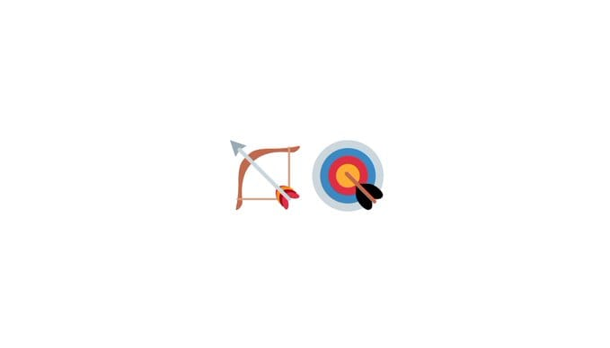
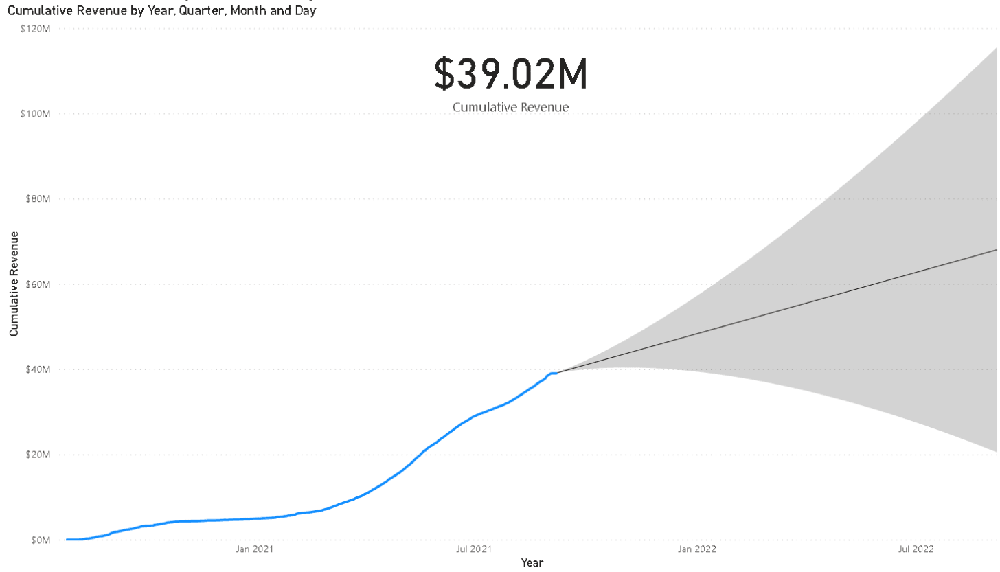

# Yearn Finance Newsletter #45

<<<<<<< HEAD
Yearn Finance Newsletterの第45号へようこそ。このニュースレターの目的は、プロジェクトのローンチ、ガバナンスの変更、エコシステムの更新など、最新のニュースをYearnとより広いクリプトコミュニティにお知らせすることです。Yearn Financeについてもっと知りたいという方は、私たちの公式[Twitter](https://twitter.com/iearnfinance)と[Medium](https://medium.com/iearn)アカウントをフォローしてください。
=======
Yearn Finance Newsletterの第 45 号へようこそ。このニュースレターの目的は、プロジェクトのローンチ、ガバナンスの変更、エコシステムの更新など、最新のニュースを Yearn とより広いクリプトコミュニティにお知らせすることです。Yearn Finance についてもっと知りたいという方は、私たちの公式[Twitter](https://twitter.com/iearnfinance)と[Medium](https://medium.com/iearn)アカウントをフォローしてください。
>>>>>>> 126b6d3793c5f94f487af7e215862dfea0236c3e

## **概要**

- ALPHA と YFI のリクイディティプロバイダーが特別な NFT の対象となりました
- V2 への移行に関する注意喚起
- Yearn の Vault にスワップする方法
- プロトコルの累積収益が 39M ドルに到達
- Yearn の Vaults
- エコシステムニュース

## **ALPHA と YFI のリクイディティプロバイダーが特別な NFT の対象となりました**

Alpha Homora V2 プールの Uniswap ETH/YFI および Sushiswap ETH/YFI プールのリクイディティプロバイダーは、Yearn、Alpha、Project Galaxy の提供による特別な NFT ドロップの対象となります。

このドロップは、9/3 ～ 9/9 の丸 3 日間行われます。対象となるプールでポジションを保持もしくはオープンしているユーザーは、Project Galaxy のウェブサイト[こちら](https://galaxy.eco/AlphaFinanceLab/campaign/117)で NFT をクライムすることができます。

なお、ユーザーが NFT をクライムできるのは期間中のみで、現在ポジションを保有しているウォレットアドレスで請求する必要があります。

詳細は[こちら](https://twitter.com/AlphaFinanceLab/status/1433689307152195591)をご覧ください。

## **V2 への移行に関する注意喚起**

v2 が公開されてから数ヶ月が経ち、v1 の Vault は廃止されストラテジーも停止されているため、Vault に残っているユーザーはイールドを獲得できていません。v1Vault は DeFi コミュニティの信頼できる収益源として 1 年以上貢献してきましたが、そろそろアップグレードの時期に来ています。今回の v2 では、複数のストラテジーに資金を配分することで効率性を高めリスク調整後の利回りを向上させるなど、いくつかの変更を行っています。v2 への移行は、いつでも手数料なしで可能です。

Vaults は[yearn.finance/vaults](https://yearn.finance/vaults)でご覧いただけます。

## **Yearn の Vault にスワップする方法**

Yearn Vaults でひとつの Vault から別の Vault に資金をスワップする最善の方法の 1 つは、通常[curve.fi](https://curve.fi/)を使用するか、Yearn の UI に組み込まれた Zap を使用することです。この方法はガス効率が良いですが、スリッページや追加手数料がかかる場合があります。

Compound や AAVE から Yearn に資金を移行するもう一つの方法は、[bowswap.finance](https://bowswap.finance/)を利用することです。こちらは、プロトコルからの引き出しと Yearn の Vault への入金を可能にするもので、さらに両プロトコルの APY を比較表示し、一度に複数のトークンを選択することができます。追加の手数料はかかりません！

この短いガイドを作成してくれた[cryptouf](https://twitter.com/cryptouf)に感謝します。

## **プロトコルの累積収益が 39M ドルに到達**

Yearn はローンチ以来、39M ドル以上の収益を上げています（預金者が得た利息を除く）。過去 30 日間では、5M ドル以上の収益がこのプロトコルによってもたらされました。このデータから推計すると、年間収益は 30M ドル近くになると予測されます。

Yearn の累積収益やその他の統計は、[こちら](https://www.yfistats.com/)からご覧いただけます。

## **Yearn の Vault**

私たちが活動しているすべての yVaults のストラテジーの詳細な説明は[こちら](https://medium.com/yearn-state-of-the-vaults/the-vaults-at-yearn-9237905ffed3)でご覧いただけます。

## **エコシステムニュース**

[Keep3r Network v3 の流動性提供インセンティブについて](https://twitter.com/AndreCronjeTech/status/1434125562281332737)

[ySNX の Vaults ユーザーが Thales Markets からのエアドロップの対象となる](https://twitter.com/thalesmarket/status/1434889906657144834)

[yvcrvSTETH がレンディングマーケットとして abracadabra.money に追加](https://twitter.com/MIM_Spell/status/1430975000350281732?s=20)

[Defiant が Yearn のエコシステムを分析](https://thedefiant.io/yearn-finance-ecosystem-breakdown-pushing-the-boundaries-of-human-coordination/)

[Yearn crvTricrypto 対象マーケットが cozy.finance に登場](https://twitter.com/cozyfinance/status/1433602125792038913)
