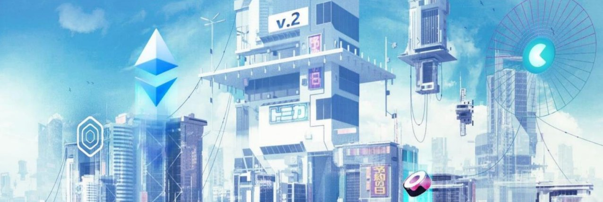
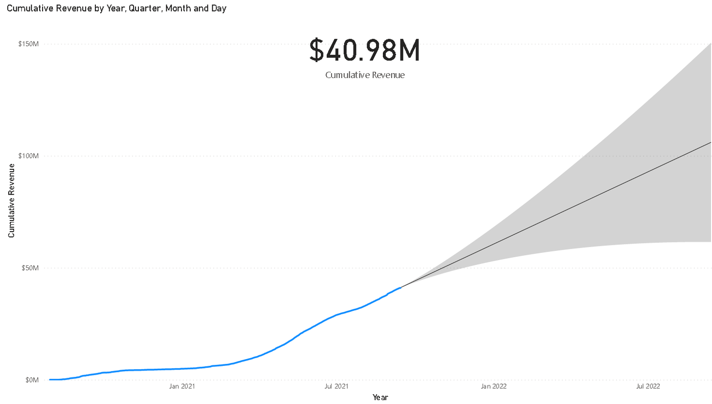

# Bản tin Yearn.Finance Số #46
#### Tuần Kết thúc Ngày 12/09/2021

Chào mừng các bạn đến với Bản tin Yearn.Finance Số #46! Chúng tôi hy vọng sẽ truyền tải được những dữ kiện mới nhất cho cộng đồng tiền mã thuật số ('crypto') nói chung lẫn cộng đồng Yearn nói riêng; từ phát hành sản phẩm, thay đổi trong quản trị đến nhiều dự án đối tác trực thuộc hệ sinh thái Yearn. Nếu quan tâm và muốn biết thêm chi tiết về Yearn.Finance, hãy theo dõi tài khoản [Twitter](https://twitter.com/iearnfinance), [Medium](https://medium.com/iearn) cũng như đón chờ nơi phát hành Tiếng Việt chính thức của chúng tôi.

## **Tóm tắt**

- Hậu trường ở Yearn
- Kiến thức Vỡ lòng về Kho bạc yvBOOST
- Báo cáo Tài chính Hàng Quý của Yearn
- Tổng Doanh thu của Giao thức Đạt 41 Triệu Đô-la Mỹ
- Các Kho bạc ('Vault') tại Yearn
- Tin tức trong Hệ Sinh thái

## Hậu trường ở Yearn

Như bạn có thể đã biết, Yearn là giao thức tạo hoa lợi cho ĐeFi, với hàng loạt chiến lược gia lập trình nhiều cách để thu lời tối ưu cho người dùng, sử dụng hợp-đồng-thông-minh ('smart contract') nhằm không ngừng phân bổ vốn sao cho hiệu quả vào các giao thức khác. Do thị trường tổng hợp hoa lợi ngày càng cạnh tranh, Yearn cần theo kịp tốc độ và triển khai chiến lược đủ nhanh, đồng nghĩa với việc sẽ luôn có rủi ro.

Có tổng cộng 176 chiến lược cho 64 Kho bạc ('Vault') tính đến thời điểm này, và để đảm bảo an toàn, chúng tôi cần có một bộ khung vững chắc về quản lý rủi ro. Để giảm thiểu sự cố, chúng tôi đã bổ sung nhiều công cụ như trình mô phỏng ('simulation bot') để bắt vấn đề hoặc kiểm tra tình trạng ngay trên mạng chính, hay còn gọi là trực-chuỗi ('on-chain'). Bất cứ ai quan tâm đều có thể đọc thêm về quy trình phản ứng khẩn cấp của Yearn [tại đây](https://github.com/yearn/yearn-devdocs/blob/master/docs/developers/v2/EMERGENCY.md).

Bạn cũng có thể xem chi tiết các Kho bạc ('Vault') và chiến lược trên [yearn.watch](https://yearn.watch/).

Đào sâu hơn nữa về quy trình bảo đảm an toàn của Yearn từ mẩu tweet của storming0x [ở đây](https://twitter.com/storming0x/status/1436851219864059906).

## **Kiến thức Vỡ lòng về Kho bạc yvBOOST**

CRV là tôken quản trị của curve.fi, vốn có thể được khóa lên đến 4 năm và mang lại quyền biểu quyết cũng như quyền nhận phần chia sẻ doanh thu (từ phí sử dụng) giao thức này. Bằng việc sử dụng Yearn để khóa CRV—lấy veCRV ("phiếu bầu ký quỹ" hay 'vote-escrowed CRV'), bạn có thể thu lời nhiều hơn nhờ việc Yearn định kỳ quyên góp một phần CRV "cày" được vào kho bạc yveCRV. Nghĩa là, ngoài lợi nhuận từ CRV thường thấy, bạn sẽ có khả năng lấy phần tiền của Yearn ở doanh thu của giao thức Curve.

Tuy nhiên, với veCRV ký gửi ở Yearn (tên tương ứng là yveCRV), bạn không thể biểu quyết ở Curve nữa. Bù lại, Yearn chạy mã mô phỏng để tự động chọn ra và biểu quyết giúp tăng tối đa hoa lợi cho tất cả mọi Kho bạc ('Vault') của mình.

"Gương mặt" gần đây ở Yearn là kho yvBOOST, một phiên bản tổng hợp lãi kép của yveCRV. Nếu khóa CRV ở đây, nó sẽ lấy lợi nhuận của giao thức và tự động mua thêm yveCRV, từ đó tổng hợp tạo lãi kép. Dĩ nhiên, bạn không thể biểu quyết bằng yvBOOST, nhưng Kho bạc ('Vault') này sẽ tự động thay mặt làm điều đó. Ký gửi ngay để đỡ đau đầu và thoải mái tận hưởng lợi nhuận.

Nếu cần tiền bình giá ('stable coin') từ lượng ký gửi vào hai Kho bạc ('Vault') nói trên, bạn có thể bán-đổi yveCRV và yvBOOST tại sàn SushiSwap.

Nếu chưa có đồng CRV nào, nhờ tính năng Zap của Yearn, bạn có thể ký gửi gần như bất cứ tiền mã thuật số ('crypto') nào trong ví vào hai Kho bạc ('Vault') này. Hợp đồng thông minh ('smart contract') của Yearn sẽ tự động quy đổi tôken của bạn thành yvBOOST.

Như thường lệ, xin cảm ơn các Chiến lược gia của chúng tôi, những người luôn xây dựng cơ sở hạ tầng hoa lợi bậc nhất cho ĐeFi.

Xem các Kho bạc ('Vault') tại liên kết [yearn.finance/vaults](https://yearn.finance/vaults).

## Báo cáo Tài chính Hàng Quý của Yearn

Các thành viên cộng đồng Yearn đã hoàn thành báo cáo tài chính hàng quý không-chính-thức cho giai đoạn 04/2021—06/2021. Báo cáo này được tổng hợp từ nhiều thông tin công khai, bao gồm giải trình thu nhập và bảng quyết toán. Báo cáo này chưa được kiểm định bởi tổ chức kiểm toán chuyên nghiệp bên-thứ-ba, và không phải lời tư vấn tài chính, đầu tư hay bất kỳ hình thức nào khác. Nó chỉ có mục đích cung cấp thông tin tham khảo.

Bạn có thể xem báo cáo này [tại đây](https://github.com/yearn/yearn-pm/blob/master/financials/reports/2021Q2-yearn-quarterly-report.pdf).

## **Tổng Doanh thu của Giao thức Đạt 41 Triệu Đô-la Mỹ**

Yearn đã ghi nhận doanh thu hơn 41 triệu đô-la Mỹ kể từ lúc phát hành (chưa tính tiền lãi mà những người ký gửi thu về). Trong 30 ngày qua, lợi nhuận của giao thức lên đến hơn 6 triệu $. Sử dụng phép ngoại suy dựa trên dữ liệu này, doanh thu hàng năm dự đoán lên đến gần 60 triệu $.

Xem tổng doanh thu và các thống kê khác của Yearn [tại đây](https://www.yfistats.com/).

## **Các Kho bạc ('Vault') tại Yearn**

Bạn có thể đọc mô tả chi tiết các chiến lược ở mọi yVault đang hoạt động [tại đây](https://medium.com/yearn-state-of-the-vaults/the-vaults-at-yearn-9237905ffed3).

## **Tin tức trong Hệ Sinh thái**

[Đăng ký thực tập ngay tại yAcademy ĐAO và kiểm định hợp đồng thông minh ('smart contract') thật](https://twitter.com/yAcademyDAO/status/1435866622556659717)

[Tôken (cấp) thanh khoản YFI/ETH ở SushiSwap giờ đã có thể dùng thế chấp tại Kho OnX của Alpha](https://twitter.com/OnXFinance/status/1435229990681972741)

[Yearn đang ủng hộ ETHGlobal và ETHOnline với giải thưởng 4000 đô-la Mỹ cho các hắc-kơ ('hacker') cũng như cơ hội cộng tác với ê-kíp Yearn](https://twitter.com/iearnfinance/status/1436302183545196546)

[Tiền thưởng rKP3R đã được bổ sung vào Fixed Forex](https://twitter.com/thekeep3r/status/1437402914474037256)

[Tham dự cùng tracheopteryx và đón xem bài thuyết trình của anh tại Messari's #Mainnet2021 vào Thứ Ba, 21/09 lúc 19:30 UTC. Thành phần góp mặt còn có Ryan Watkins và Maki, với tên hội thẩm là "Phi Tập trung từ Ngày Đầu tiên: Bài học về Thiết kế Tổ chức!"](https://twitter.com/tracheopteryx/status/1436257062971977729)

[Xin cảm ơn abracadabra.money đã mang lại 173.4 Triệu đô-la TVL (Tổng Giá trị Ký gửi) cho Yearn](https://twitter.com/danielesesta/status/1437372628054982663?s=20)

[Cách "cày" tiền với WOOFY của bạn bằng ape.tax](https://twitter.com/ape_tax/status/1436908119817211913?s=20)
