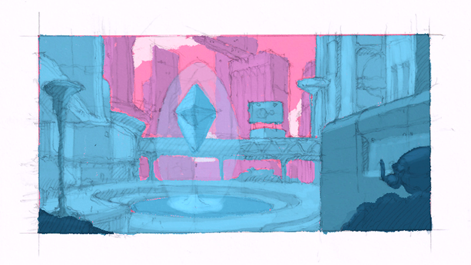
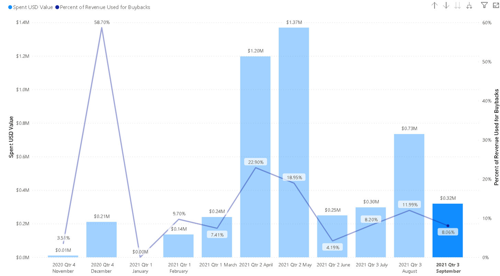
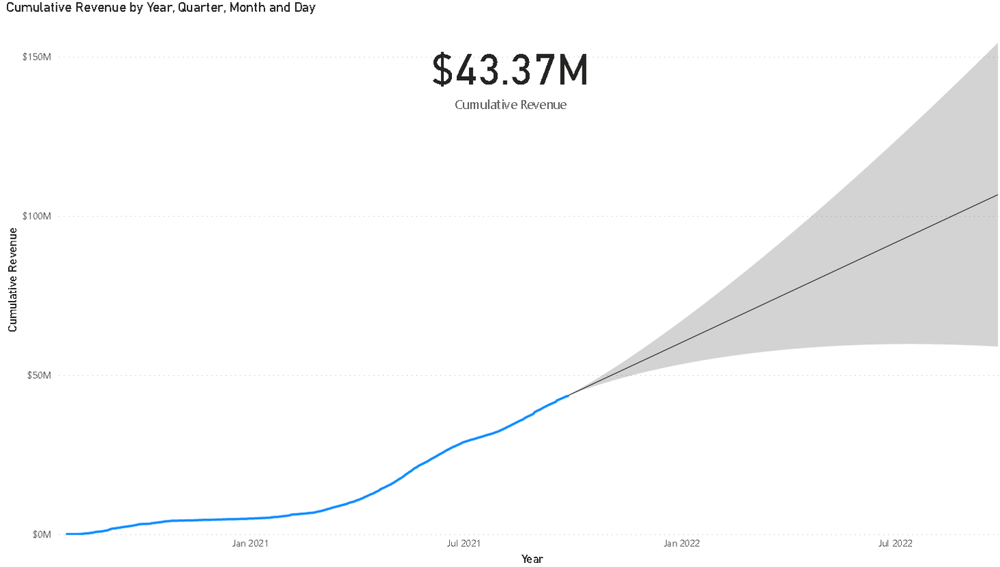

# Yearn Finance Newsletter #47

### Ende der Woche 26. September, 2021

> Willkommen zum 47. Teil des Yearn Finance Newsletter. Das Ziel dieses Newsletters ist es die Yearn und Crypto Community auf dem neusten Stand der Entwicklungen bei Yearn zu halten, mitsamt neuer Produktstarts, Veränderungen im Managementprozess und Neuigkeiten die im gesamten Ökosystem aufkommen. Wenn Sie daran interessiert sind mehr über Yearn Finance zu erfahren, folgen Sie unserem offiziellen [Twitter](https://twitter.com/iearnfinance) und [Medium](https://medium.com/iearn) Account. 

## Zusammenfassung

-   Introducing V3 of Yearn’s UI /// Einführung von V3 der Yearn Benutzeroberfläche 
    
-   Check Out the New Labs Section /// Neue "Labs" Rubrik
    
-   Yearn Has Purchased $320K of YFI in September /// Yearn hat im September YFI in Höhe von 275Tsd € gekauft 
    
-   Cumulative Protocol Revenue Reaches $43M /// Kummulative Protokolleinnahmen erreichen 37M €
    
-   Vaults at Yearn /// Vaults bei Yearn 
    
-   Ecosystem News /// Ökosystem Updates
    

## Einführung von V3 der Yearn Benutzeroberfläche

Diese Woche haben wir die neue Version 3 der Yearn Benutzeroberfläche für beta-Benutzer freigeschaltet. Dieses neue, übersichtliche Benutzerinterface stellt alle Informationen dar, die Sie für einen Gesamtüberblick über Ihre Finanzen brauchen, inklusiver eines Überblicks vergangener, sowie jährlicher Gewinne. Außerdem werden nun "simulierte Transaktionen" unterstützt, durch die Sie nie wieder unerwartete slippage-Mehrkosten oder gescheiterte Transaktionen erdulden müssen.
This week, we have opened up the new Yearn v3 to users in beta. The new friendlier interface surfaces all the data you need for a birds-eye view of your holdings and historical plus yearly earnings. It also simulates transactions so you don't get unexpected slippage or failed transactions.

Von Grund auf an neu gebaut, ist v3 die Umsetzung einer gemeinsamen Vision eines effizienten, skallierbaren Systems, das für die Blockchain-übergreifende Zukunft bereit ist. Die Hauptkomponenten des v3 stacks wurden aufgeteilt in: Lens, Meta, Subgraph, Exporter, SDK, and Front-end. 
Rebuilt from the ground up, v3 is the realization of a shared vision of a lightweight, scalable system ready for the multichain future. The core components of the Yearn V3 stack have been divided up into multiple distinct components: Lens, Meta, Subgraph, Exporter, SDK, and Front-end. 

Auch für mobile Nutzer haben wir die Benutzeroberfläche neu aufgesetzt und neue Reiter wie Home, Wallet, Labs, Iron Bank und Settings hinzugefügt. Zusätzlich werden wir verschiedene Webseitendesigns ermöglichen, wobei einige nur für Halter bestimmer NFTs freigeschaltet sein werden. Besuchen Sie [galaxy.eco/yearn](https://galaxy.eco/yearn) für NFTs, die möglicherweise für zukünftige Designs infrage kommen. 
As for the UI, we have revamped the Yearn experience for mobile users and added new sections such as the Home, Wallet, Labs, Iron Bank, and Settings pages. Additionally, there will be multiple UI themes, with some being unlockable for specific NFT holders. See [galaxy.eco/yearn](https://galaxy.eco/yearn) for potential NFTs that qualify for future themes.

Danke an die Yearn Community und alle Mitwirkenden, die uns geholfen haben in die Tat umzusetzen. Wenn Sie auch daran interessiert sind mitzuwirken, schließen Sie sich unserem öffentlichen [discord](https://discord.gg/8rF374XkXy) Server an, erstellen eine Problemanfrage in unseren [repos](https://github.com/yearn), die auf unserem [medium](https://medium.com/iearn/yearn-ui-v3-0-a194355bdb1f) verlinkt sind oder teilen Sie ihre Designs mit uns auf [twitter](https://twitter.com/iearnfinance)!
Thank you to the Yearn community and all the contributors at Yearn who helped to make this happen. If you’d like to contribute, come join our public [discord](https://discord.gg/8rF374XkXy), create an issue in one of the [repos](https://github.com/yearn) linked in the [medium](https://medium.com/iearn/yearn-ui-v3-0-a194355bdb1f), or share your designs with us on [twitter](https://twitter.com/iearnfinance)!

Einen tiefergehenden Bericht über die v3 UI finden Sie [hier](https://medium.com/iearn/yearn-ui-v3-0-a194355bdb1f).
Read an in-depth rundown on the V3 UI [here](https://medium.com/iearn/yearn-ui-v3-0-a194355bdb1f).

Testen Sie es aus [beta.yearn.finance](https://beta.yearn.finance/).
Check out [beta.yearn.finance](https://beta.yearn.finance/).

## Neue "Labs" Rubrik

Wir präsentieren: Die Labs Rubrik der neuen Yearn v3 Benutzeroberfläche, eine Ansammlung experimenteller Vaults, die die Grenzen der Zinsgenerierung auf dem Gebiet der dezentralen Finanzen (DeFi) neu definiert. Lassen Sie uns einen Blick in die neuen Vaults werfen.
Introducing the Labs section on the new Yearn V3 UI, a set of experimental vaults that push the boundaries of yield in DeFi. Let’s take a look at these new vaults.

Die Vaults der Labs Rubrik gehören nicht den üblichen Vaults an. Yearn vaults wurden nach der Idee entwickelt, die betroffenen Vermögenswerte ausschließlich "long" zu spielen, während der Benutzer jederzeit die Möglichkeit hat Einsätze aus dem Vault zurückzuziehen.
Sie, als der Teil der Community, haben auf verschiedenen Platformen und unserer Kundenumfrage nach den unterschiedlichsten Vault-Strategien gefragt. Wir haben das ernstgenommen.
The vaults that live in the LABS section are not the usual Yearn vaults. Yearn vaults were created with the idea of being long only and that users could withdraw at any time. You asked for different types of vaults and strategies on various platforms and our recent product survey. We listened!

In Labs sind Experimente die Norm, nicht die Ausnahme. Lesen Sie was jeder Vault macht, aber bitte lesen Sie es aufmerksam. Strategien könnten Abhebungssperren und temporäre Verluste im Streben nach erhöhten, nachhaltigen langzeit-Zinsen beinhalten.
In labs, experimentation is the norm, not the exception. Read what each vault does, and read carefully. Strategies may allow lock-ups and the potential for temporary losses in pursuit of increased, long-term sustainable yield.

Vielleicht kennen Sie bereits die yveCRV, yvBOOST und unser yvBOOST-ETH pJar (in Kollaboration mit Pickle Finance), welche bereits in Labs aktiviert sind. Wir werden in Kürze mehr Vaults zu Labs hinzufügen. Mit detailierten Beschreibungen für jeden Vault. 
You may already know yveCRV, yvBOOST, and our yvBOOST-ETH pJar (a collab with Pickle Finance), which are now live in Labs. We will shortly be adding more vaults to Labs, with detailed pages for each.

Schauen Sie also gerne in unser Labs Rubrik vorbei [beta.yearn.finance/#labs](https://beta.yearn.finance/#/labs) und kommen Sie bald zurück für weitere Ergänzungen und Strategien. Bitte bedenken Sie, dass diese Vaults -wie bereits angedeutet- risikoreicher als unsere Haupt-Vaults sind, da einige eventuell Abhebungssperren, impermanente Verluste und zahlreiche andere Risiken beinhalten können. 
So, check out Labs at [beta.yearn.finance/#labs](https://beta.yearn.finance/#/labs) and come back for more emerging strategies. Just remember, these vaults are usually riskier than others, as they can involve token locking, impermanent loss, and various other risks.

## Yearn hat im September YFI in Höhe von 275Tsd € gekauft

In Übereinstimmung mit YIP-56: Buyback and Build Yearn, nach der Abstimmung im Januar 2021, hat die Yearn Treasury zusätzliche 275Tsd € an YFI gekauft. 
In accordance with YIP-56: Buyback and Build Yearn, which was passed in January 2021, the Yearn Treasury has purchased an additional $320K worth of YFI.

Die Yearn Treasury wird zukünftig von Protokollgewinnen zusätzliche YFI kaufen bis eine neue Abstimmung in Kraft tritt, die diese buyback-policy verändert. Informieren Sie sich über das BABY proposal [hier](https://snapshot.org/#/yearn/proposal/Qmb6gBzjvgLMazSrQQGVcjutLNdkVyM2Lh6yckMzdoaHWZ). 
Yearn Treasury will periodically purchase additional YFI in the future using profits earned by the protocol until a new governance proposal is passed that alters this buyback policy. You can read about the BABY proposal [here](https://snapshot.org/#/yearn/proposal/Qmb6gBzjvgLMazSrQQGVcjutLNdkVyM2Lh6yckMzdoaHWZ). 

Informationen über die Rückkäufe können [hier](https://www.yfistats.com/financials/YFIBuybacks.html) gefunden werden.
Data on the buybacks can be found [here](https://www.yfistats.com/financials/YFIBuybacks.html).

## Kummulative Protokolleinnahmen erreichen 37M €

Yearn hat seit Protokollstart Einnahmen in Höhe von 37M € verzeichnet (exklusive Zinsen generiert durch Anleger). In den letzten 30 Tagen wurden knapp 5,2M € Einnahmen durch das Protokoll generiert. Unter Verwendung dieser Daten ergibt sich eine prognostizierter Schätzwert jährlichen Einkommens in Höhe von knapp 60,3M €. 
Yearn has earned nearly $43 million in revenue, since launch (excluding the interest earned by depositors). In the past 30 days, nearly $6 million dollars in revenue has been generated by the protocol. An extrapolation of this data projects annual revenue to be nearly $70 million. 

Yearns kummulative Einnahmen und andere Statistiken sind [hier](https://www.yfistats.com/) einsehbar.
Yearn’s cumulative revenue and other statistics are viewable [here](https://www.yfistats.com/).

## Vaults bei Yearn

Sie können [hier](https://medium.com/yearn-state-of-the-vaults/the-vaults-at-yearn-9237905ffed3) eine detaillierte Beschreibung aller Strategien der aktiven Vaults nachlesen. 
You can read a detailed description of the strategies for all of our active yVaults [here](https://medium.com/yearn-state-of-the-vaults/the-vaults-at-yearn-9237905ffed3).

## Ecosystem News

[Lesen Sie darüber wie MetaGuild die Coordinape Infrastruktur nutzt](https://twitter.com/metaguildcom/status/1440368717888557068)

[Tracheopteryx and 0xMaki sprechen über DAO Design bei dem Messari Mainnet Event](https://twitter.com/MessariCrypto/status/1440412651457110020)

[Steakwallet unterstützt Yearn vaults in-app](https://twitter.com/steakwallet/status/1440734147194994694)

[Donut baut eine Endnutzer-freundliche Spareinlagen App mit Yearns Infrastruktur](https://twitter.com/bantg/status/1438680337735987209)

[Yearn Bounties sind auf Flipside Crypto gestartet](https://twitter.com/flipsidecrypto/status/1438613782507446273)

[Nutzen Sie yvFTM als Sicherheit auf abracadraba.money auf Fantom](https://twitter.com/MIM_Spell/status/1441912161001820161?s=20)

[Besuchen Sie das neue Yearn Fundamentaldaten Dashboard auf Token Terminal](https://twitter.com/iearnfinance/status/1441179921523507200)
