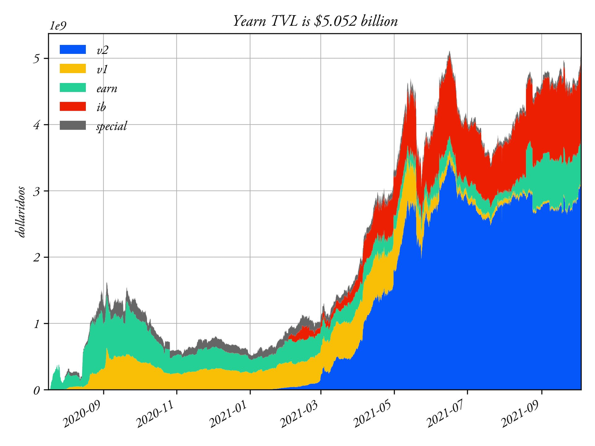
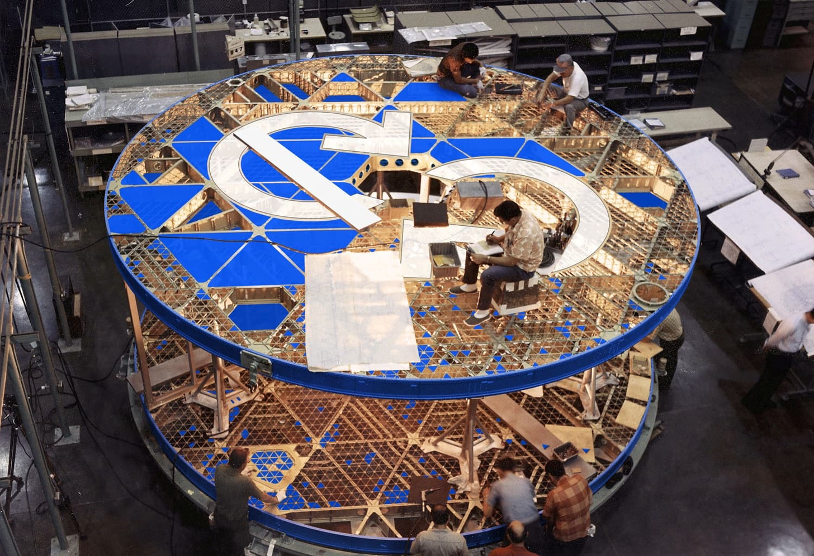
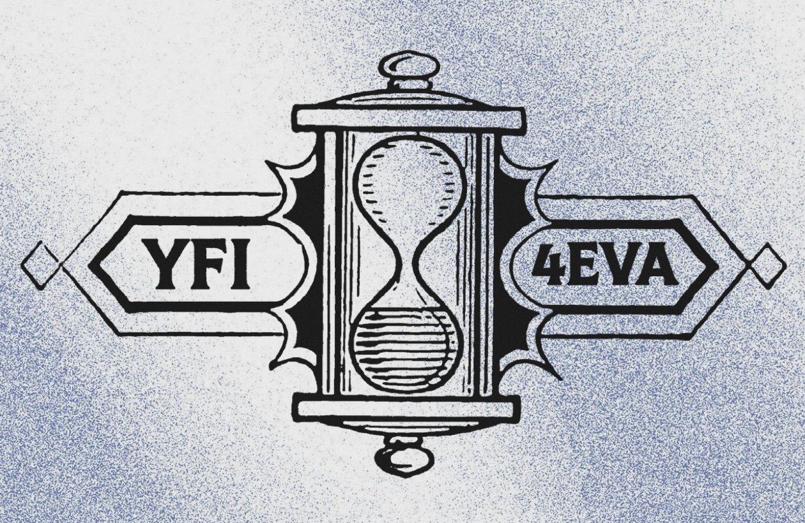

# Newsletter #47 de Yearn Finance

### Semana del 16 de Octubre de 2021

Bienvenidos a la edición número 47 de la newsletter de Yearn Finance. Nuestro objetivo es mantener informada a la comunidad de Yearn y de cripto en general con las últimas noticias, incluyendo lanzamiento de productos, cambios de gobernanza y actualizaciones del ecosistema. Si estás interesado en aprender más sobre Yearn Finance, sigue las cuentas oficiales de [Twitter](https://twitter.com/iearnfinance) y [Medium](https://medium.com/iearn).

## Resumen

-   Yearn se convierte en multicadena con Fantom
    
-   Yearn alcanza los $5.000 millones de TVL (de nuevo)
    
-   Cómo puede contribuir a Yearn
    
-   Convocatoria de ideas: Renovación de Tokenomics de YFI
    
-   Transparencia en Yearn
    
-   Vaults en Yearn
    
-   Noticias del ecosistema

## Yearn se convierte en multicadena con Fantom

El Reino Multicadena llama. Y Yearn ha atendido la llamada. 

Hoy, nos volvemos multicadena con el lanzamiento de Iron Bank Fantom y las primeras bóvedas de Fantom en

https://beta.yearn.finance

Te preguntarás, “¿Por qué multicadena ahora?”. Esto se debe a que Yearn requiere una infraestructura específica para funcionar de forma segura y eficiente, tanto externa (Gnosis safe, liquidez DEX, explorador de bloques) como interna (frontend y backend).

La base de código de nuestra bóveda v2 se ha endurecido en los últimos meses, y el nuevo sitio web beta es un gran avance que nos permite cambiar de cadena con relativa facilidad, algo que no podíamos hacer en el pasado.

Fantom es rápido, fácil de usar y fácil de conectar gracias a Anyswap. Además, está bien respaldado por nuestras herramientas de desarrollo y por nuestros socios de Iron Bank en CREAM Finance. Consulte el artículo sobre Iron Bank en Fantom [aquí](https://medium.com/cream-finance/c-r-e-a-m-dd4982004bb9).  
  
Y no está de más que Andre Cronje sea un gran admirador.

Las primeras bóvedas en Fantom son: yvWFTM, yvUSDC, yvDAI y yvMIM. También lanzamos soporte para un Iron Bank en Fantom nativo. Dirígase a [beta.yearn.finance](https://beta.yearn.finance) para comprobarlas usted mismo.

Así que para responder a sus preguntas sobre cuándo llegarán Arbitrum, Optimism, Polygon, Avalanche y otros, definitivamente habrá más diversión multicadena pronto. Por último, nos encantaría llevar Yearn a cualquier cadena en la que podamos operar con seguridad y simplificar el proceso de obtención de rendimiento para los usuarios y socios.

El Dominio se expande y nosotros también. Queremos conocer a las personas donde sea que estén, incluidos los nuevos usuarios y los usuarios con depósitos más pequeños. Expandirse a varias cadenas es la forma natural de hacer esto.

¿Tiene preguntas o quiere saber más? Únase a nosotros en Telegram o [Discord](https://discord.com/invite/SNPvCpjRET).

## Yearn alcanza los $5.000 millones de TVL (de nuevo)

 

El valor total bloqueado en todos los productos de Yearn ha vuelto a superar los $5.000 millones, y sólo en el último mes se han añadido $1.000 millones. Yearn continúa experimentando un crecimiento parabólico entre sus productos sin indicios de que vaya a frenar. Iron Bank y las bóvedas v2 son componentes particularmente notables de nuestro crecimiento exponencial. Puede ver y seguir las métricas de TVL entre nuestros productos utilizando [yearn.science](https://yearn.science/). 

Muchas gracias a todos los integrantes del ecosistema de Yearn, a nuestros socios y, por supuesto, a ustedes, los usuarios.

## Cómo puede contribuir a Yearn

 

Te preguntarás: "¿Cómo puedo contribuir a Yearn?". Por un lado, Yearn no tiene documentos de incorporación, ni sede, ni siquiera una lista de nombres y ubicaciones de sus contribuyentes. Es un experimento radical de descentralización y así es cómo puede involucrarse fácilmente.

Visite nuestra página pública en [yearnfinance.notion.site](https://yearnfinance.notion.site). Aquí, aprenderá sobre la estructura descentralizada de Yearn, la cultura del hacer, los roles abiertos y cómo ponerse en contacto.

¿Quiere lanzarse ahora y empezar a hacerlo? 1. Visite [contrib.yearn.rocks](https://contribute.yearn.rocks) 2. Escanee la lista de tareas disponibles 3. ¡Haz una que quieras hacer!

¿No ve una tarea que desea hacer en la lista? Perfecto. Puede que sepa qué es Yearn mejor que nosotros. Venga a mostrarnos. Envíe su idea a nuestro [grupo de ideas](https://yearnfinance.notion.site/Pool-of-Ideas-d75383ade9154d8bb6163388c6c2b39b). O únase a nosotros en [Discord](https://discord.com/invite/6PNv2nF) y comparta su voz.

Cómo farmear YFI trabajando para un DAO: cuando otros colaboradores de Yearn vean su trabajo, ¡pueden responder por usted en Coordinape Gorilla y estará en camino de ganar YFI! Eche un vistazo a Coordinape [aquí](https://coordinape.com).

Esto es lo que creemos: si has caído en el pozo de gravedad de Yearn, hay una razón. Choquemos contra lo imposible y veamos si se mueve.

Estamos construyendo un barco. Llevará a todo el que quiera embarcar. Cualquier edad, cualquier género, cualquier cosmovisión. Todos son bienvenidos. Yearn es un barco de la flota del mañana. Y lo único que importa es que naveguemos.

¿Y si el componente más radical de Yearn no es, después de todo, la máquina de rendimiento? La máquina es un aparato técnico construido con código. No puede existir sin su red de corazones y mentes.

Quizás la propia red es la parte más radical de Yearn... nuestra DAO única y quienes lo encarnan. Quizás el componente más radical de Yearn pronto seas tú.

Consulte más detalles [aquí](https://twitter.com/iearnfinance/status/1445799269189881864?s=20).

## Convocatoria de Ideas: Renovación de Tokenomía de YFI

Con el renovado interés por la tokenomía de YFI en los últimos días y el desarrollo del protocolo v3 todavía en una fase suficientemente maleable, podría ser un buen momento para unir adecuadamente ambos. Todo está sobre la mesa, ya sea la división de tokens, minería de liquidez, emisión de cola y bloqueos al estilo veCRV. Si comenzara YFI ahora mismo, ¿cómo lo estructuraría? Esperamos las sugerencias de nuestra comunidad y nos encantaría ponerlas en práctica en el futuro.

Consulte la publicación del foro [aquí](https://gov.yearn.finance/t/call-for-ideas-yfi-tokenomics-revamp/11573/8).

## Transparencia en Yearn

Mediante la transparencia y la verificabilidad on-chain, creemos firmemente que las criptomonedas cambiarán el mundo. Yearn espera ejemplificar esta transparencia y, a continuación, mostramos algunos ejemplos.

Consulte los balances, el EBITDA, los ingresos y más de Yearn cada trimestre: [https://github.com/yearn/yearn-pm/blob/master/financials/reports/2021Q2-yearn-quarterly-report.pdf](https://github.com/yearn/yearn-pm/blob/master/financials/reports/2021Q2-yearn-quarterly-report.pdf)

De hecho, puede seguir cada una de las transacciones relacionadas con Yearn en tiempo real en [yfistats.com](https://www.yfistats.com/). Allí, encontrará varios clasificables: registros de transacciones, ingresos de protocolo, gastos de protocolo, declaraciones de ingresos, balances de fin de mes, reservas, proyecciones de ingresos, recompras de $YFI y mucho más. Toda esta información está cuidadosamente seleccionada por el equipo de yBudget y, como siempre, es de libre acceso para todos.

¿No le gustan los sitios web? Incluso puede seguir nuestros ingresos con "bots de colectas" personalizados en [Discord](https://discord.com/invite/6PNv2nF) y [Telegram](https://t.me/yfi_harvest_tracker).

¿Quiere unirse a una de las plataformas más abiertas y transparentes de la historia? Buenas noticias: le mostramos exactamente cómo puede contribuir con una lista de tareas a la espera de nuevos colaboradores: https://contribute.yearn.rocks

El futuro está aquí, simplemente no está distribuido de manera uniforme.

Gracias a la comunidad de Yearn y a todos los colaboradores de Yearn que ayudaron a que esto sucediera. Si desea contribuir, únase a nuestro [Discord](https://discord.gg/8rF374XkXy) público , cree un problema en uno de los [repositorios](https://github.com/yearn) vinculados en el [Medium](https://medium.com/iearn/yearn-ui-v3-0-a194355bdb1f), ¡o comparta sus diseños con nosotros en [twitter](https://twitter.com/iearnfinance)!

Lea un hilo en profundidad sobre la transparencia de Yearn [aquí](https://twitter.com/iearnfinance/status/1445143482830446600?s=20).

Consulte las vaults [aquí](http://yearn.finance/vaults).

## Vaults en Yearn

Puede leer una descripción detallada de las estrategias de todas nuestras yVaults activas [aquí](https://medium.com/yearn-state-of-the-vaults/the-vaults-at-yearn-9237905ffed3).

## Noticias del ecosistema

[Los usuarios de MyEtherWallet ahora tienen acceso a las vaults de Yearn en la aplicación de Android](https://twitter.com/myetherwallet/status/1443283619867414537)

[storming0x se ha unido a yAcademyDAO, donde comenzará a auditar una estrategia de reequilibrio para Yearn](https://twitter.com/yAcademyDAO/status/1443138482604371974)

[Consulte un informe completo sobre Yearn escrito por el equipo de Diseño Económico](https://econteric.com/fundamentals/yearn-finance/)

[Obtenga APR fijo en su YFI o especule sobre el rendimiento variable de YFI en Aave en 88mph](https://twitter.com/88mphapp/status/1445880439420325889)

[Se ha creado una propuesta para donar airdrops de votantes de Curve a yvBOOST](https://gov.yearn.finance/t/donate-curve-voter-airdrops-to-yvboost/11587)

[Consulte un resumen de problemas y soluciones que yAcademyDAO ha realizado recientemente para una estrategia Yearn](https://twitter.com/yAcademyDAO/status/1445414387573997569)

[Como integradores, instamos a los holders de COMP a votar para cancelar la aprobación de la Propuesta Compuesta 63](https://twitter.com/bantg/status/1445312250827390979?s=20)

[Los portafolios de Yearn v2 en Fantom ahora se registran en DeBank](https://twitter.com/DeBankDeFi/status/1446624448744886273)

[Hilo breve sobre Yearn y el futuro de Wot \ _Is \ _Goin \ _On](https://twitter.com/Wot_Is_Goin_On/status/1446540007292952579)
