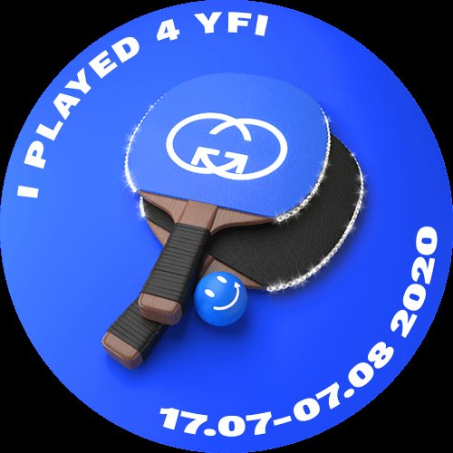
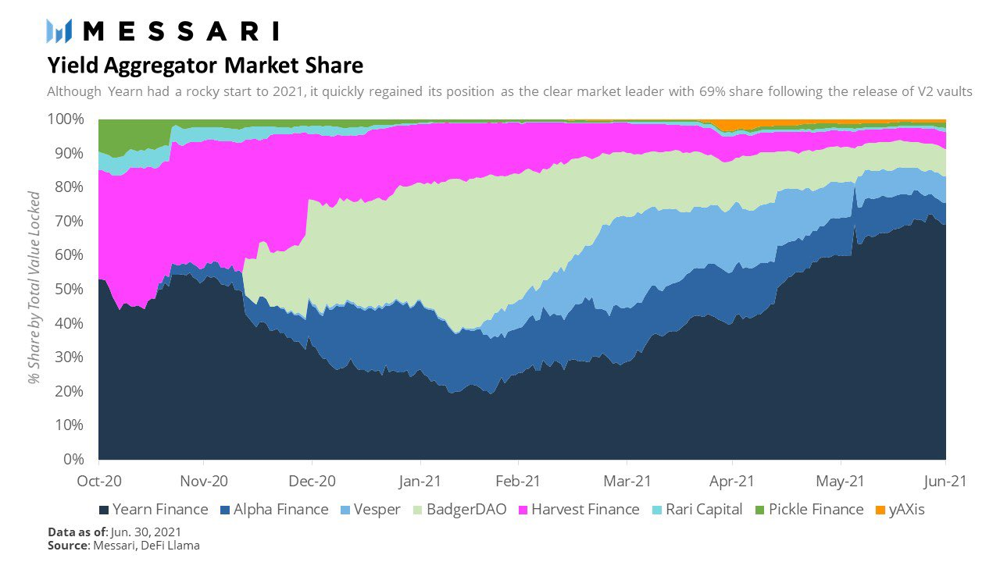
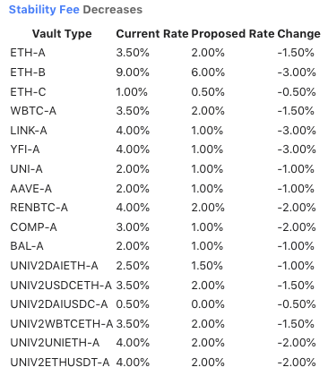

# Yearn Finance Newsletter #41

Καλώς ήρθατε στην 41η έκδοση του ενημερωτικού δελτίου του Yearn Finance. Στόχος μας με αυτό το ενημερωτικό δελτίο είναι να ενημερώνουμε την κοινότητα Yearn καθώς και την ευρύτερη κοινότητα κρυπτονομισμάτων για τα τελευταία νέα, συμπεριλαμβανομένων νέων προϊόντων, των αλλαγών διακυβέρνησης και των ενημερώσεων του οικοσυστήματος. Εάν ενδιαφέρεστε να μάθετε περισσότερα για το Yearn Finance, ακολουθήστε τους επίσημους λογαριασμούς μας [Twitter](https://twitter.com/iearnfinance) και [Medium](https://medium.com/iearn).
## Σύνοψη

- Εορτασμός του πρώτου έτους του YFI
- Αύξηση στο μερίδιο αγοράς του Yearn στην αγορά των Aggregator
- Προσθήκη του Yearn στο Compound
- Μείωση στο Επιτόκιο Δανεισμού του YFI στο MakerDAO
- Θησαυροφυλάκια στο Yearn
- Νέα του οικοσυστήματος

## Εορτασμός του πρώτου έτους του YFI

Πριν από ένα χρόνο, στις 17 Ιουλίου 2020, κυκλοφόρησε το YFI token. Σας ευχαριστούμε όλους που δημιουργήσατε μια αξέχαστη στιγμή στο DeFi και ένα πλέον από τα ισχυρότερα οικοσυστήματα DeFi.

Χάρη στο [loldefi](https://twitter.com/loldefi), μπορείτε να βρείτε ρουχισμό για τον εορτασμό της επετείου του YFI [εδώ](https://ymerch.finance/).

## Αύξηση στο μερίδιο αγοράς του Yearn στην αγορά των Aggregator

Το 2ο τρίμηνο του 2021, το μερίδιο αγοράς της Yearn στην αγορά συσσωρευτών απόδοσης (yield aggregators) αυξήθηκε από 29% σε 69%. Είδαμε μια εντυπωσιακή αύξηση 136% στο AUM μας, καθώς έφτασε τα πέντε δισεκατομμύρια δολάρια. Εργαζόμαστε συνεχώς για να σας βρίσκουμε τις καλύτερες αποδόσεις προσαρμοσμένες στον κίνδυνο της αγοράς. Καταθέστε κεφάλαιο στα yVault μας και αφήστε τους Στρατηγούς να κάνουν όλη τη σκληρή δουλειά για εσάς.

Δείτε περισσότερες λεπτομέρειες σχετικά με το Yearn και τα γενικά αναλυτικά στοιχεία του DeFi σε αυτό το [άρθρο](https://messari.io/article/q2-21-defi-review?utm_source=ryanwatkins_&utm_medium=tweet&utm_campaign=q2-21-defi-review) από το Messari .

## Το Yearn θα προστεθεί στο Compound

Έχει δημιουργηθεί μια πρόταση και έχουν αναπτυχθεί τα έξυπνα συμβόλαια για την προσθήκη του YFI ως αγοράς στο Compound Finance. Κάθε token θα έχει μηδενικό συντελεστή εξασφαλίσεων (αρχικά), το ίδιο μοντέλο επιτοκίου (όπως το COMP/LINK) και συντελεστή αποθεματικού 25% για κάθε αγορά (που είναι τυπικό).

Στο εγγύς μέλλον, οι παράγοντες εξασφαλίσεων θα αυξηθούν και οι χρήστες θα μπορούν να προμηθεύουν το YFI στο Compound και να δανείζονται νομίσματα με αυτήν την εγγύηση.

Δείτε περισσότερες λεπτομέρειες σχετικά με την ανάρτηση στο φόρουμ του Compound [εδώ](https://www.comp.xyz/t/add-markets-mkr-aave-sushi-yfi/1977).

## Το επιτόκιο δανεισμού YFI μειώθηκε στο MakerDAO

Η MakerDAO μείωσε τη χρέωση σταθερότητας του YFI-A στο 1% και του ETH-C στο 0,50%. Αυτό είναι απίστευτα ωφέλιμο για τις στρατηγικές YFI και ETH του Yearn, καθώς μειώνουν το κόστος δανεισμού. Το μειωμένο κόστος κεφαλαίου δημιουργεί μεγαλύτερη καθαρή απόδοση για τους χρήστες, βελτιώνοντας τα κέρδη.

Περισσότερα για τις αλλαγές μπορείτε να διαβάσετε [εδώ](https://forum.makerdao.com/t/maker-relay-ep-53/9305) και τα θησαυροφυλάκια μπορείτε να τα βρείτε [εδώ](https://yearn.finance /vaults).
## Τα θησαυροφυλάκια του Yearn

Μπορείτε να διαβάσετε μια λεπτομερή περιγραφή των στρατηγικών για όλα τα ενεργά yVault μας [εδώ](https://medium.com/yearn-state-of-the-vaults/the-vaults-at-yearn-9237905ffed3).

## Νέα Οικοσυστήματος

[Η Element Finance λανσάρει το τρίτο της περιουσιακό στοιχείο, το crvSTETH, το οποίο βασίζεται στο Yearn για σταθερή απόδοση](https://twitter.com/element_fi/status/1414990472569831427)

[Με τα Yearn, Keep3r και Flashbots, έλαβε χώρα μια μυστική συναλλαγή Keep3r για την ελαχιστοποίηση του MEV](https://twitter.com/lbertenasco/status/1415016369771491330)

[Το Powerpool’s YLA, ένα καλάθι με θησαυροφυλάκια Yearn επανισορροπήθηκε αυτόματα](https://twitter.com/powerpoolcvp/status/1414682829359812615)

[Τα Woofy NFT του Yearn και του Project Galaxy μπαίνουν στα κορυφαία 50 με βάση όγκο συναλλαγών στο OpenSea](https://twitter.com/ProjectGalaxyHQ/status/1414868634862710789)

[Το MahaDAO εφαρμόζει το πλαίσιο συντονισμού Coordinape του Yearn για τις λειτουργίες του DAO](https://twitter.com/TheMahaDAO/status/1414620121528680451)

[Εισαγάγετε εύκολα  το μαγικό εργαλείο τιμής του Yearn σε οποιοδήποτε script python με το ypricemagic του BobTheBuidler](https://github.com/BobTheBuidler/ypricemagic)

[Η Alchemix επανακυκλοφορεί το διακριτικό alETH, που υποστηρίζεται από τα θησαυροφυλάκια Yearn WETH](https://twitter.com/AlchemixFi/status/1414647769470443521)

[Η Ribbon Finance δημιουργεί ένα θησαυροφυλάκιο με δυνατότητα πώλησης με το yvUSDC ως εγγύηση](https://twitter.com/ribbonfinance/status/1415298793419968513)

[Το Yearn Risk Dashboard σάς επιτρέπει να αναλύσετε και να δείτε πού έχουν αναπτυχθεί τα κεφάλαια κάθε στρατηγικής](https://yearn-finance.vercel.app/system/vault/0x19D3364A399d251E894aC732651be8B0E4e85001)

[Εγγραφείτε στο Fair Launch Summit με τους Yearn, Sushiswap, Alchemist και άλλα](https://twitter.com/_alchemistcoin/status/1415646390978453508)
