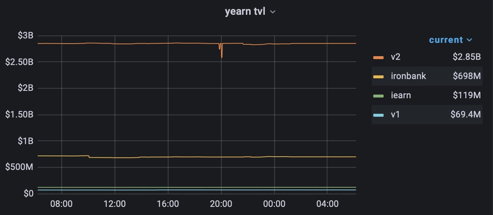
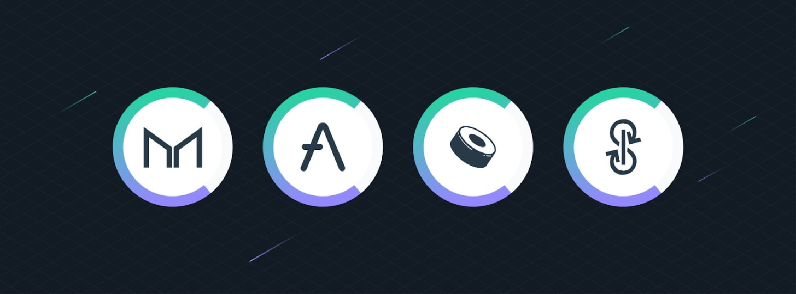

# Yearn Finance Newsletter #43

Welcome to the 43rd edition of the Yearn Finance Newsletter. Our aim with this newsletter is to keep the Yearn and the wider crypto community informed of the latest news, including product launches, governance changes, and ecosystem updates. If you're interested in learning more about Yearn Finance, follow our official [Twitter](https://twitter.com/iearnfinance) and [Medium](https://medium.com/iearn) accounts.

## **Summary**

- YIP-63: Fund Builder-First Legal Activism DAO
- Alchemix Migrates to Yearn v2
- YFI Added To Compound Finance
- Swap Between Yearn Vaults In One Transaction
- Vaults at Yearn
- Ecosystem News

## **YIP-63: Fund Builder-First Legal Activism DAO**

Amidst intensifying regulatory scrutiny of DeFi, it has been proposed that the LeXpunK_DAO should be dedicated to legal advocacy for yearn and other builder-centric DeFi communities. The LeXpunK_DAO will be governed by builders from contributing communities (including yearn) and practicing lawyers from the LeXpunK Army 146.

5% of the current supply of L3X, the non-transferable governance token of the LeXpunK Army, will be airdropped to YFI holders who support this proposal, in order to enable direct sentiment polling on relevant legal issues from the Yearn community. LeXpunK will effect additional airdrops from time to time, proportionally in line with the relative contributions of other builder communities, with the goal of forming a broad coalition to pool resources for funding shared advocacy goals.

Comments from U.S. representatives such as Gary Gensler, chairman of SEC, have been incredibly worrying for the future of DeFi, and LeXpunK_DAO aims to alleviate the concerns that regulators may have via campaigns, raids, and other methods clearly laid out in the proposal.

Read the full proposal on Yearn's forum [here](https://gov.yearn.finance/t/yip-63-fund-builder-first-legal-activism-dao/11280).

The YIP was approved. You can see results [here](https://gov.yearn.finance/t/proposal-fund-builder-first-legal-activism-dao/11280).

## **Alchemix Migrates to Yearn v2**

Alchemix has successfully migrated to the latest yvDAI. The small spike on the graph is $400m moving from the v1 vaults to the v2 vaults. We are proud to be the top yield backend for DeFi.

Yearn has experienced exponential growth in the past few months, and some of this can be attributed to our partners such as Alchemix using Yearn as vault infrastructure. We expect this growth to continue, as our vaults provide some of the best risk-adjusted returns in DeFi, while also being the most simple. Let Yearn do the hard work for you and continuously compound your funds.

Check out the vaults [here](https://yearn.finance/vaults).

## **YFI Added To Compound Finance**

YFI has been successfully added to Compound Finance as a market. Currently, it has a zero collateral factor (initially), the same interest rate model (as COMP/LINK), and a reserve factor of 25% for each market (which is standard). In the near future, collateral factors will be increased and users will be able to supply YFI on Compound and borrow coins with YFI collateral. This will enable Yearn strategists to possibly create a YFI farming strategy similar to a current strategy implemented for the YFI vault that utilizes MakerDAO. Thus, users may receive more net yield thanks to this integration, which will generally improve returns. Read more about the MakerDAO strategy [here](https://yearn.fi/invest/0xE14d13d8B3b85aF791b2AADD661cDBd5E6097Db1).

Lend and borrow YFI [here](https://app.compound.finance/).

## **Swap Between Yearn Vaults In One Transaction**

Thanks to some amazing work by pandabuild, TBouder, and Ivan, Bowswap leverages Curve metapools and in-built slippage protection to allow you to swap your vault tokens to ones with higher yield without having to withdraw.

Use this new swap feature [here](https://bowswap.finance/).

## **Vaults At Yearn**

You can read a detailed description of the strategies for all of our active yVaults [here](https://medium.com/yearn-state-of-the-vaults/the-vaults-at-yearn-9237905ffed3).

## **Ecosystem News**

[Element Finance releases fixed yield on USDC, relying on Yearn for its backend](https://twitter.com/element_fi/status/1422934199284215810?s=20)

[Check out Banteg on the cover of Fortune Magazine](https://twitter.com/FortuneMagazine/status/1420803860336152577)

[View the rarity table for The Blue Pill NFTs](https://github.com/banteg/blue-pill#rarity-table)

[Flipside Crypto launches bounties for Yearn](https://twitter.com/BmurrayFlipside/status/1421147576674422788)

[Cozy Finance adjusts Yearn USDC coverage market](https://twitter.com/cozyfinance/status/1422226784674664453)

[Yearn crvTBTC market has gone live on Cozy](https://twitter.com/cozyfinance/status/1422633897490223107)

[Anna Rose and Tarun Chitra from the Zero Knowledge Podcast chat with Facu Ameal and tracheopteryx about Yearn](https://www.zeroknowledge.fm/192)

[Check out the new Keep3r twitter](https://twitter.com/thekeep3r)
