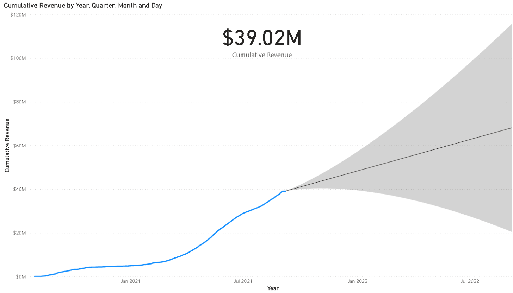

# Newsletter #45 de Yearn Finance 

Bienvenidos a la edición número 45 de la Newsletter de Yearn Finance. Con esta newsletter nuestra idea es mantener informada a la comunidad de Yearn y de cripto en general con las últimas noticias, incluyendo lanzamiento de productos, cambios de gobernanza y actualizaciones del ecosistema. Si estás interesado en aprender más sobre Yearn Finance, sigue las cuentas oficiales de [Twitter](https://twitter.com/iearnfinance) y [Medium](https://medium.com/iearn). 

## **Resumen**

- Los proveedores de liquidez de ALPHA y YFI serán elegibles para un NFT especial
- Recordar migrar a V2
- Como hacer SWAP para entrar a las vaults de Yearn
- Los ingresos acumulados del protocolo alcanzan los 39M de dólares
- Las vaults de Yearn
- Noticias del ecosistema

## **Los proveedores de liquidez de ALPHA y YFI serán elegibles para un NFT especial**

Proveedores de los fondos de liquidez de ETH/FYI en Alpha Homora V2 dentro de Uniswap y Sushiswap serán elegibles para el envío de un NFT especial, cortesía de Yearn, Alpha y Project Galaxy.

El drop se realizará en el transcurso de 3 días completos, en el periodo de 03/09-09/09. Los usuarios que tengan o abran posiciones en los fondos elegibles podrán hacerse con el NFT en la web de Project Galaxy [Aquí](https://galaxy.eco/AlphaFinanceLab/campaign/117).

Los usuarios solo podrán obtener el NFT durante la ventana mencionada y deberán hacerlo con la misma cartera con la que han abierto las posiciones.

ver mas detalles [Aquí](https://twitter.com/AlphaFinanceLab/status/1433689307152195591).

## **Recordar migrar a V2**

Las V2 vaults están activas desde hace meses, es por esto que las vaults V1 se han quedado obsoletas; se han desactivado las estrategias por lo que los usuarios en estas vaults no obtendrán rendimiento. Estas vaults han servido a la comunidad Defi por más de un año como una fuente confiable de rendimiento, y ahora es el momento para hacer una mejora. Como recordatorio, nuestras vaults V2 contienen diversos cambios como la capacidad de desplegar capital a través de diversas estrategias para mayor eficiencia y mejor ajuste de la relación riesgo-rendimiento. Puedes migrar a V2 en cualquier momento sin comisiones.

Echa un vistazo a las vaults aquí en [yearn.finance/vaults](https://yearn.finance/vaults).

## **Como hacer SWAP para entrar a las vaults de Yearn**

Una de las mejores maneras de hacer SWAP de una vault a otra es utilizando [curve.fi](https://curve.fi/) o con la opcion de ZAPS disponible en la interfaz de Yearn. Esto es eficiente con el gas pero puede causar un deslizamiento adicional o comisiones adicionales.

Otra forma de migrar fondos desde Compound y Aave a Yearn es utilizando [bowswap.finance](https://bowswap.finance/). Esto te permite retirar del protocolo y depositar en una vault de Yearn, mostrando a su vez el APY de cada protocolo para poder hacer una comparativa y permitiendo seleccionar múltiples tokens al mismo tiempo. ¡Sin comisiones extras!

Gracias a [cryptouf](https://twitter.com/cryptouf) por hacer la curación de esta pequeña guía.

## **Los ingresos acumulados del protocolo alcanzan los 39M de dólares**

Yearn ha generado ingresos de casi 39 millones de dólares desde su lanzamiento (excluyendo los intereses generados por los depositantes). En los últimos 30 días, casi 5 millones de dolares han sido generados en ingresos del protocolo. Estos datos permiten proyectar ingresos anuales de casi 30 millones de dolares.

Los ingresos acumulados de Yearn y otras estadísticas son visibles [Aquí](https://www.yfistats.com/).

## **Las vaults de Yearn**

Puedes leer la descripción detallada de las estrategias de todas nuestras vaults activas [Aquí](https://medium.com/yearn-state-of-the-vaults/the-vaults-at-yearn-9237905ffed3).

## **Noticias del ecosistema**

[Incentivos de la versión v3 de la red de liquidez de Keep3r](https://twitter.com/AndreCronjeTech/status/1434125562281332737)

[Los usuarios de la vault de SNX califican para airdrop de Thales Market](https://twitter.com/thalesmarket/status/1434889906657144834)

[yvcrvSTETH es agregada a la plataforma de préstamos abracadabra.money](https://twitter.com/MIM_Spell/status/1430975000350281732?s=20)

[The Defiant realiza análisis a profundidad del ecosistema Yearn](https://thedefiant.io/yearn-finance-ecosystem-breakdown-pushing-the-boundaries-of-human-coordination/)

[crvTricrypto, el mercado de cobertura de Yearn, se encuentra activo en cozy.finance](https://twitter.com/cozyfinance/status/1433602125792038913)
