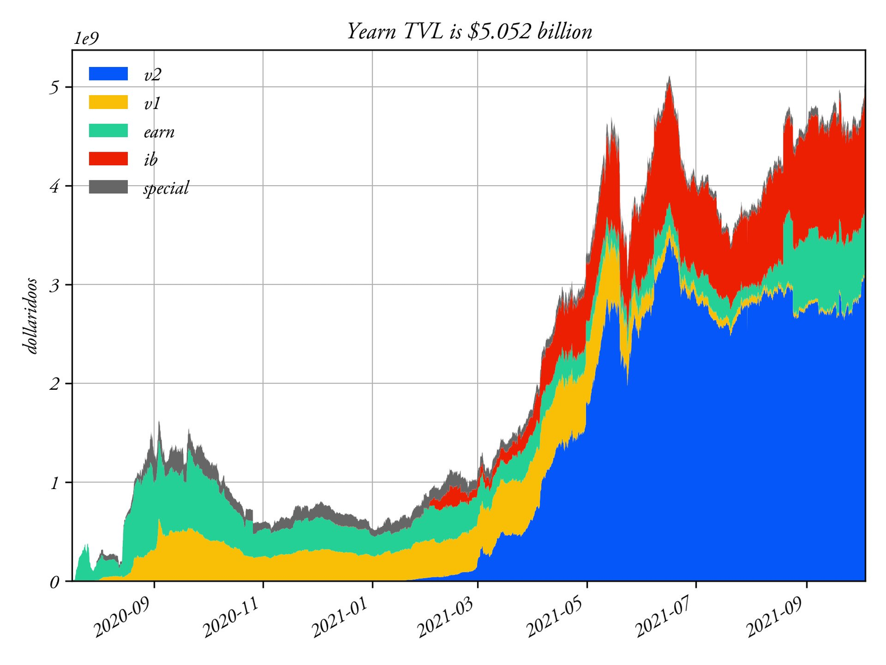
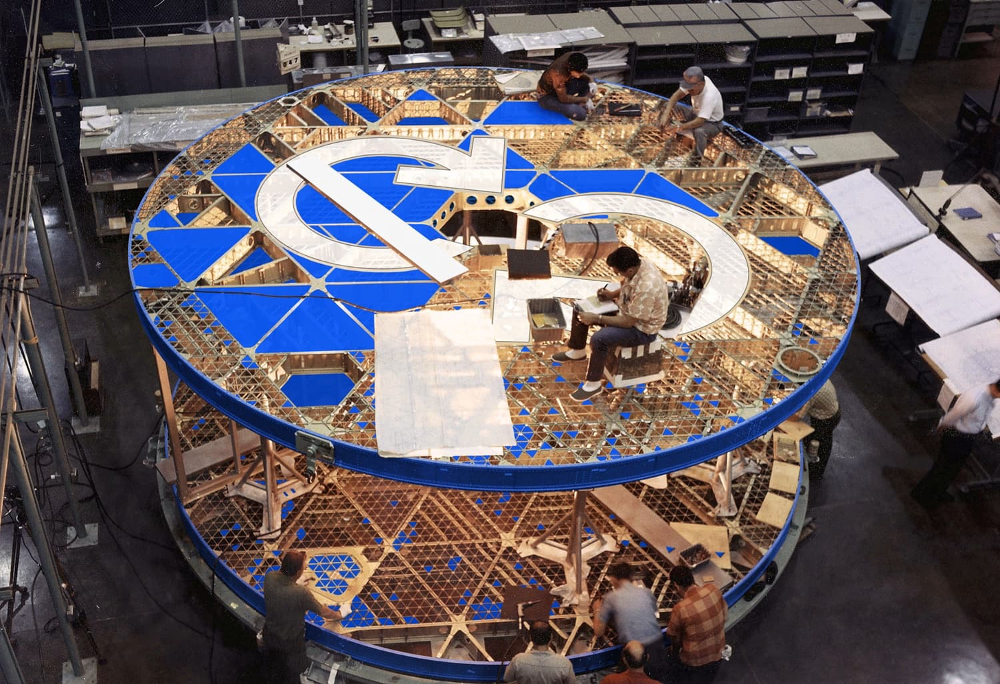
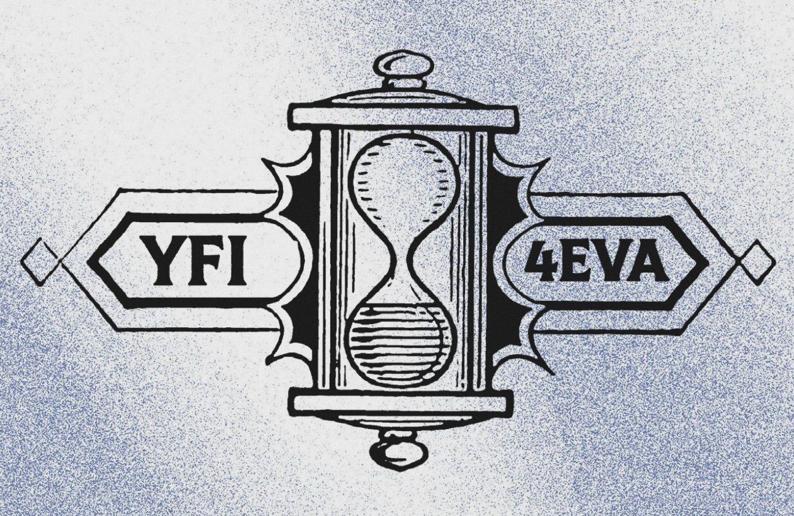

# Bản tin Yearn.Finance Số #48

### Tuần Kết thúc Ngày 10/10/2021

Chào mừng các bạn đến với Bản tin Yearn.Finance Số #48! Chúng tôi hy vọng sẽ truyền tải được những dữ kiện mới nhất cho cộng đồng tiền mã thuật số (`crypto`) nói chung lẫn cộng đồng Yearn nói riêng; từ phát hành sản phẩm, thay đổi trong quản trị đến nhiều dự án đối tác trực thuộc hệ sinh thái Yearn. Nếu quan tâm và muốn biết thêm chi tiết về Yearn.Finance, hãy theo dõi tài khoản [Twitter](https://twitter.com/iearnfinance), [Medium](https://medium.com/iearn) cũng như đón chờ nơi phát hành Tiếng Việt chính thức của chúng tôi.

## Tóm tắt

- Yearn Bắt nhịp Đa-chuỗi (`Multichain`) với Fantom

- Yearn (Lại) Đạt 5&nbsp;Tỷ&nbsp;$ TVL

- Bạn Có thể Đóng góp Phát triển Yearn Như Thế nào

- Kêu gọi Ý tưởng: Cập nhật Mô hình Kinh tế của Tôken YFI

- Sự Minh bạch ở Yearn

- Các Kho bạc (`Vault`) tại Yearn

- Tin tức trong Hệ Sinh thái

## Yearn Bắt nhịp Đa-chuỗi (`Multichain`) với Fantom

Vũ trụ Multichain vẫy gọi. Và Yearn đã trả lời. 

Hôm nay, chúng tôi chính thức bắt nhịp xu hướng đa-chuỗi (`multichain`) với việc phát hành Iron&nbsp;Bank và những kho bạc (`vault`) đầu tiên trên Fantom tại

https://beta.yearn.finance

Nếu bạn đang hỏi, "Tại sao giờ mới đa-chuỗi?”. Đó là do Yearn cần các yếu tố cụ thể để hoạt động an toàn và hiệu quả, từ cơ sở hạ tầng bên ngoài (Gnosis&nbsp;Safe, thanh khoản tại các sàn phi tập trung–`ĐEX`, công cụ khám phá khối–`block explorer`) lẫn nội bộ (hệ thống giao diện mặt trước–`frontend` cũng như nền tảng mặt sau–`backend`).

Bộ mã nguồn (`codebase`) cho kho bạc v2 của chúng tôi đã được củng cố trong những tháng qua, kết quả khiến trang web mới có sự cải tiến lớn giúp đổi chuỗi khối (`blockchain`) khá thuận tiện dù đang ở bản beta. Đây từng là điều không thể trong quá khứ.

Fantom vừa nhanh, vừa đơn giản lại có cầu nối (`bridge`) dễ dùng qua Anyswap. Thêm vào đó, nó được hỗ trợ tốt bởi nhiều công cụ phát triển của chúng tôi, cũng như các đối tác Iron&nbsp;Bank tại CREAM&nbsp;Finance. Đọc thêm bài viết về Iron&nbsp;Bank&nbsp;Fantom [tại đây](https://medium.com/cream-finance/c-r-e-a-m-dd4982004bb9).

Chưa kể, không thừa khi Andre&nbsp;Cronje là fan hâm mộ lớn.

Các kho bạc (`vault`) đầu tiên trên Fantom bao gồm: yvWFTM, yvUSDC, yvDAI và yvMIM. Chúng tôi cũng đã triển khai hỗ trợ cho Iron&nbsp;Bank gốc Fantom. Hãy ghé thăm [beta.yearn.finance](https://beta.yearn.finance) và tự mình trải nghiệm chúng.

Nhìn chung, để trả lời câu hỏi "khi nào Arbitrum, Optimism, Polygon, Avalanche và mọi thể loại abc xyz sắp xuất hiện" của các bạn, chúng tôi chắc chắn sẽ có nhiều tính năng đa-chuỗi (`multichain`) thú vị trong tương lai gần. Nói cách khác, Yearn sẽ góp mặt ở bất cứ chuỗi khối (`blockchain`) nào có khả năng vận hành an toàn, giúp đơn giản hóa quá trình kiếm lời cho người dùng và đối tác của mình.

Vũ trụ này không ngừng mở rộng, và chúng tôi cũng thế. Mục tiêu chính không gì khác ngoài gặp gỡ bạn bè mới, bắt tay khách hàng mới, hỗ trợ người dùng với tiềm lực ký gửi nhỏ hơn. Chiến lược đa-chuỗi (`multichain`) là phương án hiển nhiên.

Có thắc mắc và muốn tìm hiểu thêm? Gia nhập cùng chúng tôi trong Telegram hoặc [Discord](https://discord.com/invite/SNPvCpjRET).

## Yearn (Lại) Đạt 5&nbsp;Tỷ&nbsp;$ TVL

Tổng giá trị ký gửi (TVL) khắp mọi sản phẩm của Yearn lại một lần nữa vượt mốc 5&nbsp;tỷ&nbsp;$, với 1&nbsp;tỷ&nbsp;$ mới thêm chỉ trong tháng qua. Yearn tiếp tục chứng kiến ​​sự tăng trưởng hình parabôn mà không có dấu hiệu chậm lại. Iron&nbsp;Bank và kho bạc (`vault`) v2 là các điểm nhấn đặc biệt đáng chú ý làm nên thành công theo cấp số nhân của chúng tôi. Bạn có thể xem và theo dõi các chỉ số TVL bằng trang [yearn.science](https://yearn.science/). 

Xin thực sự cảm ơn tất cả mọi thành viên trong cộng đồng Yearn, những đối tác của chúng tôi, và tất nhiên là chính các bạn, những người dùng thân thiết.

## Bạn Có thể Đóng góp Phát triển Yearn Như Thế nào

Bạn có thể đang thắc mắc: "Làm sao để góp phần phát triển Yearn?" Thứ nhất, Yearn không có giấy tờ thành lập, không trụ sở chính, thậm chí còn không có danh sách tên và địa chỉ những cộng tác viên. Đây là một thử nghiệm cấp tiến về phân quyền và phi tập trung, cho thấy việc tham gia trở nên cực kỳ dễ dàng.

Hãy xem ngay trang công khai của chúng tôi tại [yearnfinance.notion.site](https://yearnfinance.notion.site). Tại đây, bạn sẽ biết được cấu trúc phi tập trung ở Yearn, văn hóa chủ động thực hiện, vai trò mở và cách liên lạc.

Đang muốn xắn tay vào ngay và bắt đầu làm? 1. Truy cập [contribute.yearn.rocks](https://contribute.yearn.rocks) 2. Kiểm tra danh sách các công tác đang cần người 3. Thực hiện bất cứ cái nào bạn thích!

Không thấy việc muốn làm trên danh sách? Tốt. Bạn có thể biết Yearn cần gì hơn cả chúng tôi. Đến đây và thể hiện đi. Gửi phát kiến vào [bể ý tưởng](https://yearnfinance.notion.site/Pool-of-Ideas-d75383ade9154d8bb6163388c6c2b39b) của chúng tôi. Hoặc tham gia trên [Discord](https://discord.com/invite/6PNv2nF) để chia sẻ lập trường của mình.

Có thể "cày", "gặt" và "thu hoạch" YFI bằng cách làm việc cho ĐAO? Đúng vậy, khi những cộng tác viên khác ở Yearn thấy công sức của bạn, họ có thể đứng ra bảo đảm (cho bạn) vào vòng Coordinape Gorilla để được ghi nhận xứng đáng bằng YFI! Xem ngay Coordinape [tại đây](https://coordinape.com).

Chúng tôi tin rằng: Nếu bạn đã quyết định chui vào "hang thỏ" của Yearn, tất cả có lý do hết. Hãy cùng làm điều không thể để xem nó thật hay giả.

Chúng tôi đang xây dựng một con tàu. Nó sẽ chở theo bất cứ ai muốn lên boong. Không phân biệt tuổi tác, giới tính hay quan điểm. Tất cả đều được chào đón. Yearn là con tàu của hạm đội tương lai. Và điều có nghĩa nhất là ta dương buồm ra khơi.

Rốt cuộc, biết đâu phần cấp tiến nhất của Yearn không phải là cỗ máy tạo hoa lợi như người thường vẫn nghĩ? Cỗ máy ấy chỉ là công cụ kỹ thuật dựng lên từ mã máy tính. Nó không thể tồn tại nếu không có mạng lưới những trái tim và khối óc phía sau.

Có lẽ chính mạng lưới ấy mới là phần cấp tiến nhất Yearn… Tổ chức tự trị phi tập trung độc đáo của chúng tôi và những hiện thân tương ứng. Có lẽ phần cấp tiến nhất của Yearn sẽ sớm là chính bạn.

Xem thêm chi tiết [tại đây](https://twitter.com/iearnfinance/status/1445799269189881864?s=20).

## Kêu gọi Ý tưởng: Cập nhật Mô hình Kinh tế của Tôken YFI

Gần đây, mô hình kinh tế của tôken (`tokenomic`) YFI đã được quan tâm trở lại, cộng với việc phát triển giao thức v3 vẫn còn ở giai đoạn khởi điểm, giờ có lẽ là lúc thích hợp để gắn kết cả hai lại với nhau. Mọi ý tưởng đều sẽ lên bàn cân, từ chia nhỏ đơn vị tôken, khai thác thanh khoản (`liquidity mining`), hậu phát hành (`tail emission`) đến kiểu khóa như veCRV. Nếu là người sáng lập YFI ngay lúc này, bạn sẽ cấu trúc nó như thế nào? Chúng tôi rất mong nhận được những đóng góp từ cộng đồng và hy vọng vào điều tốt nhất cho tương lai.

Xem bài đăng trên diễn đàn [ở liên kết này](https://gov.yearn.finance/t/call-for-ideas-yfi-tokenomics-revamp/11573/8).

## Sự Minh bạch ở Yearn

Nhờ sự minh bạch và dễ dàng xác minh trực-chuỗi (`on-chain`), chúng tôi tin chắc rằng tiền mã thuật số (`crypto`) sẽ thay đổi thế giới. Yearn hy vọng trở thành tấm gương điển hình về tính minh bạch với những ví dụ sau đây.

Kiểm tra bảng quyết toán (`balance sheet`), EBITDA (Thu nhập trước lãi vay, thuế, khấu hao và khấu trừ dần), thu nhập, v.v... của Yearn mỗi quý: [https://github.com/yearn/yearn-pm/blob/master/financials/reports/2021Q2-yearn-quarterly-report.pdf](https://github.com/yearn/yearn-pm/blob/master/financials/reports/2021Q2-yearn-quarterly-report.pdf)

Thật vậy, bạn có thể soi kỹ từng giao dịch một, theo thời gian thực, liên quan đến Yearn tại [yfistats.com](https://www.yfistats.com/). Tại đó, mọi dữ liệu đều dễ dàng được phân loại và sắp xếp: Sao kê giao dịch, thu nhập của giao thức, chi phí vận hành giao thức, giải trình thu nhập, số dư cuối tháng, biểu đồ, dự đoán doanh thu, mua lại $YFI, v.v... Tất cả thông tin đều do ê-kíp yBudget tổng hợp kỹ càng, ai cũng có thể kiểm tra và xác minh.

Không thích dùng website nói chung? Bạn thậm chí còn có thể theo dõi thu nhập của chúng tôi bằng rôbốt "thu hoạch" (`harvest`) trên [Discord](https://discord.com/invite/6PNv2nF) và [Telegram](https://t.me/yfi_harvest_tracker).

Đã muốn gia nhập một trong những nền tảng công khai và minh bạch nhất lịch sử chưa? Rồi à? Chúng tôi sẽ cho bạn thấy chính xác những gì đang chờ đóng góp viên mới với danh sách các công tác tại: https://contribute.yearn.rocks

Tương lai đã đến rồi, nó chỉ không đều thôi.

Xin cảm ơn cộng đồng Yearn và tất cả những ai đã giúp đỡ hiện thực hóa mục tiêu này. Nếu muốn đóng góp, hãy tham gia ngay kênh [discord](https://discord.gg/8rF374XkXy), lập đề tài (`issue`) tại một trong các [tập mã nguồn (`repo`)](https://github.com/yearn) có liên kết ở [medium](https://medium.com/iearn/yearn-ui-v3-0-a194355bdb1f), hoặc chia sẻ thiết kế của bạn với chúng tôi qua [twitter](https://twitter.com/iearnfinance)!

Nghiên cứu chuyên sâu về sự minh bạch của Yearn [ở bài này](https://twitter.com/iearnfinance/status/1445143482830446600?s=20).

Xem ngay các kho bạc (`vault`) [tại đây](http://yearn.finance/vaults).

## Các Kho bạc (`Vault`) tại Yearn

Bạn có thể đọc mô tả chi tiết các chiến lược ở mọi yVault đang hoạt động [tại đây](https://medium.com/yearn-state-of-the-vaults/the-vaults-at-yearn-9237905ffed3).

## Tin tức trong Hệ Sinh thái

[Người dùng MyEtherWallet giờ đã có thể truy cập kho bạc của Yearn trên ứng dụng Android tương ứng](https://twitter.com/myetherwallet/status/1443283619867414537)

[storming0x đã nhập học yAcademyDAO để bắt đầu kiểm toán một chiến lược tái cân bằng (`rebalancer strategy`) cho Yearn](https://twitter.com/yAcademyDAO/status/1443138482604371974)

[Kiểm tra báo cáo toàn diện về Yearn do Economics Design thực hiện](https://econteric.com/fundamentals/yearn-finance/)

[Chọn lấy APR cố định cho đồng YFI của bạn hoặc đầu cơ suy đoán hoa lợi biến động của YFI trên Aave bằng 88mph](https://twitter.com/88mphapp/status/1445880439420325889)

[Một đề xuất đã được tạo để đóng góp những "quà tặng" (`airdrop`) liên quan đến biểu quyết Curve (`Curve voter`) vào yvBOOST ](https://gov.yearn.finance/t/donate-curve-voter-airdrops-to-yvboost/11587)

[Xem bản tóm tắt các vấn đề và khắc phục mà yAcademyDAO thực hiện gần đây cho một chiến lược của Yearn](https://twitter.com/yAcademyDAO/status/1445414387573997569)

[Với tư cách là bên tích hợp, chúng tôi kêu gọi các chủ sở hữu đồng COMP biểu quyết và bác bỏ Đề xuất `Compound Proposal 63`](https://twitter.com/bantg/status/1445312250827390979?s=20)

[ Danh mục đầu tư Yearn v2 trên Fantom giờ đã được tích hợp theo dõi ở DeBank](https://twitter.com/DeBankDeFi/status/1446624448744886273)

[Vài dòng ngắn gọn về Yearn và tương lai từ Wot\_Is\_Goin\_On](https://twitter.com/Wot_Is_Goin_On/status/1446540007292952579)
