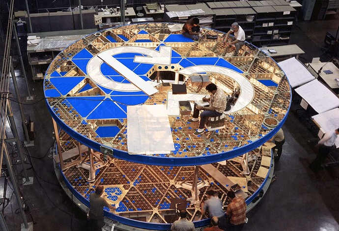
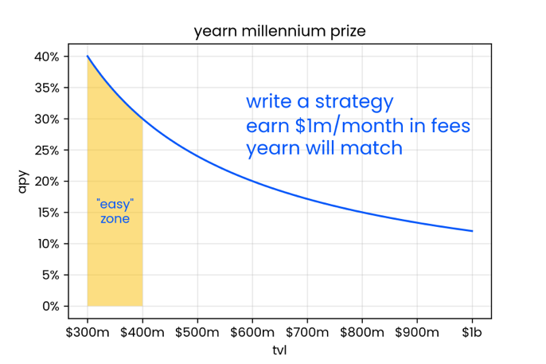
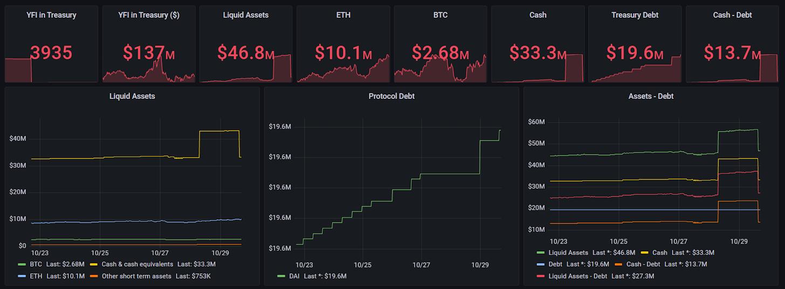
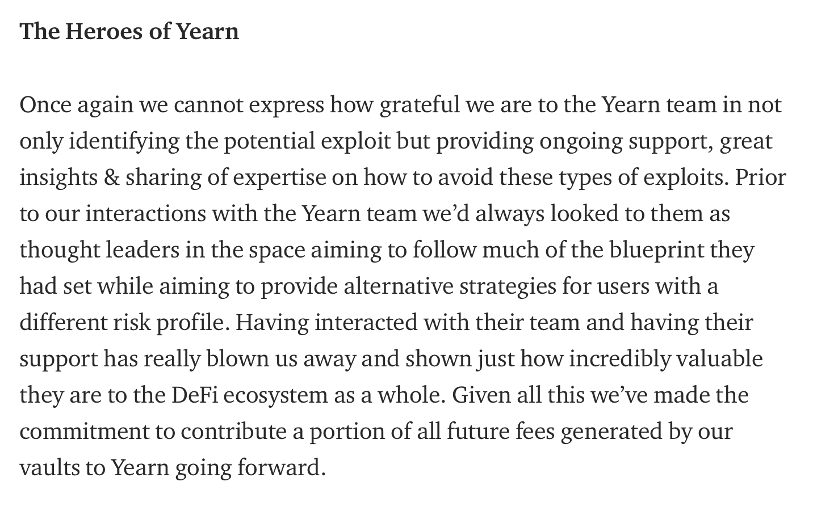
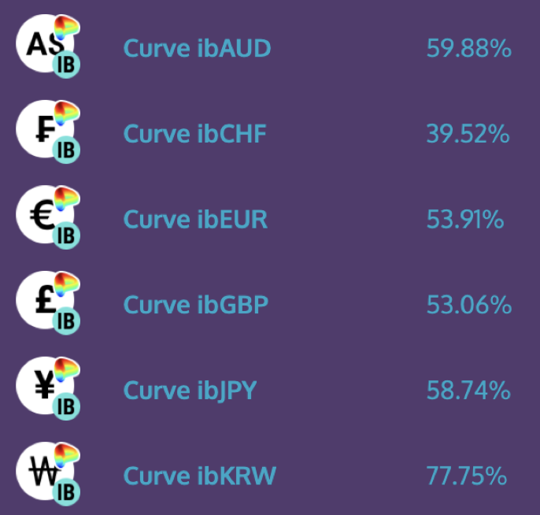

# Yearn Finance Newsletter #49

### Week Ending November 14th, 2021

Welcome to the 49th edition of the Yearn Finance Newsletter. Our aim with this newsletter is to keep the Yearn and the wider crypto community informed of the latest news, including product launches, governance changes, and ecosystem updates. If you’re interested in learning more about Yearn Finance, follow our official [Twitter](https://twitter.com/iearnfinance) and [Medium](https://medium.com/iearn) accounts.

## Summary

-   Yearn Tokenomics Revamp

-   Yearn Millennium Prize

-   Yearn Total Value Locked Reaches $6B

-   YFI Combinator’s First Project: Tesseract

-   Messari Publishes A Report on Yearn

-   Yearn Treasury Status

-   Yearn Devs Save Robo Vault From $50M Loss

-   Fixed Forex Zaps

-   $2M Paid to Yearn Partners

-   Vaults at Yearn

-   Ecosystem News

## YFI Tokenomics Revamp

Recently, several Yearn community members and developers have banded together to create actionable plans to upgrade the YFI tokenomics. Some of these suggestions include a token split, a veCRV model, fee sharing, fee reduction, vault insurance, and many more amazing ideas. Thank you to all of the people involved for your valuable input.

Check out the forum post [here](https://gov.yearn.finance/t/call-for-ideas-yfi-tokenomics-revamp/11573/1) and fill out a short anonymous survey to give your thoughts on how to best update YFI’s tokenomics [here](https://twitter.com/wot_is_goin_on/status/1457051296909959171?s=21). The other best way to get involved in tokenomics discussions is at the [Yearn discord server](https://discord.com/invite/A7VwrCCWDu).

Overviews of the recent YFI Tokenomics Meetings can be found [here](https://www.notion.so/Tokenomics-Event-4942f645a4a546669996fcc945403776) and [here](https://docs.google.com/document/d/1Xz_0Yi1LwdZZh2ry50v4w94qc-2h5QTiNkJpVF17daI/edit).

## Yearn Millennium Prize

Write a strategy which consistently and safely earns 40% APY on $300 million or 12% on $1 billion for a month and you'll earn $1 million in monthly strategist fees.

If you pull this off, Yearn would also match and reward you with a prize of $1 million.

This applies to WETH, WBTC, USDC, DAI, and USDT vaults. Subject to DAO approval. Limited to one prize.

Learn more on Yearn’s process of creating and deploying strategies [here](https://twitter.com/flashfish0x/status/1460246273488044036?s=21).

## Yearn Total Value Locked Reaches $6B

Total value locked across all Yearn products has reached $6 billion, and almost $1 billion has been added in the last month alone. Yearn is continuing to see parabolic growth among its products with no indication of slowing down. The Iron Bank and v2 vaults are particularly notable components of our exponential growth. You can view and track TVL metrics among our products using [yearn.science](https://yearn.science/). 

A big thank you to everyone in the Yearn ecosystem, our partners, and of course you, the users.

To celebrate this milestone, claim your geo-located $6B TVL NFT made by @MoTomiWasTaken [here](https://6b-pill.glitch.me/).

## YFI Combinator’s First Project: Tesseract

Tesseract is the first project hatched from YFI Combinator, our newest early-stage incubator. It leverages the expertise amassed at Yearn to bring the best yields to a wider audience.

Tesseract Finance is a multi-dimensional yield farming protocol where you can experience DeFi at the speed of light with the best of Yearn’s strategies - now on Polygon. Add liquidity to Tesseract and start generating juicy yields.

Back in spring, the Tesseract team watched Ethereum drown in fees and thought: you know what’d be cool? A yield aggregator that’s immune to Ethereum’s scaling pains. Luckily, 2021 has been a cambrian explosion of sidechains and big-ticket L2s. 

They happened to see Polygon as the best fit for a Yearn-like protocol. At the time, Ethereum’s scaling solutions were just starting to raise crops. A few farms here, meadows there. Some leverage opportunities but a lot of potential.

Today, Polygon is ready for industrial-level farming, which Tesseract aims to achieve. 

Their first dimension has launched, and it has 4 vaults: USDC, DAI, WBTC & WETH, with a strategy (leveraged AAVE). For farmer safety, we will start with a $1M cap/vault. Then, the training wheels come off.

A stable and safe yield aggregator on Polygon lets anyone farm yields without the ‘manual labor’. All you need to do is deposit funds in one (or more) of the four vaults. The strategy does the rest.

Check out the vaults on Polygon [here](https://tesr.finance/#/). Got questions or want to learn more? Read the [announcement](https://medium.com/tesseract-finance/the-genesis-of-tesseract-finance-9b73400a05b1).

## Messari Publishes A Report on Yearn

Messari has recently published a comprehensive report on Yearn detailing our growth and statistics of various vaults. This report additionally covers Yearn’s links to “DeFi 2.0” protocols, future multichain expansions, updates, and partnerships. 

Read the article [here](https://messari.io/article/yearning-for-yearn).

## Yearn Treasury Status

As of October 29, Yearn's Treasury holds a $27.2m balance in non-native tokens, of which $13.7m is stablecoins. 

We also hold 3935 YFI, currently valued at $137m. Assets excluding YFI tokens is 16.5% making it among the most diversified balance sheets in DeFi.

Check out various Yearn statistics [here](https://yearn.vision/) and view the GitHub [here](https://github.com/BobTheBuidler/yearn-exporter/tree/treasury).

## Yearn Devs Save Robo Vault From $50M Loss

With the help of the Yearn team, Robo Vault has identified and fixed a critical issue that could have affected over $50 million in user deposits. Yearn has also salvaged over $9 million from the CREAM exploit, which has since been returned.

Read more on the process [here](https://medium.com/@RoboVault/post-mortem-next-steps-3556820b7470), and view the CREAM repayment transaction [here](https://twitter.com/iearnfinance/status/1453681370698502148).

## Fixed Forex Zaps

We have collaborated with Zapper, so Yearn users can zap into Keep3r Fixed Forex vaults with almost any token in your wallet. 

Earn compounding yield natively on AUD, CHF, EUR, GBP, JPY, KRW (and ZAR soon) at [beta.yearn.finance/#/vaults](http://beta.yearn.finance/#/vaults).

## $2 Million Paid to Yearn Partners

More projects are moving to Yearn's fertile gardens, where they can source yield and feel protected by the Citadel walls. They focus on their own products and moats and earn up to 50% of user fees back to DAO simply for building on top of Yearn. Thank you to our happy partners including Frax, BadgerDAO, Abracadrabra, Pickle, Element, Alchemix, and many others.

[Check out the tweet here.](https://twitter.com/iearnfinance/status/1456736892376989697?s=21)

## Vaults At Yearn

You can read a detailed description of the strategies for all of our active yVaults [here](https://medium.com/yearn-state-of-the-vaults/the-vaults-at-yearn-9237905ffed3).

## Ecosystem News

[Yearn Basic Income coming soon](https://twitter.com/0x7171/status/1451584344213135392)

[Get WOOFY stickers at LX Factory in Lisbon](https://twitter.com/saltyfacu/status/1450786439306924036)

[Yearn alumni Matt West is the first DeFi developer to run for Congress](https://twitter.com/CoinDesk/status/1450218098246701056)

[Join the next group of yAcademy fellows here](https://twitter.com/iearnfinance/status/1450561465463672832)

[Listen to tracheopteryx as he joins Colony’s podcast to speak about compensation in DAOs](https://twitter.com/joincolony/status/1450159578268807169)

[Yearn devs are actively identifying and fixing protocol issues in war rooms](https://twitter.com/iearnfinance/status/1454092767580327938)

[Check out the EthBlocks NFT commemorating the deployment of the YFI token](https://twitter.com/iearnfinance/status/1459238290394009600?s=21)

[What are you going to gift this yMas?](https://twitter.com/y___gift/status/1459947639299051524?s=21)

[Learn how to protect your Gnosis Safe from attacks in the new Yearn Engineering blog](https://mirror.xyz/yearn-finance-engineering.eth/9uInM_sCrogPBs5qkFSNF6qe-32-0XLN5bty5wKLVqU)
