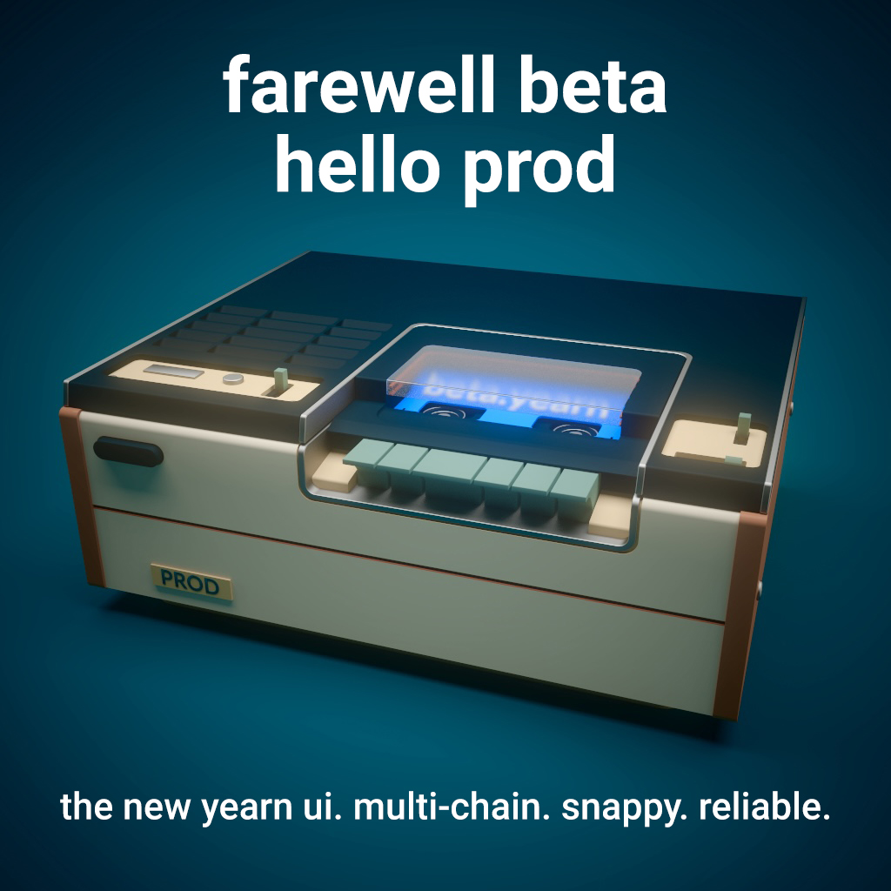
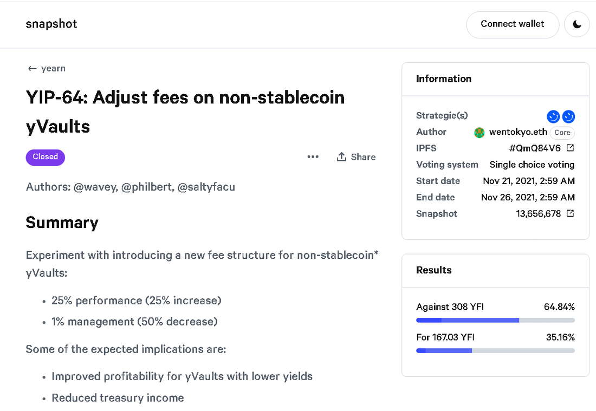

# Yearn Finance Newsletter #50

### Week Ending December 5th, 2021

Welcome to the 50th edition of the Yearn Finance Newsletter. Our aim with this newsletter is to keep the Yearn and the wider crypto community informed of the latest news, including product launches, governance changes, and ecosystem updates. If you’re interested in learning more about Yearn Finance, follow our official [Twitter](https://twitter.com/iearnfinance) and [Medium](https://medium.com/iearn) accounts.

## Summary

-   新用户界面
    
-   YFI 代币经济模型更新提案
    
-   Yearn 的更新文档
    
-   YIP-64 未通过
    
-   Yearn 将 23M veCRV 委托到 Convex
    
-   Yearn Snapshot 策略

-   Yearn 机枪池

-   生态系统最新消息

## 新用户界面

基于来自社区的大量反馈，我们重建了 [yearn.finance](https://yearn.finance/) 。新网站现在已经上线，可以去体验啦。

最有意思的功能之一（在我们看来）是模拟功能。在以前 UI 版本的机枪池存款界面，我们添加了 Zapper 的支持功能。举例来说，用户可以使用 ETH 或 Zapper 支持的任何代币存入 3CRV 机枪池。这是快速方便的，并且意味着在你的存款过程中将发生代币交换。你可能会问"模拟.."是什么意思呢？"模拟..."根据你的输入代币，使用 Zapper 的 API 和 Tenderly，对交易进行模拟，并计算确切的输出结果，可以当作是存款预览。例如，ETH>3crv.

为什么这很有用呢？原因是机枪池所涉及的协议和链上状态是动态的，很难预测你可以收到的机枪池代币的具体数量。实际滑点可能比预期的要大，或者交易可能会失败但却花费了 Gas 费等。这种模拟可以节省存款或取款的花费。

取款也是很难预测的。模拟有助于检查你是否可以在给定的机枪池条件下取款，取决于不同的策略，有些机枪池的流动性较深。

If you get a "Simulation Failed.." msg, odds are that if you move forward with the transaction it will revert.

The v3 UI is new so more work is being done to improve this UX to be even more smooth.

Look under the hood [here](https://medium.com/iearn/yearn-ui-v3-0-a194355bdb1f). If you’re a developer, contribute [here](https://github.com/yearn/yearn-finance-v3).

## YFI Tokenomics Update Proposal

A snapshot poll is live to gauge support for community proposals on YFI tokenomics.

There are currently 5 options up for vote, with the working names being ySplit, veYFI, xYFI, BurnKeYs, and Status Quo. The [ySplit proposal](https://docs.google.com/document/d/1dAWTkS_ZsXNy7mKKjOFUjILSlLsLz9KhGfLrwVu0GUg/edit) suggests splitting the YFI token into 10,000 to 1,000,000 to combat unit bias. The [veYFI proposal](https://docs.google.com/document/d/1hoi-IVccOB6iUJYzuApVbyjbQBx8-M0UuzZosb9wlWM/edit) suggests locking YFI for a given period of time in order to receive governance rights that dictate the vaults where treasury earnings should go. [xYFI](https://docs.google.com/document/d/1ev16BXu3bDC8zMSBvHmxMWIeD82ptZck6SJAO5frV5g/edit) suggests the creation of a YFI staking vault where excess treasury earnings are to be sent. [BurnKeYs](https://docs.google.com/document/d/1BqmRsfdfCIaCtNZULdhKqUJzpKdaHE1XOGQlVp2nuSc/edit) calls for the mint function of the YFI token to be permanently disabled, thus capping the supply at 36,666 tokens. Status Quo would leave the YFI tokenomics in its current state and inform holders and potential investors of the benefits.

Vote here at [the Snapshot page](https://yearn.snapshot.page/#/proposal/0x783cb3d57dd59b2827f6a42967375f06504cc947ebaa3c0e495c7b29ffd47aea). Thank you to all in the community who have contributed. An update from the working group, haiku included, can be found [here](https://docs.google.com/document/d/1-YEfXqXgTm-qzhPRUKs5allfX1XqYUOYwr_49FApnLU/edit).

## Updated Yearn Docs

Several months ago Yearn contributors set out to rewrite our docs to make them friendly and approachable.

The completely refreshed docs are here to guide users, devs, partners, and to feed your curiosity with many previously unseen entries.

Check out the new docs [here](https://docs.yearn.finance/).

## YIP-64 Fails To Meet Quorum

YIP-64: Adjust fees on non-stablecoin yVaults entered the voting phase and ended in the majority voting against adjusting fees.

Check out the proposal [here](https://snapshot.org/#/ybaby.eth/proposal/0xfe7296601d199b89a8aa53f95d6243ef935d736bea2f13109979d8d5098017d2).

## Yearn Delegates 23M veCRV to Convex

Yearn has delegated 23 million veCRV to Convex Finance using Curve’s new native boost delegation feature. This will increase yields of factory pools for both our DAOs. This does not affect regular pools, fees or voting.

Delegating unused veCRV [here](https://convex-boost-delegation.vercel.app/) increases factory rewards for all Convex participants, this further helps increase yield for Convex and Yearn. Our delegation transaction can be found [here](https://etherscan.io/tx/0x4734c879b23c678cb97ba90591e16a14f1f7a2e0a7d71bfa67d2e7bb5d718e5f).

## Yearn Snapshot Strategy

In preparation for several important votes, Yearn's Snapshot strategy got refreshed.

It allows you to vote with productive YFI, namely YFI in wallet, all Yearn v2 vaults, Bancor, Balancer v2, Uniswap v2, Sushi (incl. MasterChef), MakerDAO, Unit, Instadapp (incl. MakerDAO).

The contract can be found [here](https://github.com/yearn/snapshot-strategy) and the deployment can be found [here](https://etherscan.io/address/0xA79e803FffE9DA37477ddaFD7C6F3dbDCa1C566C#code)

## Vaults At Yearn

You can read a detailed description of the strategies for all of our active yVaults [here](https://medium.com/yearn-state-of-the-vaults/the-vaults-at-yearn-9237905ffed3).

## Ecosystem News

[Securely use your YFI on Qredo Network’s platform](https://twitter.com/QredoNetwork/status/1461031928564436994)

[Listen to Into the Byte Code with tracheopteryx](https://twitter.com/benmercerdev/status/1464347991674863626?s=21)

[Steakwallet now supports Yearn’s beta vaults on Fantom](https://twitter.com/steakwallet/status/1463623834389602311?s=21)

[Tesseract enters top five fastest growing protocols on Polygon](https://twitter.com/marketducky/status/1461734313636945926?s=21)

[Watch the Coordinape onboarding video](https://twitter.com/coordinape/status/1460591450413015043?s=21)

[Checkout Yearn on Argent’s L2 wallet with fees as low as $2](https://twitter.com/argentHQ/status/1468934923264401419)

[Tesseract vaults have increased their deposit limits](https://twitter.com/tesseract_fi/status/1468217220966801413)

[Get a discount on ETHDubai tickets by holding $yvBOOST or $yvYFI](https://twitter.com/ETHDubaiConf/status/1467068791456923648)

[See Zapper’s spotlight on Yearn Simulations](https://twitter.com/zapper_fi/status/1466447565302517765)

[Listen in to Facu’s insights on Yearn with the On the Ledger podcast](https://twitter.com/Ledger/status/1465678701635506185)

[YFI is now spendable in Flexa’s app](https://twitter.com/FlexaHQ/status/1469092114038415364)
