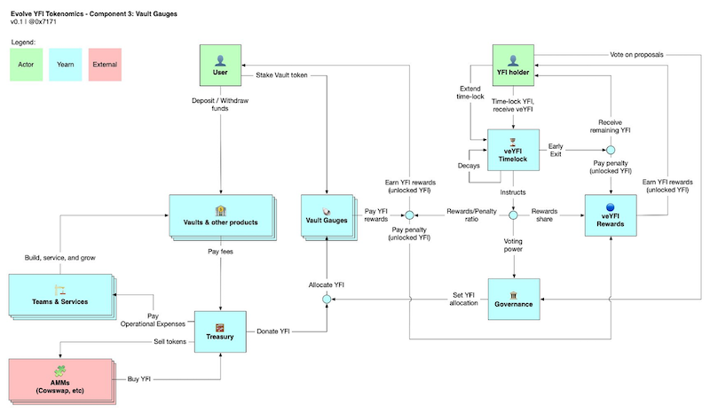

# Yearn Finance Newsletter #51

### Week Ending December 19th, 2021

Welcome to the 51th edition of the Yearn Finance Newsletter. Our aim with this newsletter is to keep the Yearn and the wider crypto community informed of the latest news, including product launches, governance changes, and ecosystem updates. If you’re interested in learning more about Yearn Finance, follow our official [Twitter](https://twitter.com/iearnfinance) and [Medium](https://medium.com/iearn) accounts.

## Summary

- YFI Tokenomics Poll Finalized
- Yearn Has Purchased $7.5M of YFI
- Proposal: Evolving YFI’s Tokenomics
- Report: Reborn As A Black Hole
- Yearn Holiday Card NFT
- Vaults at Yearn
- Ecosystem News

## YFI Tokenomics Poll Finalized

The YFI tokenomics poll has ended with xYFI as the leading option. xYFI suggests the creation of a YFI staking vault where excess treasury earnings are to be sent.

Huge thanks to [Fin4Dao](https://twitter.com/Fin4Dao) for all the facilitation work. Check out the snapshot [here](https://snapshot.org/#/ybaby.eth/proposal/0x783cb3d57dd59b2827f6a42967375f06504cc947ebaa3c0e495c7b29ffd47aea).

## Yearn Has Purchased $7.5M of YFI

Yearn has purchased $7,526,343 worth of YFI from the open market. We got 282.4 YFI (0.77% of total supply) at an average price of $26,651. More YFI has been bought back in the past month than in the prior year.

Now that the Treasury has more than $45 million saved up and with earnings stronger than ever, expect much more aggressive buybacks. What will you do anon?

We have also been purchasing back a significant amount of yvBOOST in order to restore the peg. Transactions can be found here: [https://etherscan.io/token/0x9d409a0a012cfba9b15f6d4b36ac57a46966ab9a?a=0x7d2aB9CA511EBD6F03971Fb417d3492aA82513f0](https://etherscan.io/token/0x9d409a0a012cfba9b15f6d4b36ac57a46966ab9a?a=0x7d2aB9CA511EBD6F03971Fb417d3492aA82513f0)

## Proposal: Evolving YFI’s Tokenomics

Step 1 is xYFI, where one stakes in the xYFI vault, earning back YFI from the treasury.

Step 2 is veYFI, where one vote-locks YFI, with decay and time extension. Max-lock and earn disproportionate rewards compared to those who lock for shorter duration. Early exit any time but pay a penalty to the other stakers.

Step 3 is Vault gauges, where one stakes their yVault token in a gauge, earning YFI rewards, boosted by how much veYFI they have staked. Vote on which vaults should get allocated rewards. Pay a penalty to other stakers if you don't have a strong enough lock.

Step 4 is useful work, in which veYFI holders earn additional rewards by doing useful work. This is is pending the final form of the vaults v3 design. Things that it could be (but not limited to) includes configuring vault parameters, setting fees, providing insurance.

The proposal asks that the mandate is given to developers to implement these high level designs at their discretion. Once rolled out, only xYFI and later veYFI would be eligible to vote in Yearn Governance.

What will the rewards be, you ask? The treasury is buying back more YFI than ever, and expect to be able to direct $35-45m to buybacks per year. At a YFI price of $30k, that's 100 YFI/month.

Read all the details in the proposal [here](https://gov.yearn.finance/t/proposal-evolving-yfi-tokenomics/11994), get involved, and let us know what you think. A big shout out to all the participants on the forum, Discord, and Telegram chats who helped shape the form of this proposal over the past two months.

## Report: Reborn As A Black Hole

Ape Froman has recently published a report detailing a comprehensive overview of Yearn, and he details the recent tokenomics troubles at Yearn, potential fixes, and further integrations of the YFI token into the greater DeFi ecosystem. This will allow better value capture for holders and allow for a potential imbalance in the circulating supply of YFI - thus driving demand.

Special thanks to [Ape Froman](https://medium.com/@portiadog) for the thoughtful writeup. Check out the full piece [here](https://medium.com/@portiadog/yfi-reborn-as-a-black-hole-db249b90ed5a).

## Yearn Holiday Card NFT

Get in on Project Galaxy's Holiday Treasure Hunt and grab this Yearn Holiday Card NFT, just for being a Yearn Newsletter subscriber.

Collect all 12 NFTs from Project Galaxy ecosystem partners and you'll get an additional Galaxy Girl NFT, which our friends at Project Galaxy will use to drop you future goodies. Probably nothing.

Steps are as follows: subscribe to Yearn’s weekly [newsletter](https://yearn.substack.com/), confirm your (new or existing) subscription on this [Google form](https://forms.gle/gsVpRsjdSXxyaXha9), and claim your rewards [here](https://galaxy.eco/yearn/campaign/GCTj8UUaoD).

Happy hunting and happy holidays from Yearn!

## Vaults At Yearn

You can read a detailed description of the strategies for all of our active yVaults [here](https://medium.com/yearn-state-of-the-vaults/the-vaults-at-yearn-9237905ffed3).

## Ecosystem News

[Check out Facu’s security chat with the Wido team who are building on top of Yearn](https://www.joinwido.com/blog/chat-with-facu-about-wido-together-and-its-security-model)

[Deposit in Yearn with lower gas fees thanks to Argent’s L2 Wallet](https://twitter.com/argentHQ/status/1471503921851944983)

[See the YFI pendant made by loldefi](https://twitter.com/loldefi/status/1470449196939493383)

[$GEAR holders are eligible to vote on GIP-2 and GIP-3 to include YFI and Yearn contracts](https://twitter.com/GearboxProtocol/status/1472299963149426696?s=20)

[Anyone in the world can contribute to the Yearn experience](https://twitter.com/bantg/status/1472038972092207107?s=20)

[Get insured on your Yearn deposits with solace.fi](https://twitter.com/SolaceFi/status/1471594979638321153?s=20)
