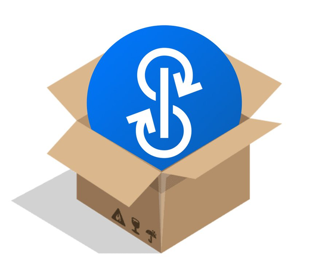

# Yearn Finance 最新动态 #53

### 2022 年 1 月 9 日结束的一周

欢迎来到 Yearn 最新动态第 53 版。 此新闻简报的目的是让 Yearn 和所有加密货币社区了解最新消息，包括新产品发布，治理变化和生态系统更新。如果你有兴趣了解更多有关 Yearn Finance 的信息，请关注我们的官方 [Twitter](https://twitter.com/iearnfinance) 和 [Medium](https://medium.com/iearn) 帐户。

## 摘要

- Yearn 的透明度
- Yearn 网站更新
- 申请下一季的 yAcademyDAO
- Yeanr 已从 Fantom Foundation 收到额外的一百万 FTM 的赠款
- Yearn 的机枪池
- 生态系统最新消息

# Yearn 的透明度

# 更透明，更多 alpha。

Yearn 的最新两款工具揭示了兔子洞的神秘深处：[内容集合器 content aggregator](https://blog.yearn.finance/) 和 [机枪池百科全书 vault encyclopedia](https://vaults.yearn.finance/)。

应用内容集合器，你可以找到来自 Yearn 最重要的资讯。点击链接即可找到 Yearn 的最新更新，推文，周报，文章和季度财务报告。你也可以找到像 tracheopteryx 这样聪明人的推文发布文章。

应用由 Yearn 社区创建的机枪池百科全书，你可以找到关于 yVault 如何运作的详细资讯并可查看这些机枪池执行的操作/策略。

发布到 Medium 后，新的机枪池网页将会有过滤器，多链讯息，自动信息更新以及多种语言的支持。

你可以在这里读更多有关这些工具的讯息。感谢 @0xMajor，@KoxEvan 和 DarkGhosty 在机枪池百科全书方面的贡献。

# Yearn 网站更新

为了要增加透明度，多位 Yearn 网页生态系统的贡献者已开始整理一份时事通讯，此通讯将被用于集合关于新功能，正在进行的工作和计划的更新，还会包括定期关于网络技术的深入研究。

这个新版本的主要更新包括改进用户体验和切换网络时的速度，还有在必要的时后提示用户在钱包上添加 Fantom 以及改进在 yearn-exporter 上给 Fantom 的支持。

如果你对网站有任何反馈或建议，或者想做些贡献，请到 [Discord](https://discord.com/invite/yearn) 联系我们。

你可以在[这里](https://yearnweb.substack.com/p/update-jan-5-2022?showWelcome=true)查看我们的更新。

# 申请下一季的 yAcademyDAO

如果你不熟悉 yAcademyDAO，这是一个由社区驱动的区块链安全小组。在 Yearn，我们非常的注重安全性，yAcademy 是我们的生态系统计划之一，为的是创建可持续和协作的区块链安全性并确保我们的人才可得到充分的利用。

yAcademyDAO 是由其全职成员和贡献者管理的，它也接受以太坊安全联盟成员的监督和指导。

你可以在[这里](https://yacademy.github.io/)访问其网站，并在[这里](https://docs.google.com/forms/d/e/1FAIpQLSfc5VUYOyG_cRpiRkymJOVoHluFOuiYMRONX-R7xRuvWM25Xg/viewform)填 yAcademyDAO 的申请表。

# Yeanr 已从 Fantom Foundation 收到额外的一百万 FTM 的赠款

欢迎来到 2022 年，我们继续的收到捐款。

Yearn 又收到了一份 Fantom Foundation 给的基金。

一样的我们没有卖掉。捐款总额是 208,333 FTM，90% 被发送到 FTM 的机枪池，其余按比例发送给其它的 Fantom 机枪池。

我们会继续以这个方式处理未来所有的捐款。

# Yearn 的机枪池

你可以在[这里](https://medium.com/yearn-state-of-the-vaults/the-vaults-at-yearn-9237905ffed3)查看我们所有活跃的机枪池的详细描述。

# 生态系统最新消息

[看一下 PILLS universe 给 Yearn 做的介绍](https://twitter.com/pillsuniverse/status/1478321675510763520)

[ZooDAO 如何应用 Yearn 来生产收益](https://twitter.com/ZooDAO/status/1480244287526916105)

[读有关 yMarkt 的提议](https://gov.yearn.finance/t/proposal-ymarkt-the-best-buybacks-can-get/12166)

[Theorycrafting 发布有关 Andre Cronje 的新 AMM 项目和 Yearn 的参与的帖子](https://gov.yearn.finance/t/yfi-solid-theorycrafting/12181)

[发布 Keep3r CLI 更新](https://twitter.com/DeFi_Wonderland/status/1478061081956343812)

[看一下 Element Finance 全新应用 Yean 机枪池的 DAI 定期储蓄](https://twitter.com/element_fi/status/1478819507829293058)

[试试在 Fantom 上全新的 ApeMode 机枪池](https://twitter.com/poolpitako/status/1479271890933923843)
