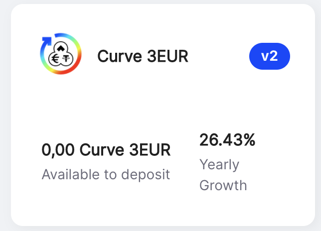
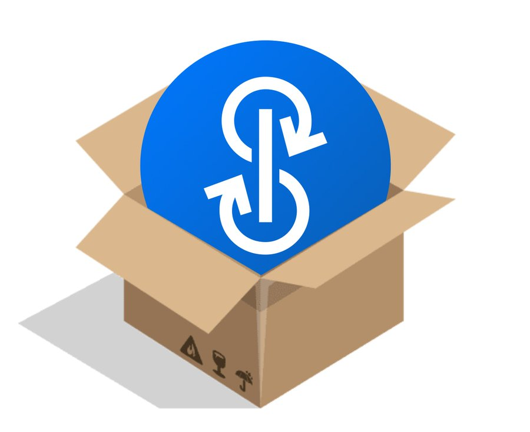
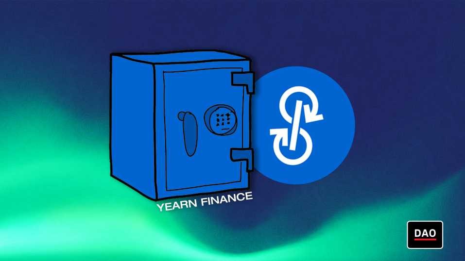

# यर्न फाइनेंस समाचार पत्र #५४

### १६ जनवरी, २०२२ को समाप्त होने वाला सप्ताह

यर्न फाइनेंस समाचार पत्र के ५२वें संस्करण में आपका स्वागत है। इस न्यूज़लेटर के साथ हमारा उद्देश्य उत्पाद लॉन्च, शासन परिवर्तन और पारिस्थितिकी तंत्र अपडेट सहित नवीनतम समाचारों के बारे में यर्न और व्यापक क्रिप्टो समुदाय को सूचित करना है। अगर आप यर्न फाइनेंस के बारे में अधिक जानने में रुचि रखते हैं, तो हमारे आधिकारिक [Twitter](https://twitter.com/iearnfinance) और [Medium](https://medium.com/iearn) खातों का अनुसरण करें।

## सारांश

- पेश है सात नए फैंटम वाल्ट
- नये कर्व वॉल्ट लाइव
- यर्न वेब अपडेट
- यर्न फाइनेंस तिजोरी: डी-फाई  के दरवाजे पर दस्तक
- YvBOOST पर अपडेट
- यर्न में वाल्ट
- पारिस्थितिकी तंत्र समाचार

# पेश है सात नए फैंटम वाल्ट

फैंटम पर, ये सात वॉल्ट मिक्स में शामिल हो जाते हैं: WBTC, WETH, SPELL, DOLA, कर्व ट्रिक्रिप्टो, कर्व गीस्ट और CRV

इस बीच, फैंटम वॉल्ट में लगभग $४०० मिलियन वैल्यू लॉक्ड के साथ, हम अभी भी रसदार APY देख रहे हैं, ४५% से अधिक। अधिकांश फैंटम वॉल्ट स्क्रीम पर फोल्डिंग का उपयोग करते हैं, जिसमें गीस्ट फाइनेंस और टैरो फाइनेंस रणनीतियां आ रही हैं।

आपकी चाल क्या है? आज ही जमा करना शुरू करें [yearn.finance/vaults](https://yearn.finance/vaults).

# नये कर्व वॉल्ट लाइव

एथेरियम पर, निम्नलिखित नए कर्व वॉल्ट अब लाइव हैं: CVX-ETH, CRV-ETH, 3EUR, UST वर्महोल, USDPax, DOLA, और RAI - रिफ्लेक्सर के कस्टम कर्व कार्यान्वयन का उपयोग करने वाला पहला वॉल्ट।

3EUR के लिए, यह टोकन एक कर्व तरलता पूल का प्रतिनिधित्व करता है। धारक पूल में व्यापार करने वाले उपयोगकर्ताओं से शुल्क कमाते हैं, और सीआरवी उत्सर्जन अर्जित करने के लिए एलपी को कर्व के गेज में भी जमा कर सकते हैं। इस पूल में agEUR, EURT और EURS शामिल हैं। agEUR एंगल प्रोटोकॉल द्वारा जारी एक सिंथेटिक यूरो है, जबकि EURS और EURT दोनों क्रमशः स्टैसिस और टीथर द्वारा जारी किए गए केंद्रीकृत, हार्ड-पेग्ड यूरो टोकन हैं।

3EUR रणनीति CRV और CVX (और कोई अन्य उपलब्ध टोकन) अर्जित करने के लिए कॉन्वेक्स फाइनेंस को 3EURpool-f प्रदान करती है। अर्जित टोकन काटा जाता है, अधिक 3EURpool-f के लिए बेचा जाता है जिसे वापस रणनीति में जमा किया जाता है।

नए वाल्ट देखें [यहां](https://yearn.finance/#/vaults).

# यर्न वेब अपडेट

इस सप्ताह के यर्न वेब अपडेट में कई पहली बार योगदानकर्ता शामिल हैं जो पीआर खोल रहे हैं और आयरन बैंक और कर्व एलपी टोकन के लिए बेहतर बैकएंड लॉजिक हैं।

आगामी अपडेट्स यर्न एसडीके के लिए एक अपडेटेड टेस्ट सूट हैं, अधिक वर्णनात्मक सिमुलेशन त्रुटियां हैं, और एपीआई को दस्तावेज़ीकरण के साथ फिर से तैयार करना है।

पूरा नया अपडेट देखें [यहां](https://yearnweb.substack.com/p/yearn-web-engineering-update).

# यर्न फाइनेंस तिजोरी: डी-फाई  के दरवाजे पर दस्तक

BanklessDAO का यह लेख यर्न द्वारा दी जाने वाली सुविधाओं का एक संपूर्ण सारांश प्रस्तुत करता है और यह दर्शाता है कि यह कैसे डी-फाई  को उपयोग में आसान बनाता है।

कुल मिलाकर, यर्न वॉल्ट का उपयोग करना प्रोटोकॉल पर एक दांव है जिसमें यील्ड एग्रीगेटर्स की उच्चतम सुरक्षा है और सभी रणनीतिकारों और उनके ऑटोमेशन के अद्भुत काम के साथ डी-फाई में महत्वपूर्ण पूंजी दक्षता लाने में सक्षम है।

पूरा टुकड़ा देखें [यहां](https://medium.com/bankless-dao/yearn-finance-vaults-knockin-on-defi-s-door-f5e9f56f669a).

# YvBOOST पर अपडेट

अधिकांश को इसका एहसास नहीं हो सकता है, लेकिन १ yvBOOST १ veCRV की तुलना में २,२ x अधिक साप्ताहिक कर्व प्रोटोकॉल शुल्क एकत्र करता है। yvBOOST APR भी १०० % से अधिक है, निरंतर है, १ yvBOOST वर्तमान में १ CRV से ३२ % सस्ता है। इन सबके बाद भी, अभी भी yvBOOST धारकों को $५  मिलियन से अधिक का दान किया जाना बाकी है

दान की जाँच करें [यहाँ](https://etherscan.io/address/0xdf270b48829e0f05211f3a33e5dc0a84f7247fbe).

# यर्न में वाल्ट

आप हमारे सभी सक्रिय yVaults के लिए रणनीतियों का विस्तृत विवरण पढ़ सकते हैं [यहां](https://medium.com/yearn-state-of-the-vaults/the-vaults-at-yearn-9237905ffed3).

# पारिस्थितिकी तंत्र समाचार

[आगामी यर्न x पिल्स सहयोग](https://twitter.com/bantg/status/1482764820265029633)

[यर्न के लिए रणनीतियां कैसे लिखें, इस पर एक पठन सूची देखें](https://twitter.com/sjkelleyjr/status/1481664381054177281)

[एक्सप्लोर करें कि कैसे एक डाओ ने पेरोल को प्रबंधित करने के लिए कोर्डिनैप का उपयोग किया](https://twitter.com/jkey_eth/status/1479642151730356226)

[कांग्रेस में एक सीट के लिए एक यर्न के पूर्व छात्रों के अभियान का समर्थन करें](https://twitter.com/mattdwest/status/1481083902580166656)
