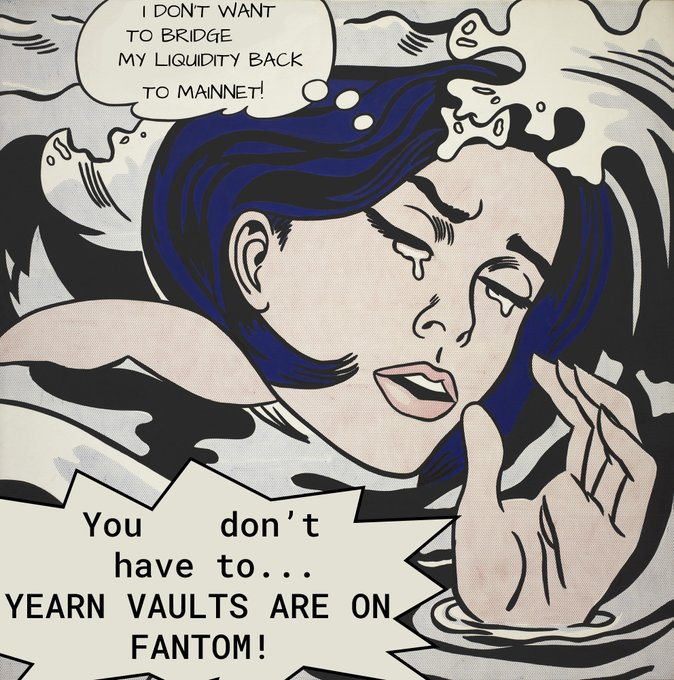
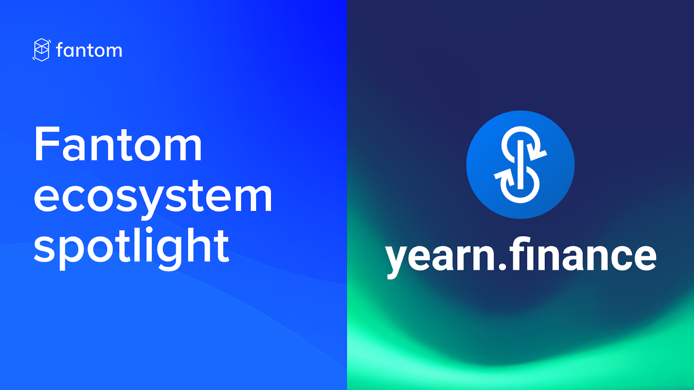
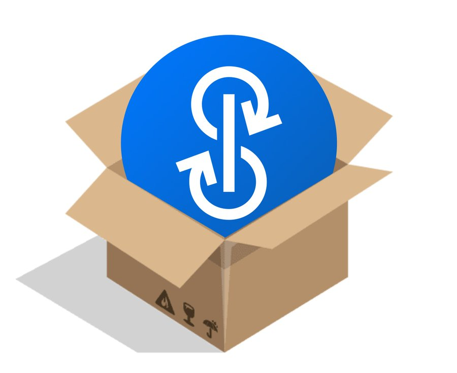
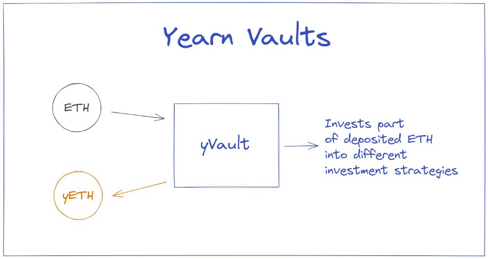

# Yearn Finance 最新动态 #55

### 2022年1月26日结束的一周

欢迎来到Yearn最新动态第55版。 此新闻简报的目的是让Yearn和所有加密货币社区了解最新消息，包括新产品发布，治理变化和生态系统更新。如果你有兴趣了解更多有关Yearn Finance的信息，请关注我们的官方 [Twitter](https://twitter.com/iearnfinance) 和 [Medium](https://medium.com/iearn) 帐户。

## 摘要

- Fantom 上的 Yearn TVL 达到 10 亿美金
- Fantom 生态系统聚焦 - Yearn
- Yearn 网站更新
- Yearn Finance 解析
- Yearn 的机枪池
- 生态系统最新消息

# Fantom 机枪池的现状

随着 Andre Cronje 和 Daniele Sestagalli 的新项目 Solidly ve(3,3) 的兴起，Fantom 上出现各种吸血鬼的袭击，都是为了进入 Fantom 上 TVL 前 20 名，从而获得 Solidly 的空投。

[yearn.finance](https://yearn.finance/#/home) 充分利用这次机会，让我们的存款用户获得风险调整后的最高的 APR。我们在 0xDAO、veDAO、Scream、Curve、Beets、Tarot 等协议获得极好的收益机会。机枪池有针对所有这些协议的策略，并能够自动轮换到收益最高的策略，每 30 分钟实现一次收益变现，让用户轻松获得高回报。吸血鬼攻击活动最近结束了，并成为历史的一页，但 Yearn 仍将在 Fantom 陪伴你。

你该做些什么呢？立即开始在 [yearn.finance/vaults](https://yearn.finance/vaults) 存款吧。.

# Fantom 生态系统聚焦 - Yearn

Yearn 贡献者 Tracheopteryx 简要概述了 Yearn 和我们的使命，我们的主要关注点是用户、合作伙伴和建设者。

Yearn 的核心产品是机枪池、Iron Bank、Labs 和 YFI/WOOFY 代币。Tracheopteryx 进一步探索了 YFI 的起源，解释了为什么 Yearn 选择 Fantom 作为以太坊主网之外扩展的第一个侧链。

采访结束时提到了即将进行的 YFI 代币升级，例如回购并分发给代币持有者、xYFI、veYFI 和 vault gauges。

在 [此处](https://fantom.foundation/blog/fantom-ecosystem-spotlight-yearn/?__cf_chl_rt_tk=rdrT2KHoFbjTe1yyUOmIDA92AeTmrMPKtQW5yT18mwk-1643234302-0-gaNycGzNCH0) 查看完整文章。

# Yearn 网站更新

本周的 Yearn 网站更新包括 UI 新增 APY 悬停工具提示和机枪池提款时的 Dust 修复。

即将推出的更新，包括详细的文章介绍、更新的多链 UI/UX、以及将新增一条链。

在 [此处](https://yearnweb.substack.com/p/yearn-web-engineering-update-7d7?r=2y79e&utm_campaign=post&utm_medium=web) 查看完整的更新。

# Yearn Finance 解析

Yearn 机枪池给存款用户的存款凭证是 IOU 收益代币， 相关的收益策略都是由策略师们经过繁琐复杂的审查过程制定的，为了确保 Yearn 用户获得风险调整后的最佳收益。

Yearn 在之前的 v1 版本中，以太坊的 yVault 中使用的一种策略：当用户存入 ETH 时，ETH 会作为抵押品存入 MakerDAO ，用于借入 DAI，然后存入 DAI yVault。

用户可能常会提出的一些问题是 “Yearn 是如何，何时将资金转移到机枪池的？” 以及 “Yearn 的策略如何保证代币一直是增加的而不是减少的呢？”。策略中的一个关键功能称为“获利”。该功能被调用时，会触发重新平衡过程，在此过程中实现利润并将其复投回策略中。策略师还使用许多工具来监控链上数据，以确保策略的健康。其中一个工具是 Yearn Watch，它提供了一个漂亮的用户界面，以及许多链上的关键指标。

为了保持机枪池的性能，需要任务的完成能够实现自动化，Yearn 和 Keep3r 在这方面提供了强大的协同做用。为了构建策略，需要对 Vyper（用于 yVaults）和 Solidity（用于策略）有很好的了解。成为策略师的基本要求是：将部署策略的区块链生态系统的相关知识，这些知识可以通过对策略中使用的代币的代币经济模型和文档进行深入研究来获得；类似于在 CryptoZombies 上完成级别 4 的Solidity 编程知识；以及知道如何使用 git、eth-brownie 和 ganache。

在具备了上述的基础知识后，你就可以复制我们的策略模板了！构建你自己的第一个策略需要使用的函数是 prepareReturn、adjustPosition 和liquidatePositon。可以在 [此处](https://github.com/yearn/brownie-strategy-mix) 找到策略模板。

感谢 MarcoWorms 的文章，可在 [此处](https://medium.com/iearn/yearn-finance-explained-what-are-vaults-and-strategies-96970560432) 找到。

# Yearn 的机枪池

可以在 [此处](https://medium.com/yearn-state-of-the-vaults/the-vaults-at-yearn-9237905ffed3) 阅读我们所有活跃 yVault 的策略的详细说明。

# 生态系统最新消息

[通过 Ambire 钱包的直接存款到 Yearn 的机枪池](https://twitter.com/AmbireWallet/status/1483087593285820416)

[在 Shapeshift DAO 上使用 Yearn 机枪池](https://twitter.com/ShapeShift_io/status/1484599573289086984)

[Tesseract Finance 与 VESQ 合作的最新消息](https://twitter.com/tesseract_fi/status/1483484524143128578)

[Yearn 成为在 Fantom 上 TVL 排名第一的聚合器](https://twitter.com/vannny365/status/1484385291947368448)

[查看在 Yearn 贡献者的帮助下制作的 ApeFramework](https://twitter.com/ApeFramework)

[阅读 Yearn 及其指标的概述](https://twitter.com/fuuurma/status/1484503576076599298)
