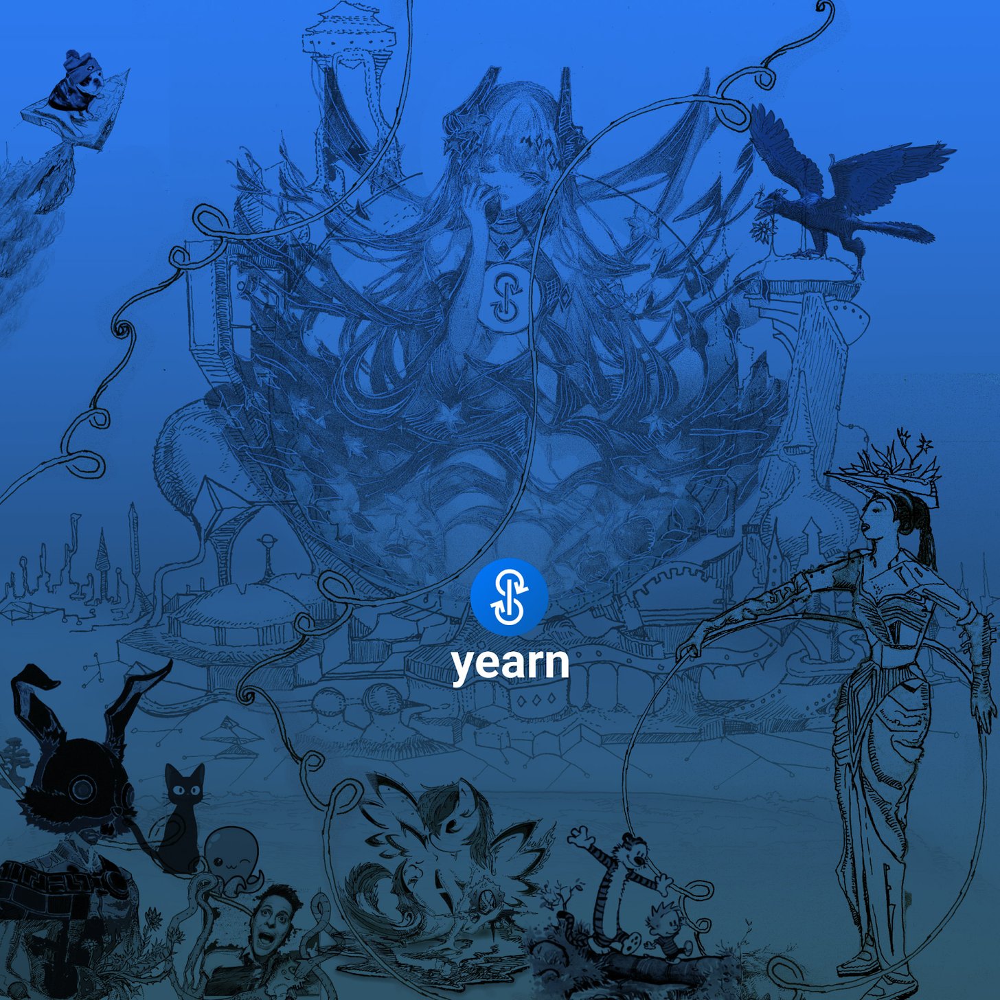
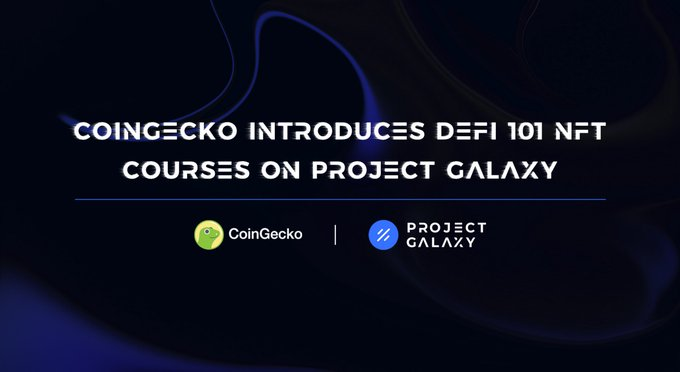
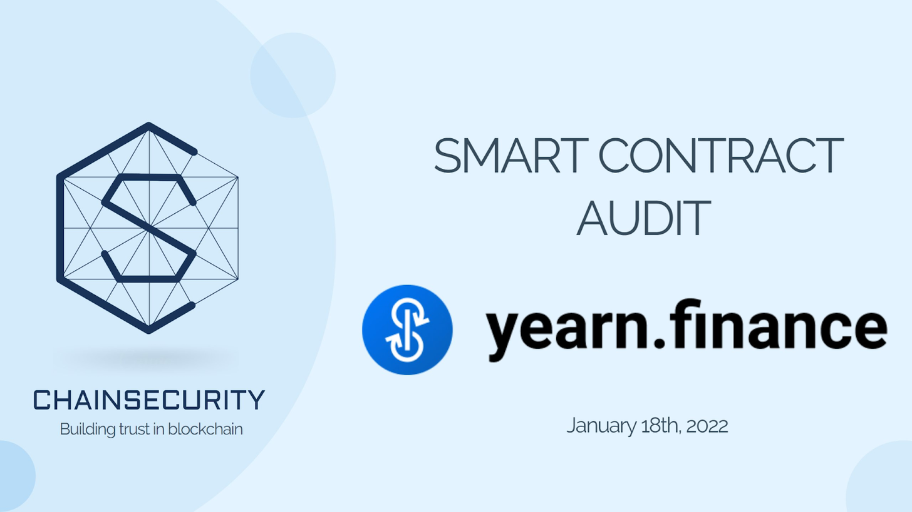
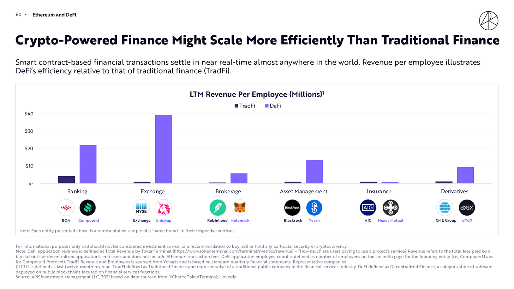

### Semaine du 30 Janvier, 2022

Bienvenue à la 56e édition de la Newsletter Yearn Finance. Notre objectif avec cette newsletter est de tenir la communauté Yearn, et plus généralement la communauté crypto, au courant des dernières nouvelles, y compris les lancements de produits, les changements de gouvernance et les mises à jour de l’écosystème. Si vous souhaitez en savoir plus sur Yearn Finance, suivez nos comptes [Twitter](https://twitter.com/iearnfinance) et [Medium](https://medium.com/iearn) officiels.

## Résumé

- Proposition de refonte du système de rémunération de Yearn
- Yearn a acheté 127,9 YFI supplémentaires pour 3,9 millions de dollars
- Les utilisateurs de Yearn sont éligibles pour recevoir le badge NFT du projet Galaxy
- Lisez l'audit de suivi des partenaires de Yearn
- Yearn présenté dans le rapport de ARK Invest Big Ideas
- Vaults chez Yearn
- Nouvelles de l’écosystème

# Proposition de refonte du système de rémunération de Yearn

Vous voulez encore plus de rachats de YFI, anon? Et si le système de rémunération de Yearn tirait parti de la nouvelle tokenomics décrite dans la YIP-65 ? Et si chaque fois qu'un membre de l'équipe Yearn reçois son salaire, il puisse en allouer jusqu'à 100 % pour acheter et verrouiller des veYFI ?

Après des mois de travail, un groupe de 15 auteurs a présenté une proposition de rachat de contributeur, ainsi que de nouveaux avantages pour les personnes qui choisissent de se s'impliquer entièrement dans Yearn.

Cette proposition vise à, faire évoluer Yearn vers un plan de rémunération unique et flexible, intégrer directement la conception des tokenomics veYFI, tout aligner sur le YFI et encourager le verrouillage des jetons, et fonctionner de manière autonome. La proposition comprend un historique de la rémunération chez @ Yearn, le nouveau plan proposé, les étapes pour passer à une rémunération simplifiée et les risques.

Nous vous invitons à vous engager, à donner votre avis et à participer au sondage. Venez construire avec nous.

Consultez la proposition [ici](https://gov.yearn.finance/t/proposal-streamlining-contributor-compensation/12247).

# Yearn a acheté 127,9 YFI supplémentaires pour 3,9 millions de dollars

Conformément au YIP-56: Buyback and Build Yearn, qui a été adopté en janvier 2021, nous sommes fiers d'annoncer que la "Yearn Treasury" a acheté 127,9 YFI supplémentaires pour 3,9 millions de dollars.

La "Yearn Treasury" continuera à achètera périodiquement des YFI supplémentaires en utilisant les bénéfices générés par le protocole jusqu'à ce qu'une nouvelle proposition de gouvernance soit adoptée qui modifie cette politique de rachat. Vous pouvez en savoir plus sur la proposition BABY [ici](https://gov.yearn.finance/t/yip-56-buyback-and-build/8929).

Pour plus d'informations, une liste détaillée des achats précédents de YFI par la "Yearn Treasury" est disponible [ici](https://gov.yearn.finance/t/yfi-buyback-auctions/10491/3).

# Les utilisateurs de Yearn sont éligibles pour recevoir le badge NFT du projet Galaxy

Avec l'aide de nos partenaires Project Galaxy, nous offrons à la communauté Yearn un autre badge NFT, avec des remerciements particuliers à Coingecko. Ce badge correspond à la deuxième tâche de la série Coingecko "Yield Farmer - DeFi 101"

Les utilisateurs qui ont misé n'importe quel montant sur Yearn, Alpha ou Badger seront récompensés par le badge "Yield Farmer - DeFi 101". Gardez également un œil sur les futures récompenses de notre part !

Réclamez vos futures récompenses sur [galaxy.eco/coingecko ](https://twitter.com/ProjectGalaxyHQ/status/1487048124182921220?s=20&t=Z5Z2328-bsM-BNCp9d1KAA) and read le fil complet [ici](https://twitter.com/ProjectGalaxyHQ/status/1487048124182921220?s=20&t=Z5Z2328-bsM-BNCp9d1KAA).

# Lisez l'audit de suivi des partenaires de Yearn

Chez Yearn, nous prenons la sécurité très au sérieux dans le but d'offrir à nos utilisateurs les meilleurs rendements ajustés au risque de la DeFi.

Yearn Finance implémente un tracker de partenaire qui suit les dépôts de coffres effectués par un partenaire affilié. Le montant suivi est simplement la somme de tous les fonds déposés via le partenaire dans un coffre spécifique. Aucun problème de sécurité n'a été trouvé et des problèmes mineurs tels que les importations inutilisées ou les constantes ont été corrigés.

Chainsecurity nous a également félicités pour notre codebase, qui a également un haut niveau de sécurité.

Découvrez l'audit complet [ici](https://chainsecurity.com/security-audit/yearn-finance-partner-tracker/).

# Yearn présenté dans le rapport ARK Invest Big Ideas

Dans ce rapport, Yearn est noté comme une excellante entreprise pour son innovation perturbatrice et capable de créer un nouveau protocole qui peut remplacer les technologies plus anciennes. Nous sommes comparé avec BlackRock, le gestionnaire d'actifs de plusieurs billions de dollars. Yearn générant près de 15 millions de dollars de revenus par employé et BlackRock générant près de 10 fois moins par employé.

Avec l'aide de contrats intelligents, nous sommes en mesure de réduire le risque de contrepartie et de réduire les dépendances vis-à-vis des intermédiaires, et ainsi créer le gestionnaire d'actifs le plus efficace au monde. De plus, grâce aux nouveaux YIP, le protocole Yearn ne fera que se renforcer et s'étendre à l'avenir.

Le rapport complet de l'ARK est disponible [ici](https://research.ark-invest.com/hubfs/1_Download_Files_ARK-Invest/White_Papers/ARK_BigIdeas2022.pdf?hsCtaTracking=217bbc93-a71a-4c2b-9959-0842b6fe301c%7C2653a4d0-af35-42f0-853a-c5f90f002abb).

# Vaults chez Yearn

Vous pouvez trouver une description détaillée des stratégies de tous nos yVaults actifs [ici](https://medium.com/yearn-state-of-the-vaults/the-vaults-at-yearn-9237905ffed3).

# Nouvelles de l’écosystème

[Check out this short overview of the newest Yearn proposal](https://twitter.com/0x7d54/status/1487252998023745540)

[A vote for a YFI / ETH pool on Curve has received the highest ever quorum](https://twitter.com/CurveFinance/status/1487764860553371648)

[Try out Yearn with low fees on Argent’s zkSync wallet](https://twitter.com/argentHQ/status/1487014855592849414)

[Yearn has been integrated into insurance protocol solace.fi](https://twitter.com/SolaceFi/status/1486145688291487749?s=20&t=fTfbPYIAOA5xVim5BETQZQ)
