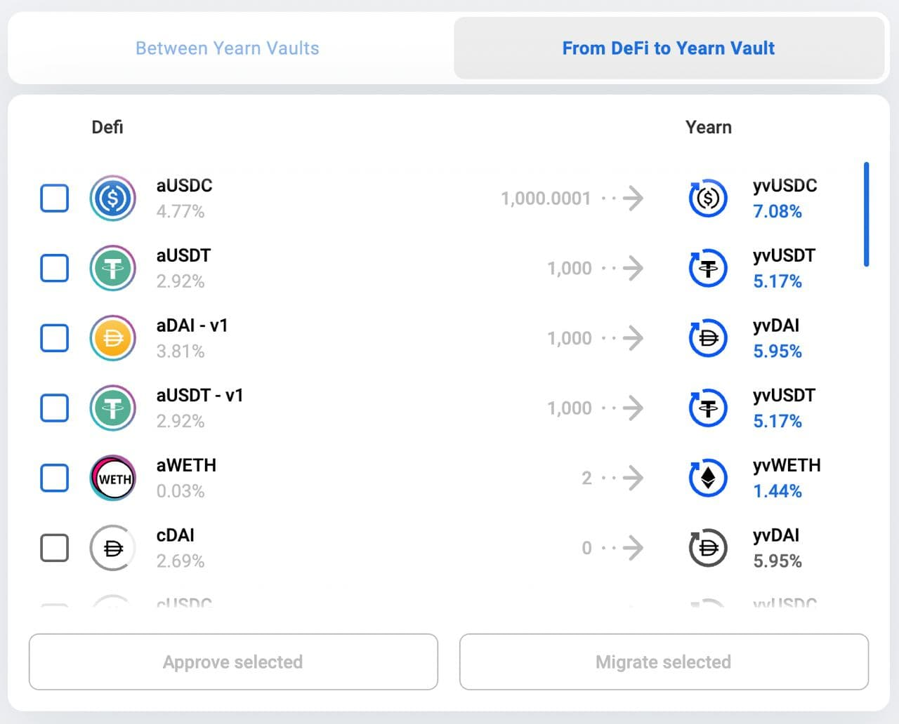

Author: @[Facu](https://twitter.com/fameal)

Link: https://twitter.com/fameal/status/1424857239505018880

# 1

There's a new way to always have the best available yield. A simple way:

🏹 https://bowswap.finance

You can now swap between [@iearnfinance](https://twitter.com/iearnfinance) Vaults in one single transaction ⚡️

👇

# 2

In this first version you can move between some Curve LP vaults that have the same metapool.

👇

# 3

What's a metapool? It's a pool built on top of another pool. Simple, right?

👇

# 4

You are going to be able to swap safely thanks to the slippage protection built-in 🛡️

Thanks [@pandabuild](https://twitter.com/pandabuild) [@TBouder](https://twitter.com/TBouder) and Ivan for building this yAmazing thing 🚀

# 5 [Update](https://t.me/yearnupdates/483)

It has two parts:

## Between Yearn Vaults

It swaps funds from one vault to another. There's no liquidity pool. It withdraws and redeposits into the desired vault. The only swaps it does is using Curve. If the vaults have a token in common (same metapool or 3CRV for example) it will use them. While it's not cheap gas-wise, it is gas efficient - Cheaper than doing it manually, for sure

## From DeFi to Yearn Vaults

Re-Introducing [bowswap.finance](https://bowswap.finance/), now with simple migration to the best yield available. Migrate from AAVE and Compound to Yearn Finance in a few clicks, with no fees.

Sorry Stani

This next feature helps users migrate funds from Compound and AAVE to Yearn. It's the same concept as above, withdraw from the protocol and deposit into a Yearn Vault. Also shows both protocol's APY in the list and let's you select multiple tokens at the same time.

No fees are charged by Yearn on these swaps.
