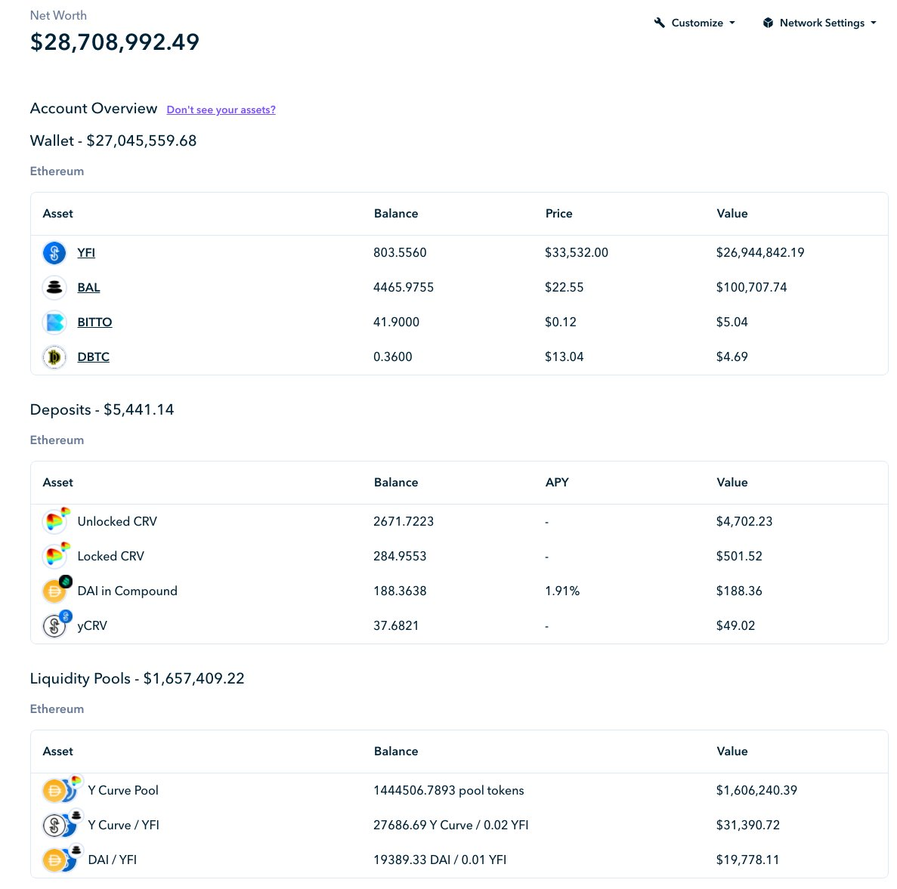

Autor: @[Dudesahn](https://twitter.com/dudesahn)

Enlace: https://twitter.com/dudesahn/status/1413567068583104512

# 1

Acabo de revisar los viejos contratos de staking de [@iearnfinance](https://twitter.com/iearnfinance) :

~30 YFI sin reclamar en las staking pools originales
~8.5 YFI apostado en el primer contrato de staking
~764 YFI todavía apostados en el segundo contrato de staking con $750k reclamables de yCRV 😬

Casi $29 millones en LPs apostados, YFI y recompensas reclamables :point_down:

# 2

¿No estás seguro si tienes fondos para reclamar?

Dirígete a https://etherscan.io, e ingresa una de las siguientes direcciones:

• YFI Farming Pool 1: 0x0001FB050Fe7312791bF6475b96569D83F695C9f
• YFI Farming Pool 2: 0x033E52f513F9B98e129381c6708F9faA2DEE5db5

# 3

• YFI Farming Pool 3: 0x3A22dF48d84957F907e67F4313E3D43179040d6E
• YFI Gov Staking v1: 0xb01419E74D8a2abb1bbAD82925b19c36C191A701
• YFI Gov Staking v2: 0xBa37B002AbaFDd8E89a1995dA52740bbC013D992

Debajo de Contract, haz clic en Read Contract, e ingresa tu dirección debajo de balanceOf

# 4

Si un valor >0 aparece, entonces felicidades, ¡tienes YFI y/o recompensas que reclamar! :partying_face:

Para reclamar todos tus activos invertidos y recompensas, dirígete a Write Contract, conecta tu billetera, y llama a exit().

# 5

Con tu nuevo YFI o yCRV en la mano, dirígete a http://yearn.finance/vaults y deposítalos en una de nuestras bóvedas.  Alternativamente, dirígete a nuestros buenos amigos de @CreamdotFinance 🍦 y pide un préstamo contra esos activos, o incluso usa @MIM_Spell 🧙‍♂️ para pedir prestado contra tu nuevo yvYFI.

# 6

También cabe aclarar: ¡aunque no tengas fondos haciendo staking no significa que no puedas reclamar tus recompensas! Parecido a como con balanceOf(), puedes verificar las recompensas reclamables en Read Contract con earned(), y luego reclamar las disponibles en Write Contract usando getReward()! 🤑

  

