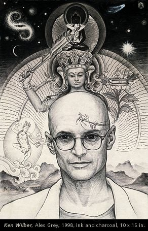
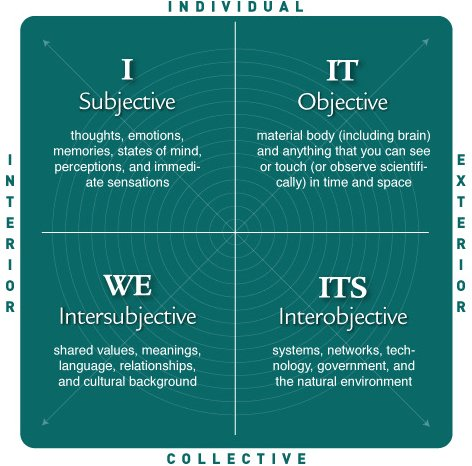
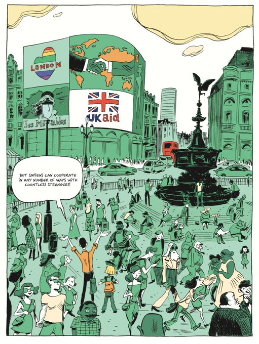
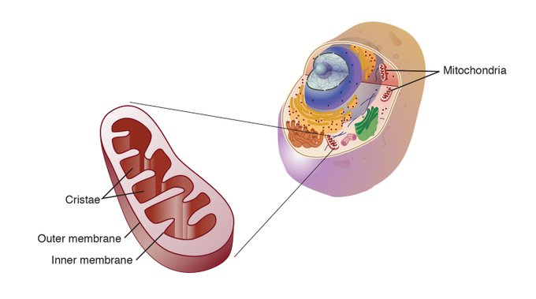
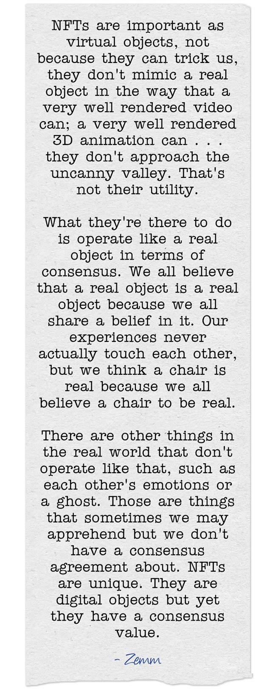
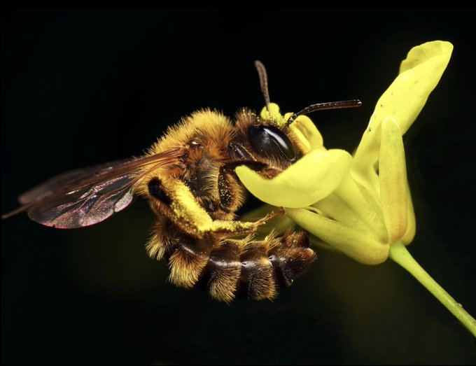
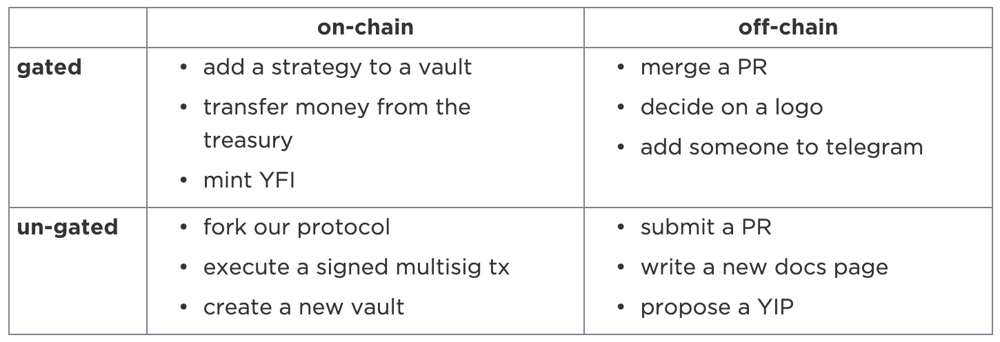
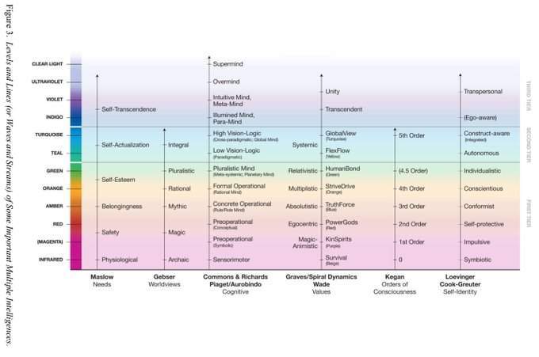
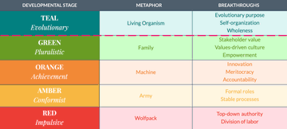

Autor: @[tracheopteryx](https://twitter.com/tracheopteryx)

Enlace: https://twitter.com/tracheopteryx/status/1410243752434753547

# 1

Me gustó mucho hablar con [@TrustlessState](https://twitter.com/TrustlessState) en el podcast de [@BanklessHQ](https://twitter.com/BanklessHQ) sobre [@coordinape](https://twitter.com/coordinape) con [@fifthworldzach](https://twitter.com/fifthworldzach)

https://youtu.be/JM0zF3AzFno

Explicamos qué hace diferentes a las mécanicas y visión de Coordinape, y profundizamos en algunas grandes ideas.

Aquí va un hilo sobre las DAO

1/22  
https://www.youtube.com/watch?v=JM0zF3AzFno

# 2

¿Qué es una DAO?

Hay muchas respuestas a esto. Es un fenómeno emergente cuya historia se está escribiendo activamente.

Mi respuesta puede ser un poco diferente a otras que encontrarás...

✨ Las DAO son una nueva forma de vida 🧫

Me explicaré.

2/  

# 3

Vaya si es difícil de explicar....

Bien, comencemos con Ken Wilber. Wilber es muchas cosas, principalmente es un maestro de los mapas. Estudió el trabajo de filósofos, científicos y gurús de todo el mundo con la tesis impulsora de que "todo el mundo tiene razón".

3/  

# 4

Durante décadas, encajó todas estas piezas dispares de sabiduría en un mapa del potencial humano llamado Teoría Integral.

La noción de cuadrantes es fundamental para entender esto. Cada cuadrante es irreducible a cualquier otro cuadrante. Cada uno de ellos es un marco diferente e intrínsecamente válido.

4/  

# 5

La experiencia interior individual del color rojo es irreductible al concepto exterior individual de la luz de 650 nm. Ambas surgen como caras diferentes de una misma moneda.

Entonces, ¿a dónde diablos va esto, verdad?

Aquí, las DAO con el índice apuntando a la derecha son formas de vida que emergen en los cuadrantes colectivos.

5/  

# 6

“Desde la Revolución Cognitiva, los sapiens han vivido en una realidad dual. Por un lado, la realidad objetiva de ríos, árboles y leones; y por otro lado, la realidad imaginada de dioses, naciones y corporaciones ”.

- Sapiens de Yuval Harari

6/  

# 7

Harari escribe maravillosamente sobre el poder de la ficción colectiva. La ficción ha escalado el esfuerzo humano.

Familia, tribu, religión, nación, incorporación: el surgimiento de cada nueva ficción trasciende e incluye a la anterior, lo que nos permite coordinarnos cada vez en mayor número.

7/  

# 8

Cuando la vida surgió en la Tierra, éramos criaturas simples. Microorganismos. Flotando. Comiéndonos unos a otros. Luego, un pequeñín se comió a otro pequeñín. . . pero éste se quedó por ahí; no fue digerido. De procariota a eucariota.

💥 Vida multicelular.

Todo cambió.

8/  

# 9

El mundo está a punto de dar un paso extraordinario.

Verás, el mar del colectivo ha sido como el mar de la vieja tierra. Las fuerzas que unen al análogo celular del colectivo (¿memes?) no han sido lo suficientemente fuertes como para dar el paso al eucariota.

Pero: ahora tenemos blockchain.

9/  

# 10

Blockchain es una nueva física. Una física del /espacio colectivo/.

Nadie ha dilucidado esta realidad más profundamente que mi co-instigador en Coordinape, [@Zemm_NFT](https://twitter.com/Zemm_NFT), hablando sobre los NFT en [@DirSchmidt](https://twitter.com/DirSchmidt) "La mejor película NFT jamás realizada".

https://youtube.com/watch?v=cY9lM73ie0Q&t=1575s

10/  

# 11

Blockchain hace que la ficción sea real. Tan real como la suciedad. Y de esta tierra, florece nueva fauna. [@Coordinape](https://twitter.com/coordinape) es una flor. Sus pétalos, una invitación. Crece en el dosel del bosque oscuro, donde prospera la confianza. El tipo de confianza que conocen tan bien quienes han trabajado en equipos creativos.

11/  

# 12

Mira el video de Bankless o visita http://coordinape.com para aprender más, pero en pocas palabras:

Coordinape permite que los protocolos hagan crecer su red de colaboradores con un sistema de insignias NFT y que distribuyan subvenciones a través de un mecanismo novedoso, descentralizado y dirigido por la comunidad, inspirado en las economías de regalo.

12/  

# 13

Porque los tipos de herramientas que se utilizan para apoyar la inteligencia colectiva en un entorno adverso son poco adecuados para un entorno /colaborativo/.

La abeja y la flor no necesitan contratos.

13/  

# 14

Necesitábamos este tipo de herramienta en [@iearnfinance](https://twitter.com/iearnfinance). No existía, así que desarrollamos Coordinape.

Es una pieza de un rompecabezas más grande. Gov 2.0, escrito por
[@lex_node](https://twitter.com/lex_node) y yo, es otro.

Porque, al igual que la biología, las DAO no son monolíticas. El espacio de decisión es vasto.

https://gov.yearn.finance/t/yip-61-governance-2-0/10460

14/  

# 15

GGov 2.0, o delegación restringida, comienza por comprender las decisiones.

Una DAO necesita tomar cientos de decisiones diferentes. Gov 2.0 se ocupa de las decisiones on-chain. Pero más allá de estos ejes también hay que tener en cuenta: escala de tiempo, impacto, seguridad, comunidad, dominio...

15/  

# 16

Tuvimos que inventar todo este tipo de herramientas en Yearn por pura necesidad.

Nacimos del caos. No hay una base, ninguna empresa con procesos a los que recurrir. [@AndreCronjeTech](https://twitter.com/AndreCronjeTech) regaló $1B en $YFI y el campo de inflatones de ese evento formó nuestro mundo. ¡Bang!

16/  

# 17

No todas las DAO funcionan de la misma manera. Al igual que las corporaciones o las personas, tienen diferentes cosmovisiones.

Volvamos a Wilber. Los cuadrantes son solo una parte de su obra maestra. También estudió a Piaget, Clare Graves, Jean Gebser, Aurobindo y muchos otros.

17/  

# 18

Wilber tomó los mapas del desarrollo humano iniciados por estos académicos y los combinó en una teoría de niveles y líneas. Cada uno de nosotros tiene múltiples inteligencias que se desarrollan a diferentes ritmos. Y también las organizaciones.

18/  

# 19

[@fred_laloux](https://twitter.com/fred_laloux) tomó el mapa de Wilber y lo aplicó a las empresas que estudió en su inigualable trabajo "Reinventar las organizaciones"

Solo porque las DAO tengan el potencial de crecer como árboles en el cielo azul de nuestro futuro no significa que lo harán. Necesitan del sistema operativo adecuado.

19/  

# 20

Teal es un sistema operativo para organizaciones formadas por seres humanos soberanos que toman agencia y responsabilidad de sus vidas; basado en la autogestión, la integridad y el propósito evolutivo.

Mientras que las grandes empresas de hoy son como máquinas, las organizaciones Teal son como la biología.

20/  

# 21

¿Por qué ese pequeñito sobrevivió y se convirtió en mitocondrias cuando el otro se lo comió? Quién sabe.

Pero tal vez tuvo algo que ver con la confianza. El mago [@fifthworldzach](https://twitter.com/fifthworldzach)
, nuestro otro co-instigador en Coordinape, dice que "las organizaciones se mueven a la velocidad de la confianza".

21/  

# 22

Pienso mucho en esto. Ser parte de una forma de vida colectiva que derrama dinero y crece en reinos más allá de mi imaginación puede ser confuso.

No /puedo/ entender lo que necesita. Necesito dejarlo ir. Y para hacer eso, necesito confiar en que estaré bien.

22/  

# 23

Estructuras como Ethereum, Organizaciones Teal, DAOs, Coordinape y gov 2.0 me ayudan a confiar en que la mente entre las mentes estará allí, y puedo ir a donde me lleven mis intereses, sabiendo que todo el sitema prosperará.

Eso es lo que estamos construyendo.

/Fin
