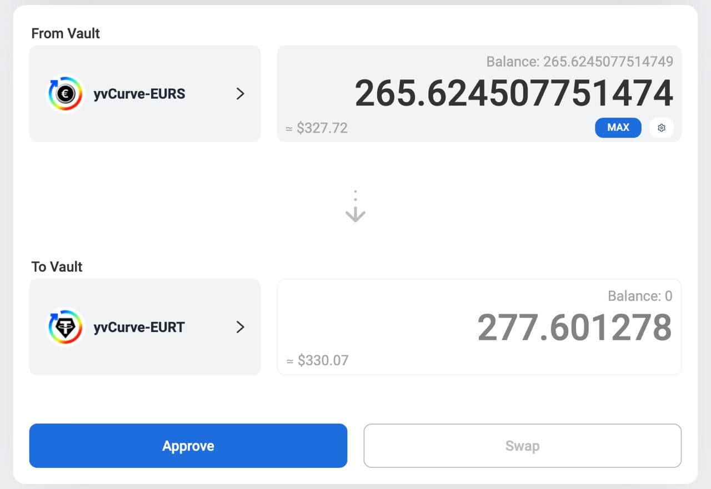

ソース: [twitter](https://twitter.com/fameal/status/1424857239505018880)

##### 1

常に最高の利回りを得るための新しい方法があります。シンプルな方法です。:

🏹 https://bowswap.finance

一度のトランザクションで[@iearnfinance](https://twitter.com/iearnfinance)のボールト間のスワップができるようになりました ⚡️

##### 2

この最初のバージョンでは、同じメタプールを持つCurveのLPボールト間を移動することができます。

##### 3

メタプールとは？他のプールの上に作られたプールのことです。簡単でしょう？

##### 4

スリップ防止機能が付いているため、安心してスワップすることができます🛡️

この素晴らしいものを作ってくれた[@pandabuild](https://twitter.com/pandabuild) [@MajorTom_eth](https://twitter.com/MajorTom_eth) とIvanに感謝します🚀