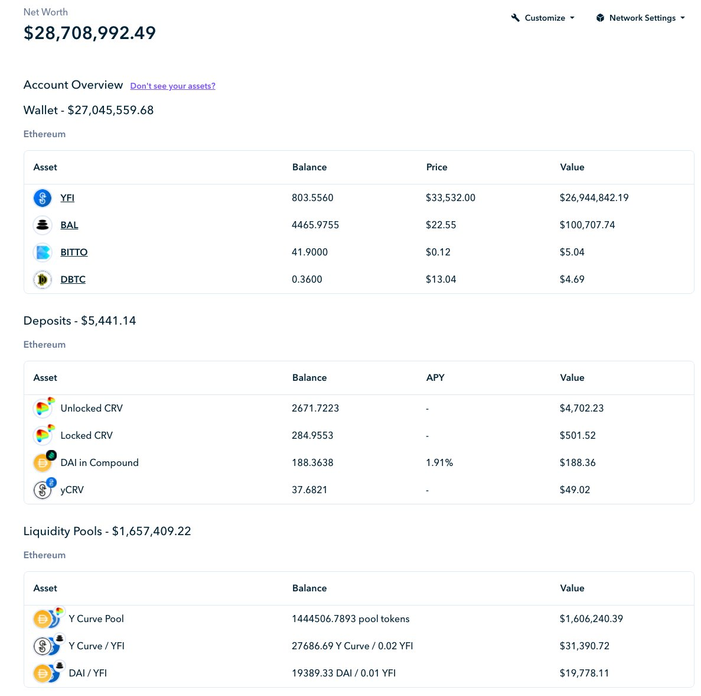
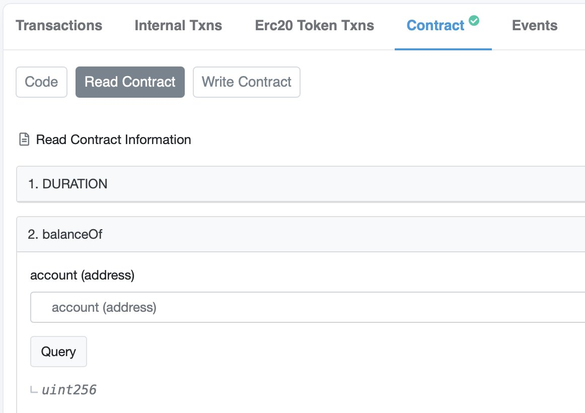
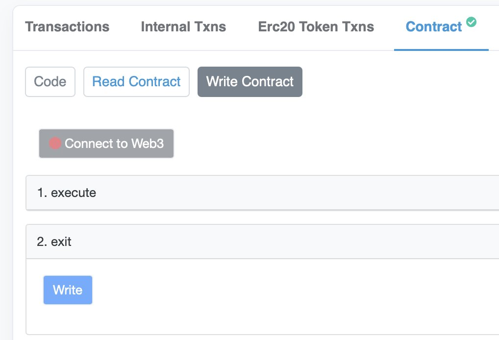
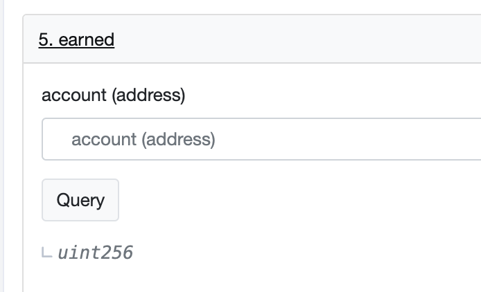

fonte original: [twitter](https://twitter.com/dudesahn/status/1413567068583104512)

##### 1

Acabei de checar os antigos contratos de [@iearnfinance](https://twitter.com/iearnfinance):

~30 YFI não reinvidicados dos pools de staking originais
~8.5 YFI em stake no contrato de stake v1
~764 YFI ainda em stake no contrato de stake v2 com $750k em yCRV não reinvidicados 😬

Quase $29m em LPs em stake, YFI, e recompensas que podem ser reinvidicados :point_down:

##### 2

Não tem certeza se possui algum fundo para reinvidicar?

Vá para https://etherscan.io, e insira os seguintes endereços:

• YFI Farming Pool 1: 0x0001FB050Fe7312791bF6475b96569D83F695C9f
• YFI Farming Pool 2: 0x033E52f513F9B98e129381c6708F9faA2DEE5db5
	@@ -37,25 +37,25 @@ Vá para https://etherscan.io, e insira os seguintes endereços:
• YFI Gov Staking v1: 0xb01419E74D8a2abb1bbAD82925b19c36C191A701
• YFI Gov Staking v2: 0xBa37B002AbaFDd8E89a1995dA52740bbC013D992

Na aba Contrato, cliquem em Ler Contrato, e insira seu endereço no campo balanceOf 👀

##### 4

Se um valor >0 aparecer, parabéns, você tem YFI e/ou recompensas para reinvidicar! :partying_face:

Para reinvidicar os seus ativos em stake e suas recompensas, vá para Escrever Contrato, conecte sua carteira e execute o comando exit().

##### 5

Com o seu YFI ou yCRV em mãos, vocÊ pode ir para http://yearn.finance/vaults e os depositar em um de nossos vaults. Ou você pode procurar nossos bons amigos de @CreamdotFinance 🍦 e tomar um empréstimo usando seus ativos como garantia, ou até mesmo usar @MIM_Spell 🧙‍♂️ para tomar emprestado usando seu novo yvYFI como garantia.

##### 6

Também cabe mencionar: só porque você não tem nenhum saldo ainda em stake, isso não significa que você não pode reinvidicar recompensas! Da mesma forma que balanceOf(), você pode verificar as recompensas disponíveis na aba Ler Contrato com earned(), e então reinvidicar o que tiver disponível em Escrever contrato usando getReward()! 🤑

  