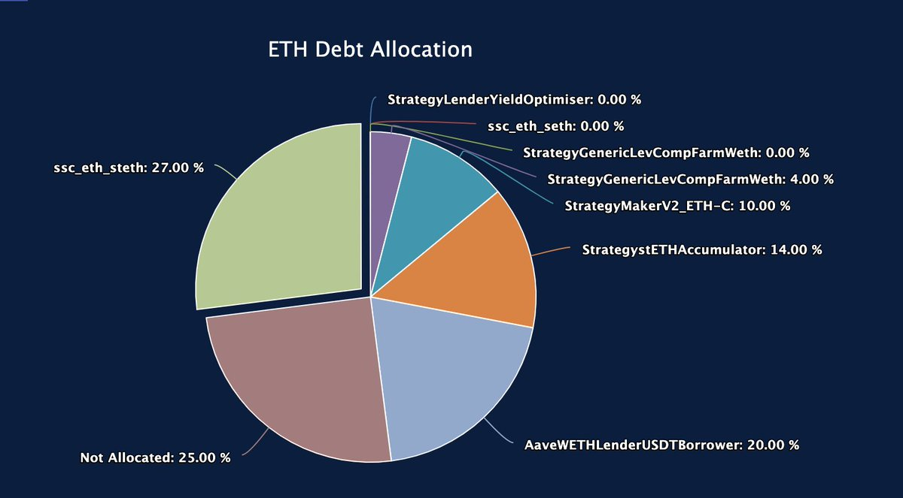
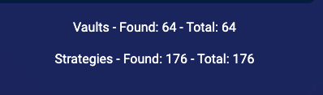
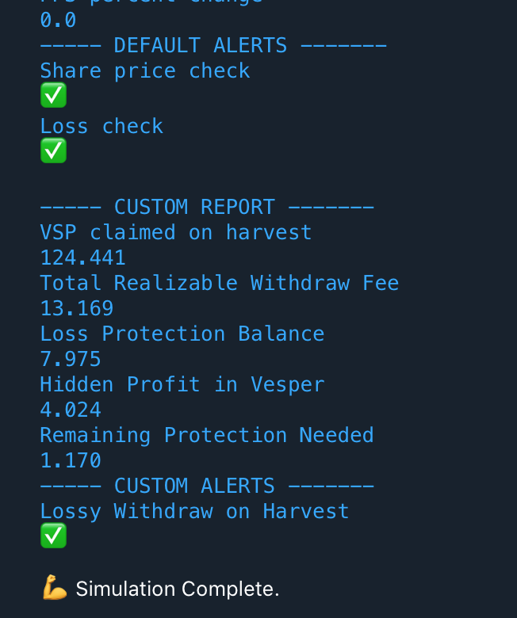
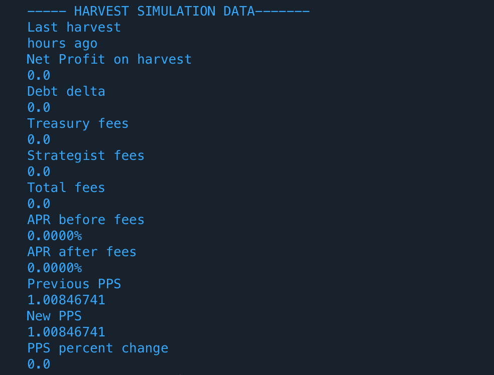
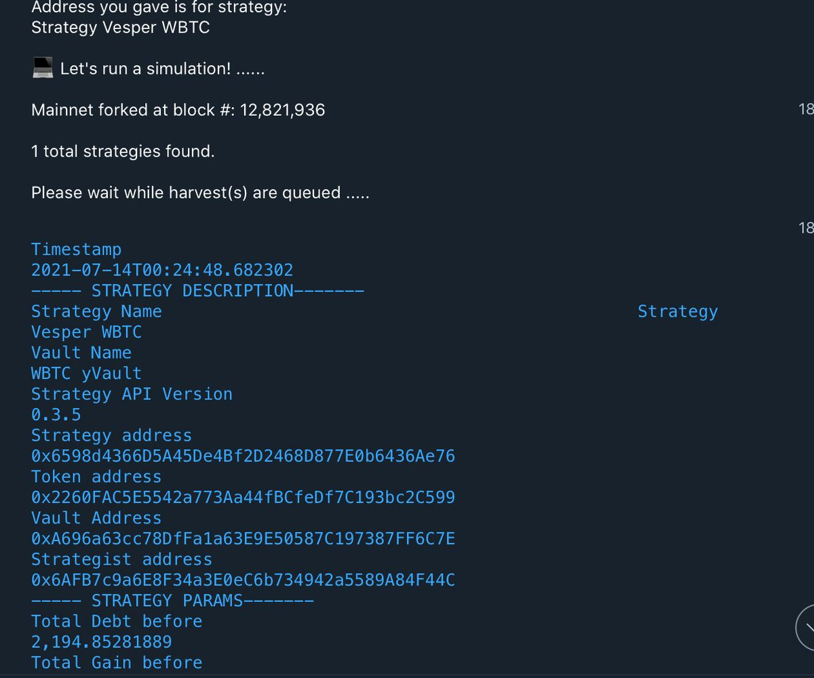
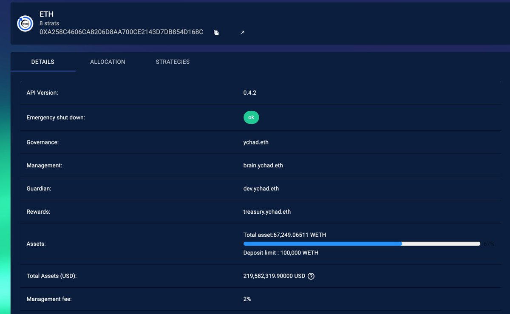
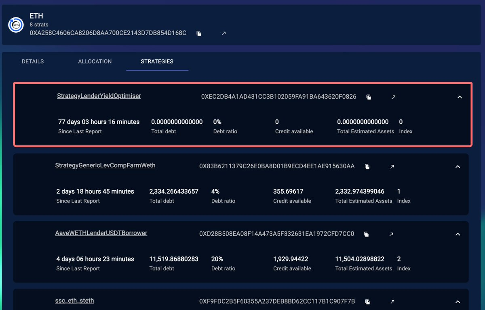
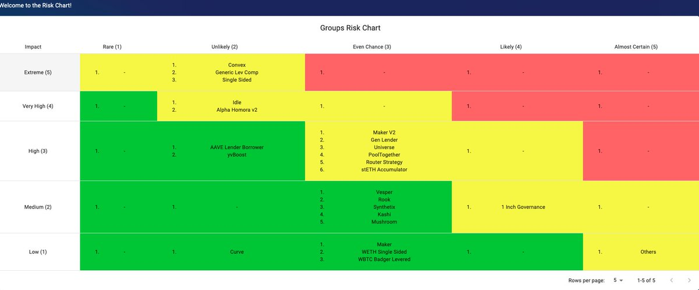
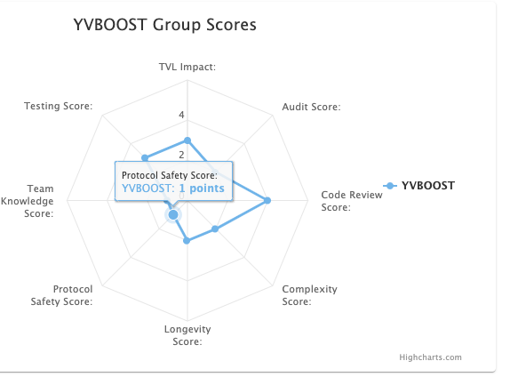
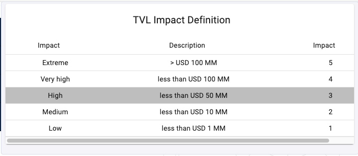

original source: [twitter](https://twitter.com/storming0x/status/1436851219864059906)

##### 1
Doing some weekend coding and decided to do a tweet storm about [@iearnfinance](https://twitter.com/iearnfinance) risk, tooling and insight behind the scenes.

🧵 👇

##### 2
If you don't know about [yearn.finance](http://yearn.finance), you can think of it as the "yield function protocol". Yearn top product are the Vaults. Put money into the vaults and somehow the next day that money grows and keeps growing constantly. This is an over simplification ofc.

##### 3
This is made possible by a team of smart folks that code strategies for the vault to allocate money with the goal to earn returns. The strategies are smart contracts that need to be deploy and updated often. These smart contracts are flexible and dynamic. Example allocations:

##### 4
Given the way yearn protocol works, it needs a very quick turnaround to launch new contracts and strategies quickly, this has implications in security. One of the main concerns at yearn is risk from all perspectives. We are at the EOD in the risk business. How to balance this?

##### 5
We need to come up with a risk framework. To get the picture. This is the number of vaults + strategies deployed currently. There is no way around the complexity of this system, many pieces need to fall in place to make this work.

##### 6
In my previous life I had a background in aeronautics systems. I think many lessons can be taken from Aviation which is also in the risk business. The complexity like in finance is high. Still you don't think twice booking a flight for your next trip.

##### 7
Every day millions of flights take place, and many flights have incidents. An incident doesn't lead to an accident = plane crashing. You need many incidents concurrently to happen for a plane to crash. This in current airline operations is extremely unlikely.

##### 8
But every time there is an incident the aviation process and systems, require that you correct and fix the root cause. We have implemented a similar process in yearn, every war room doesn't lead to a loss of funds, but we are required to learn from it and improve.

##### 9
This process was implemented early this year after a really bad month of incidents and war rooms. And several initiatives were started and implemented to automate and remove human factors as much as possible from our daily decisions.

[twitter.com/storming0x/sta…](https://twitter.com/storming0x/status/1395452522840608768?s=20)

> 
> Storm Blessed 0x ([@storming0x](https://twitter.com/storming0x))

> We just got out of a 16 + hour plus war room dealing with a situation in yearn. Extremely tired but grateful to have the chance to be part of these awesome team.

Crisis resolved and no funds lost. Lots of key learnings and thing that will make [@iearnfinance](https://twitter.com/iearnfinance) stronger. Need 😴

##### 10
This ofc still can be improved, and is a constant process, but in yearn what doesn't kill us for sure makes us stronger. It's part of my job to make this process ingrained in Yearn's DNA.

[github.com/yearn/yearn-de…](https://github.com/yearn/yearn-devdocs/blob/master/docs/developers/v2/EMERGENCY.md)

##### 11
We had war rooms were code had a bug and made incorrect accounting that lead to war rooms and issues.
Fixes:
-We added simulation bots to catch issues before they happen on chain.
-On chain healthchecks that revert a trx if the asserts are not met.

[github.com/yearn/yearn-de…](https://github.com/yearn/yearn-devdocs/blob/master/docs/developers/v2/DEPLOYMENT.md#health-checks)

##### 12
The simulation bot is tied to alerting on our telegram and send us with time ahead any issue. We recently had a war room completely prevented by a simulation, the strategy was winded down without having to correct anything onchain. We moved from corrective to preventive action.

##### 13
[yearn.watch](http://yearn.watch) is the site I built to track strategies and vaults state. It uses a great piece on infra built internally by the yearn team to fetch data. We have specialized multicall contracts to be able to get this data efficiently to make decisions.

##### 14
We also have a risk dashboard that we came up to score each strategy to assess at any point in time our risk. This is populated by our internal infra and adjusted automatically by onchain changes.
(Sample data below)

##### 15
This is an internal risk tool that has been added very recently, is still to early to made public since we are tweaking our data and models to try come up with an objective scoring given our internal process. Once we collected more data on this I'm happy to share more on it.

##### 16
We are far from solving smart contract risk and security, but the only thing we can do is keep trying. We hope this behind the scenes view can inform other projects in the ecosystem to help them or also come up with other ideas that we can all benefit from.

Thanks for reading!
