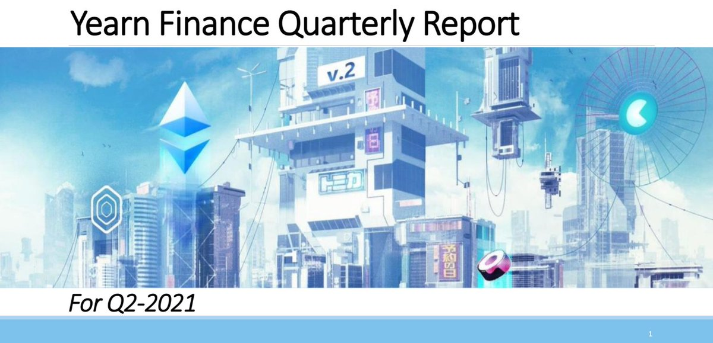
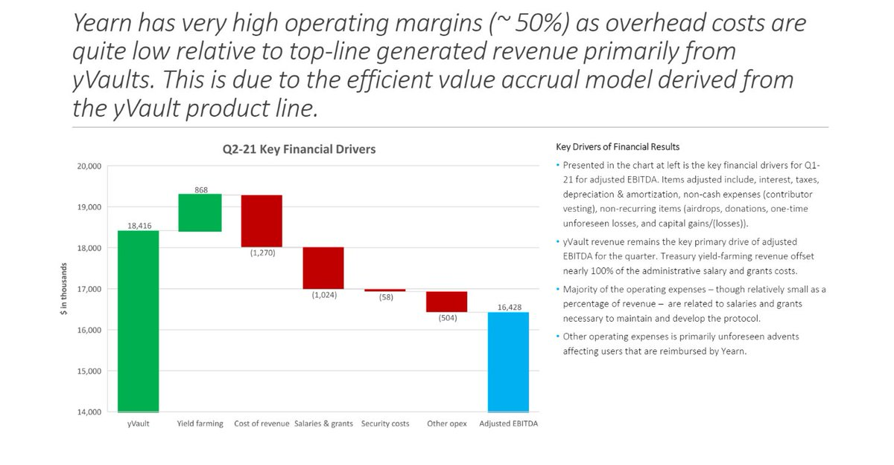

source originale: [twitter](https://twitter.com/iearnfinance/status/1445143482830446600)

##### 1

C'est pourquoi la crypto va changer le monde.

Il tue les ombres.

Les super codeurs de Yearn sont 🌞.

Tout est en chaîne avec des étiquettes lisibles par les hoomans.

Transparence vérifiée ✅

Voyons à quel point Yearn est transparent 👇

##### 2

Consultez les bilans, l'EBITDA, les revenus et plus de Yearn CHAQUE trimestre :

https://github.com/yearn/yearn-pm/blob/master/financials/reports/2021Q2-yearn-quarterly-report.pdf

##### 3

En fait, vous pouvez suivre chaque transaction liée à Yearn en temps réel à [yfistats.com](http://www.yfistats.com/)

##### 4

Vous y trouverez triable :

Enregistrements des transactions

🔵 Revenu de protocole

🔵 Frais de protocole

🔵 Comptes de résultat

🔵 Soldes menseul

🔵 Graphiques

🔵 Projets de revenus

🔵 Rachats $YFI

& beaucoup plus.

Tout cela est méticuleusement étiqueté par l'équipe yBudget avec 💙 et librement accessible à toute personne dans le 🌍

##### 5

Vous n'aimez pas les sites Web ? Vous pouvez même suivre vos revenus avec des « robots de récolte » personnalisés dans Discord et Telegram :

🔵 Discord: [discord.com/invite/6PNv2nF](https://discord.com/invite/6PNv2nF)

🔵 Telegram: [t.me/yfi_harvest_tracker](https://t.me/yfi_harvest_tracker)

##### 6

Vous voulez rejoindre l'une des plateformes les plus ouvertes et transparentes de l'histoire ?

Bonne nouvelle: nous vous montrons exactement comment vous pouvez contribuer avec une liste de tâches qui n'attendent que de nouveaux contributeurs : [contribute.yearn.rocks](https://contribute.yearn.rocks/)

##### 7

L'avenir est là, il n'est tout simplement pas réparti uniformément.

Venez le vivre avec nous à Yearn

