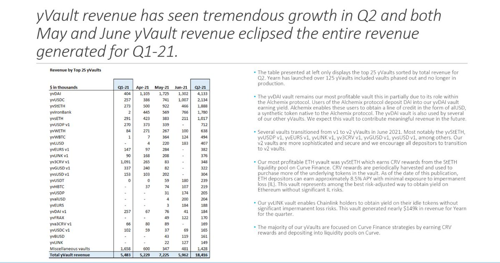
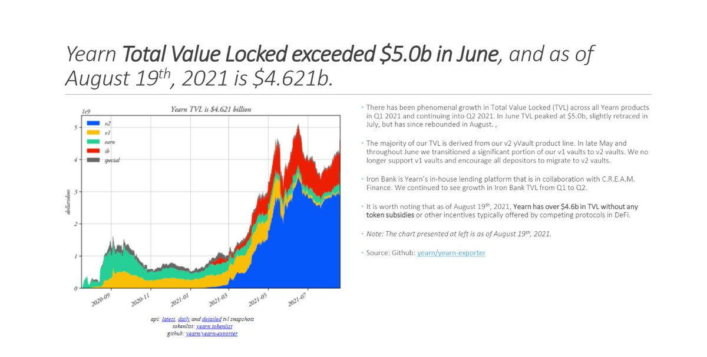

ソース: [twitter](https://twitter.com/iearnfinance/status/1445143482830446600)

##### 1

これはクリプトが世界を変える理由です。

クリプトは影を殺します。

Yearnのスーパーコーダーは🌞です。

全てのオンチェーンに人間が読めるラベルがついています。

透明性が検証されました✅

Yearnがどれほど透明なのかを見てみましょう👇

##### 2

Yearnのバランスシート、EBITDA、収入、そして全ての四半期をみてください。:

https://github.com/yearn/yearn-pm/blob/master/financials/reports/2021Q2-yearn-quarterly-report.pdf

##### 3

実際、Yearn関連のすべてのトランザクションは[yfistats.com](http://www.yfistats.com/)にてリアルタイムで追跡することができます。

##### 4

そこでは次のように区分されています:

🔵 トランザクション記録

🔵 プロトコル収入

🔵 プロトコル費用

🔵 損益計算書

🔵 EOMのバランス

🔵 チャート

🔵 収益プロジェクト

🔵 $YFIバイバック

などなど。

そのすべてがyBudgetチームと💙によって綿密にラベル付けされ、🌍の誰もが自由にアクセスできます。

##### 5

ウェブサイトが嫌いですか？DiscordやTelegramのカスタム「ハーベストボット」でYearnの収入を追跡することもできます。:

🔵 Discord: [discord.com/invite/6PNv2nF](https://discord.com/invite/6PNv2nF)

🔵 Telegram: [t.me/yfi_harvest_tracker](https://t.me/yfi_harvest_tracker)

##### 6

歴史上最もオープンで透明性の高いプラットフォームに参加してみませんか？

グッドニュース：Yearnでは、あなたがどのようにコントリビュートできるかを、新しいコントリビューターを待っているタスクのリストを使って正確に示しています。[contribute.yearn.rock](https://contribute.yearn.rocks/)

##### 7

将来はここにあります。ただし均等には存在しません。

Yearnで一緒に暮らしましょう💙

