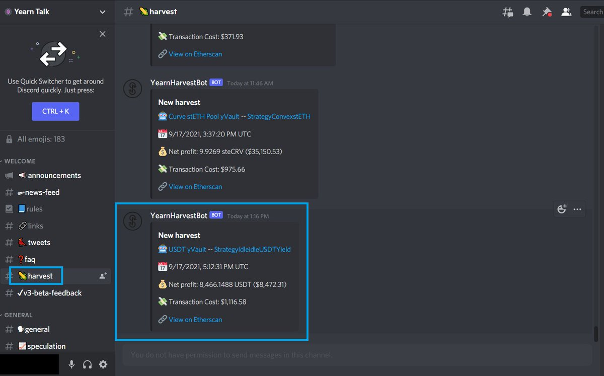
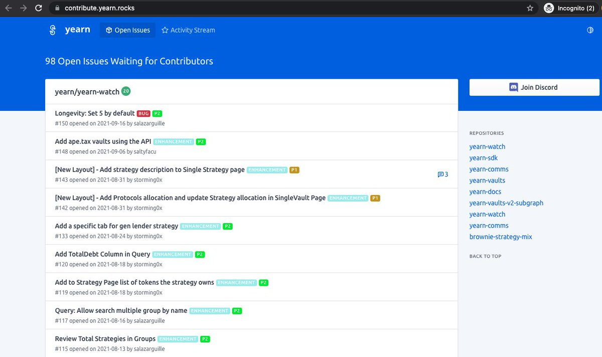

Originalquelle: [twitter](https://twitter.com/iearnfinance/status/1445143482830446600)

##### 1

Das ist der Grund, warum Krypto die Welt verändern wird.

Es tötet Schatten.

Die Super-Coder von Yearn sind 🌞

Alles ist auf der Kette mit hooman-lesbaren Etiketten.

Geprüfte Transparenz ✅

Schauen wir uns mal an, wie transparent Yearn ist 👇

##### 2

Sieh dir die Bilanzen, das EBITDA, das Einkommen und mehr von Yearn in JEDEM Quartal an:

https://github.com/yearn/yearn-pm/blob/master/financials/reports/2021Q2-yearn-quarterly-report.pdf

##### 3

Auf [yfistats.com](http://www.yfistats.com/) kannst du jede einzelne Transaktion im Zusammenhang mit Yearn in Echtzeit verfolgen.

##### 4

Dort findest du sortierbare:

🔵 Buchungssätze

🔵 Protokoll-Einnahmen

🔵 Protokoll-Ausgaben

🔵 Gewinn- und Verlustrechnungen

🔵 EOM-Salden

🔵 Diagramme

🔵 Einnahmeprojekte

🔵 $YFI-Rückkäufe

& vieles mehr

All das wird vom yBudget-Team akribisch mit 💙 beschriftet und ist für jeden 🌍 frei zugänglich.

##### 5

Du magst keine Websites? Du kannst unsere Einnahmen sogar mit benutzerdefinierten "Ernte-Bots" in Discord und Telegram verfolgen:

🔵 Discord: [discord.com/invite/6PNv2nF](https://discord.com/invite/6PNv2nF)

🔵 Telegram: [t.me/yfi_harvest_tracker](https://t.me/yfi_harvest_tracker)

##### 6

Möchtest du bei einer der offensten und transparentesten Plattformen der Geschichte mitmachen?

Die gute Nachricht: Wir zeigen dir genau, wie du einen Beitrag leisten kannst, mit einer Liste von Aufgaben, die auf neue Mitwirkende warten: [contribute.yearn.rocks](https://contribute.yearn.rocks/)

##### 7

Die Zukunft ist da, sie ist nur nicht gleichmäßig verteilt.

Komm und lebe sie mit uns bei Yearn 💙

