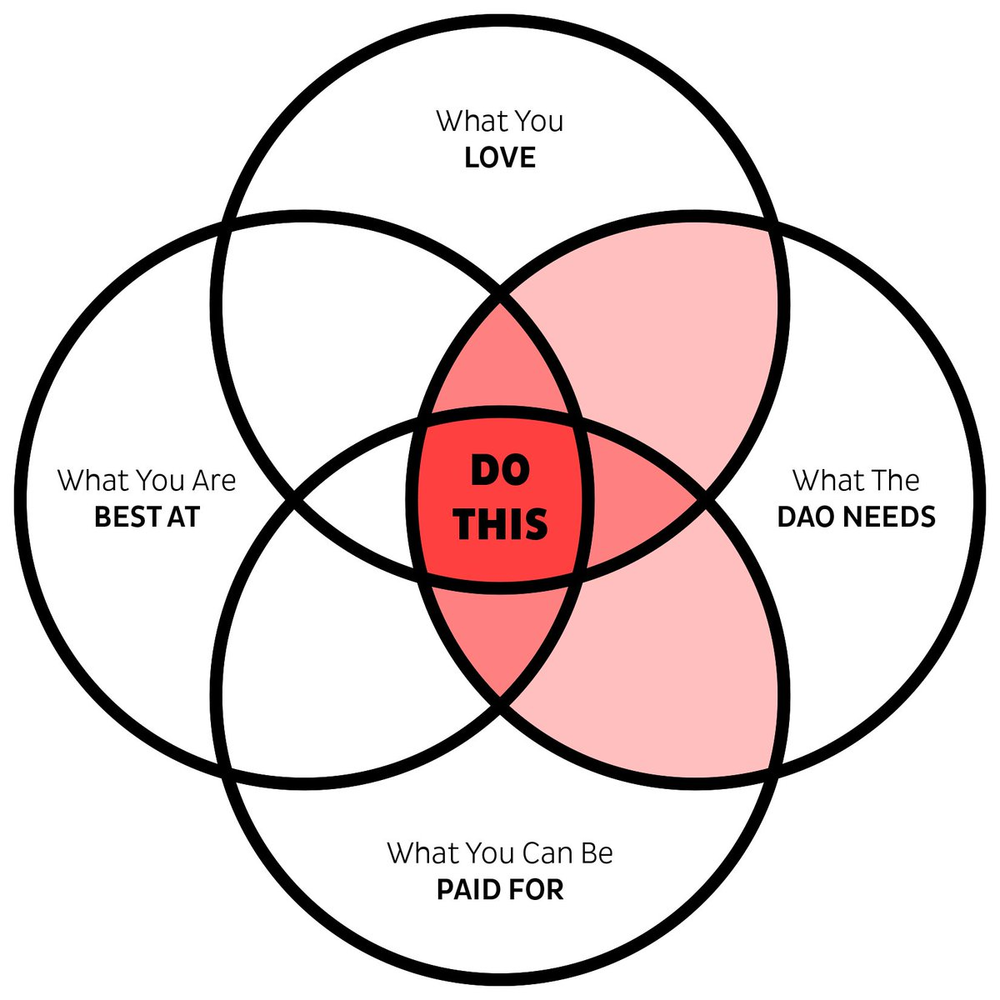
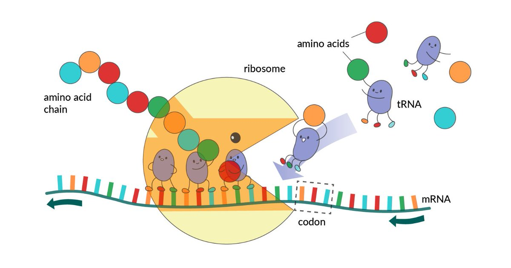
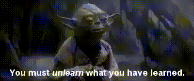
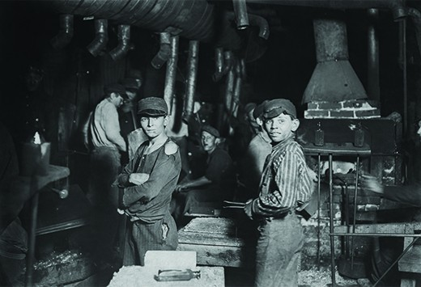
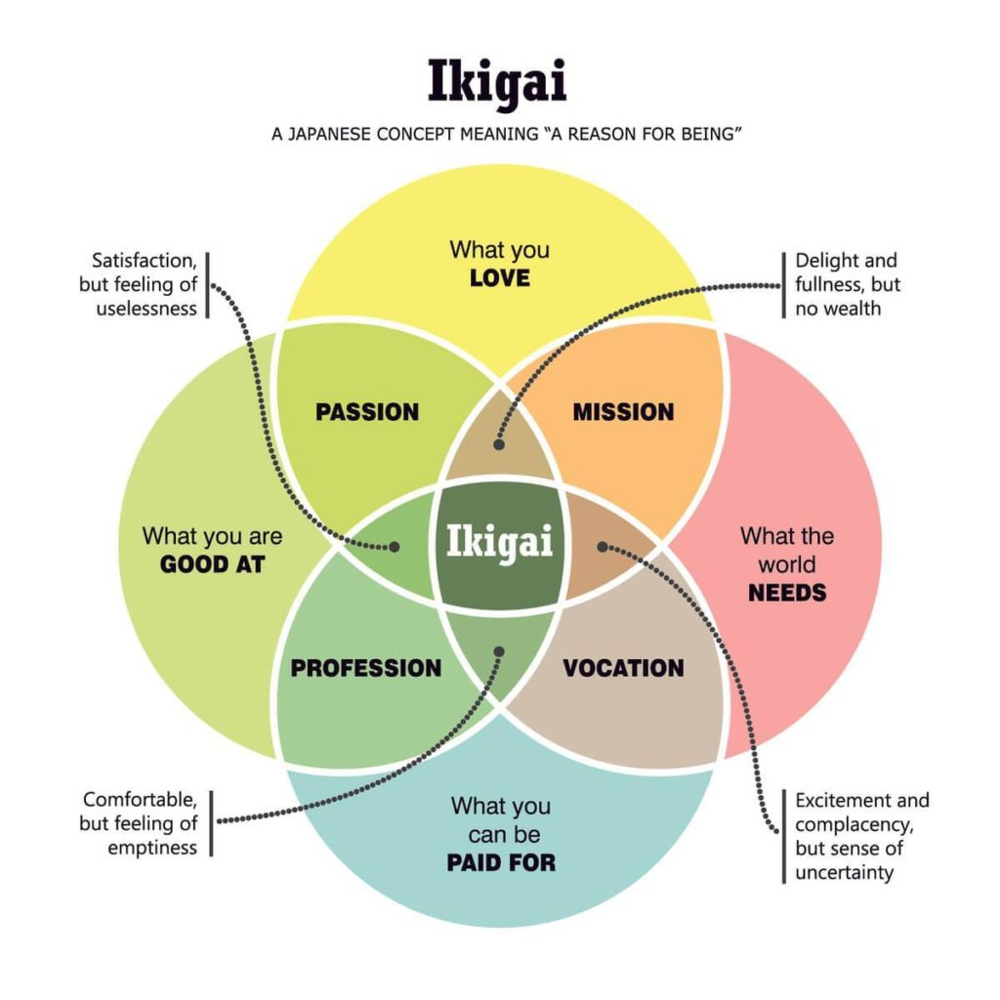

original source: [twitter](https://twitter.com/tracheopteryx/status/1473314953713045507)

---

##### 1

Making the jump to working for a DAO can be a challenge.

I've helped dozens of newbies into the space over these past 18 months and the thing that is often most difficult for them is this simple question:

"What should I do?" 🤔

Here's a thread on how to figure that out:

---

##### 2

In a real DAO work happens differently.

It's like the difference between a robot and an amoeba — DAOs are like bowls of amino acids waiting for some ribosome to come and stack them into proteins, not like a carefully designed servomotor awaiting its preset electrical impulse.

---

##### 3

And there are no college courses on how to be a DAO ribosome (yet).

You are in the soup and you need to figure out what to do with very little guidance. It's really like what Yoda said.

We've suffered hundreds of years of gaslighting to construct the idea of a "work ethic" ...  

---

##### 4

... in order to numb our instincts, tricking us into thinking our lives are best spent as wage slaves.

Most of us have been so divorced from the connection to our own internal needs and desires that it's almost impossible to answer the question of "what do I really want?"

---

##### 5

And, strange as it may seem, this is the question that DAOs need us to answer.

Because, like biology, DAOs rely on each of us following our own wisdom. Each component of a DAO needs to be able to decide for itself what to do though self-knowledge & realtime sensing of the whole.

---

##### 6

This is not a "flat organization" that concept doesn't work. Hierarchy is an essential feature of our reality (the sun is bigger than the earth, get over it).

What is important is fluid hierarchy where the leader is the one who knows what to do next. (And process & structure.)

---

##### 7

Getting back to what to do, I created this diagram based on the Japanese concept of Ikigai, adapting it to be DAO-centric, though most of it is the same.

I'll walk through each circle.

<table><tr>
<td>  </td>
<td>  </td>
</tr></table>

---

##### 8

👉 What the 𝔻𝔸𝕆 ℕ𝔼𝔼𝔻𝕊

Anything in this circle is valuable for the DAO. Check github issues, bounty boards, notion pages, discord channels, or whatever other resources the DAO has for surfacing needed work.

Find some work that calls to you, and do it.

---

##### 9

👉 What You Can Be ℙ𝔸𝕀𝔻 𝔽𝕆ℝ

Not all contributions are of equal value. If you can earn $1,000/hr as a logo designer then in general that kind of work is going to be of greater service to the DAO than something you can't get paid much for.

But that isn't the only factor.

---

##### 10

👉 What You 𝕃𝕆𝕍𝔼

Maybe you get paid bank for logos, but if you hate doing them, chances are they won't actually be that good and further, you won't stick around long.

Life is too short not to do what you love. And work done with love is always stronger.

---

##### 11

👉 What You Are 𝔹𝔼𝕊𝕋 𝔸𝕋

One of the great joys in the world is to work with brilliant colleagues. Imagine what it would be like if we each did what we were best at?

(I don't have to imagine, I contribute at [@iearnfinance](https://twitter.com/iearnfinance) and [@coordinape](https://twitter.com/coordinape).)

---

##### 12

We need to start thinking from the DAO's perspective.

What work will be of most value to the DAO?

How can I be of most service?

Everything in the "what the DAO needs" circle is valuable, but it's the red areas that will be most valuable. And the middle is where magic happens.

---

##### 13

We do not need to make any more FAANG behemoths. The world honestly can't survive that. DAOs can be something different.

Working can be a /joy/ not a burden. Compensation can be a gift, not a competition. And maybe 'corporations' could feel like forests, not industrial lots.

---

##### 14

It's not so hard to imagine if each of us only did the work that we loved, were best at, could get paid for, and that our DAOs needed.

If it's not that, why do it?

/end
