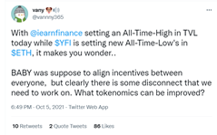
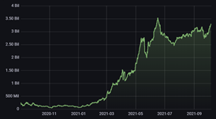
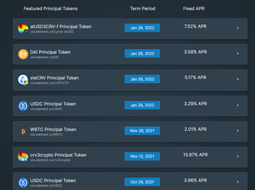
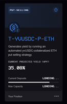
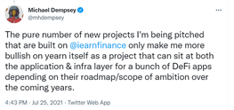
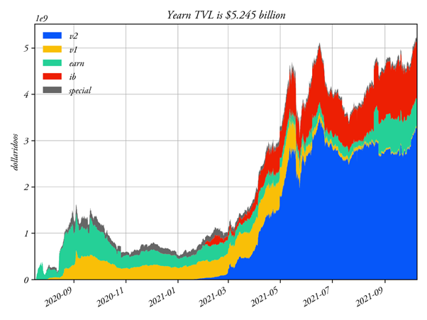

Αρχική πηγή: [twitter](https://twitter.com/Wot_Is_Goin_On/status/1446540007292952579)

##### 1
Ο κόσμος δυσκολευόταν να κατανοήσει το ETH στα μέσα του 2020. Δεν ήταν σαφές ποια θα ήταν η περίπτωση χρήσης του, η Συνολική Κλειδωμένη Αξία (TVL) ήταν κολλημένη στα 8 δισ. δολάρια και δεν είχε αυξηθεί πολύ για 18 μήνες. Ακόμη και ανάμεσα σε εκείνους που πίστευαν στο Ethereum, υπήρχε σκεπτικισμός σχετικά με το πώς θα προέκυπτε αξία για το ETH.

##### 2
Περνώντας γρήγορα στο σήμερα στο σήμερα και είναι σαφές ότι υπάρχουν πολλά που μπορούν να χτιστούν πάνω στο Ethereum (DeFi, NFTs και παιχνίδια), η Συνολική Κλειδωμένη Αξία (TVL) έχει εκτοξευθεί σε πάνω από 100 δισ. δολάρια και προσθέστε σε όλα αυτά και έναν μηχανισμό καύσης token και κάπως έτσι οι άνθρωποι καταλαβαίνουν πώς η αξία αυξάνεται για το εγγενές token της αλυσίδας.

##### 3
Κατά κάποιο τρόπο η αντίληψη για το Yearn σήμερα είναι παρόμοια με εκείνη για το ETH στα μέσα του 2020, τουλάχιστον όσον αφορά την αβεβαιότητα σχετικά με το τι θα χτιστεί στο Yearn, τη μελλοντική του ανάπτυξη και τη δημιουργία αξίας για το YFI. Ακόμη και οι OGs του Yearn αρχίζουν να γίνονται ανήσυχοι.

##### 4
Η Συνολική Κλειδωμένη Αξία (TVL) του Yearn έφτασε σε ιστορικά υψηλά επίπεδα άνω των 5 δισ. δολαρίων TVL, επιτυγχάνοντάς το αυτό χωρίς να προσφέρει κίνητρα. Αυτή η Κλειδωμένη Αξία είναι υψηλότερή από τα πολυδιαφημισμένα Avalanche και Polygon που διαπραγματεύονται σε πολλαπλάσια επίπεδα σε σύγκριση με το YFI

##### 5
Τα θησαυροφυλάκια του έχουν ενσωματωθεί από τους Badger, Enzyme Finance, Argent Wallet, [Crypto.com](http://Crypto.com) και την εφαρμογή MEW Wallet στο Android. Η ευρεία πρόσβαση στα θησαυροφυλάκια είναι μια καλή αρχή, αλλά το Yearn περιμένει υπομονετικά το δολοφονικό της dapp.

[medium.com/myetherwallet/…](https://medium.com/myetherwallet/introducing-yearn-vaults-on-mew-wallet-app-android-274818aa830e)

##### 6
Το πρώτο dapp που δημιουργήθηκε στο Yearn για να αποκτήσει το πρωτόκολλο αγορά προϊόντος ήταν τα αυτοαποπληρούμενα δάνεια του Alchemix. Τα ξαφνικά άλματα στο yvDai στις αρχές του 2021 που φαίνονται παρακάτω συνέβησαν καθώς το Yearn έπρεπε να αυξήσει γρήγορα τα όρια του πιο δημοφιλούς θησαυροφυλακίου του για να συμβαδίσει με τη ζήτηση.

##### 7
Η χωρίς απώλειες λοταρία του [@PoolTogether\_](https://twitter.com/PoolTogether_)επέλεξε επίσης να κερδίσει απόδώσεις χρησιμοποιώντας το Yearn. Στο Ηνωμένο Βασίλειο υπάρχουν πάνω από 100 δισεκατομμύρια λίρες (140 δισεκατομμύρια δολάρια) σε ομόλογα με ασφάλιστρα, όπου η λοταρία διανέμει μια καταθλιπτική ετήσια απόδοση της τάξης του 1%.

##### 8
Εαν το [@element_fi](https://twitter.com/element_fi) μπορεί να σπάσει το γρίφο γύρω από την παροχή σταθερού εισόδηματος, με τα θησαυροφυλάκια του Yearn (τα token "yv") στο παρασκήνιο, τότε μιλάμε για μια συνολική αγορά τρισεκατομμυρίων, στην οποία απευθυνόμαστε.

##### 9
Τα θησαυροφυλάκια του [@ribbonfinance](https://twitter.com/ribbonfinance) αξιοποιούν τη δυνατότητα σύνθεσης που παρέχει η Αποκεντρωμένη Οικονομία (DeFi), έτσι ώστε το USDC να κερδίζει αποδόσεις με το Yearn να δουλεύει στο παρασκήνιο.

##### 10
Το [@longlongfinance](https://twitter.com/longlongfinance) είναι επίσης διαθέσιμο για να διαφοροποιήσετε το κεφάλαιό σας και την απόδοσή σας σε διαφορετικά περιουσιακά στοιχεία.

##### 11
Παρ' όλα τα ενδιαφέροντα πρωτόκολλα μέχρι στιγμής, τα πρωτόκολλα που θα φέρουν τη μεγαλύτερη υιοθέτηση για το Yearn πιθανότατα δεν έχουν κατασκευαστεί ακόμα, αλλά υπάρχουν πολλές ομάδες που εργάζονται πάνω σ' αυτό.

##### 12
Με τη μετάβαση του Yearn σε πρωτόκολλο που λειτουργεί σε πολλαπλές αλυσίδες (multi-chain) δημιουργούνται οι δυνατότητες για την ανάπτυξη διαφορετικών τύπων dapps σε κάθε αλυσίδα. [twitter.com/iearnfinance/s…](https://twitter.com/iearnfinance/status/1446243257336229912?s=20)

> 
> yearn.finance ([@iearnfinance](https://twitter.com/iearnfinance))

> Το βασίλειο των Πολλαπλών Αλυσίδων (Multichain) μας καλεί.

Και το Yearn ανταποκρίθηκε στο κάλεσμα. 📯

Σήμερα, ξεκινάμε την παρουσία μας σε πολλαπλές αλυσίδες με το λανσάρισμα του Iron Bank Fantom και των πρώτων θησαυροφυλακίων Fantom στο [beta.yearn.finance](http://beta.yearn.finance)🧵

> 

##### 13
Οι άνθρωποι που μιλάνε για το θάνατο της Αποκεντρωμένης Οικονομίας (DeFi) στο Ethereum ίσως χρειαστεί να κάνουν zoom out. H Συνολική Κλειδωμένη Αξία (TVL) του Yearn για το γ' τρίμηνο του 2021 ήταν 4,6 δισ. δολάρια, σχεδόν 300% υψηλότερο από ό,τι 12 μήνες πριν. Τα ετησιοποιημένα έσοδα του 3ου τριμήνου 2021 ήταν πάνω από 60 εκατ. δολάρια, αυξημένα κατά σχεδόν 400% σε σχέση με το προηγούμενο έτος.

##### 14
Η κριτική σχετικά με την έλλειψη συσσώρευσης αξίας είναι κάτι που μπορεί να διορθωθεί εύκολα. Ωστόσο, η πρόκληση έγκειται στον σχεδιασμό των tokenomics που παρέχουν κίνητρα για την ανάπτυξη και τη βιωσιμότητα του πρωτοκόλλου όσον αφορά τους συνεισφέροντες και τη TVL, καθώς και τη συσσώρευση αξίας.

##### 15
Το Ethereum χρειάστηκε 5+ χρόνια για να εφαρμόσει το EIP-1559 και το 2022 φέρνει τη μετάβαση στο PoS που θα ανταμείβει τους ETH stakers αντί για τους miners. Και όταν υπάρχουν κίνητρα για να επιτευχθούν πράγματα, τα πράγματα συνήθως επιτυγχάνονται.

[gov.yearn.finance/t/call-for-ide…](https://gov.yearn.finance/t/call-for-ideas-yfi-tokenomics-revamp/11573/5)

##### 16
Η βιωσιμότητα της εξόρυξης ρευστότητας (liquidity mining) και ο ανταγωνισμός ως προς τις παρεχόμενες αμοιβές, καθώς και ο ρυθμός της καινοτομίας στον τομέα της Αποκεντρωμένης Οικονομίας (DeFi), σηματοδοτούν ότι τίποτα δεν είναι εγγυημένο!

##### 17
Αλλά αυτές οι ανησυχίες μπορούν να παραμεριστούν γνωρίζοντας ότι αυτός ο τύπος ανέπτυξε το πρώτο έξυπνο συμβόλαιο του Yearn.

[twitter.com/CFantom777/sta…](https://twitter.com/CFantom777/status/1446366012421468162?s=20)

> 
> Fantom_Memes ([@CFantom777](https://twitter.com/CFantom777))

> Γαμώτο, είναι ωραίο να είσαι fantie

[$FTM](https://twitter.com/search?q=%24FTM) [#Fantom](https://twitter.com/hashtag/Fantom) [#cryptocurrency](https://twitter.com/hashtag/cryptocurrency) [#andrecronje](https://twitter.com/hashtag/andrecronje) [pic.twitter.com/B1tTP48nqN](https://twitter.com/CFantom777/status/1446366012421468162/video/1)
