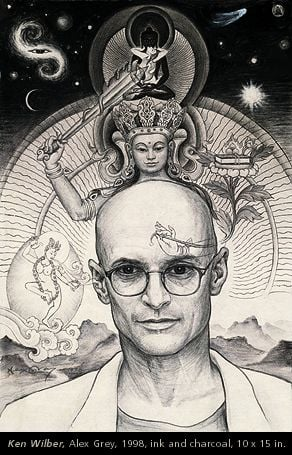
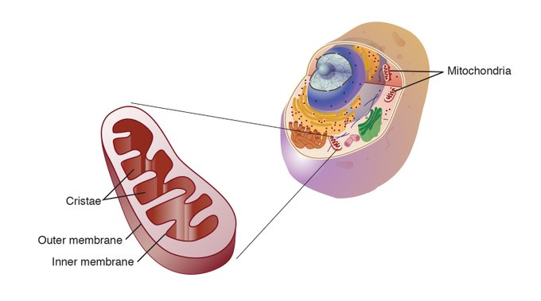
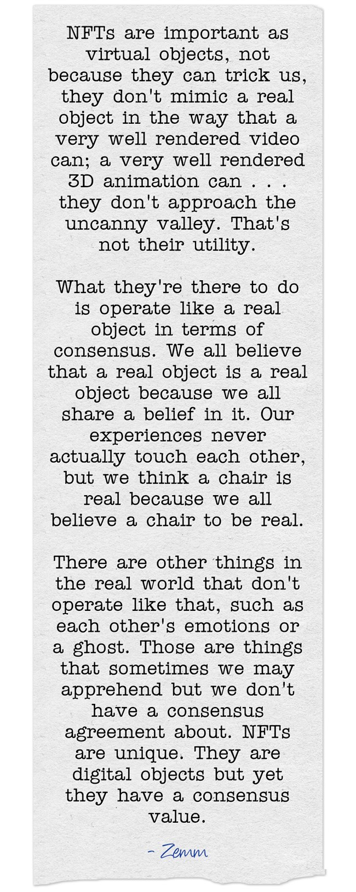
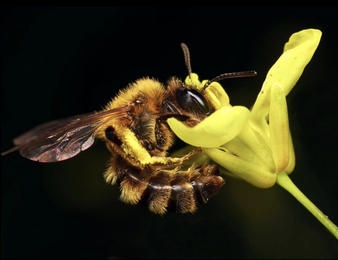
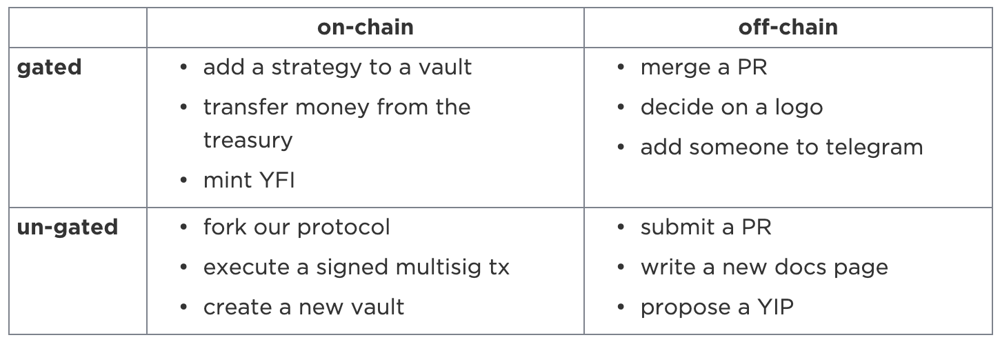
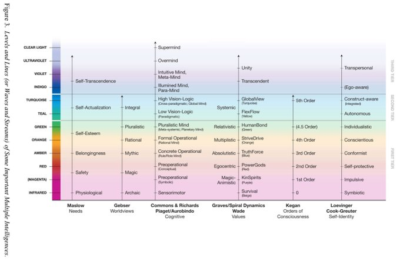
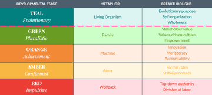

original source: [twitter](https://twitter.com/tracheopteryx/status/1410243752434753547)

##### 1
Really enjoyed talking to [@TrustlessState](https://twitter.com/TrustlessState) on the [@BanklessHQ](https://twitter.com/BanklessHQ) podcast about [@coordinape](https://twitter.com/coordinape) with [@fifthworldzach](https://twitter.com/fifthworldzach)

[youtube](https://www.youtube.com/watch?v=JM0zF3AzFno)

We explained what's different about Coordinape's mechanics & vision, and went pretty deep into some big ideas.

So, here's a thread on DAOs

##### 2
What is a DAO? There are many answers to this. It's an emergent phenomena whose story is actively being written. My answer may be a bit different from others you'll read....

✨ 𝔻𝔸𝕆𝕤 𝕒𝕣𝕖 𝕒 𝕟𝕖𝕨 𝕗𝕠𝕣𝕞 𝕠𝕗 𝕝𝕚𝕗𝕖 🧫

I'll explain.

##### 3
jfc this is hard to explain.... Ok, let's start with Ken Wilber. Wilber is many things, primarily he's a master map maker. He studied the work of philosophers, scientists, and gurus from all over the world with the driving thesis that "everybody is right."

##### 4
Over decades he fit together all these disparate pieces of wisdom into a map of human potential called Integral Theory. Central to this understanding, is the notion of Quadrants. Each quadrant is irreducible to any other quadrant. Each a different, inherently valid frame.

##### 5
The individual interior experience of the color red is irreducible to the individual exterior concept of 650nm light. Both arise like different sides of the same coin. So where the fuck is this going, right? Here Right pointing backhand index DAOs are life forms emerging in the collective quadrants.

##### 6
“Ever since the Cognitive Revolution, Sapiens have been living in a dual reality. On the one hand, the objective reality of rivers, trees and lions; and on the other hand, the imagined reality of gods, nations and corporations.”
- Sapiens by Yuval Harari

##### 7
Harari writes beautifully about the power of collective fiction. Fiction has scaled human endeavor. Family, tribe, religion, nation, incorporation—the emergence of each new fiction transcends and includes the former, allowing us to coordinate in greater and greater number.

##### 8
When life first emerged on earth, we were simple creatures. Single-celled. Floating. Eating each other. Then one little guy ate another little guy . . . but this one hung around; didn't get digested. From prokaryote to eukaryote. 💥 Multicellular life. Everything changed.

##### 9
The world is about to take an extraordinary step. You see, the sea of the collective has been like the sea of the old earth. The forces binding the collective's cell-analog (memes?) haven't been strong enough to make the step to eukaryote. But: we have blockchain now.

##### 10
Blockchain is a new physics. A physics of /the collective space/. No one has elucidated this reality more profoundly than my co-instigator at Coordinape, [@Zemm_NFT](https://twitter.com/Zemm_NFT), speaking about NFTs in [@DirSchmidt](https://twitter.com/DirSchmidt)'s banger "The Greatest NFT Film Ever Made."

https://youtube.com/watch?v=cY9lM73ie0Q&t=1575s

##### 11
Blockchain makes fiction real. As real as dirt. And from this dirt, new fauna blooms. [@Coordinape](https://twitter.com/coordinape) is a flower. Its petals, an invitation. It grows in the canopy of the dark forest—where trust thrives. The kind of trust those who have worked on creative teams know so well.

##### 12

Watch the bankless video or go to http://coordinape.com to learn more, but briefly: Coordinape allows protocols to grow their contributor network with an NFT badge system & distribute grants via a novel, decentralized, community-led mechanism inspired by gift economies.

##### 13
Because the kinds of tools used to support collective intelligence in an adversarial environment are ill-suited for a /collaborative/ environment. The bee & the flower do not need contracts.

##### 14
We needed this kind of tool at [@iearnfinance](https://twitter.com/iearnfinance). It didn't exist, so we built Coordinape. It's one piece of a bigger puzzle. Gov 2.0, written by [@lex_node](https://twitter.com/lex_node) and I, is another. Because, like biology, DAOs are not monolithic. The decision space is vast.

https://gov.yearn.finance/t/yip-61-governance-2-0/10460

##### 15
Gov 2.0, or constrained delegation, starts by understanding decisions. A DAO needs to make hundreds of different decisions. Gov 2.0 deals with on-chain, gated decisions. But beyond these axes we also have to consider: timescale, impact, security, community, domain...

##### 16
We had to invent all these kinds of tools at Yearn out of sheer need. We were born from chaos. There is no foundation, no company with processes to fall back on. [@AndreCronjeTech](https://twitter.com/AndreCronjeTech) gave away $1B in $YFI and the inflaton field from that event formed our world. Bang.

##### 17
Not every DAO works the same way. Just like corporations, or like people, they have different worldviews. Let's go back to Wilber. The quadrants are just one part of his masterwork. He also studied Piaget, Clare Graves, Jean Gebser, Aurobindo, and many others.

##### 18
Wilber took the maps of human development pioneered by these scholars and combined them into a theory of levels and lines. Each of us has multiple intelligences that develop at different rates. And so do organizations.

##### 19
[@fred_laloux](https://twitter.com/fred_laloux) took Wilber's map and applied it to the companies he studied in his peerless work "Reinventing Organizations" Just because DAOs have the potential to grow like trees into the blue sky of our future, doesn't mean they will. They need the right operating system.

##### 20
Teal is an operating system for organizations formed from sovereign human beings taking agency and responsibility in their lives; based on self-management, wholeness, and evolutionary purpose. Where today's big companies are like machines, Teal orgs are like biology.

##### 21
Why did that little guy survive and turn into mitochondria that time the other guy ate it? Who fucking knows. But maybe it had something to do with trust. The wizard [@fifthworldzach](https://twitter.com/fifthworldzach), our other co-instigator at coordinape, says "organizations move at the speed of trust."

##### 22
I think about this a lot. Being part of a collective life form that bleeds money and grows in realms beyond my imagination can be confusing. I /can't/ understand what it needs. I need to let go. And to do that, I need to trust I'll be ok.

##### 23
Structures like ethereum, Teal Orgs, DAOs, coordinape, and gov 2.0 help me trust that the mind between minds will be there, and I can go wherever my interests take me, knowing the whole organism will thrive.

That's what we're building.
