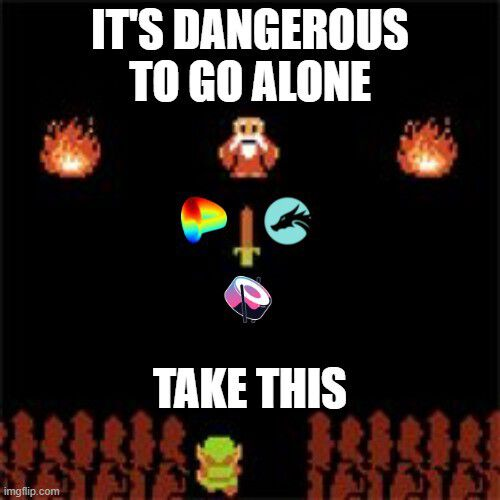
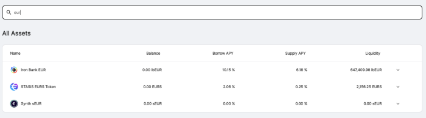
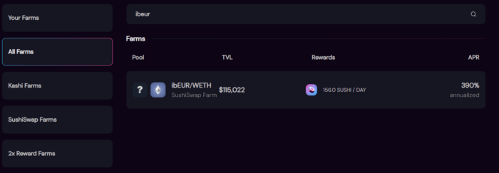

# Lanzamientos justos, colaboración descentralizada y Fixed Forex

**\-Feria de lanzamientos-**

Me tomó un tiempo darme cuenta finalmente de la esencia detrás de un lanzamiento justo. No es regalar los tokens, no es porque no hubo preventa, en pocas palabras, fue porque todos tenían la misma ventaja, todos tenían el mismo conjunto de reglas, no había rondas secretas de "amigos y familiares", rondas semilla , asignación de personas influyentes, no había listas blancas, no había límite de participación, se proporcionaron las reglas y cualquiera podía participar. Finalmente me siento cómodo al decir que un lanzamiento justo es un lanzamiento en el que todos los participantes tienen el mismo conjunto de reglas.

**\-Colaboración descentralizada-**

Todavía veo mucho tribalismo, supongo que es comprensible, nunca entendí cómo la gente se volvió tan tribal con respecto a los equipos deportivos, comencé a preguntarme cuánto de ese tribalismo se debe a las apuestas en los equipos, después de todo, eso es lo que son las criptomonedas. , apostando por tu equipo favorito. Así como nunca entendí el tribalismo en los deportes, tampoco lo entiendo en el mundo cripto. Según mis estándares, simplemente veo lo "correcto" y lo "incorrecto", no importa si es un equipo con el que estoy asociado o no, si veo lo "correcto", lo elogio, si veo lo "incorrecto" , lo regaño.

Pero creo que algunos equipos a menudo descartan el valor de la colaboración, es algo que siempre disfruté de yveCRV y, por extensión, sus clones, stCRV y cvxCRV, son el producto de la colaboración entre curve, yearn, sushi y pickle. No puede existir sin todas esas entidades. La misma razón antes de yveCRV, el yPool era mi orgullo y alegría, era la colaboración entre curve, yearn, aave, compound y dydx.

Con esto en mente, me di cuenta de que, para seguir teniendo éxito, los productos no se pueden aislar, deben ser una fusión de productos y equipos. Mi iteración original de Fixed Forex era independiente, no actualizable, ingobernable, sin extracción de valor y sin token.

**\-Fixed Forex-**

Seguimos hablando de interrumpir el control de cambios, seguimos hablando de interrumpir el fiat, a su manera, Tether y Circle hicieron más por interrumpir el control de cambios que las criptomonedas, el control de cambios tiende a tener una regla simple, el dinero no puede salir de su territorio sin permiso especial. Tanto Tether como Circle aceptan depósitos localmente, el fiat nunca sale de la cuenta bancaria, por lo tanto, no hay control de cambio (en teoría, en la práctica y la regulación es una historia muy diferente). Así que supongamos que desea realizar un pago desde EE. UU. a Corea, de USD a KRW, una ruta “simple”, sería depositar USD por USDT, transferir USDT a Upbit, cambiar USDT por KRW, retirar KRW.

Fixed Forex está diseñado para lograr lo anterior sin que los usuarios finales sean conscientes o conozcan los pasos, Fixed Forex tiene dos componentes principales, liquidez en la cadena de divisas y rampas de entrada y salida fiduciarias descentralizadas.

Si bien estoy más entusiasmado con este último, su fecha de lanzamiento solo es posible después de que logremos la liquidez en la cadena. Entonces, para los propósitos de este artículo, explicaremos cómo funciona Fixed Forex y cómo los usuarios pueden participar.

**\-Fixed Forex de Iron Bank (ibff)-**

Fixed Forex ha apalancado al Iron Bank, Yearn, Sushi y Curve

**Descargos de responsabilidad;**

- Sin auditar.
- 0 beneficio por participación anticipada, solo riesgo.
- La distribución inicial del token será una fracción de la emisión, esto sirve solo para fines de prueba.
- Dada la distribución inicial increíblemente baja, no compre estos tokens, no proporcione liquidez para estos tokens, perderá dinero.

Fixed Forex es el nombre colectivo de USD, EUR, ZAR, JPY, CNY, AUD, AED, CAD, INR y cualquier otro par de divisas lanzado bajo el nombre de Fixed Forex.

La primera opción disponible es [ibEUR](https://www.coingecko.com/en/coins/iron-bank-euro) que se puede acuñar a través de [yearn.fi/lend](https://yearn.fi/lend)

Todas las opciones de forex se pueden crear a través de cualquiera de las garantías aceptadas en [yearn.fi](https://yearn.fi/lend)

Para conocer los factores colaterales actualizados, puede visitar la documentación de Iron Bank, [aquí](https://docs.cream.finance/iron-bank/collateral-and-reserve-factor)

Cada par de divisas apuntará a 2 grupos de liquidez;

ib\*/\* ([curve.fi](https://curve.fi/))  
ib\*/ETH ([sushi.com](https://sushi.com/))  

Para cada activo, los proveedores de liquidez tendrán cuatro opciones de rendimiento disponibles;

1. Proporcione ib\* a [yearn.fi/lend](https://yearn.fi/lend) y gane intereses (actualmente 6.38%)
2. Proporcione ib\*/ETH a [sushi.com](https://sushi.com/) (actualmente 390%)
3. Proporcione ib\*/\* a [curve.fi](https://curve.fi/) (grupo pendiente)
4. Hacer staking en Iron Bank Fixed Forex y gane el token nativo IBFF (vested, veIBFF)

\-veIBFF-

El mecanismo IBFF es complejo y debe entenderse cuidadosamente antes de participar.

El lanzamiento inicial tendrá como objetivo un único grupo, [ibEUR/ETH](https://analytics.sushi.com/tokens/0x96e61422b6a9ba0e068b6c5add4ffabc6a4aae27)

Como LP, puede apostar el token LP en IBFF [faucet](https://etherscan.io/address/0x7d254d9adc588126edaee52a1029278180a802e8), esto proporciona un goteo de token fraccional, esto es necesario para crear un bloqueo de token en el contrato de adquisición, [veIBFF](https://etherscan.io/address/0x4d0518c9136025903751209ddddf6c67067357b1).

El verdadero token nativo del sistema es veIBFF, o IBFF conferido, veIBFF gana tarifas de protocolo, estas tarifas son dinámicas en función de la oferta y la demanda. Actualmente, estas tarifas son 10.15% de TVL.

Los propietarios de IBFF pueden optar por crear un bloqueo de adquisición de derechos, hasta 4 años, con deterioro lineal en el [contrato veIBFF](https://etherscan.io/address/0x4d0518c9136025903751209ddddf6c67067357b1)  

Una vez que se ha creado un bloqueo, los LP pueden apostar ibEUR/ETH en el [contrato de distribución](https://etherscan.io/address/0x1da8a6fe33bd35b99505d67843eec9fa124f2d4b), el contrato de distribución distribuirá tokens cada 7 días de forma lineal.

Los tokens de distribución se recompensan en función de su bloqueo de adquisición. Si el bloqueo de adquisición es de 1 año, recibe 1/4 tokens como veIBFF, que se desbloquearán en 1 año. Los 3/4 tokens restantes se distribuyen al [contrato de distribución de tarifas](https://etherscan.io/address/0x83893c4a42f8654c2dd4ff7b4a7cd0e33ae8c859).

Los holders de veIBFF tienen dos reclamos semanales, el reclamo 1 son las tarifas acumuladas del protocolo (10,15 % de TVL actualmente) y el IBFF distribuido del [contrato de distribución](https://etherscan.io/address/0x83893c4a42f8654c2dd4ff7b4a7cd0e33ae8c859).

En pocas palabras, cuanto mayor sea su inversión de tiempo, más desproporcionada será su recompensa.

**Descargos de responsabilidad;**

- Sin auditar.
- 0 beneficio por participación anticipada, solo riesgo.
- La distribución inicial del token será una fracción de la emisión, esto sirve solo para fines de prueba.
- Dada la distribución inicial increíblemente baja, no compre estos tokens, no proporcione liquidez para estos tokens, perderá dinero.

**Enlaces;**

[Foro](https://gov.yearn.finance/c/projects/fixed-forex/26)  
[Sitio web](https://yearn.fi/lend)  
sin redes sociales
