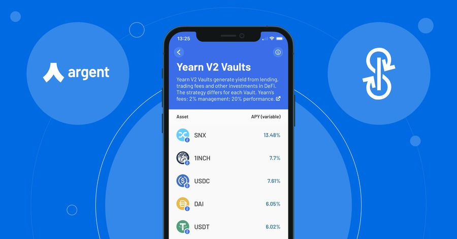
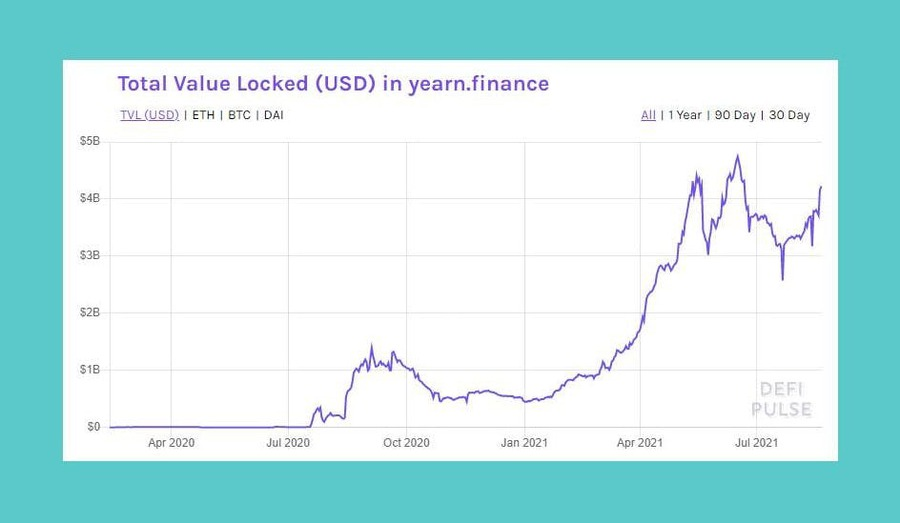
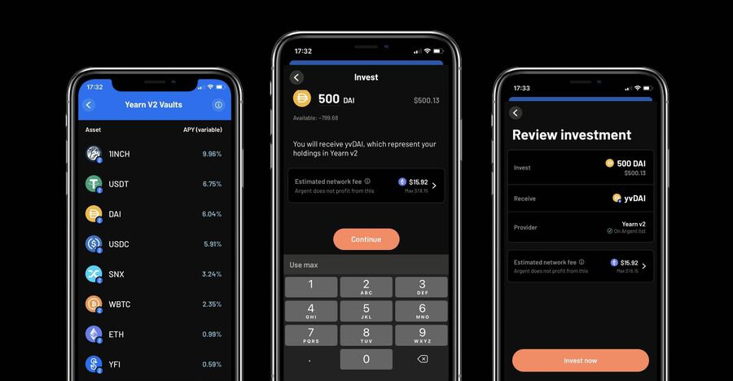

¡Las vaults de Yearn V2 ahora están a solo un toque de distancia en Argent! Obtén hasta un 16,47 % de APY neto\* con la generación de rendimiento automatizada. Esto se basa en nuestro soporte existente para [Vaults V1 de Yearn](https://www.argent.xyz/blog/yearn-vaults-in-argent/).

## **Beneficios de usar Yearn con Argent**

Ganar con [Yearn](https://yearn.finance/vaults) a través de Argent es único por su:

- **Simplicidad**: Solo se requiere una transacción. (No hay necesidad de una aprobación por separado).
- **Seguridad**: Sin aprobaciones infinitas de tokens; automáticamente solo apruebas lo que necesitas gastar. También tiene la tranquilidad de saber que está interactuando con los contratos correctos.

Lanzamos con 7 Vaults (USDC, DAI, SNX, 1INCH, YFI, WBTC, USDT, UNI, ETH).

## **Por qué es importante Yearn**

Yearn ha crecido a un [ritmo monumental](https://defipulse.com/yearn.finance) desde su lanzamiento a principios de 2020. Yearn hace que sea fácil para cualquiera hacer "yield farming" (tratar de maximizar el rendimiento de sus activos al utilizando múltiples protocolos DeFi). Yearn compara su enfoque con la inversión pasiva.

Gráfico de Defi Pulse que muestra el valor total bloqueado (TVL) en Yearn.Finance

También hay un gran beneficio en lo que respecta a las tarifas de la red Ethereum ("gasolina"). El gas se "socializa" entre todos los que usan esa vault, lo que lo hace mucho más económico para el usuario promedio.

[Estrategias](https://medium.com/yearn-state-of-the-vaults/the-vaults-at-yearn-9237905ffed3) son propuestas por la comunidad y votadas por la gobernanza de Yearn.

Con V2, cada Vault puede emplear múltiples estrategias, mientras que Vaults V1 usaba solo una cada una.

## **Cómo usar las Bóvedas de Yearn V2 en Argent**

### **Comprar**

- Toca la pestaña **'Invest'** en Argent
- Toca **'Yearn V2 Vaults'**
- Elije una vault
- Toca **'Buy Investment'**
- Selecciona la cantidad (y confirma que estás satisfecho con la tarifa de la red)
- Compra

### **Tarifa**

Argent no cobra honorarios.

Yearn toma:

- 20% de comisión de rendimiento (deducida del rendimiento)
- 2% de comisión de gestión (deducida del saldo total por año).

También tienes que pagar por el gas.

Uso de yearn en la aplicación Argent

## **Seguimiento del rendimiento de su bóveda**

Los saldos no se actualizan continuamente; se actualizan de forma "fluctuante", según Yearn.

Para realizar un seguimiento de las devoluciones, puede utilizar

- [Zapper](https://zapper.fi/)
- [Zerion](https://app.zerion.io/)
- [Calculadora de ROI de vault de Yearn](https://yearn-roi.xyz/#/)
- [Retorno de la inversión de yVault](https://yvault-roi.netlify.app/)

## **Otras lecturas y recursos**

- [Documentos de Yearn](https://docs.yearn.finance/)
- [Estado de las vaults de Yearn (actualización semanal)](https://medium.com/yearn-state-of-the-vaults/the-vaults-at-yearn-9237905ffed3)
- [Twitter de Yearn](https://twitter.com/iearnfinance)

## **Riesgos**

Como siempre en cripto y DeFi, debes hacer tu propia investigación sobre los riesgos. Estos incluyen contratos inteligentes y la economía de los protocolos. Las auditorías de Yearn se pueden encontrar [aquí](https://docs.yearn.finance/resources/audits).

\*APY es variable y el concepto técnicamente no se aplica directamente como lo hace en las finanzas centralizadas. Consulte [Explicación de Yearn](https://docs.yearn.finance/resources/guides/how-to-understand-yvault-roi#roi-calculation) para obtener más información.

## **Descargar Argent**

Comience con Argent [aquí](https://argent.link/yearn-v2-post). Si tienes alguna duda puedes encontrarnos en:

- [Discord](https://discord.com/invite/GWSyrHg)
- [Twitter](https://twitter.com/argentHQ)
- [Soporte](https://support.argent.xyz/hc/en-us)

_Esto debería ser evidente, pero en caso de que no sea así: NO somos un banco _**🙄**_. No somos una entidad financiera regulada._
