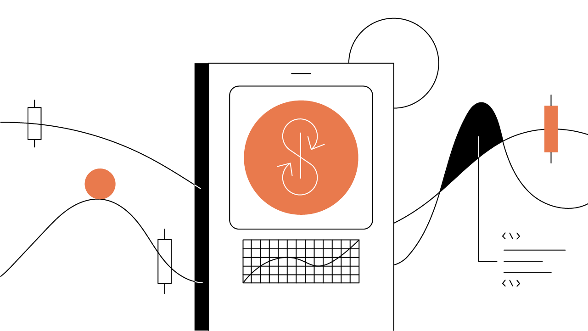

Escrito por nossos amigos em Gemini & pela [equipe da Cryptopedia](https://www.gemini.com/cryptopedia/authors#cryptopedia-staff)

Atualizado em 25 de março, 2021

[https://www.gemini.com/cryptopedia/yearn-finance-defi-lending-protocol](https://www.gemini.com/cryptopedia/yearn-finance-defi-lending-protocol)

# Yearn Finance e Robôs de Dinheiro: Estratégia Automatizada DeFi

Yearn Finance oferece um conjunto de estratégias de investimento que utilizam robôs que contém uma “sabedoria vinda da multidão” — a comunidade da Yearn.

## Resumo

Os "robôs de dinheiro" Yearn Finance executam estratégias de investimento em plataformas financeiras descentralizadas (DeFi) com o objetivo de obter os maiores retornos com o menor risco. As estratégias aplicadas incluem fornecer ativos para empréstimo, obter tokens de projetos através de farm de rendimento, por prover liquidez, ou uma combinação dessas e outras estratégias em diversas plataformas de empréstimo DeFi. O protoclo Yearn permite que você facilmente empregue estratégias complexas de investimento ao fornecer tokens para a plataforma. Seu cada vez maior conjunto de produtos tem o objetivo de simplificar o investimento em DeFi e está recebendo a atenção dos investidores. 

## Índice

- Yearn.Finance: yVaults
- Estudo de Caso de Estratégia yVault: GUSD
- Um conjuntod e produtos DeFi
- Sabedoria da Multidão

A Yearn Finance desenvolve produtos que automatizam e visam simplificar a complexidade das finanças descentralizadas (DeFi) com “robôs de dinheiro” que trabalham para maximizar o retorno mediante o pagamento de uma taxa. Yearn começou com apenas um desenvolvedor [Ethereum] (https://www.gemini.com/cryptopedia/ethereum-smart-contracts-tokens-use-cases) - [Andre Cronje] (https://www.gemini.com/ cryptopedia / glossary # andre-cronje) - que buscou automatizar e otimizar seus próprios retornos DeFi. Agora, ela evoluiu para uma das comunidades descentralizadas mais ativas e engajadas em Ethereum, com foco no desenvolvimento de formas cada vez mais inovadoras de gerar retornos.

Robôs de dinheiro referem-se a estratégias de negociação automatizadas executadas por Yearn em plataformas DeFi baseadas em Ethereum. Existem inúmeras estratégias de investimento que podem ser implementadas em um número crescente de protocolos DeFi. Por exemplo, um robô de dinheiro Yearn pode ganhar taxas de negociação no [protocolo Curve] (https://www.gemini.com/cryptopedia/curve-crypto-automated-market-maker), pegar dinheiro emprestado usando [empréstimos flash do Aave] ( https://www.gemini.com/cryptopedia/aave-flashloans) e emprestar ativos para [Compound] (https://www.gemini.com/cryptopedia/compound-finance-defi-crypto).

## Yearn.Finance: yVaults

Os produtos mais populares no ecossistema Yearn são [yVaults] (https://www.gemini.com/cryptopedia/glossary#y-vaults), uma série de conjuntos de tokens que seguem uma estratégia de investimento alocada em plataformas DeFi. O depósito de tokens em um yVault gera automaticamente um novo [yToken] (https://www.gemini.com/cryptopedia/glossary#y-tokens), que é um tipo de [token de provedor de liquidez (LP)] (https: // www.gemini.com/cryptopedia/liquidity-provider-amm-tokens). Os tokens LP são criados automaticamente quando os tokens são depositados em um [pool de liquidez] (https://www.gemini.com/cryptopedia/glossary#liquidity-pool) - e servem como uma reivindicação aos ativos subjacentes de um pool. Cada yToken pode ser resgatado a qualquer momento pelos tokens depositados originalmente, além de quaisquer recompensas acumuladas enquanto os tokens funcionavam no yVault.

Por exemplo, você pode depositar [GUSD] (https://www.gemini.com/cryptopedia/gusd-gemini-dollar-stablecoin-features) no GUSD yVault e receber o token LP chamado yGUSD. Quando você negocia o yGUSD pelo GUSD subjacente, você recebe esse GUSD mais quaisquer ganhos ou recompensas que o GUSD acumulou usando a estratégia do yVault. Os yVaults da Yearn compreendem camadas complexas de aplicativos e componentes DeFi em uma estratégia de negociação simplificada, onde os investidores fornecem ativos e mantêm um token para participar de uma estratégia sofisticada e algorítmica.

## Estudo de Caso de Estratégia yVault: GUSD

As estratégias da yVault são fluidas e a comunidade Yearn pode decidir mudar ou ajustar uma estratégia conforme ela se torna menos lucrativa. Na estratégia yGUSD, para outubro de 2020 - que já foi alterada para otimização - a estratégia ganha rendimento para o detentor de yGUSD através das seguintes etapas:

1. GUSD é depositado em um pool Curve composto de [stablecoins] (https://www.gemini.com/cryptopedia/what-are-stablecoins-how-do-they-work) GUSD, [DAI] (https: //www.gemini.com/cryptopedia/dai-stablecoin-what-is-dai-token), USDC e USDT para ganhar taxas.
2. O token LP gerado a partir do pool de stablecoin é colocado em stake em Curve para ganhar o [token CRV] (https://www.gemini.com/cryptopedia/glossary#crv-token).
3. 90% dos tokens CRV ganhos são vendidos para DAI.
4. DAI é depositado de volta no pool de stablecoin GUSD, DAI, USDC, USDT original para ganhar mais taxas.

Do ponto de vista de um usuário, as etapas acima ocorrem sob o capô algorítmico. Esta estratégia GUSD em si é bastante simples em comparação com estratégias yVault mais evoluídas e sequencialmente complicadas, que podem envolver empréstimos de dinheiro, usando [alavancagem] (https://www.gemini.com/cryptopedia/glossary#leverage) e mantendo a exposição a forças de mercado.

Por exemplo, o vault yETH, que ainda está em estágio experimental em dezembro de 2020 e ainda não totalmente lançado, usa os protocolos [MakerDAO] (https://www.gemini.com/cryptopedia/makerdao-defi-mkr-dai -coins) e Curve em sua estratégia. Com a estratégia yETH, os detentores da ETH permanecem expostos à valorização (ou depreciação) do preço da ETH ao mesmo tempo em que ganham rendimento por meio das seguintes etapas:

1. O ETH é depositado na MakerDAO como garantia.
2. O DAI é emprestado da MakerDAO usando o ETH depositado como garantia.
3. O DAI emprestado é depositado no vault yDAI.
4. O vault yDAI deposita o DAI na Curve para ganhar taxas.
5. O token LP gerado a partir do pool stablecoin é colocado em stake na Curve para ganhar o token CRV.
6. Os tokens CRV são vendidos por ETH.
7. O ETH é depositado de volta na MakerDAO como garantia.

Como o vault yETH toma emprestado o DAI da MakerDAO, há o risco de ser liquidado - ou de o robô de dinheiro vender seu ETH para reembolsar o empréstimo de DAI. A liquidação ocorre quando o valor da garantia do ETH cai abaixo do limite mínimo de 150% do valor do DAI emprestado. Para evitar a liquidação, o "robô de dinheiro" yETH visa manter o valor do colateral do ETH em 200% seguro em relação ao valor da dívida DAI. Se o valor da garantia do ETH começar a cair abaixo da meta de 200%, o robô de dinheiro automaticamente saldará parte da dívida do DAI para permanecer com garantia de sobra. Gerenciar dívidas, garantias e liquidação adiciona uma camada extra de complexidade aos vaults de Yearn.

É importante reconhecer o acréscimo de risco da estratégia yVault à medida que ela se torna mais complexa devido à dependência de mais protocolos e plataformas. Estratégias como o exemplo yETH também têm os riscos inerentes ao uso de alavancagem, bem como os riscos de liquidação e falha de contrato inteligente.

## Um conjunto de produtos DeFi

O pacote de produtos Yearn é um conjunto de produtos DeFi em constante expansão e evolução. Além das várias estratégias yVault, Yearn oferece vários outros produtos que juntos formam seu ecossistema.

Outros produtos Yearn incluem o aplicativo yEarn, que se concentra no uso de stablecoins como DAI e em colocá-los para trabalhar em pools de empréstimos de alto rendimento no Compound ou Aave. Outro produto, o Zap, foi projetado para reduzir os custos de transação no Ethereum, combinando o que seriam várias transações manuais em uma transação mais complexa com um único clique. O recurso yInsure fornece seguro para contratos inteligentes como uma proteção em caso de vulnerabilidade ou falha no código.

Há também uma grande variedade de produtos atualmente em fase de pesquisa e desenvolvimento, incluindo yTrade para alavancar negociações, yLiquidate para automatizar liquidações e yBorrow para empréstimos. Yearn provou até agora ser um terreno fértil para pesquisa e desenvolvimento, e suas ofertas de produtos provavelmente continuarão a se expandir conforme o espaço DeFi amadurece.

## Sabedoria da Multidão

Um "robô de dinheiro" Yearn executa um plano estratégico de investimento de ativos digitais: como alocá-los, onde colocá-los, quando movê-los e quando vendê-los. Na verdade, qualquer pessoa pode propor uma nova estratégia publicando-a no fórum de governança do Yearn e explicando a lógica e os retornos potenciais para a comunidade. Se aprovada pela comunidade, a estratégia será implementada e o criador da estratégia receberá honorários - lucrando com sua estratégia bem-sucedida.

Embora o espaço DeFi possua muitos mecanismos automatizados e algorítmicos em suas várias plataformas, as estratégias de Yearn são criadas e influenciadas por membros da comunidade. O gerenciamento da comuniadade de Yearn, “[lançamento justo] (https://www.gemini.com/cryptopedia/what-is-yearn-finance-yfi-coin-yearnfinance)” distribuído de seus [tokens de governança YFI] ( https://www.gemini.com/cryptopedia/glossary#yfi-token) e a natureza colaborativa apresentam um lembrete oportuno da engenhosidade e eficácia humanas, mesmo na era dos algoritmos automatizados. Com Yearn, as ideias podem vir de qualquer lugar e a sabedoria vem da multidão. A eficácia dessa sabedoria é constantemente testada, iterada e aprimorada em tempo real com dinheiro real.

Yearn Finance apresenta uma proposta única de camadas, interoperabilidade e crowdsourcing no DeFi. É uma experiência de investimento e desenvolvimento de produtos automatizados, de incentivos e coordenação. E é uma experiência para ver se uma comunidade descentralizada com um amplo mandato para otimizar os retornos pode fazer isso de forma eficaz sem conflito organizacional. Enquanto muitas plataformas DeFi enfocam a desintermediação de jogadores e sistemas legados, a inovação de Yearn é atuar como um intermediário reunindo a comunidade descentralizada e plataformas distintas para o benefício de seus usuários.